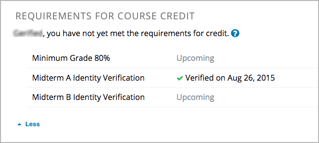

.. _In Course Reverification:

#################################
In-Course Reverification
#################################

To use in-course reverification, you must complete the following steps.

#. :ref:`Enable reverification in your course <Enable Reverification>`.
#. :ref:`Create specific reverification checkpoints <Create Reverification Checkpoint>`.

.. _Enable ICRV:

*********************************
Enable In-Course Reverification
*********************************

To enable in-course reverification for your course, follow these steps.

#. In Studio, select **Settings**, and then select **Advanced Settings**.
#. In the **Advanced Module List** field, place your cursor between the
   brackets (``[]``),and then add ``"edx-reverification-block"``. Make sure to
   include the quotation marks. 

   .. note:: If the **Advanced Module List** field already contains one or 
    more items, add a comma after the closing quotation mark for the last
    item, and then add ``"edx-reverification-block"``. The field should
    resemble the following example.

    ``["module_name","edx-reverification-block"]``

#. At the bottom of the page, select **Save Changes**.

.. _Create ICRV Checkpoint:

*************************************************
Create an In-Course Reverification Checkpoint
*************************************************

For more information about how to create an in-course reverification
checkpoint, contact your edX program manager.

After you create a reverification checkpoint, the checkpoint appears in the
list of course credit requirements on learners' **Progress** pages.

.. update image when sandbox ready (8/7: can't show anything but "Upcoming"
.. status)

     progress graph.