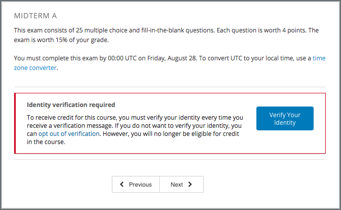

.. _In Course Reverification:

#################################
In-Course Identity Reverification
#################################

To use in-course identity reverification, you must enable reverification in
your course, create specific verification checkpoints, and then set
assessments to require verification.

.. contents::
 :local:
 :depth: 1

.. _Enable ICRV:

*****************************************
Enable In-Course Identity Reverification
*****************************************

.. note:: The in-course identity reverification process requires using the
   edx-reverification-block, which is :ref:`unsupported<Levels of Support>`.
   Before you can enable in-course identity reverification you must follow the
   steps to :ref:`allow the addition of unsupported
   <Add_Unsupported_Exercises_Problems>` tools and problem types.

To enable in-course identity reverification for your course, follow these
steps.

#. In Studio, select **Settings**, and then select **Advanced Settings**.
#. In the **Advanced Module List** field, place your cursor between the
   brackets (``[ ]``), and then add ``"edx-reverification-block"``. Make sure
   to include the quotation marks.

   .. note:: If the **Advanced Module List** field already contains one or
    more items, add a comma after the closing quotation mark for the last
    item, and then add ``"edx-reverification-block"``. You do not have to
    include a space between the items. The field should resemble the following
    example.

    ``["module_name","edx-reverification-block"]``

#. At the bottom of the page, select **Save Changes**.

.. _Create ICRV Checkpoint:

*********************************
Create a Verification Checkpoint
*********************************

To require learners to verify their identities before a specific assessment,
you add a verification checkpoint component to a unit in that assessment. After
you create a checkpoint component, the checkpoint appears on the **Progress**
pages and in the body of the course for learners who must complete in-course
identity reverification.

.. note:: Make sure that you add verification checkpoints only before assessments.

#. In the subsection that contains the assessment, create a new unit.

   If the subsection already contains one or more units, move the new unit so
   that it is the first unit in the subsection.

#. In the new unit, locate **Add New Component**, and then select **Advanced**.

#. Select **Verification Checkpoint**, and then select **Edit**.

#. In the **Verification Checkpoint Name** box, enter a name.

#. In the **Verification Attempts** box, select the number of times that
   learners can attempt to verify their identities. You can specify up to
   three attempts.

#. Select **Save**.

#. Publish the unit that contains the component.

After you save the component and publish the unit that contains the component,
the verification checkpoint name appears in a list of verification checkpoints
in component and unit settings. You modify these settings to require
verification for a component or unit. For more information, see :ref:`Require
Verification Component` or
:ref:`Require Verification Unit`.

.. _Require Verification:

*********************************************************
Set an Assessment to Require Verification
*********************************************************

After you create a verification checkpoint in an assessment, you set the
components and units in that assessment to require verification.

When a component or unit requires verification, the content in that component
or unit is invisible to learners until the learners pass the verification
checkpoint that you select. If you want to include text that learners can see
regardless of verification status, you can leave some components and units
visible.

To require verification, you select the verification checkpoint in the
settings of the component or unit. By default, components and units do not
require verification and are visible to learners. To leave them visible, do
not select a verification checkpoint in the component or unit settings.

When you set a component or unit to require verification, keep the
following information in mind.

* If you set an entire unit to require verification, all of the components in
  that unit are invisible until learners complete verification. You cannot
  make an individual component visible.

* If you do not set a unit to require verification, all of the components in
  that unit are visible by default. However, you can set individual components
  to require verification.

.. important:: Do not set the unit that contains the verification
 checkpoint component, or the verification component itself, to require
 verification. If you do this, learners cannot access the verification
 checkpoint.

For an example situation in which a unit contains three components, with one
component that requires verification, see :ref:`Understand the Learner
Experience`.

.. _Require Verification Component:

=================================================
Require Verification for a Component
=================================================

To set a component to require verification, access the component visibility
settings for the component, and then select the verification checkpoint that
you want from the list.

.. important:: Do not set the verification checkpoint component itself
 to require verification. If you do this, learners cannot access the
 verification checkpoint.

#. On the unit page, locate the component that you want, and then select
   **Visibility Settings** for that component. The **Visibility Settings**
   control resembles an eye.

#. Under **Make visible to**, select **Specific Content Groups**, and then
   select the verification checkpoint that you want.

   .. image:: ../../../../shared/images/ICRV_CompSettings.png
    :width: 250
    :alt: The settings editor for a component, showing the list of
      verification checkpoints.

#. Select **Save**.

.. _Require Verification Unit:

=================================================
Require Verification for a Unit
=================================================

To set a unit to require verification, access the unit settings, and then
select the verification checkpoint that you want from the list.

.. important:: Do not set the unit that contains the verification
 checkpoint to require verification. If you do this, learners cannot access
 any of the content in the unit, including the verification checkpoint.

#. On the **Course Outline** page, locate the unit that you want, and then
   select **Configure** for that unit. The **Configure** control resembles a
   gear.

#. Under **Verification Checkpoint**, select the name of the verification
   checkpoint that you want.

   .. image:: ../../../../shared/images/ICRV_UnitSettings.png
    :width: 250
    :alt: The settings editor for a unit, showing the list of verification
      checkpoints.

#. Select **Save**.

.. _Understand the Learner Experience:

**************************************
Understand the Learner Experience
**************************************

The following example explains how to require verification for an assessment,
and then shows the learner view of the first unit before and after
verification.

=================================================
Example Assessment: Course Team Steps
=================================================

In your assessment, you want the first unit to contain some introductory text,
the verification checkpoint, and an exam problem. You want the introductory
text to be visible to all learners, regardless of verification. However, you
do not want learners to see the exam problem until they pass the verification
checkpoint.

You want all of the components in the remaining units to be invisible until
learners pass the verification checkpoint.

To create this assessment, you would follow these steps.

#. Create a new unit. Do not change the unit settings.
#. Create one component for the introductory text, and enter your text in the
   component.
#. Below the introductory text component, create the verification checkpoint
   component.
#. Below the verification checkpoint component, create a component for the
   problem, and enter the content for the component.
#. Change the settings of the problem component to require verification. Do
   not change the settings of the other components.
#. Create the remaining units and components. Change the settings of each
   remaining unit to require identity verification. You do not have to change
   the settings of the individual components in any of these units.

=================================================
Example Assessment: Learner View
=================================================

When learners arrive at the assessment in the course, the introductory
text and the verification checkpoint are visible. The assessment content in
the third component in the unit is not visible.

     perform identity verification.

After learners pass the checkpoint, a message indicates that they can now
access assessment content, and the assessment content is visible.

.. image:: ../../../../shared/images/ICRV_Checkpoint_Passed.png
 :width: 500
 :alt: A verification checkpoint showing a message that the learner can
     continue to the assessment.

When learners who do not have to complete in-course identity reverification
arrive at a checkpoint, the learners receive an informative message about
identity verification and verified certificates. They can immediately access
assessment content.

Additionally, learners who must complete in-course reverification see the
verification checkpoints for their course in the list of course credit
requirements on their **Progress** pages.

.. image:: ../../../../shared/images/SFD_Credit_ReqList.png
 :width: 350
 :alt: Learner's Progress page with a list of credit requirements below the
     progress graph.

For more information about the in-course identity reverification experience for
the learner, see `In-Course Identity Reverification
<http://edx-guide-for-students.readthedocs.org/en/latest/SFD_credit_courses/SFD_in_course_ID_reverification.html>`_.
