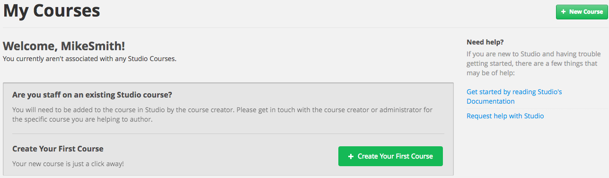
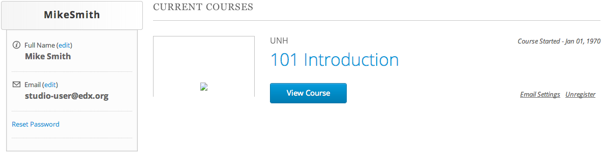

.. _Getting Started with Studio:

###########################
Getting Started with Studio
###########################

This topic describes the tools you use to build an edX course, and how to
create your first course.

.. contents::
 :local:
 :depth: 1

If your organization has an agreement with edX and approval to do so, you can
run courses on the edX Edge and edx.org websites.

If you are using an instance of Open edX to create a course, see
:ref:`opencoursestaff:Getting Started with Studio` in the *Building and Running
an Open edX Course* guide.

.. _What is Studio?:

***************
What is Studio?
***************

Studio is the edX tool you use to build your courses. You use Studio to create
a course structure, and then add problems, videos, and other resources for
learners. You can also manage the course schedule, identify members of the
course team, set the grading policy, publish your course, and more.

* For the edX Edge site, anyone who has approval to use Studio can create and
  develop courses.

* For the edx.org site, only edX staff members can create courses in Studio.
  Course teams at partner institutions can then use Studio to develop the
  courses. Contact your partner manager to discuss your schedule and other
  requirements.

You use Studio directly through your browser. You do not need any additional
software.

.. _Use Studio on Edge:

******************
Use Studio on Edge
******************

For the edX Edge site, you use Studio to create and build courses.

===================================================
Request Course Creation Privileges for edX Edge
===================================================

If you are a first time Studio user for the edX Edge site, follow these steps.

#. Go to the Studio website for Edge, located at https://studio.edge.edx.org.

#. Sign in with the account you created on Edge.

   You must then request access to create courses.

#. Select the **+** icon to expand the field labeled **Becoming a Course
   Creator in Studio**.

#. Select **Request the Ability to Create Courses**.

EdX evaluates your request. When course creation permissions are granted,
you are notified by email.

.. _Create Your First Course:

==================================
Create Your First Course on Edge
==================================

When you receive notice that you can create courses on Edge, log in to Studio
at https://studio.edge.edx.org.

You see the following page, which is your **My Courses** dashboard.

Select **Create Your First Course**, and then follow the instructions in the
:ref:`Creating a New Course` section.

After you create a course, you can view it in the Edge LMS.

.. _View Your Course on Edge:

==================================
View Your Course in the Edge LMS
==================================

You can view a course in the LMS as soon as you create it, even if it does not
contain any content.

From the Course Outline page in Studio, select **View Live**. The course opens
in the Edge LMS.

You can also go directly to the edX Edge LMS at https://edge.edx.org/. Sign in
if prompted. You see the course you just created listed on your **My Courses**
dashboard.

     listed.

You can select the course to confirm its content.

.. _Register Your Course on edx.org:

****************************************************
View Your edx.org Course in Studio and the LMS
****************************************************

If your organization has an agreement with edX and approval to do so, you can
develop courses to run on the edx.org website. Only edX staff members can
create courses to run on edx.org.

.. note:: Contact your partner manager directly to discuss your schedule and
  other requirements for creating an edx.org course. The **Email staff to
  create course** option that appears in Studio is not regularly monitored, and
  should not be used.

After the course is created, you can add content in Studio and then view the
course in the LMS.

#. Go to the Studio website for edx.org, located at https://studio.edx.org.

#. Sign in, and then verify that your course appears on your dashboard.

#. To build your course, follow the instructions in the :ref:`Creating a New
   Course` section.

#. To view the course in the LMS, on the **Course Outline** page select **View
   Live**.

   Your course enrollment page opens in a new browser tab.

#. Select **Enroll** to enroll in your course. After you enroll in your course,
   it opens in the edx.org LMS.

#. To continue working on your course, select the browser tab that shows
   Studio. The **Course Outline** page displays.

.. include:: ../../../links/links.rst
