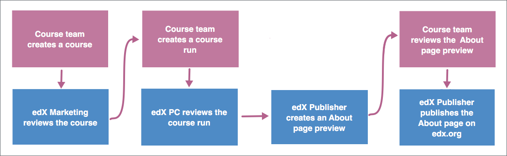

.. _Introduction to Publisher:

################################
Introduction to Publisher
################################

.. note::
  This information applies to courses on the edx.org site. If your course will
  run on Edge, you create the course and the About page in Studio. For more
  information, see :ref:`Creating a New Course` or :ref:`Creating a Course
  About Page`.

EdX Publisher is a tool that allows course teams, edX marketing, edX project
coordinators (PCs), and an edX publisher to work together to create an About
page. The Publisher tool tracks each action and sends email notifications when
actions are complete or required. You can view the status of your About page in
Publisher at any time.

This topic introduces new terms that Publisher uses, provides an overview of
the Publisher process, and explains how to complete common tasks.

.. contents::
  :local:
  :depth: 1

.. _Signing In to Publisher:

***********************
Signing In to Publisher
***********************

Publisher is a separate tool from Studio.

To sign in to Publisher, go to https://publisher.edx.org/,
and then enter your edX username and password.

.. _Publisher Terms:

*********************
Publisher Terms
*********************

To use Publisher, you need to be familiar with the following terms.

* **course**: A collection of lessons presented by an instructor or
  instructors. Information about a course remains true every time the course is
  run on edX and includes the course name, number, description, and image.

* **course run**: A version of the course that runs at a particular time.
  Information about a course run includes start and end dates, as well as staff
  and the languages the course is available in.

* **publisher**: The member of the edX team who converts the information from
  the Publisher tool into an About page on edx.org.

* **Studio URL**: Sometimes also called a "Studio instance", the Studio URL is
  the location that contains course content such as videos and exercises. Every
  course run has a unique Studio URL.

.. _The Publisher Process:

*********************
The Publisher Process
*********************

To create and announce an edX course, the course team and the edX team complete
the following process. You can click the image to enlarge it.

     course to the edX publisher publishing the About page.

#. :ref:`Create the course <Pub Creating a Course>`.

   #. The course team creates a course.
   #. The edX marketing team reviews the course for search engine optimization
      (SEO).
   #. The course team finalizes the course.

#. :ref:`Create the course run <Pub Creating a Course Run>`.

   #. The course team creates a course run for the course.
   #. The course team edits the course run, adding any additional required
      information.
   #. The edX PC reviews the course run.
   #. The course team finalizes the course run.

#. :ref:`Publish the About page <Pub Publishing an About Page>`.

   #. The edX publisher creates a preview of the About page for the course run.
   #. The course team reviews the About page preview.
   #. The edX publisher publishes the About page.

Some of these steps can occur concurrently. For example, a course team can
create and edit a course run before, while, or after edX marketing reviews a
course. However, the course team must finalize the course before the course
team can send the course run to the edX PC for review.

