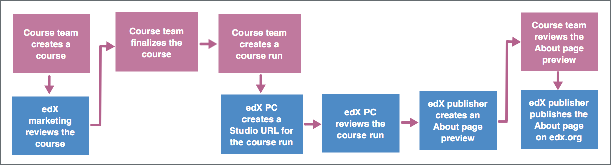

.. _Introduction to Publisher:

################################
Introduction to Publisher
################################

EdX Publisher is a tool that allows course teams, edX marketing, edX project
coordinators (PCs), and an edX publisher to work together to create an About
page. The Publisher tool tracks each action and sends email notifications when
actions are complete or required. You can view the status of your About page in
Publisher at any time.

To use Publisher, you need to be familiar with the following terms.

* course: A collection of lessons presented by an instructor or instructors.
  Information about a course remains true every time the course is run on edX
  and includes the course name, number, description, and image.

* course run: A version of the course that runs at a particular time.
  Information about a course run includes start and end dates, as well as staff
  and the languages the course is available in.

* publisher: The member of the edX team who converts the information from the
  Publisher tool into an About page on edx.org.

* Studio URL: Sometimes also called a "Studio instance", the Studio URL is the
  location that contains course content such as videos and exercises. Every
  course run has a unique Studio URL.

.. _The Publisher Process:

*********************
The Publisher Process
*********************

To create and announce an edX course, the course team and the edX team complete
the following process.

     course to the edX publisher publishing the About page.

#. :ref:`Create the course <Pub Creating a Course in Publisher>`.

   #. The course team creates a course.
   #. The edX marketing team reviews the course for search engine optimization
      (SEO).
   #. The course team finalizes the course.

#. :ref:`Create the course run <Pub Creating a Course Run in Publisher>`.

   #. The course team creates a course run for the course.
   #. The edX PC creates a Studio URL for the course run.
   #. The course team edits the course run, adding any additional required
      information.
   #. The edX PC reviews the course run.
   #. The course team finalizes the course run.

#. :ref:`Publish the About page <Pub Publishing an About Page in Publisher>`.

   #. The edX publisher creates a preview of the About page for the course run.
   #. The course team reviews the About page preview.
   #. The edX publisher publishes the About page.

Some of these steps can occur concurrently. For example, a course team can
create and edit a course run before, while, or after edX marketing reviews a
course. However, the course team cannot send the course run to the edX PC for
review before the course team finalizes the course.

.. note::
 When the course team creates a course run, the edX PC creates a Studio
 URL for the course run. When the Studio URL is ready, the course team can
 enter course content into Studio at any time.

****************************
Change the Course Team Admin
****************************

On the course team, only the user who is listed as the course team admin can
edit the course. Other members of the course team can view the course, but
cannot edit the course. You can change the course team admin at any time.

To change the course team admin, follow these steps.

#. To open Publisher, go to https://edx.org/publisher.
#. In Publisher, go to the **Courses** page, and select the course that you
   want from the list.
#. On the page for the course, locate **Course Team** under **Reviews**.
#. Next to the name of the current course team admin, select **Change**.
#. In the list, select the name of the new course team admin.
#. Select **Change**.

On the course team, only the user who is listed as the course team admin can
edit the course. Other members of the course team can view the course, but
cannot edit the course. You can change the course team admin at any time.

To change the course team admin, follow these steps.

#. Use one of the following methods to open the page for the course run.

   * On the dashboard, select the **In Development** tab, and then select the
     course run that you want. You can identify the course run by the start
     date.
   * On the **Courses** page, select the course that you want. When the page
     for the course opens, under **Course Runs**, select the course run.

#. On the page for the course run, locate **Course Team** under **Reviews**.
#. Next to the name of the current course team admin, select **Change**.
#. In the list, select the name of the new course team admin.
#. Select **Change**.

