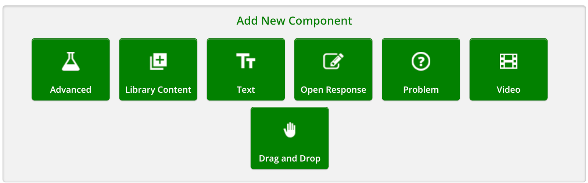
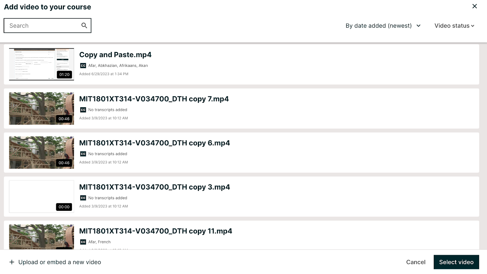
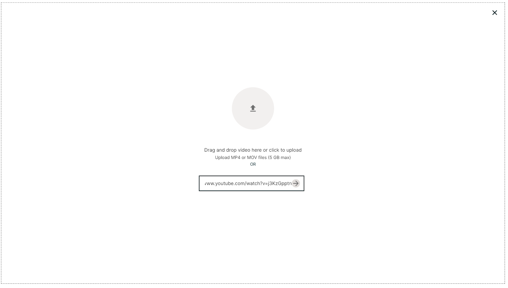
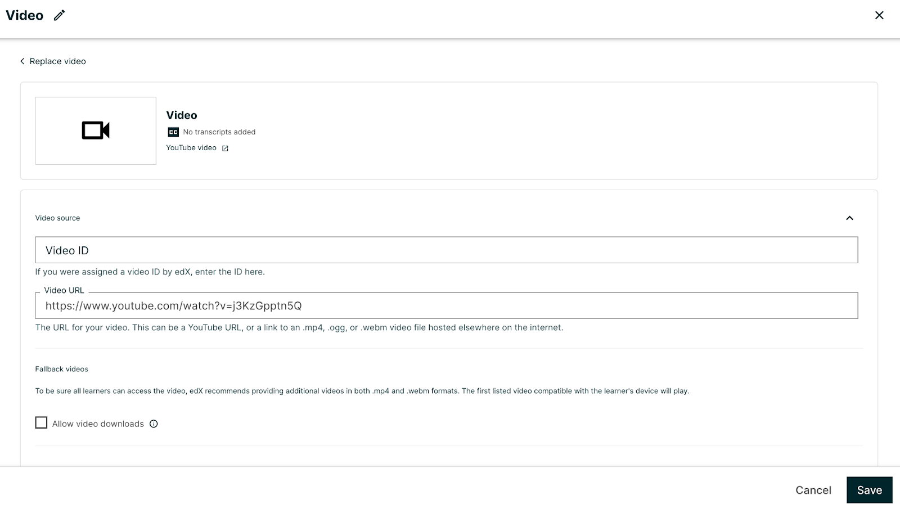

.. _Adding a Video to a Course:

##########################
Adding a Video to a Course
##########################

To make a video visible in your course, you create a video component in a Unit
in Studio, and then you add information for the video to the video component.
The information is different for courses on edx.org and courses on Edge.

.. contents::
 :local:
 :depth: 1

.. _Add a Video to an edx org Course:

********************************
Add a Video to an edx.org Course
********************************

.. note::
  **This information applies only to courses that run on the edx.org site.**
  For information about adding videos to courses that run on Edge, see
  :ref:`Add a Video to an Edge Course`.

For courses on edx.org, you add the following information to the video
component:

* A display name for the component.
* The video ID that the upload process automatically creates for your video. To
  find the video ID, see :ref:`Copy the Video ID`.
* The transcript for your video, for videos with non-integrated transcripts.

.. _Copy the Video ID:

=================
Copy the Video ID
=================

To copy the video ID, follow these steps.

#. Open the course in Studio.

#. On the **Content** menu, select **Video Uploads**.

#. In the **Previous Uploads** list, locate the video that you want to
   include in the course.

#. Select the value in the **Video ID** column for the video. The video ID
   is assigned when you upload a video.

#. Right-click the value, and then select **Copy**. Be sure to copy the
   entire video ID value.

Note that the course team can add a video to their course as soon as the
unique video ID is visible in the **Previous Uploads** list on the **Video
Uploads** page. However, for a video to play successfully, the status for
the file must be “Ready”. Processing takes 24 hours to complete for all
encodings and all video hosting sites.

You can also :ref:`download a report<Reporting Video Status>` of all uploaded
videos. The report includes the video ID for every uploaded file.

=====================
Add a Video Component
=====================

.. note::
  **This information applies only to courses that run on the edx.org site.**
  For information about adding videos to courses that run on Edge, see
  :ref:`Add a Video to an Edge Course`.

To add a video and its transcript to an edx.org course, follow these steps.

#. In Studio, locate the unit that you want, and then select **Video** under
   **Add New Component**.

#. Select the **pencil icon** in the top left hand corner, and enter the name
   that you want learners to see for this video as the Component Display Name.

   This name appears as a heading above the video in the LMS, and it identifies
   the video for you in Insights. If you do not enter a display name, the
   platform specifies “Video” for you. Clicking the “Check” icon will save your
   changes, the “X” icon will discard them.

#. Under Video Source, in the **Video ID** field, enter the Video ID, or **Video
   URL** fields, enter the streaming media link, or video file URL.
   
   .. note::
      When you add the video ID, you do not need to add values to the **Video
      URL** or **Fallback Video** fields. The URLs that are associated with the
      video ID override any existing values in other fields.

#. Optionally, you can set more options for the video. For a
   description of each option, see :ref:`Video Settings`.

#. Select **Save** to save the video component.

=========================================================
Add New or Previously Uploaded Video to Course on edx.org 
=========================================================

If you are in a Unit in your course and you want to add a previously uploaded video, click on the green video tile. 

You now see a list of all the videos that you have previously uploaded. You can search for specific videos within the Search bar, filter by date added (newest/oldest), name (ascending/descending), or duration (longest/shortest). You can sort by video status (uploading, processing, ready, failed). To add a video to your course, click on the video you want to add and then click on Select video. 

To upload or embed a new video, click on the link on the bottom left side of the Add video to your course page. You can drag and drop a video, click to upload a video, or paste your video ID or URL in the text box. 

In the screenshot above, a Youtube URL was pasted into the text box. If you click the right arrow in the box, you are taken to the Video Settings page (screenshot below). If you click Save, the video is added to your course. If you click on Replace video, you are taken back to the Add video to your course page.

.. _Add a Video to an Edge Course:

********************************
Add a Video to an Edge Course
********************************

.. note::
  **This information applies only to courses that run on the Edge site.**
  For information about adding videos to courses that run on edx.org, see
  :ref:`Add a Video to an edx org Course`.

For courses on Edge, you add the following information to the video
component.

.. include:: ../../../shared/video/add_video_to_course.rst
