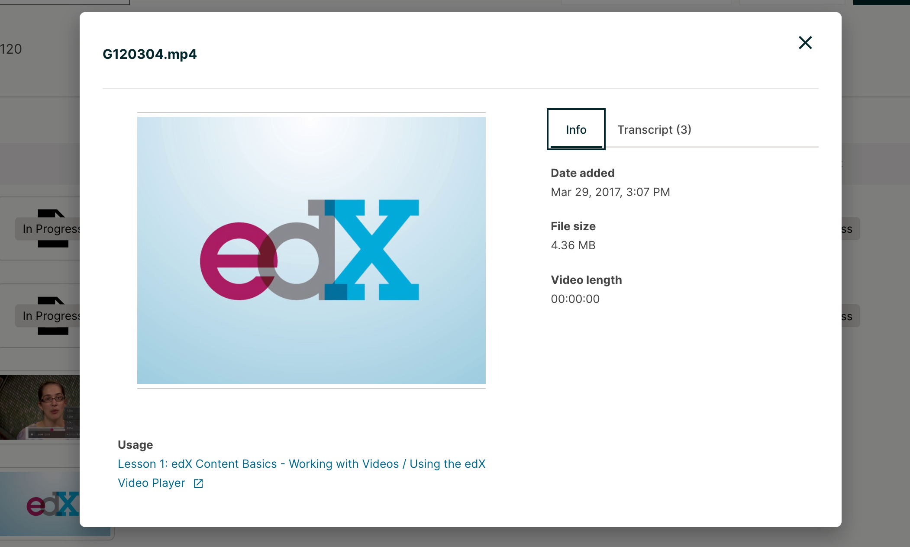
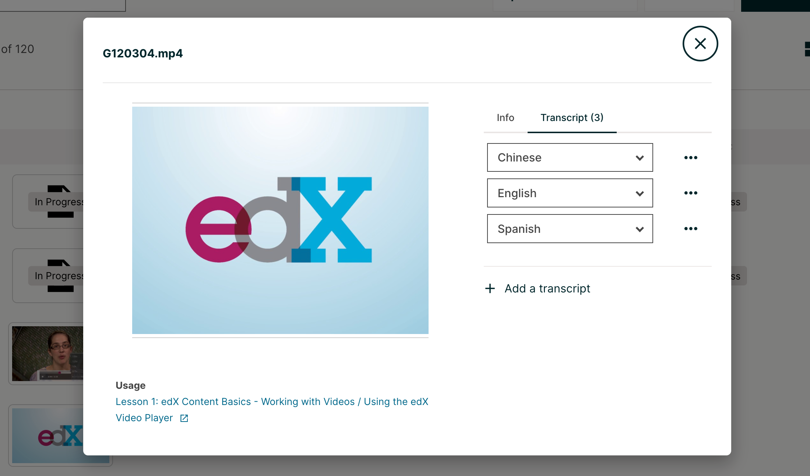
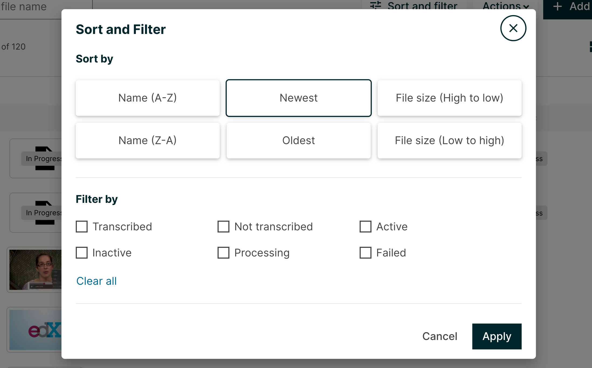

.. _Managing Course Videos:

.. this is the old name of this section, left here so that frozen Maple
    projects will resolve the reference:
.. _Upload a Video on edX:

#######################
Managing Course Videos
#######################

Uploading a video and transcript is different depending on whether your 
course is on edx.org or Edge.

For more information, see the following topics.

.. contents::
  :local:
  :depth: 2

.. _Course  Videos Page:

*******************
Course Videos Page
*******************

You manage videos for your course on the Videos page. This page lists the 
videos that you have added, along with the following capabilities and 
information regarding the videos.

.. image:: ../../../shared/images/videos_page.png
 :width: 600
 :alt: The Videos page lists all course videos.  Additional features include: 
  title search; sort and filter; add videos; download videos; delete videos; 
  view file name, video length, transcript status, and whether video is 
  active in the course at a glance.

* A checkbox for Download and Delete bulk actions
* A thumbnail of the file
* The video name
* The video length
* Transcript status
* An indication of whether the video is active in the course
* An indication of the video status (failed, processing, or blank. The video 
  is ready when that column is blank)
* The three dot menu allows you to copy the Video ID, download the video, 
  launch the Info Modal, and delete a video

=================
Video Info Modal
=================

The Info Modal shows the date added, the file size, and the length of the 
video. The “Usage” section lists all Units where the file is referenced 
within the course. Clicking on each link will take you to the corresponding 
Studio Unit page. 

  the file size, the video length, and if the video is active, then there 
  is a link on the bottom left hand corner of the page that will take you 
  to the location of the video in the course.

This page also includes a Search option to help you find specific videos. 
For more information, see :ref:`Find an Uploaded Video`.

.. _Uploading a Video for an edx org Course:

******************************************
Uploading a Video for an edx.org Course
******************************************

.. note::
  **This information applies only to courses that run on the edx.org site.**
  For information about adding video files to courses that run on Edge,
  see :ref:`Uploading a Video for an Edge Course`.

For :ref:`edx.org courses <Uploading a Video for an edx org Course>`, you
upload your videos to the **Videos** page. The edX video process then
creates multiple formats and sources for your videos.

For more information, see the following topics.

.. contents::
  :local:
  :depth: 2

.. _Automated Video Process:

=======================
Automated Video Process
=======================

So that the edX video player can automatically play videos in the best format
for a learner's device and internet connection, after you upload a video for an
edx.org course, an automated video process creates multiple formats and sources
for every video. The process also assigns a single video ID to the video that
represents all of the formats and hosting locations for the video.

* For courses that have :ref:`integrated transcripts <Automated Video Process
  for Integrated Transcripts>` through 3Play Media or cielo24, the edX
  automated video process also creates transcripts for each video.

* For courses that have :ref:`non-integrated transcripts <Automated Video
  Process for Non Integrated Transcripts>`, you must obtain your transcripts
  from your third party provider. You later :ref:`add the video transcripts
  manually <Add a Transcript>` when you create a video component. Transcripts 
  can also be added in the Transcript tab within the Info Modal.

  also offers the capability to add languages.

.. note::
  If a step in the process does not complete successfully, the process
  automatically tries again multiple times. If the process does not complete
  successfully after multiple tries, an :ref:`error status <Video Processing
  Statuses>` appears in the list of videos on the **Videos** page as 
  well as within the video component.

For more information, see the following topics:

.. contents::
  :local:
  :depth: 1

.. _Automated Video Process for Integrated Transcripts:

**************************************************
Automated Video Process for Integrated Transcripts
**************************************************

If the course has integrated video transcripts through 3Play Media or cielo24,
the process has the following steps.

.. image:: ../../../shared/images/VidProc-IT.png
 :width: 600
 :alt: The video process for courses with integrated video transcripts, as
     explained in the following numbered list.

#. The course team uploads the video file on the **Videos** page.

#. The process assigns a unique video ID to the video. This video ID represents
   all of the files, hosting locations, and transcripts that the automated
   process creates.

   .. important::
    As soon as the automated video process has assigned a video ID to the
    video, you can add the video to the course. However, the video is not
    visible in the course until the automated process is complete. The process
    can take up to 24 hours.

#. The process encodes video files in different formats, and then uploads the
   video files to the hosting service.

#. The process creates transcripts for the video, and then uploads the
   transcripts to the hosting service.

After the automated video process is complete, the course team creates a video
component and adds the video ID to the video component. For more information,
see :ref:`Add a Video to a Course`.

.. _Automated Video Process for Non Integrated Transcripts:

******************************************************
Automated Video Process for Non-Integrated Transcripts
******************************************************

If the course uses a transcript provider that does not offer integrated
transcripts, the video processing service completes the following steps.

.. image:: ../../../shared/images/VidProc-NoIT.png
 :width: 600
 :alt: The video process for courses without integrated video transcripts, as
     explained in the following numbered list.

#. The course team uploads the video file on the **Videos** page.

#. The process assigns a unique video ID to the video. This video ID represents
   all of the files and hosting locations that the automated process creates.

   .. important::
    As soon as the automated video process has assigned a video ID to the
    video, you can add the video to the course. However, the video is not
    visible in the course until the automated process is complete. The process
    can take up to 24 hours.

#. The process encodes video files in different formats.

#. The process uploads the video files to the hosting service.

Either before or after the course team uploads a video on the **Videos**
page, the course team :ref:`obtains transcripts <Obtain a Video Transcript>`
from a transcript provider. When the edX video process is complete, and the
course team has obtained transcripts from the transcript provider, the course
team creates a video component and adds the video ID and transcript to the
component. For more information, see :ref:`Add a Video to a Course`.

=============================================================
Upload a Video for an edx.org Course (for Videos page)
=============================================================

To upload video files, both for videos with integrated transcripts and
non-integrated transcripts, follow these steps.

.. important::
  You must leave the **Videos** page open in your browser until the
  upload process is complete for all files.

#. Open the course in Studio.
#. On the **Content** menu, select **Videos**.
#. Add video files to the **Videos** page by clicking the “Add videos” button 
and browsing your computer to locate the files to upload.

#. (optional) Specify a thumbnail image for the video. The thumbnail image is
   the image that learners see before the video begins to play. To do this,
   hover the cursor over **Add Thumbnail**, select an image from your computer,
   and then select **Open**.

   If a thumbnail image exists for the video and you want to change the image,
   hover the cursor over the image, and then select **Edit Thumbnail**. Select
   an image from your computer, and then select **Open**.

After you have uploaded video files, the edX video process begins. You can
check the progress of a video file through the service at any time. For more
information, see :ref:`Monitor Video Processing` or :ref:`Reporting Video
Status`.

.. _Monitor Video Processing:

========================
Monitor Video Processing
========================

After your video files are successfully uploaded, the video processing service
begins.

.. note::
  This service takes up to 24 hours to complete.

A list of every file that you attempt to upload to the edX servers appears on
the **Videos** page. The list includes each file's status in the encoding and 
hosting workflow. In addition, you can download a report of the video files 
that you uploaded. For more information, see :ref:`Reporting Video Status`.

.. _Video Processing Statuses:

*************************
Video Processing Statuses
*************************

The encoding and hosting process assigns the following statuses to video files.

.. list-table::
  :widths: 25 75
  :header-rows: 1

  * - Status
    - Description
  * - **Failed**
    - Files did not complete processing successfully. If this status appears,
      follow these steps.

      #. Verify that you can play your original .mp4 or .mov file and that the
         file meets all :ref:`specifications <Video Guidelines>` for successful
         video processing.
      #. Remove the video file from the **Videos** page.
      #. Upload the original file again, or upload a replacement file.

      There might be failure instances where a small error message will be displayed
      under the **Failed** status. In most of the cases when the error message is displayed, there
      is a possibility of corruption in the uploaded file (either during the upload or the original
      video file itself). However, if processing fails more than one time for a file, contact edX partner
      support at ``partner-support@edx.org``.

  * - **Failed Duplicate**
    - Files failed to upload because the system identified the files as
      duplicates.
  * - **In Progress**
    - Files are undergoing processing to create additional file formats, or are
      waiting for successful transfer to the host sites.
  * - **Invalid Token**
    - A configuration problem has occurred. If this status appears, contact edX
      partner support at ``partner-support@edx.org``.
  * - **Ready**
    - The encoding process is complete for your files. When you click the names
      of these files, a file on one of the external host sites plays. The
      encoding process might take 24 hours after you upload a file.

      .. note::
        For all courses, the "Ready" status means that the **encoding** process
        is complete. It does not refer to the **transcript** creation process.

        For courses that have integrated transcripts through 3Play Media or
        cielo24, the video is not ready for you to add to the course, or for
        learners to view, until the "Ready" status changes to "Transcript
        Ready", signifying that the transcript creation process is complete.

        For courses that do not have integrated transcripts, you must make sure
        that each video has a transcript. For more information, see :ref:`Non
        Integrated Transcripts`.

  * - **Transcription in Progress**
    - The encoding process has completed, and video transcripts are being
      created.

      If a video has this status longer than the time that you specified for
      the **Transcript Turnaround** time, follow these steps.

      #. Verify that the file that you uploaded is in .mp4 or .mov format and
         that the file meets all :ref:`specifications <Video Guidelines>` for
         successful video processing.
      #. Remove the video file from the **Videos** page.
      #. Upload the original file again, or upload a replacement file.

      If this problem occurs more than one time for a file, contact edX partner
      support at ``partner-support@edx.org``.

  * - **Transcript Ready**
    - Both the video encoding and transcript creation processes are complete.
      The video and transcripts are ready to add to your course and for
      learners to view.

  * - **Partial Failure**
    - This status appears when the transcription process has been started for 
      more than one languages and either one or more processes fail. This 
      indicates a combination of successful and unsuccessful transcription 
      processes.

  * - **Transcript Failed**
    - All the transcription processes have failed.

  * - **Unknown**
    - A configuration problem has occurred. If this status appears, contact edX
      partner support at ``partner-support@edx.org``.
  * - **Uploaded**
    - The file has successfully completed uploading to the edX servers.
  * - **Uploading**
    - The file has not yet reached the edX servers. If a video has this status
      for more than 48 hours, follow these steps.

      #. Verify that the file that you uploaded is in .mp4 or .mov format and
         that the file meets all :ref:`specifications <Video Guidelines>` for
         successful video processing.
      #. Remove the video file from the **Videos** page.
      #. Upload the original file again, or upload a replacement file.

      If this problem occurs more than one time for a file, contact edX partner
      support at ``partner-support@edx.org``.

.. _Reporting Video Status:

******************************************
Downloading the Available Encodings Report
******************************************

The Available Encodings report is a comma separated values (.csv) file that
provides detailed information about the video files that you have uploaded.
This report includes the status of the encoding and hosting process for each
video file that you have uploaded, the identifier for the video, and the URLs
for each encoding format. The edX encoding and hosting process produces these
alternative formats to ensure optimal playback quality for your learners.

You can view the Available Encodings report in a spreadsheet application or
text editor.

To download the Available Encodings report, follow these steps.

#. Open the course in Studio.

#. On the **Content** menu, select **Videos**.

#. On the **Videos** page, click **Download available encodings
   (.csv)**.

#. Use a spreadsheet application or text editor to open the .csv file.

The .csv file includes the following columns.

* The file **Name**.

* The file **Duration**. If the upload process has not yet determined how long
  the file is, **Pending** appears in the **Duration** column for a video.

* The **Date Added**, which shows the date and time that you uploaded the
  video file.

* The unique, identifying **Video ID**. When you add a video component to your
  course, you supply the video ID for the file you want to add. For more
  information, see :ref:`Add a Video to a Course`.

* The **Status** of the encoding and hosting process for the file. For more
  information, see :ref:`Video Processing Statuses`.

The .csv file also includes a column for each of the formats that are the
result of the edX encoding and hosting process. These columns include the URL
of a host site only after the format is successfully generated and delivered to
its destination.

* **desktop_mp4 URL**: The location of a 720p resolution video file in .mp4
  format. Learners who view course videos with mp4 players view this file.

* **desktop_webm URL**: The location of a 720p resolution video file in .webm
  format. Learners who view course videos with webm players view this file.

  .. note::
    The encoding and hosting process no longer creates .webm versions of the
    video files that you upload. Modern web browsers do not require the webm
    format. The .csv file includes the **desktop_webm URL** column to show the
    webm URLs for videos uploaded before this change. When you upload a new
    video, the column will remain empty, even after the encoding and hosting
    process is complete.

* **mobile_low URL**: The location of a 360p resolution video file. Learners
  who download and view course videos on mobile devices view this file.

* **youtube URL**: EdX no longer supports YouTube videos.

**********************
Find an Uploaded Video
**********************

The Videos page lists up to 50 videos at one time. If your course has more 
than 50 videos, additional videos are listed on subsequent pages.

To find a video on the Videos page, you can use the Search option, or you can 
view the page that lists the video.

To use the Search option, enter one of the following search terms in the Search 
field

* The full video name.
* The video name extension, or video type.
* Any part or multiple parts of the video name.

**********************
Sort and Filter Videos
**********************

  Newest, Oldest, File size (high to low) or (low to high). You can filter by 
  videos that are Transcribed, Not Transcribed, Active, Inactive, Processing, or 
  Failed.

On the Videos page, you can sort your files by Name (A-Z), Name (Z-A), Newest, 
Oldest, File size (high to low), and File size (low to high). To sort by one of 
these, select what you wish to sort by and click Apply.

You can filter videos by type so that only a selected type of video is visible. 
The list remains in the current sort order.

To filter the list of videos by type, follow these steps.

#. On the Videos page, click the Sort & Filters button.
#. In the list, select the checkboxes for the type of video that you want.

The list refreshes to show only the type or types of file you selected. To reset 
the list and view videos of all types, clear all checkboxes.

**************
Delete a Video
**************

To delete a video, first click on the corresponding checkboxes of the video(s) 
that you wish to delete, then click on the Actions button, and then select Delete. 

To delete all files, select the very first checkbox, then select the Action button 
and then select Delete. After you delete a video, any links to the video from 
inside or outside the course are broken. You must update links to files that you 
delete, and it is recommended to do this using the Info Modal before deleting any 
referenced videos.

****************
Download a Video
****************

To download a video, which includes the ability to download individual videos, 
multiple videos at once, or all of your videos, first click on the corresponding 
checkboxes of the videos that you wish to download, then click on the Actions 
button, and then select Download. To download all videos, select the very first 
checkbox, then select the Action button and then select Download.

.. _Uploading a Video for an Edge Course:

*************************************
Uploading a Video for an Edge Course
*************************************

.. note::
  This information applies only to courses that run on Edge. For information
  about uploading videos to courses that run on edx.org, see
  :ref:`Uploading a Video for an edx org Course`.

For :ref:`Edge courses <Uploading a Video for an Edge Course>`, you upload your
videos to the third party hosting site that you selected. You also obtain the
transcripts for the videos from your third party provider. You :ref:`add the
video location <Add a Video>` and :ref:`transcripts manually <Add a Transcript>` when you
create a video component.

.. include:: ../../../shared/video/upload_video.rst
