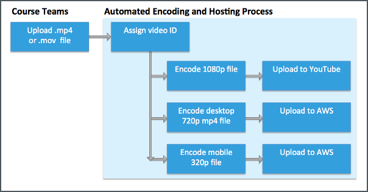

.. _Video Processing Overview:

###########################
Video Processing Overview
###########################

.. note::
  **This process applies only to courses that run on the edx.org site.** For
  information about adding video files to courses that run on Edge, see
  :ref:`Step 3. Upload a Video for an edx Edge Course <Upload Video>`.

This section provides an overview of the automated video process for edX
partners. This process creates a single video ID for each video. This video ID
represents files for each of the different video formats as well as the hosting
services for these files.

This process has several steps. The following diagram shows a simplified view
of this process.

.. image:: ../../../../shared/images/encoding_proc_overview.png
 :width: 700
 :alt: Flowchart of the process. EdX partner support sets up YouTube and AWS
     accounts, then a course team uploads a video. The automated process
     assigns a video ID, encodes and uploads the video in different formats to
     YouTube and AWS, and provides the video ID to the course team. The course
     team monitors processing and adds the video to a course.

#. EdX Partner Support works with your organization’s video administrators to
   set up accounts at YouTube™ and Amazon Web Services™ (AWS). For more
   information, see :ref:`Video Getting Started`.
#. Course teams use Studio to upload a video file to the edX servers. For more
   information, see :ref:`Uploading Videos in Studio`.
#. The automated video process assigns a video ID to the video file, creates
   additional formats for the video, and transfers these files to YouTube and
   AWS. For more information, see :ref:`Video Encoding and Hosting Overview`.
#. While the automated video process is in progress, the course team receives
   the video ID for the video and monitors the video status. The video process
   is complete when the video has a status of "Ready" on the **Video Uploads**
   page. For more information, see :ref:`Monitor Video Processing`.

After these steps are complete, the course team can :ref:`add the video to the
course<Add a Video to a Course>`.

.. important::
 The edX video process **does not** include transcript services. Your course
 teams use your organization's current workflow to generate transcripts for
 your video files and then add the transcripts to the video in Studio. For more
 information, see :ref:`Add a Video Transcript`.

.. _Video Encoding and Hosting Overview:

********************************************
The Video Encoding and Hosting Process
********************************************

After a member of a course team uploads a video file to the edX servers
successfully, the automated encoding and hosting process starts. This process
creates additional file formats and transfers the files to YouTube and AWS
accounts to ensure optimal playback quality for course videos.

     video ID and then transcoding it into four formats and transferring the
     results to YouTube and AWS.

.. important:: The automated encoding and hosting process takes up to **24
   hours** to complete.

If a step does not complete successfully, the process automatically tries again
multiple times.
