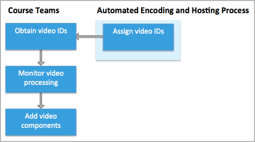

.. _Video Processing Overview:

###########################
Video Processing Overview
###########################

Videos are one of the most important assets of an online course. Making
course videos available to learners who are located all over the world, and
who are accessing course content with different devices and Internet
connectivity constraints, can be a complex undertaking.

* Videos need to be available from more than one host site to play in
  locations around the world.

* Videos need to be available in several different formats to play on both
  desktop computers and smartphones.

* Videos need to be available for both download and streaming to be watchable
  by learners with slow or intermittent Internet connections.

To help course teams at partner institutions meet the challenge of delivering
high quality video experiences to as many learners as possible for edx.org
courses, edX offers media encoding and hosting services to partners to address
multiple playback and download needs.

.. note:: The information and procedures in this section apply only to
 courses that run on the edx.org site. For information about adding video files
 to courses that run on Edge, see :ref:`Working with Video Components`.

************************************
Course Team Video Upload Overview
************************************

The edX partner support team establishes accounts for your institution at
YouTube™ and Amazon Web Services™ (AWS). For more information about the
preliminary setup that your institution works with edX to complete, see
:ref:`Video Getting Started`.

After these services are set up, course teams use Studio to upload one file to
the edX servers for each of the videos that they want to include in their
course. For more information, see :ref:`Uploading Videos in Studio`.

.. _Video Encoding and Hosting Overview:

************************************
Video Encoding and Hosting Overview
************************************

After a member of a course team uploads a video file to the edX servers
successfully, the automated encoding and hosting process starts. This process
creates additional file formats and transfers the files to YouTube and AWS
accounts to ensure optimal playback quality for course videos.

.. image:: ../../../shared/images/encoding_process.png
 :alt: Flowchart of course team uploading a video, followed by edX assigning a
     video ID and then transcoding it into four formats and transferring the
     results to two host sites

.. important:: The automated encoding and hosting process takes **24 hours**
 to complete.

If a step fails to complete successfully the process includes multiple
automated retries.

Course teams can track the status of each video file on the Studio **Video
Uploads** page as the videos go through automated processing.

.. note:: The edX automation process does not include captioning services.
 Your course teams use your institution's current workflow to generate
 transcripts for your video files, and then add them to the video in Studio.
 For more information, see :ref:`Add a Video Transcript`.

************************************
Course Team Add Video Overview
************************************

In Studio, course teams can monitor the progress of each video that they
upload and obtain its unique video ID. After the file uploads to the edX
servers successfully, it is given a status of Ready and the course team can
add its video ID to a video component in the course outline. For more
information, see :ref:`Adding Videos to a Course`.

     video ID and then transcoding it into four formats and transferring the
     results to two host sites

When a learner uses the edX video player or the edX mobile app to access a
course video, the video ID is what provides the connection to the URLs that
host each differently-encoded version of the original video file. For
information about ensuring that your videos are available to learners who use
the edX mobile apps, see :ref:`installation:Configuring Video Modules for
Mobile`.

The course team can add a video to their course as soon as its unique video ID
is assigned, and the video plays in the LMS as soon as its status is Ready.
However, processing takes 24 hours to complete for all encodings and all video
hosting sites.
