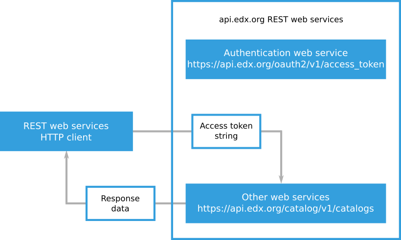

.. _edX API Authentication:

###############################################
Authenticating as an edX REST Web Service User
###############################################

The edX Course Catalog API is a REST web services API. An API client is a
program, utility, or other tool that you can use to exchange messages with an
API. When you use the edX API, you use a client to make requests and receive
response data. Clients must authenticate when they make API requests.
Authenticating allows the edX API to verify the identity of the client and
associate that identity with a specific edX.org user.

When a client authenticates with the edX API, the client completes the
following process.

* The client presents a client identifier and a secret string to the
  ``/oauth2/v1/access_token`` authentication resource and receives an access
  token.

* The client includes the access token when the client makes another API
  request.

An access token is a text string that includes encoded information about the
client, the user, and the period of time in which the token is valid. Access
tokens expire after a period of time that is specified when you request them.
After an access token expires, you must get a new token from the
``/oauth2/v1/access_token`` authentication resource.

The following diagram shows a client presenting its client ID and client
secret to the ``/oauth2/v1/access_token`` authentication resource. The
authentication resource returns an access token.

      credentials to the authentication web service and receiving an access
      token.

The following diagram shows a client presenting an access token when the client
requests a resource. After the edX API accepts the access token, it returns the
resource data.

      token when it requests a REST resource from api.edx.org.

The edX API uses the OAuth 2.0 standard for authentication. OAuth
2.0 is an open standard used by many systems that require secure user
authentication. See the `OAuth 2.0 Standard`_ for more information.

The edX API uses JSON web tokens (JWT) as access tokens for authentication. JWT
access tokens are digitally signed and encoded strings of information about the
edX user who presents the token. For more information about JWT, see
`JWT <https://jwt.io>`_.

The example API requests shown in this guide use the ``curl`` command-line
program to send HTTP messages to the edX API. You can use any technology to
send REST API requests. The examples use the ``curl`` program to show the
syntax and data for a request in a way that is easy to read. For more
information about the ``curl`` program, see `curl client program`_.

The following sections provide more information about authenticating as an edX
API user.

.. contents::
   :local:
   :depth: 1

.. _getting_a_client_id_and_secret:

*************************************
Getting a Client ID and Client Secret
*************************************

Your API client credentials consist of a client ID and a client secret. EdX
generates your client credentials after you request access to the edX API.

To obtain your client credentials, complete the following steps.

.. contents::
   :local:
   :depth: 1

The following example shows a client ID and client secret.

.. code-block:: none

    Application Name: My REST Web Services Application

    API Client ID: VBu9oI0h4OkrEA29DPn1F8ArNOiviEKq05UHbzwe

    API Client Secret: wDSbvs7vs5Xj9P9oE73pAV6L4iZxfPdPjagkBdmLzqtQ6lqu2IMXuTt
    upD2TmaMB3MPmrKEZbtaFMUqjZKzg98xMu5QzboPDQSBL72hjQ7r7IfrutVMZF8AGXn9LqZmk

.. _Create API Account:

===========================================
Create an Account on edx.org for API Access
===========================================

To request access to the edX Course Catalog API, you need a dedicated edx.org
account with a user name that matches your organization's identity. For example,
if you are at an organization named Example, Inc., you need to create an edX
account with a user name like ``Example``. This enables edX to match your Course
Catalog API request with an organization that is authorized to use the Course
Catalog API.

.. _CC API Complete Access Request Form:

========================================
Complete the EdX API Access Request Form
========================================

To request access to the edX Course Catalog API, follow these steps.

#. Sign in to edX at https://courses.edx.org/login with an account whose user
   name matches your organization's identity, as described in :ref:`Create API Account`.
#. Go to http://courses.edx.org/api-admin.
#. On the **EdX API Access Request** page, enter the information for your
   organization. All fields are required.

    * **Company Name**: The name of your company.
    * **Website**: The URL for your company's website.
    * **Company Address**: Your company's mailing address. This can be a street
      address or a post office box.
    * **Application Description**: A brief description of the main use for your
      application.

#. At the bottom of the form, select the **Terms of Service** check box.
#. Select **Request API Access** to submit your request.

After you submit the request form, edX will review your request, and then edX
will send you an email message approving your request or providing more
information.

.. _CC API Generate API Credentials:

========================
Generate API Credentials
========================

When you receive your approval email message from edX, follow these steps.

#. Go to http://courses.edx.org/api-admin/status.
#. On the page that opens, enter the following information.

   * Name: An identifying name that you assign to your application.
   * Redirect URIs (optional): The redirect URL or URLs for your application.
     Not all edX REST web services clients use redirect URLs. For example, you
     do not need a redirect URL to use the Course Catalog API.

#. Select **Generate API client credentials**.

The screen displays your application name, client ID, client secret, and any
redirect URIs that you entered. Make sure that you record your client ID and
client secret.

If you need to regenerate your credentials, go to http://courses.edx.org/api-
admin/status and select **Generate API client credentials** again. Do not
change the existing **Name** and **Redirect URIs** values.

.. _getting_an_access_token:

*********************************************
Getting an Access Token
*********************************************

To get an access token, you send a ``POST`` request to the
``/oauth2/v1/access_token`` authentication resource. The response you receive
contains the access token string.

To get an access token for the edX API, follow these steps.

#. Make sure you have the client ID and client secret strings for your API
   client.

#. Send a ``POST`` HTTP request to the ``/oauth2/v1/access_token``
   authentication resource. Include your client identifier and client secret in
   the message body of your ``POST`` request. Include the client ID and secret
   in a string that includes ``grant_type=client_credentials`` and
   ``token_type=jwt`` as shown in the following example.

   ``grant_type=client_credentials&client_id={client id}&client_secret={client
   secret}&token_type=jwt``

   For an example request, see :ref:`example_access_token_request`.

#. Find the access token string in the ``access_token`` value in the JSON
   response data. For more information about the authentication endpoint
   response data, see :ref:`authentication_endpoint_response`.

   The following example ``access_token`` value includes an access token
   string.

   .. code-block:: none

      "access_token": "4IHZlbCB2aXZlcnJhIGdyYXZpZGEsIHJpc3V.TG9yZW0gaXBzdW0gZG9
      sb3Igc2l0IGFtZXQsIGNvbnNlY3RldHVyIGFkaXBpc2NpbmcgZWxpdC4gRXRpYW0gdGluY2lk
      dW50IG9kaW8gZWdldCB0aW5jaWR1bnQgcG9ydGEuIEZ1c2NlIHZlaGljdWxhIGFyY3UgdGVsb
      HVzLCBzaXQgYW1ldCBmcmluZ2lsbGEgZXN0IHByZXRpdW0gc2VkLiBDdXJhYml0dXIgY29uc2
      VxdWF0IHVsdHJpY2llcyB0cmlzdGlxdWUuIEluIGVzdCBwdXJ1cywgZmFjaWxpc2lzIGFjIGx
      lY3R1cyBxdWlzLCBsdWN0dXMgdGVtcG9yIG9yY2kuIEludGVnZXIgdml0.YWUgbmVxdWUgbGl
      ndWxhLiBVdCBjb25zZXF1YXQsIGV"

.. _example_access_token_request:

====================================
Example Access Token Request
====================================

The following example ``curl`` program command requests an access token from
the edX API authentication endpoint.

.. code-block:: bash

    curl -X POST -d "grant_type=client_credentials&client_id=VB1AkrAE28ArNnOizi4OEKq03UGu9oI0h9DPbvwe&client_secret=wFMUqjZKQzboPEQSBLxERatup7r772hzg98xLu6fr6s7vIta5Xj3MPmrKEZbfPdPjagkBdmLjQXlqu2IMC2TnaMutVLZF9AGXn9LqZv9P9oE73pAV6L4iZxzpuQBuTmk&token_type=jwt" https://api.edx.org/oauth2/v1/access_token

.. _authentication_endpoint_response:

==================================================
Understanding the Authentication Endpoint Response
==================================================

The edX API authentication endpoint returns JSON data that includes an
access token string and information about that access token.

The values in the authentication endpoint response data are described in the
following list.

* ``access_token``: The access token string that you can use to make API
  requests.

* ``expires_in``: The length of time, in seconds, that the access token will be
  accepted. The period of time starts when the authentication service issues
  the token. Note that this value may change at any time and should not be
  hard-coded in any scripts that make requests for an access token.

* ``scope``: The internal resources that your API client has access to. You do
  not need to use the information in the ``scope`` value.

* ``token_type``: A description of the format of the access token. You specify
  the format of an access token when you use that token to make API requests.

The following example JSON response data shows the ``access_token`` value and
the access token string.

.. code-block:: json

    {
      "access_token": "4IHZlbCB2aXZlcnJhIGdyYXZpZGEsIHJpc3V.TG9yZW0gaXBzdW0gZG9
      sb3Igc2l0IGFtZXQsIGNvbnNlY3RldHVyIGFkaXBpc2NpbmcgZWxpdC4gRXRpYW0gdGluY2
      lkdW50IG9kaW8gZWdldCB0aW5jaWR1bnQgcG9ydGEuIEZ1c2NlIHZlaGljdWxhIGFyY3Ugd
      GVsbHVzLCBzaXQgYW1ldCBmcmluZ2lsbGEgZXN0IHByZXRpdW0gc2VkLiBDdXJhYml0dXIg
      Y29uc2VxdWF0IHVsdHJpY2llcyB0cmlzdGlxdWUuIEluIGVzdCBwdXJ1cywgZmFjaWxpc2l
      zIGFjIGxlY3R1cyBxdWlzLCBsdWN0dXMgdGVtcG9yIG9yY2kuIEludGVnZXIgdml0.YWUgb
      mVxdWUgbGlndWxhLiBVdCBjb25zZXF1YXQsIGV",
      "expires_in": 180,
      "scope": "read write profile email",
      "token_type": "JWT"
    }

.. _using_an_access_token:

*********************************************
Using an Access Token to Make REST Requests
*********************************************

To make an edX API request, you include an access token string in the
``Authorization`` HTTP header field. In addition to the access token string,
you specify the token type, for example ``JWT``.

The following example ``curl`` program command sends a request to an edX API
endpoint. The example request includes the token type and access token string
in the ``Authorization`` HTTP header field.

.. code-block:: bash

  curl -X GET -H "Authorization: JWT 4IHZlbCB2aXZlcnJhIGdyYXZpZGEsIHJpc3V.TG9yZW0gaXBzdW0gZG9sb3Igc2l0IGFtZXQsIGNvbnNlY3RldHVyIGFkaXBpc2NpbmcgZWxpdC4gRXRpYW0gdGluY2lkdW50IG9kaW8gZWdldCB0aW5jaWR1bnQgcG9ydGEuIEZ1c2NlIHZlaGljdWxhIGFyY3UgdGVsbHVzLCBzaXQgYW1ldCBmcmluZ2lsbGEgZXN0IHByZXRpdW0gc2VkLiBDdXJhYml0dXIgY29uc2VxdWF0IHVsdHJpY2llcyB0cmlzdGlxdWUuIEluIGVzdCBwdXJ1cywgZmFjaWxpc2lzIGFjIGxlY3R1cyBxdWlzLCBsdWN0dXMgdGVtcG9yIG9yY2kuIEludGVnZXIgdml0.YWUgbmVxdWUgbGlndWxhLiBVdCBjb25zZXF1YXQsIGV" https://api.edx.org/catalog/v1/catalogs/

.. include:: ../../../links/links.rst
