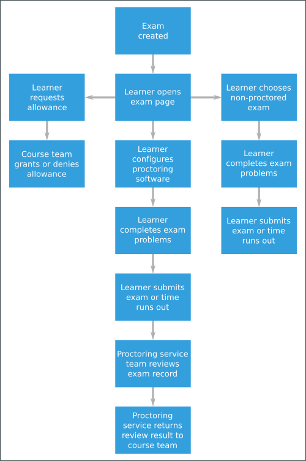

.. _Student_Event_Types:

##############
Student Events
##############

This section lists events that are typically initiated by learners. These
events are generated by interactions with the learning management system (LMS)
other than the instructor dashboard.

For a list of events generated by course team interactions on the instructor
dashboard, see :ref:`Instructor_Event_Types`. For a complete, alphabetical
list of events, see the :ref:`event_list`.

.. contents::
  :local:
  :depth: 1

The descriptions that follow include what each event represents, the system
component it originates from, the history of any changes made to the event
over time, and any additional member fields that the common ``context`` or
``event`` fields contain.

The value in the ``event_source`` field distinguishes between events that
originate in the browser (in JavaScript) and events that originate on the
server (during the processing of a request).

For more information about the common ``context`` or ``event`` fields, and
about the ``event_source`` field, see :ref:`common`.

.. Badging is currently available only on Open edX, so badging events section is commented out. Add to live doc when badging is supported on edx.org (CT)

  .. _badging_events:

  *****************
  Badging Events
  *****************

  This section includes descriptions of the following events related to badges,
  which are created when learners have achieved some course milestone, usually
  the awarding of a course certificate. Badges are created automatically when
  certificates are generated. A badge is uniquely identifiable by its assertion
  information. A badge assertion represents a badge being awarded to a learner,
  and describes the following three items.

       * Who the badge was awarded to.
       * What the badge represents (for example, course identifier, enrollment mode).
       * Who issued the badge (the issuing organization).

      When learners earn badges, they can download a badge image and share it on
      social networks or on badge display sites such as Mozilla Backpack. When
      other parties visit the shared badge links, they can view information that
      gives evidence of the learner's achievement.

      * ``edx.badge.assertion.created``
      * ``edx.badge.assertion.shared``
      * ``edx.badge.assertion.evidence_visited``

      =================================
      ``edx.badge.assertion.created``
      =================================

      When a badge is created that associates a specific learner with a specific
      achievement, the server emits an ``edx.badge.assertion.created`` event.

      **Event Source**: Server

      **History** Added 8 June 2015.

      ``event`` **Member Fields**:

      .. list-table::
         :widths: 15 15 60
         :header-rows: 1

         * - Field
           - Type
           - Details
         * - ``assertion_id``
           - number
           - The unique ID of the BadgeAssertion object.
         * - ``assertion_image_url``
           - string
           - The URL of an image file of the badge that includes badge assertion
             information in the header. These files can serve to verify the user's
             accomplishment and can be easily shared.
         * - ``assertion_json_url``
           - string
           - The URL of a JSON object containing the badge assertion information.
         * - ``course_id``
           - string
           - The course associated with this badge.
         * - ``enrollment_mode``
           - string
           - The course enrollment mode associated with this badge.
         * - ``issuer``
           - string
           - The URL of the badge issuer's web site.
         * - ``user_id``
           - number
           - The numeric ID of the learner who earned this badge.

      =================================
      ``edx.badge.assertion.shared``
      =================================

      When a learner downloads a badge that she has earned for the purpose of
      sharing it on social media, the server emits an
      ``edx.badge.assertion.shared`` event.

      **Event Source**: Browser

      **History** Added 8 June 2015.

      ``event`` **Member Fields**:

      The ``edx.badge.assertion.shared`` event includes many of the same ``event``
      member fields that are described for the ``edx.badge.assertion.created``
      event. The following member fields serve the same purpose for
      ``edx.badge.assertion.shared`` as they do for
      ``edx.badge.assertion.created``.

      * ``assertion_id``
      * ``assertion_image_url``
      * ``assertion_json_url``
      * ``course_id``
      * ``enrollment_mode``
      * ``issuer``
      * ``user_id``

      The following additional ``event`` member field applies specifically to
      ``edx.badge.assertion.shared`` events.

      .. list-table::
         :widths: 15 15 60
         :header-rows: 1

         * - Field
           - Type
           - Details
         * - ``social_network``
           - string
           - The social network to which the badge is shared.

      ===========================================================
      ``edx.badge.assertion.evidence_visited``
      ===========================================================

      Each badge contains assertion information that includes an "evidence" field.
      When badges are displayed on sites such as Mozilla Backpack, the evidence
      field is used to provide a link to evidence that confirms the badge owner's
      achievement, usually a certificate.

      When other users visit social networks or a site such as Mozilla Backpack and
      use a badge's evidence link to view a badge owner's certificate, the server
      emits an ``edx.badge.assertion.evidence_visited`` event.

      **Event Source**: Browser

      **History** Added 8 June 2015.

      ``event`` **Member Fields**:

      The ``edx.badge.assertion.evidence_visited`` event includes all of the same
      ``event`` member fields that are described for the
      ``edx.badge.assertion.created`` event. The following member fields serve the
      same purpose for ``edx.badge.assertion.evidence_visited`` as they do for
      ``edx.badge.assertion.created``.

      * ``assertion_id``
      * ``assertion_image_url``
      * ``assertion_json_url``
      * ``course_id``
      * ``enrollment_mode``
      * ``issuer``
      * ``user_id``

.. _bookmark_events:

**************************
Bookmark Events
**************************

This section includes descriptions of the following events.

.. contents::
 :local:
 :depth: 1

Users can add bookmarks to course units for easy access in the future. The
browser emits these events when users view, add, use, or delete bookmarks.

.. _edx_bookmark_accessed:

=====================================================
``edx.bookmark.accessed``
=====================================================

The browser emits this event when a user accesses a bookmark by selecting a
link on the **My Bookmarks** page in the LMS.

``event`` **Member Fields**:

.. list-table::
   :widths: 15 15 60
   :header-rows: 1

   * - Field
     - Type
     - Details
   * - ``bookmark_id``
     - string
     - The unique internal identifier for the bookmark.
   * - ``component_type``
     - string
     - The component type of the bookmarked XBlock. For more information, see
       :ref:`Course Structure Category Field`.
   * - ``component_usage_id``
     - string
     - The unique usage identifier of the bookmarked XBlock. This ID
       corresponds to the ``courseware_studentmodule.module_id``. For more
       information, see :ref:`module_id`.

**Event Source**: Browser

**History**: Added 4 Jan 2016.

.. _edx_bookmark_added:

=====================================================
``edx.bookmark.added``
=====================================================

The browser emits this event when a user bookmarks a page.

``event`` **Member Fields**:

The ``edx.course.bookmark.added`` events include the same event member fields
that are described for :ref:`edx_bookmark_accessed`. The following
member fields serve the same purpose for accessed bookmarks, added bookmarks,
and removed bookmarks.

* ``bookmark_id``
* ``component_type``
* ``component_usage_id``

The following ``event`` member field applies specifically to
``edx.course.bookmark.added`` and ``edx.course.bookmark.removed`` events.

.. list-table::
   :widths: 15 15 60
   :header-rows: 1

   * - Field
     - Type
     - Details
   * - ``course_id``
     - string
     - The identifier of the course that includes the bookmark.

**Event Source**: Browser

**History**: Added 4 Jan 2016.

=====================================================
``edx.bookmark.listed``
=====================================================

The browser emits this event when a user selects **My Bookmarks** in the LMS
to list previously bookmarked pages. If the number of bookmarked events
exceeds the defined page length, the browser emits an additional
``edx.course.bookmark.listed`` event each time the user navigates to a
different page of results.

``event`` **Member Fields**:

.. list-table::
   :widths: 15 15 60
   :header-rows: 1

   * - Field
     - Type
     - Details
   * - ``bookmarks_count``
     - integer
     - The number of pages a learner has bookmarked. If the ``course_id`` is
       specified, this value is the number of pages a learner has bookmarked
       in that course.
   * - ``course_id``
     - string
     - The identifier of the course that includes the bookmark. This is an optional
       field that is present only if the value for ``list_type`` is ``per_course``.

       * ``per_course`` indicates that all listed bookmarks are in a single course.
       * ``all_courses`` indicates that the listed bookmarks can be in any
         course that the learner is enrolled in.

   * - ``list_type``
     - string
     - Possible values are 'per_course' or 'all_courses'.
   * - ``page_number``
     - integer
     - The current page number in the list of bookmarks.
   * - ``page_size``
     - integer
     - The number of bookmarks on the current page.

**Event Source**: Browser

**History**: Added 4 Jan 2016.

=====================================================
``edx.bookmark.removed``
=====================================================

The browser emits this event when a user removes a bookmark from a page.

``event`` **Member Fields**:

The ``edx.course.bookmark.removed`` event includes the same event member
fields that are described for :ref:`edx_bookmark_accessed`, and it also
includes the ``course_id`` field that is described for
:ref:`edx_bookmark_added`.

The ``edx.course.bookmark.removed`` event includes the following event member
fields.

* ``bookmark_id``
* ``component_type``
* ``component_usage_id``
* ``course_id``

**Event Source**: Browser

**History**: Added 4 Jan 2016.

.. _certificate_events:

*******************
Certificate Events
*******************

This section includes descriptions of the events related to certificates, which
are awarded to qualified learners when they complete a course.

.. contents::
  :local:
  :depth: 1

=================================
``edx.certificate.created``
=================================

When a certificate is generated, a record is created in the
``certificates_generatedcertificate`` table, triggering an
``edx.certificate.created`` event. For details, see
:ref:`certificates_generatedcertificate`.

**Event Source**: Server

**History** Added 2 September 2015.

``event`` **Member Fields**:

.. list-table::
   :widths: 15 15 60
   :header-rows: 1

   * - Field
     - Type
     - Details

   * - ``certificate_id``
     - string
     - The ``verify.uuid`` value from the
       ``certificates_generatedcertificate`` table. This string appears at the
       bottom of each certificate.
   * - ``certificate_url``
     - string
     - The URL for the certificate web page.
   * - ``course_id``
     - string
     - The course for which this certificate is issued.
   * - ``enrollment_mode``
     - string
     - The course enrollment mode associated with this certificate.
   * - ``generation_mode``
     - string
     - Indicates whether this certificate was generated for all learners in a
       course by a batch command, or whether a learner generated her own
       certificate. Possible values are "batch" and "self".
   * - ``user_id``
     - number
     - The numeric ID of the learner who earned this certificate.

=================================
``edx.certificate.shared``
=================================

When a learner shares the URL for her certificate on a social media web site,
the server emits an ``edx.certificate.shared`` event.

**Event Source**: Browser

**History** Added 2 September 2015.

``event`` **Member Fields**:

The ``edx.certificate.shared`` event includes many of the same ``event``
member fields that are described for the ``edx.certificate.created`` event.
The following member fields serve the same purpose for
``edx.certificate.shared`` as they do for `edx.certificate.created`_.

* ``certificate_id``
* ``certificate_url``
* ``course_id``
* ``enrollment_mode``
* ``user_id``

The following additional ``event`` member field applies specifically to
``edx.certificate.shared`` events.

.. list-table::
   :widths: 15 15 60
   :header-rows: 1

   * - Field
     - Type
     - Details
   * - ``social_network``
     - string
     - The social network to which the certificate is shared, such as
       "LinkedIn", "Facebook", or "Twitter".

======================================
``edx.certificate.evidence_visited``
======================================

When a learner shares her certificates on social network sites such as
LinkedIn, and the link back to the certificate is followed by some visitor to
that social network site, the server emits an
``edx.certificate.evidence_visited`` event.

**Event Source**: Browser

**History** Added 2 September 2015.

``event`` **Member Fields**:

The ``edx.certificate.evidence_visited`` event includes all of the same
``event`` member fields that are described for the ``edx.certificate.created``
event. The following member fields serve the same purpose for
``edx.certificate.evidence_visited`` as they do for
``edx.certificate.created``.

* ``certificate_id``
* ``certificate_url``
* ``course_id``
* ``enrollment_mode``
* ``user_id``

The following additional ``event`` member fields apply specifically to
``edx.certificate.evidence_visited`` events.

.. list-table::
   :widths: 15 15 60
   :header-rows: 1

   * - Field
     - Type
     - Details
   * - ``social_network``
     - string
     - The social network to which the certificate is shared, such as
       "LinkedIn", "Facebook", or "Twitter".
   * - ``source_url``
     - string
     - The URL of the web site where the certificate evidence link was
       selected. This URL is the same as the URI in the ``context.referer``
       field. For details, see :ref:`referer_field`.

.. _student_cohort_events:

***************************
Cohort Events (Student)
***************************

This section includes descriptions of the following events.

.. contents::
  :local:
  :depth: 1

For information about including student cohorts in a course, see
:ref:`partnercoursestaff:Cohorts Overview` in the *Building and Running an edX
Course* guide.

=================================
``edx.cohort.created``
=================================

When a course team or the system creates a cohort, the server emits an
``edx.cohort.created`` event. Cohorts can be created manually by members of the
course team. The system automatically creates the default cohort and any
cohorts that are defined by the ``auto_cohort_groups`` advanced setting when
they are needed (for example, when a student is assigned to one of those
cohorts).

Additional events are emitted when members of the course team select
**Instructor** in the LMS to create a cohort on the instructor dashboard. See
:ref:`instructor_cohort_events`.

**Event Source**: Server

**History** Added 7 Oct 2014.

``event`` **Member Fields**:

.. list-table::
   :widths: 15 15 60
   :header-rows: 1

   * - Field
     - Type
     - Details
   * - ``cohort_id``
     - number
     - The numeric ID of the cohort.
   * - ``cohort_name``
     - string
     - The display name of the cohort.

=================================
``edx.cohort.user_added``
=================================

When a user is added to a cohort, the server emits an ``edx.cohort.user_added``
event. Members of the course team can add users to cohorts individually or by
uploading a .csv file of student cohort assignments. The system automatically
adds a user to the default cohort or a cohort included in the course's
``auto_cohort_groups`` setting if a user who has not yet been assigned to a
cohort accesses course content.

Additional events are emitted when members of the course team select
**Instructor** in the LMS to add a user to a cohort on the instructor
dashboard. See :ref:`instructor_cohort_events`.

**Event Source**: Server

**History** Added 7 Oct 2014.

``event`` **Member Fields**:

.. list-table::
   :widths: 15 15 60
   :header-rows: 1

   * - Field
     - Type
     - Details
   * - ``cohort_id``
     - number
     - The numeric ID of the cohort.
   * - ``cohort_name``
     - string
     - The display name of the cohort.
   * - ``user_id``
     - number
     - The numeric ID (from ``auth_user.id``) of the added user.

=================================
``edx.cohort.user_removed``
=================================

When a course team member selects **Instructor** in the LMS to change the
cohort assignment of a learner on the instructor dashboard, the server emits an
``edx.cohort.user_removed`` event.

**Event Source**: Server

**History** Added 7 Oct 2014.

``event`` **Member Fields**:

.. list-table::
   :widths: 15 15 60
   :header-rows: 1

   * - Field
     - Type
     - Details
   * - ``cohort_id``
     - number
     - The numeric ID of the cohort.
   * - ``cohort_name``
     - string
     - The display name of the cohort.
   * - ``user_id``
     - number
     - The numeric ID (from ``auth_user.id``) of the removed user.

.. _Course Content Completion Events:

************************************
Course Content Completion Event
************************************

This section describes the event emitted by the completion XBlock, which adds
a toggle control in course content. This toggle allows learners to mark the
associated section of course content as complete.

EdX recommends using the completion XBlock primarily for progress tracking of
ungraded activities, such as reading assigned texts, watching videos, or
participating in course discussions.

Learners are not limited in the number of times that they can toggle the
control between the default incomplete state and the completed state. For more
information, see :ref:`partnercoursestaff:completion` in the *Building and
Running an edX Course* guide.

.. contents::
  :local:
  :depth: 1

**History**: Added 27 Jan 2016.

=======================================================
``edx.done.toggled``
=======================================================

Both the browser and the server emit the ``edx.done.toggled`` event when the
control added by the Completion XBlock is toggled. The ``event_source`` field
indicates whether the event was emitted by the client or the server.

``event`` **Member Fields**:

.. list-table::
   :widths: 15 15 60
   :header-rows: 1

   * - Field
     - Type
     - Details
   * - ``done``
     - Boolean
     - Indicates the state of the Completion toggle at the time the event is
       emitted. Possible values are ``true`` (a learner has completed the
       associated content) and ``false`` (a learner has not completed the
       associated content).

.. _library_events:

************************************
Content Library Interaction Events
************************************

This section includes descriptions of the following events.

.. contents::
  :local:
  :depth: 1

Course teams in an organization can collaboratively contribute to content
libraries, such as a collection of problem components for a particular subject.
Content libraries are created and maintained separately from courses so that
their content can be used in different courses.

In a course outline, course teams can include randomized content block
components that reference a content library and deliver its content to
students. In a randomized content block component, the course team defines the
type and number of content library components to deliver to each student.

For more information, see :ref:`partnercoursestaff:Content Libraries`.

=====================================================
``edx.librarycontentblock.content.assigned``
=====================================================

The server emits an ``edx.librarycontentblock.content.assigned`` event the
first time that content from a randomized content block is delivered to a
user. The ``edx.librarycontentblock.content.assigned`` event identifies the
components delivered from the library to a user.

Additional ``edx.librarycontentblock.content.assigned`` events can also be
emitted if the course team makes a change that results in an increase in the
number of components that the randomized content block delivers. After such a
change, the randomized content block delivers more components to any user who
revisits it after that change. For those users, the
``edx.librarycontentblock.content.assigned`` event identifies the complete set
of components delivered from the library and also the components that were
delivered for the first time.

**Event Source**: Server

**History** Added 18 Mar 2015.

``event`` **Member Fields**:

.. list-table::
   :widths: 15 15 60
   :header-rows: 1

   * - Field
     - Type
     - Details
   * - ``added``
     - list
     - Lists the library components that were delivered to the user for the
       first time. The content of this field is different from the content of
       the ``result`` field only if the user revisited the randomized content
       block and it delivered additional components from the library.
   * - ``location``
     - string
     - Identifies the randomized content block component.
   * - ``max_count``
     - number
     - The **Count** specified by a course team member in Studio. Defines the
       number of library components to deliver. This number is greater than
       the number of library components listed by the ``result`` field only
       when the library has too few matching blocks available.
   * - ``previous_count``
     - number
     - The number of components assigned to this student before this event.
       The first time the user views the randomized content block, this value
       is 0.
   * - ``result``
     - list
     - Lists all of the library components delivered to the user.

       * ``descendants``, when present, is a list that identifies each
         part of a library component that contains multiple parts (the
         children of an XBlock with children).

       * ``original_usage_key`` and ``original_usage_version`` identify the
         component in the library.

         When students attempt a problem component delivered by a randomized
         content block, the resulting problem events also reference the
         ``original_usage_key`` and ``original_usage_version`` in
         ``context.module`` member fields. See :ref:`context`.

       * ``usage_key`` identifies the location of this component in the
         course. This value identifies a child of the randomized
         content block component.

       To identify a component consistently within a course, you can use
       either ``usage_key`` or ``original_usage_key`` as a consistent
       identifier. To identify components across courses, use
       ``orignal_usage_key``.

=====================================================
``edx.librarycontentblock.content.removed``
=====================================================

The server emits an ``edx.librarycontentblock.content.removed`` event when a
user revisits a randomized content block and one or more of the components
that were previously delivered to that user can no longer be delivered.

* If components are removed from the library and the course team
  resynchronizes the randomized content block to the library, the server emits
  an ``edx.librarycontentblock.content.removed`` event if a user who was
  previously assigned one of those components revisits the randomized content
  block or accesses the progress page.

* If the course team changes settings for the randomized content block so that
  fewer or different components are allowed.

  For example, the course team reduces the number of library components to
  deliver or specifies a different type of problem to deliver.

**Event Source**: Server

**History** Added 18 Mar 2015.

``event`` **Member Fields**:

The ``edx.librarycontentblock.content.removed`` events include the following
``event`` member fields. These fields serve the same purpose for events of
this type as for the ``edx.librarycontentblock.content.assigned`` events.

* ``location``
* ``max_count``
* ``previous_count``
* ``result``

The following additional ``event`` member fields apply specifically to
``edx.librarycontentblock.content.removed`` events.

.. list-table::
   :widths: 15 15 60
   :header-rows: 1

   * - Field
     - Type
     - Details
   * - ``reason``
     - string
     - 'overlimit' if a course team member reduces the **Count** of library
       components to deliver.

       'invalid' if the component is no longer included in the library, or no
       longer matches the settings specified for the randomized content block.

   * - ``removed``
     - list
     - Identifies the components that are no longer delivered to this user.
       This field contains the same member fields as the ``event.result``
       field for ``edx.librarycontentblock.content.assigned`` events.

.. _navigational:

***********************************
Course Navigation Events
***********************************

This section includes descriptions of the following events.

.. contents::
  :local:
  :depth: 1

=============================================================================
``edx.ui.lms.link_clicked``
=============================================================================

The browser emits this event when a user selects any hypertext link from the
course content.

**History**: Added May 5 2016.

**Component**: Sequence

**Event Source**: Browser

``event`` **Member Fields**:

The ``edx.ui.lms.link_clicked`` event includes both a ``name`` field
and an ``event_type`` field. For more information about these common fields,
see :ref:`common`.

``event`` **Member Fields**:

.. list-table::
   :widths: 15 15 60
   :header-rows: 1

   * - Field
     - Type
     - Details

   * - ``current_url``
     - string
     - The URL of the page where the user selected the hypertext link.

   * - ``target_url``
     - string
     - The URL of the page that the selected link leads to.

=============================================================================
Example ``edx.ui.lms.link_clicked`` Event
=============================================================================

The following example shows the relevant fields of the event that is emitted
when a user selects any hypertext link from the course content.

.. code-block:: json

 {
     "name": "edx.ui.lms.link_clicked",
     "event_type": "edx.ui.lms.link_clicked",
     "event": {
         "target_url": "http://example-website.com",
         "current_url": "https://courses.edx.org/courses/a/course/here/some/further/info",
         }
 }

===========================================
``edx.ui.lms.outline.selected``
===========================================

The browser emits this event when a user selects a subsection in the course
navigation pane in the LMS to open a new page. Selecting a section in the course navigation pane does not emit an event.

**History**: Added May 5 2016.

**Component**: Sequence

**Event Source**: Browser

``event`` **Member Fields**:

The ``edx.ui.lms.sequence.outline.selected`` event includes both a ``name``
field and an ``event_type`` field. For more information about these common
fields, see :ref:`common`.

``event`` **Member Fields**:

.. list-table::
   :widths: 15 15 60
   :header-rows: 1

   * - Field
     - Type
     - Details

   * - ``current_url``
     - string
     - The URL of the page where the user is viewing the course
       navigation pane.

   * - ``target_name``
     - string
     - The display name of the subsection that the user is navigating to,
       on the page identified by ``target_url``.

   * - ``target_url``
     - string
     - The URL of the page containing the subsection that the user is
       navigating to.

   * - ``widget_placement``
     - string
     - Indicates the position on the page of the control that the user
       selected.

       For this event, the control is the course navigation pane at the side of
       the course page, identified with a value of ``accordion``.

================================================
Example ``edx.ui.lms.outline.selected`` Event
================================================

The following example shows the relevant fields of the event that is emitted
when a user selects a subsection on the course navigation pane in the LMS.

.. code-block:: json

 {
     "name": "edx.ui.lms.outline.selected",
     "event_type": "edx.ui.lms.outline.selected",
     "event": {
         "target_name": "Lesson 3 - Be Social ",
         "target_url": "https://courses.stage.edx.org/courses/edX/DemoX/Demo_Course/courseware/social_integration/48ecb924d7fe4b66a230137626bfa93e/",
         "widget_placement": "accordion",
         "current_url": "https://courses.stage.edx.org/courses/edX/DemoX/Demo_Course/courseware/graded_interactions/simulations/"
         }
 }

================================================
``edx.ui.lms.sequence.next_selected``
================================================

The browser emits this event when a user selects the "next" control in the
unit navigation bar in the LMS. Users can use the "next" control to navigate
from one unit to the next unit within the current subsection, or from the last
unit in one subsection to the first unit in the next subsection.

**History** : On May 3, 2016, the "next" navigation control in the LMS was
enhanced to allow users to move not only within a subsection but also between
subsections. The ``seq_next`` event was correspondingly enhanced with
additional fields and now maps to the new event
``edx.ui.lms.sequence.next_selected``. Before May 3, 2016, the ``name`` and
``event`` fields for the ``seq_next`` event were both set to the same value.
Events that have both a ``name`` and an ``event_type`` of ``seq_next`` are no
longer emitted.

The new event with a ``name`` value of ``edx.ui.lms.sequence.next_selected``
is emitted when users navigate in the LMS using the "next" control. Depending
on whether a learner navigates within the current subsection or between
subsections, the resulting event has a different ``event_type`` value.

* Navigating to the next unit within a subsection (the already supported
  interaction that previously emitted the ``seq_next`` event) now emits the
  new event with an ``event_type`` of ``seq_next``, so that you can continue
  to track the same interaction.

* Navigating from the last unit in one subsection to the first unit in the
  next subsection, which is the newly supported interaction, emits the new
  event with both an ``event_type`` and ``name`` of
  ``edx.ui.lms.sequence.next_selected``.

**Component**: Sequence

**Event Source**: Browser

The ``edx.ui.lms.sequence.next_selected`` event includes both a ``name`` field
and an ``event_type`` field. For more information about these common fields,
see :ref:`common`.

``event`` **Member Fields**:

.. list-table::
   :widths: 15 15 60
   :header-rows: 1

   * - Field
     - Type
     - Details

   * - ``current_tab``
     - integer
     - Identifies the tab or icon in the unit navigation bar that the user was
       viewing prior to selecting "next". Tabs correspond to the unit in the
       subsection (or verticals in the sequence) and are indexed starting from
       1. If this value is equal to ``tab_count``, the user was on the last
       vertical of the subsection.

   * - ``id``
     - string
     - The usage key of the subsection that is being navigated by the user.

   * - ``new``
     - integer
     - Identifies the tab that the user was navigating to.

       This field is included only for events that are emitted by "next"
       navigation within a subsection. These events have an ``event_type`` of
       ``seq_next`` to enable backward compatibility with the ``seq_next``
       events emitted prior to 3 May 2016.

   * - ``old``
     - integer
     - Identifies the tab that the user was navigating from.

       This field is included only for events that are emitted by "next"
       navigation within a subsection. These events have an ``event_type`` of
       ``seq_next`` to enable backward compatibility with the ``seq_next``
       events emitted prior to 3 May 2016.

       The ``edx.ui.lms.sequence.next_selected`` events emitted after 3 May
       2016 use the ``current_tab`` value to identify the user's position in
       the unit, and do not include this field.

   * - ``tab_count``
     - integer
     - The number of tabs in the unit navigation bar. This number
       matches the total number of units in the current subsection.

   * - ``widget_placement``
     - string
     - Unit navigation controls appear at the top and bottom of pages in the
       LMS. Values for this field can be "top" or "bottom", indicating the
       position on the page of the control that the user selected.

=====================================================
Example ``edx.ui.lms.sequence.next_selected`` Events
=====================================================

The following example shows the relevant fields in the event that is emitted
when a user navigates within the same subsection using the "next" control.

.. code-block:: json

  {
    "name": "edx.ui.lms.sequence.next_selected",
    "event_type": "seq_next",
    "event": {
        "current_tab": 3,
        "tab_count": 6
        "old": 3,
        "new": 4,
        "id":     "block-v1:edX+DemoX+Demo_Course+type@sequential+block@19a30717eff543078a5d94ae9d6c18a5",
        "widget_placement": "top"
      }
   }

The following example shows the relevant fields in the event that is emitted
when a user navigates from the last unit in one subsection to the first unit
in the next subsection using the "next" control.

.. code-block:: json

 {
     "name": "edx.ui.lms.sequence.next_selected",
     "event_type": "edx.ui.lms.sequence.next_selected",
     "event": {
         "current_tab": 6,
         "tab_count": 6,
         "id": "block-v1:edX+DemoX+Demo_Course+type@sequential+block@19a30717eff543078a5d94ae9d6c18a5",
         "widget_placement": "top"
         }
 }

=====================================================
``edx.ui.lms.sequence.previous_selected``
=====================================================

The browser emits this event when a user selects the "previous" control in the
unit navigation bar in the LMS. Users can use the "previous" control to
navigate from one unit back to the previous unit within the current
subsection, or from the first unit in one subsection to the last unit in the
previous subsection.

**History** : On May 3, 2016, the "previous" navigation control in the LMS was
enhanced to allow users to move not only within a subsection but also between
subsections. The ``seq_prev`` event was correspondingly enhanced with
additional fields and now maps to the new event
``edx.ui.lms.sequence.previous_selected``. Before May 3 2016, the ``name``
and ``event`` fields for the ``seq_prev`` event were both set to the same
value. Events that have both a ``name`` and an ``event_type`` of ``seq_prev``
are no longer emitted.

After May 3 2016, an event that has a ``name`` value of
``edx.ui.lms.sequence.previous_selected`` is emitted when users navigate in
the LMS using the "previous" control. Depending on whether a learner navigates
within the current subsection or between subsections, the resulting event has
a different ``event_type`` value.

* Navigating to the previous unit within a subsection (the already supported
  interaction that previously emitted the ``seq_prev`` event) now emits the
  new event with an ``event_type`` of ``seq_prev``, so that you can continue
  to track the same interaction.

* Navigating from the first unit in one subsection to the last unit in the
  previous subsection, which is the newly supported interaction, emits the new
  event with both an ``event_type`` and ``name`` of
  ``edx.ui.lms.sequence.previous_selected``.

**Component**: Sequence

**Event Source**: Browser

The ``edx.ui.lms.sequence.previous_selected`` event includes both a ``name``
field and an ``event_type`` field. For more information about these common
fields, see :ref:`common`.

``event`` **Member Fields**:

The ``edx.ui.lms.sequence.previous_selected`` event also includes the
following ``event`` member fields. These fields serve the same purpose for
events of this type as for ``edx.ui.lms.sequence.next_selected`` events.

* ``current_tab``
* ``id``
* ``new``
* ``old``
* ``tab_count``
* ``widget_placement``

==========================================================
Example ``edx.ui.lms.sequence.previous_selected`` Events
==========================================================

The following example shows the relevant fields in the event that is emitted
when a user navigates within the same subsection using the "previous" control.

.. code-block:: json

  {
    "name": "edx.ui.lms.sequence.previous_selected",
    "event_type": "seq_prev",
    "event": {
        "current_tab": 2,
        "tab_count": 6
        "old": 2,
        "new": 1,
        "id": "block-v1:edX+DemoX+Demo_Course+type@sequential+block@19a30717eff543078a5d94ae9d6c18a5",
        "widget_placement": "top"
      }
   }

The following example shows the relevant fields in the event that is emitted
when a user navigates from the first unit in one subsection to the last unit
in the previous subsection using the "previous" control.

.. code-block:: json

 {
     "name": "edx.ui.lms.sequence.previous_selected",
     "event_type": "edx.ui.lms.sequence.previous_selected",
     "event": {
         "current_tab": 1,
         "tab_count": 6,
         "id": "block-v1:edX+DemoX+Demo_Course+type@sequential+block@19a30717eff543078a5d94ae9d6c18a5",
         "widget_placement": "top"
         }
 }

==========================================================
``edx.ui.lms.sequence.tab_selected``
==========================================================

The browser emits this event when a user selects any tab in the unit
navigation bar in the LMS to navigate to another unit within the subsection.
Tabs correspond to the unit in the subsection (or verticals in the sequence).

**History** : On May 3, 2016, the ``seq_goto`` event was promoted to a new
naming infrastructure and now maps to the new event
``edx.ui.lms.sequence.tab_selected``. Before May 3, 2016, the ``name`` and
``event`` fields for the ``seq_goto`` event were both set to the same value.

New fields have been added to the event, but existing fields are retained for
backward compatibility. The updated event has a ``name`` value of
``edx.ui.lms.sequence.tab_selected`` and an ``event_type`` value of
``seq_goto``, to ensure that you can map these new events to the ``seq_goto``
events that were emitted previously. Events that have both a ``name`` and an
``event_type`` of ``seq_goto`` are no longer emitted.

**Component**: Sequence

**Event Source**: Browser

The ``edx.ui.lms.sequence.tab_selected`` event includes both a ``name`` field
and an ``event_type`` field. For more information about these common fields,
see :ref:`common`.

``event`` **Member Fields**:

.. list-table::
   :widths: 15 15 60
   :header-rows: 1

   * - Field
     - Type
     - Details

   * - ``target_tab``
     - integer
     - Identifies the tab or icon in the unit navigation bar that the user
       selected to navigate to. Tabs correspond to the unit in the subsection,
       and are indexed starting from 1.

The ``edx.ui.lms.sequence.tab_selected`` event also includes the following
``event`` member fields. These fields serve the same purpose for events of
this type as for ``edx.ui.lms.sequence.next_selected`` events.

* ``current_tab``
* ``id``
* ``new``
* ``old``
* ``tab_count``
* ``widget_placement``

==========================================================
Example ``edx.ui.lms.sequence.tab_selected`` Event
==========================================================

.. code-block:: json

 {
     "name": "edx.ui.lms.sequence.tab_selected",
     "event_type": "seq_goto",
     "event": {
         "current_tab": 3,
         "target_tab": 7,
         "tab_count": 7,
         "old": 3,
         "new": 7,
         "id": "block-v1:edX+DemoX+Demo_Course+type@sequential+block@19a30717eff543078a5d94ae9d6c18a5",
         "widget_placement": "top"
         }
 }

``page_close``
**************

The ``page_close`` event originates from within the JavaScript Logger itself.

**Component**: JavaScript Logger

**Event Source**: Browser

``event`` **Member Fields**: None

.. _forum_events:

**************************
Discussion Forum Events
**************************

This section includes descriptions of the following events.

.. contents::
  :local:
  :depth: 1

The server emits discussion forum events when a user interacts with a course
discussion. This section presents the discussion forum events alphabetically.
However, several of these events have hierarchical or sequential
relationships.

* When a user creates a new thread, such as a student asking a question, the
  server emits an :ref:`forum_thread` event.

* When a user responds to a thread, such as another student answering the
  question, the server emits an :ref:`forum_response` event.

* When a user adds a comment to a response, such as a course team member adding
  a clarification to the student answer, the server emits an
  :ref:`forum_comment` event.

These events are emitted and included in daily event logs in addition to
the MongoDB discussion forums database data that is included in the weekly
database data files. For information about the discussion forums database, see
:ref:`Discussion Forums Data`.

If a thread, response, or comment was part of a team discussion within a
course, a ``team_id`` field is also included in events for creation or voting
interactions. The ``team_id`` identifies the team that triggered the discussion
event. For more information about events for teams, see
:ref:`student_teams_events`.

.. _forum_comment:

=====================================================
``edx.forum.comment.created``
=====================================================

Users create a comment about a response by entering text and then submitting
the contributions. When these actions are complete, the server emits an
``edx.forum.comment.created`` event.

**Component**: Discussion

**Event Source**: Server

**History**: Added 5 Mar 2015.

``event`` **Member Fields**:

The ``edx.forum.comment.created`` events include many of the same ``event``
member fields that are described for :ref:`forum_thread` and
:ref:`forum_response` events. The following member fields serve the same
purpose for comments as they do for threads or responses.

* ``body``
* ``commentable_id``
* ``discussion``
* ``id``
* ``options``
* ``team_id``
* ``truncated``
* ``url``
* ``user_course_roles``
* ``user_forums_roles``

.. list-table::
   :widths: 15 15 60
   :header-rows: 1

   * - Field
     - Type
     - Details
   * - ``response``
     - object
     - Contains a member ``id`` field with the unique identifier of the
       response that the user added this comment to.

.. _forum_response:

=====================================================
``edx.forum.response.created``
=====================================================

Users create a reply to a post by clicking **Add a Response** and then
submitting their contributions. When these actions are complete, the server
emits an ``edx.forum.response.created`` event.

**Component**: Discussion

**Event Source**: Server

**History**: Added 5 Mar 2015.

``event`` **Member Fields**:

The ``edx.forum.response.created`` events include many of the same ``event``
member fields that are described for :ref:`forum_thread` events. The following
member fields serve the same purpose for responses as they do for threads.

* ``body``
* ``commentable_id``
* ``id``
* ``options``
* ``team_id``
* ``truncated``
* ``url``
* ``user_course_roles``
* ``user_forums_roles``

The following additional ``event`` member field applies specifically to
``edx.forum.response.created`` events.

.. list-table::
   :widths: 15 15 60
   :header-rows: 1

   * - Field
     - Type
     - Details
   * - ``discussion``
     - object
     - Contains a member ``id`` field with the unique identifier of the thread
       that the user responded to.

       Also present for ``edx.forum.comment.created`` events.

=====================================================
``edx.forum.response.voted``
=====================================================

Users can indicate interest in a response by selecting a "Vote" icon. The
"Vote" icon is a toggle, so users can also clear a vote made previously. When
either of these actions is complete, the server emits an
``edx.forum.response.voted`` event.

In these events, the user who voted for the response is identified in the
``username`` and ``context.user_id`` fields, and the user who originally posted
the thread is identified in the ``event.target_username`` field.

**Component**: Discussion

**Event Source**: Server

**History**: Added 1 Dec 2015.

``event`` **Member Fields**:

The ``edx.forum.response.voted`` events include the same ``event`` member
fields as :ref:`edx.forum.thread.voted` events. The following member fields
serve the same purpose for votes on a response as they do for votes on a
thread.

* ``category_id``
* ``category_name``
* ``commentable_id``
* ``id``
* ``target_username``
* ``team_id``
* ``undo_vote``
* ``url``
* ``user_course_roles``
* ``user_forums_roles``
* ``vote_value``

=====================================================
``edx.forum.searched``
=====================================================

After a user executes a text search in the navigation sidebar of the course
**Discussion** page, the server emits an ``edx.forum.searched`` event.

**Component**: Discussion

**Event Source**: Server

**History**: Added 16 May 2014.  The ``corrected_text`` field was added 5
Jun 2014. The ``group_id`` field was added 7 October 2014.

``event`` **Member Fields**:

.. list-table::
   :widths: 15 15 60
   :header-rows: 1

   * - Field
     - Type
     - Details
   * - ``corrected_text``
     - string
     - A re-spelling of the query, suggested by the search engine, which was
       automatically substituted for the original one.

       This happens only when there are no results for the original query, but
       the index contains matches for a similar term or phrase.

       Otherwise, this field is null.

   * - ``group_id``
     - number
     - The numeric ID of the cohort to which the user's search is
       restricted, or ``null`` if the search is not restricted in this way.

       In a course with cohorts enabled, a student's searches will always be
       restricted to the student's cohort.

       Discussion admins, moderators, and Community TAs in such a course can
       search all discussions without specifying a cohort, which leaves
       this field ``null``, or they can specify a single cohort to
       search.

   * - ``page``
     - number
     - Results are returned in sets of 20 per page.

       Identifies the page of results requested by the user.

   * - ``query``
     - string
     - The text entered into the search box by the user.
   * - ``total_results``
     - number
     - The total number of results matching the query.

.. _forum_thread:

=====================================================
``edx.forum.thread.created``
=====================================================

Users create a new top-level thread, also known as a post, by clicking **New
Post** and then submitting their contributions. When these actions are
complete, the server emits an ``edx.forum.thread.created`` event.

**Component**: Discussion

**Event Source**: Server

**History**: Added 5 Mar 2015.

``event`` **Member Fields**:

.. list-table::
   :widths: 15 15 60
   :header-rows: 1

   * - Field
     - Type
     - Details
   * - ``anonymous``
     - Boolean
     - Applies only to courses that allow discussion posts that are anonymous
       to all other users.

       'true' only if the user selected the **post anonymously** check box.

   * - ``anonymous_to_peers``
     - Boolean
     - Applies only to courses that allow discussion posts that are anonymous
       to other students. The username of the thread creator is visible only
       to users who have discussion management privileges.

       'true' only if the user selected the **post anonymously to classmates**
       check box.

   * - ``body``
     - string
     - The text supplied for the new post. Truncated if the field contains more
       than 2000 characters.

       Also present for ``edx.forum.response.created`` and
       ``edx.forum.comment.created`` events.

   * - ``category_id``
     - string
     - Identifier for the specific discussion component or top-level,
       course-wide discussion.

       Also present for ``edx.forum.response.created``,
       ``edx.forum.comment.created``, ``edx.forum.response.voted``,
       ``edx.forum.thread.viewed``, and ``edx.forum.thread.voted``  events.

   * - ``category_name``
     - string
     - The display name for the specific discussion component or top-level,
       course-wide discussion.

       Also present for ``edx.forum.response.created``,
       ``edx.forum.comment.created``, ``edx.forum.response.voted``,
       ``edx.forum.thread.viewed``, and ``edx.forum.thread.voted``  events.

   * - ``commentable_id``
     - string
     - Identifier for the specific discussion component or top-level,
       course-wide discussion. Duplicates the ``category_id``.

       Also present for ``edx.forum.response.created``,
       ``edx.forum.comment.created``, and ``edx.forum.thread.viewed`` events.

   * - ``group_id``
     - string
     - The numeric ID of the cohort to which the contribution is restricted,
       or ``null`` if the contribution is not restricted to a specific cohort.

   * - ``id``
     - string
     - A unique identifier for this forum contribution.

       Also present for ``edx.forum.response.created``,
       ``edx.forum.comment.created``, and ``edx.forum.thread.viewed`` events.

   * - ``options``
     - object
     - Contains the ``followed`` Boolean, which identifies whether the user
       elected to track the responses that others make to this post.

       Also present for ``edx.forum.response.created`` and
       ``edx.forum.comment.created`` events.

   * - ``team_id``
     - string
     - If the thread is part of a team discussion within a course, this field
       identifies the team that the thread was created in. For more
       information about events for teams, see :ref:`student_teams_events`.

       Also present for ``edx.forum.thread.viewed`` events.

   * - ``thread_type``
     - string
     - The person who creates the thread specifies either 'discussion' or
       'question' to characterize the purpose of the post.

   * - ``title``
     - string
     - The brief descriptive text supplied to identify the post. Truncated if
       the title has more than 1000 characters.

   * - ``title_truncated``
     - Boolean
     - 'true' only if the title is longer than 1000 characters, which is the
       maximum included in the event.

   * - ``truncated``
     - Boolean
     - 'true' only if the post contains more than 2000 characters, which is the
       maximum included in the event.

       Also present for ``edx.forum.response.created`` and
       ``edx.forum.comment.created`` events.

   * - ``url``
     - string
     - The escaped URL of the page from which the thread can be viewed.

       Also present for ``edx.forum.response.created``,
       ``edx.forum.comment.created``, and ``edx.forum.thread.viewed`` events.

   * - ``user_course_roles``
     - array
     - Identifies the course-level 'Instructor' (that is, Admin) or 'Staff'
       privilege assigned to the user. No value is reported for students.

       Also present for ``edx.forum.response.created``,
       ``edx.forum.comment.created``, and ``edx.forum.thread.viewed`` events.

       The :ref:`student_courseaccessrole` table lists all users who have a
       privileged role for the course.

   * - ``user_forums_roles``
     - array
     - Identifies a user who does not have discussion management privileges as
       a 'Student'. Identifies users who have discussion management privileges
       as a course 'Community TA', 'Moderator', or 'Administrator'.

       Also present for ``edx.forum.response.created``,
       ``edx.forum.comment.created``, and ``edx.forum.thread.viewed`` events.

       The :ref:`django_comment_client_role_users` table lists the discussion
       role of every enrolled user.

.. _edx.forum.thread.viewed:

=====================================================
``edx.forum.thread.viewed``
=====================================================

A user views a thread in the course discussions on a desktop, laptop, or tablet
computer, or on the edX mobile apps.

**Component**: Discussion

**Event Source**: Server

**History**: Added 12 Jul 2017.

``event`` **Member Fields**:

The ``edx.forum.thread.viewed`` events include many of the same ``event``
member fields that are described for :ref:`forum_thread` events. The following
member fields serve the same purpose for thread views as they do for thread
creation.

* ``category_id``
* ``category_name``
* ``commentable_id``
* ``id``
* ``team_id``
* ``title``
* ``title_truncated``
* ``url``
* ``user_course_roles``
* ``user_forums_roles``

The following additional ``event`` member field applies to
``edx.forum.thread.viewed`` events.

.. list-table::
   :widths: 15 15 60
   :header-rows: 1

   * - Field
     - Type
     - Details
   * - ``target_username``
     - string
     - Identifies the user who originally posted the thread. This member field
       has the following limitations.

       * For browser views, the ``edx.forum.thread.viewed`` event includes the
         ``target_username`` field for all posts, including anonymous posts.

       * For views on versions of the edX mobile apps earlier than 2.9.1 for
         iOS and 2.8.1 for Android, the ``edx.forum.thread.viewed`` event does
         not include the ``target_username`` field.

       * For views on versions of the edX mobile apps later than 2.9.1 for iOS
         and 2.8.1 for Android, the ``edx.forum.thread.viewed`` event includes
         the ``target_username`` field for non-anonymous posts only.

.. _edx.forum.thread.voted:

=====================================================
``edx.forum.thread.voted``
=====================================================

Users can indicate interest in a thread by selecting a "Vote" icon. The "Vote"
icon is a toggle, so users can also clear a vote made previously. When either
of these actions is complete, the server emits an ``edx.forum.thread.voted``
event.

In these events, the user who voted for the thread is identified in the
``username`` and ``context.user_id`` fields, and the user who originally posted
the thread is identified in the ``event.target_username`` field.

**Component**: Discussion

**Event Source**: Server

**History**: Added 1 Dec 2015.

``event`` **Member Fields**:

The ``edx.forum.thread.voted`` events include many of the same ``event``
member fields that are described for :ref:`forum_thread` events. The following
member fields serve the same purpose for votes on a thread as they do for
thread creation.

* ``category_id``
* ``category_name``
* ``commentable_id``
* ``id``
* ``team_id``
* ``url``
* ``user_course_roles``
* ``user_forums_roles``

The following additional ``event`` member fields apply to
``edx.forum.thread.voted`` events.

.. list-table::
   :widths: 15 15 60
   :header-rows: 1

   * - Field
     - Type
     - Details
   * - ``target_username``
     - string
     - Identifies the user who originally posted the thread, even if the user
       posted anonymously.

       Also present for ``edx.forum.response.voted`` events, where it indicates
       the user who originally made the response.

   * - ``undo_vote``
     - Boolean
     - 'true' if the user clears selection of the "Vote" icon made previously.

       'false' if the user selects the "Vote" icon.

       Also present for ``edx.forum.response.voted`` events.

   * - ``vote_value``
     - string
     - Set to 'up' for all ``edx.forum.thread.voted`` events. In the user
       interface, users can only vote for ("up vote") a thread or clear a
       previous vote. They cannot vote against ("down vote") a thread.

       Also present for ``edx.forum.response.voted`` events

.. _Drag and Drop Events:

***********************
Drag and Drop Events
***********************

This section describes events emitted by the drag and drop problem XBlock. The
drag and drop problem XBlock presents a background image and a set of draggable
items. Learners select an item and move it into a target zone on the background
image. Drag and drop problems can also require that learners enter number input
for each item that they drag into a target zone. A drag and drop problem is
complete when each draggable item that matches a target zone is correctly
placed on its zone.

For more information about how course teams set up a drag and drop problem, see
:ref:`partnercoursestaff:drag_and_drop_problem`.

.. contents::
  :local:
  :depth: 1

This section presents the drag and drop events alphabetically. Typically, an
interaction with these problems begins with a :ref:`drag_and_drop_v2_loaded`
event.

**History**: Added 24 Feb 2016.

=======================================================
``edx.drag_and_drop_v2.feedback.closed``
=======================================================

The server emits this event when a pop up feedback message closes in a drag and
drop problem.

**Event Source**: Server

``context`` **Member Fields**:

This event type includes the :ref:`common<context>` ``context.module`` member
field.

``event`` **Member Fields**:

.. list-table::
   :widths: 15 15 60
   :header-rows: 1

   * - Field
     - Type
     - Details
   * - ``content``
     - string
     - The text of the success or error feedback message in the pop up.
   * - ``manually``
     - Boolean
     - 'true' if the learner manually closed the pop up dialog box,
       'false' if the browser closed the dialog box.
   * - ``truncated``
     - Boolean
     - 'true' only if the ``content`` was longer than 12,500 characters,
       which is the maximum included in the event.

=======================================================
``edx.drag_and_drop_v2.feedback.opened``
=======================================================

The server emits this event when a pop up feedback message opens in a drag and
drop problem.

**Event Source**: Server

``context`` **Member Fields**:

This event type includes the :ref:`common<context>` ``context.module`` member
field.

``event`` **Member Fields**:

The ``edx.drag_and_drop_v2.feedback.opened`` events include the following
``event`` member fields. These fields serve the same purpose for events of this
type as for ``edx.drag_and_drop_v2.feedback.closed`` events.

* ``content``
* ``truncated``

=======================================================
``edx.drag_and_drop_v2.item.dropped``
=======================================================

The server emits this event when a learner releases a draggable item into a
target zone in a drag and drop problem. For problems that also require a number
input, this event is also emitted after the learner submits the number input.

**Event Source**: Server

**History**: ``item`` and ``location_id`` added 7 Sep 2016.

``context`` **Member Fields**:

This event type includes the :ref:`common<context>` ``context.module`` member
field.

``event`` **Member Fields**:

.. list-table::
   :widths: 15 15 60
   :header-rows: 1

   * - Field
     - Type
     - Details
   * - ``input``
     - integer
     - The number input value entered by the learner.
   * - ``item``
     - string
     - The display name of the draggable item selected by the learner.  For
       items that do not have a display name, this contains the item's image
       URL.
   * - ``item_id``
     - integer
     - The index assigned to the draggable item selected by the learner.
   * - ``is_correct``
     - Boolean
     - For problems that do not require a number input, 'true' if the item is
       in the correct zone, or 'false' if it is not in a correct zone. For
       problems that require a number input, 'true' only if both the item is
       dropped in the correct zone and the number input is correct.
   * - ``is_correct_location``
     - Boolean
     - 'true' if the draggable item is in the correct target zone. 'false' if
       the item is not in the correct zone. For problems that do not require a
       number input, ``is_correct`` and ``is_correct_location`` are equivalent.
   * - ``location``
     - string
     - The text identifier for the target zone in which the learner placed the
       item.
   * - ``location_id``
     - integer
     - The automatically generated unique index assigned to the target zone in
       which the learner placed the item.  The assigned index is persistent for
       each instance.

=======================================================
``edx.drag_and_drop_v2.item.picked_up``
=======================================================

The server emits this event when a learner selects a draggable item in a drag
and drop problem.

**Event Source**: Server

``context`` **Member Fields**:

This event type includes the :ref:`common<context>` ``context.module`` member
field.

``event`` **Member Fields**:

.. list-table::
   :widths: 15 15 60
   :header-rows: 1

   * - Field
     - Type
     - Details
   * - ``item_id``
     - integer
     - The index assigned to the draggable item selected by the learner.

.. _drag_and_drop_v2_loaded:

=======================================================
``edx.drag_and_drop_v2.loaded``
=======================================================

The server emits this event after a drag and drop problem is shown in the LMS.

**Event Source**: Server

``context`` **Member Fields**:

This event type includes the :ref:`common<context>` ``context.module`` member
field.

``event`` **Member Fields**: None

.. _enrollment:

*****************
Enrollment Events
*****************

This section includes descriptions of the following events.

.. contents::
  :local:
  :depth: 1

=============================================================================
``edx.course.enrollment.activated`` and ``edx.course.enrollment.deactivated``
=============================================================================

The server emits these events in response to course enrollment
activities completed by a student.

* When a student enrolls in a course, the server emits an
  ``edx.course.enrollment.activated`` event. For example, when a student
  clicks **Enroll** for a course on the edx.org site, the server emits this
  event.

* When a student unenrolls from a course, the server emits an
  ``edx.course.enrollment.deactivated`` event. For example, when a student
  clicks **Unenroll** for a course on the edx.org site, the server emits this
  event.

In addition, actions by course team members also generate
enrollment events. For the actions that members of the course team complete
that result in these events, see :ref:`instructor_enrollment`.

**Event Source**: Server

**History**: These enrollment events were added on 03 Dec 2013. On 07 May
2014, the ``name`` field was added. These enrollment events include both a
``name`` field and an ``event_type`` field.

``event`` **Member Fields**:

.. list-table::
   :widths: 15 15 60
   :header-rows: 1

   * - Field
     - Type
     - Details
   * - ``course_id``
     - string
     - The course in which the student was enrolled or unenrolled.

       If an external tool is used to enroll or unenroll students, this field
       contains a value and the ``context.course_id`` field is null.

   * - ``mode``
     - string
     - 'audit', 'honor', 'professional', 'verified'. Identifies the student's
       enrollment mode.
   * - ``user_id``
     - number
     - Identifies the student who was enrolled or unenrolled.

========================================================
Example ``edx.course.enrollment.deactivated`` Event
========================================================

.. code-block:: json

    {
        "username": "AAAAAAAAAA",
        "event_source": "server",
        "name": "edx.course.enrollment.deactivated",
        "referer": "http:\/\/localhost:8001\/container\/i4x:\/\/edX\/DemoX\/vertical\/69dedd38233a46fc89e4d7b5e8da1bf4?action=new",
        "accept_language": "en-US,en;q=0.8",
        "time": "2014-01-26T00:28:28.388782+00:00",
        "agent": "Mozilla\/5.0 (Windows NT 6.1; WOW64; Trident\/7.0; rv:11.0) like Gecko",
        "page": null
        "host": "courses.edx.org",
        "session": "a14j3ifhskngw0gfgn230g",
        "context": {
          "user_id": 9999999,
          "org_id": "edX",
          "course_id": "edX\/DemoX\/Demo_Course",
          "path": "\/change_enrollment",
        },
        "ip": "NN.NN.NNN.NNN",
        "event": {
          "course_id": "edX\/DemoX\/Demo_Course",
          "user_id": 9999999,
          "mode": "honor"
        },
        "event_type": "edx.course.enrollment.deactivated"
      }

=============================================================================
``edx.course.enrollment.mode_changed``
=============================================================================

The server emits an ``edx.course.enrollment.mode_changed`` event when the
process of changing a student's ``student_courseenrollment.mode`` to a
different mode is complete.

**Event Source**: Server

**History**: Added 21 Aug 2014.

``event`` **Member Fields**:

.. list-table::
   :widths: 15 15 60
   :header-rows: 1

   * - Field
     - Type
     - Details
   * - ``course_id``
     - string
     - The course in which the student's enrollment mode has changed.
   * - ``mode``
     - string
     - 'audit', 'honor', 'professional', verified'. Identifies the student's
       new enrollment mode.
   * - ``user_id``
     - number
     - Identifies the student whose enrollment mode changed.

=============================================================================
``edx.course.enrollment.upgrade.clicked``
=============================================================================

Students who enroll with a ``student_courseenrollment.mode`` of 'audit' or
'honor' in a course that has a verified certificate option see a **Challenge
Yourself** link for the course on their dashboards. The browser emits this
event when a student clicks this option, and the process of upgrading the
``student_courseenrollment.mode`` for the student to 'verified' begins. See
:ref:`student_courseenrollment`.

**Event Source**: Browser

**History**: Added 18 Dec 2013.

``context`` **Member Fields**:

In addition to the :ref:`common<context>` ``context`` member fields, this
event type also includes the following ``context`` member field.

.. list-table::
   :widths: 15 15 60
   :header-rows: 1

   * - Field
     - Type
     - Details and Member Fields
   * - ``mode``
     - string
     - Enrollment mode when the user clicked **Challenge Yourself**: 'audit' or
       'honor'.

``event`` **Member Fields**: None.

=============================================================================
``edx.course.enrollment.upgrade.succeeded``
=============================================================================

The server emits this event when the process of upgrading a student's
``student_courseenrollment.mode`` from 'audit' or 'honor' to 'verified' is
complete.

**Event Source**: Server

**History**: Added 18 Dec 2013.

``context`` **Member Fields**:

In addition to the :ref:`common<context>` ``context`` member fields, this
event type also includes the following ``context`` member field.

.. list-table::
   :widths: 15 15 60
   :header-rows: 1

   * - Field
     - Type
     - Details and Member Fields
   * - ``mode``
     - string
     - Set to 'verified'.

``event`` **Member Fields**: None.

.. _notes:

********************************
Notes Events
********************************

This section includes descriptions of the following events.

* ``edx.course.student_notes.added``
* ``edx.course.student_notes.deleted``
* ``edx.course.student_notes.edited``
* ``edx.course.student_notes.notes_page_viewed``
* ``edx.course.student_notes.searched``
* ``edx.course.student_notes.used_unit_link``
* ``edx.course.student_notes.viewed``

The Notes tool allows learners to highlight and make notes about what they read
in the body of the course. Learners can also add tags to their notes to make
their notes easier to find. Learners can access their notes either in the body
of the course or on a **Notes** page.

For more information about notes, see :ref:`partnercoursestaff:Notes Tool` in
*Building and Running an edX Course* or :ref:`learners:SFD Notes` in the *EdX
Learner's Guide*.

.. _edx_course_student_notes_added:

=====================================================
``edx.course.student_notes.added``
=====================================================

The browser emits ``edx.course.student_notes.added`` events when a learner
adds a note in the course.

**Event Source**: Browser

**History**: Added 16 March 2016.

``event`` **Member Fields**:

.. list-table::
   :widths: 15 15 60
   :header-rows: 1

   * - Field
     - Type
     - Details
   * - ``component_usage_id``
     - string
     - The unique identifier for the HTML component where the learner added
       the note. For more information about the components that a course
       includes, see :ref:`partnercoursestaff:Developing Course Components`.
   * - ``highlighted_content``
     - string
     - The course text that the learner highlighted. The text is truncated at
       8333 characters.
   * - ``note_id``
     - string
     - The ID of the note.
   * - ``note_text``
     - string
     - The text of the note. Notes are truncated at 8333 characters.
   * - ``tags``
     - array of strings
     - An array of the tags that the learner has specified. The text is
       truncated at 8333 characters. If the text is truncated, only complete
       tag names appear in the array. If the learner did not specify tags,
       the array is empty.
   * - ``truncated``
     - array of strings
     - Lists the names of any truncated fields. Values can be ``note_text``,
       ``highlighted_content``, and ``tags``. If no fields have been truncated,
       the array is empty.

       The ``truncated`` field can also include the values ``old_note_text`` or
       ``old_tags`` if the text in either of those fields is truncated. These
       fields are found in the :ref:`edx_course_student_notes_edited` event.

=====================================================
``edx.course.student_notes.deleted``
=====================================================

The browser emits ``edx.course.student_notes.deleted`` events when a learner
deletes a note in course.

**Event Source**: Browser

**History**: Added 16 March 2016.

``event`` **Member Fields**:

The member fields in the ``edx.course.student_notes.deleted`` event are the
same as the member fields in the :ref:`edx_course_student_notes_added` event.

.. _edx_course_student_notes_edited:

=====================================================
``edx.course.student_notes.edited``
=====================================================

The browser emits ``edx.course.student_notes.edited`` events when a learner
edits a note in course.

**Event Source**: Browser

**History**: Added 16 March 2016.

``event`` **Member Fields**:

The ``edx.course.student_notes.edited`` event includes the following fields in
addition to the member fields in the :ref:`edx_course_student_notes_added`
event.

.. list-table::
   :widths: 15 15 60
   :header-rows: 1

   * - Field
     - Type
     - Details
   * - ``old_note_text``
     - string
     - The text of the note before the learner edited it. Notes are truncated
       at 8333 characters.
   * - ``old_tags``
     - array of strings
     - Content of the array of tags before the learner edited it. Text is
       truncated at 8333 characters. If the text is truncated, only complete
       tag names appear in the array. If the learner did not specify tags,
       the array is empty.

=====================================================
``edx.course.student_notes.notes_page_viewed``
=====================================================

The browser emits ``edx.course.student_notes.notes_page_viewed`` events when a
learner accesses the **Notes** page or selects a different view on the page.

**Event Source**: Browser

**History**: Added 16 March 2016.

``event`` **Member Fields**:

.. list-table::
   :widths: 15 15 60
   :header-rows: 1

   * - Field
     - Type
     - Details
   * - ``view``
     - string
     - The view on the **Notes** page that the learner selects. Possible values
       are ``Recent Activity`` and ``Search Results``. Because "Recent
       Activity" is the default view, the browser always emits an
       ``edx.course.student_notes.notes_page_viewed`` event that has a ``view``
       field value of "Recent Activity" the first time that the learner
       accesses the page.

=====================================================
``edx.course.student_notes.searched``
=====================================================

The browser emits ``edx.course.student_notes.searched`` events when a learner
searches notes on the **Notes** page.

**Event Source**: Browser

**History**: Added 16 March 2016.

``event`` **Member Fields**:

.. list-table::
   :widths: 15 15 60
   :header-rows: 1

   * - Field
     - Type
     - Details
   * - ``number_of_results``
     - integer
     - The number of search results.
   * - ``search_string``
     - string
     - The text of the search query.

=====================================================
``edx.course.student_notes.used_unit_link``
=====================================================

The browser emits ``edx.course.student_notes.used_unit_link`` events when a
learner uses a note link on the **Notes** page to go to the HTML component that
contains that note.

**Event Source**: Browser

**History**: Added 16 March 2016.

``event`` **Member Fields**:

.. list-table::
   :widths: 15 15 60
   :header-rows: 1

   * - Field
     - Type
     - Details
   * - ``component_usage_id``
     - string
     - The ID of the component where the learner added the note.
   * - ``note_id``
     - string
     - The ID of the note.
   * - ``view``
     - string
     - Identifies the **Notes** page view that the learner was using when the
       learner selected the note. Possible values are ``Recent Activity`` and
       ``Search Results``.

=====================================================
``edx.course.student_notes.viewed``
=====================================================

The browser emits ``edx.course.student_notes.viewed`` events when a learner
views one or more notes on a page in the course.

**Event Source**: Browser

**History**: Added 16 March 2016.

``event`` **Member Fields**:

.. list-table::
   :widths: 15 15 60
   :header-rows: 1

   * - Field
     - Type
     - Details
   * - ``notes``
     - array
     - A list of the ``note_id`` values for any currently visible notes.
       Learners can add multiple notes to the same text. Contains the member
       field ``note_id``, which contains the unique identifier for the note.

.. _ora2:

**************************************
Open Response Assessment Events
**************************************

This section includes descriptions of the following events.

.. contents::
  :local:
  :depth: 1

In an open response assessment, learners review a question and then submit a
text response and, optionally, an image, .pdf, or other file. To evaluate
their own and one or more other learners' responses to the questions, learners
use a scoring rubric designed by the course team. Course team members with
staff privileges can also evaluate learners' responses, either in a staff
assessment step included in the assignment, or by overriding an existing
assignment score. For more information about open response assessments, see
:ref:`partnercoursestaff:Open Response Assessments 2`.

For more information about the SQL tables that store data for open assessment
problems, see :ref:`ORA2 Data`.

**Component**: Open Response Assessments

**History:** The open response assessment feature was released in August 2014;
limited release of this feature began in April 2014. The ability for course
team members to either include a staff assessment step in the assignment, or
to perform a staff override grade, was added in January 2016.

=====================================================
``openassessmentblock.get_peer_submission``
=====================================================

After learners submit their own responses for evaluation, they use the scoring
rubric to evaluate the responses of other course participants. The server emits
this event when a response is delivered to a learner for evaluation.

**Event Source**: Server

**History**: Added 3 April 2014.

``event`` **Member Fields**:

.. list-table::
   :widths: 15 15 60
   :header-rows: 1

   * - Field
     - Type
     - Details
   * - ``course_id``
     - string
     - The identifier of the course that includes this assessment.
   * - ``item_id``
     - string
     - The locator string that identifies the problem in the course.
   * - ``requesting_student_id``
     - string
     - The course-specific anonymized user ID of the learner who retrieved the
       response for peer assessment.
   * - ``submission_returned_uuid``
     - string
     - The unique identifier of the response that was retrieved for assessment.

       If no assessment is available, this is set to "None".

========================================================
``openassessmentblock.get_submission_for_staff_grading``
========================================================

If a staff assessment step exists in the open response assessment, a member of
the course staff evaluates a learner's response using the same rubric that is
used for self and peer assessments.

When a course team member retrieves a learner's response for grading in the
staff assessment step, the server emits an
``openassessmentblock.get_submission_for_staff_grading`` event.

**Event Source**: Server

**History**: Added 20 Jan 2016.

``event`` **Member Fields**:

This event type includes the same ``context`` and ``event`` member fields as the
``openassessmentblock.get_peer_submission`` event and also includes the
following ``event`` member fields.

.. list-table::
   :widths: 15 15 60
   :header-rows: 1

   * - Field
     - Type
     - Details
   * - ``requesting_staff_id``
     - string
     - The course-specific anonymized user ID of the course team member who
       is retrieved the response for grading.
   * - ``type``
     - string
     - Indicates the type of staff grading that is being performed. Currently,
       the only valid value is "full-grade", which indicates that staff
       grading is being done in a staff assessment step.

=====================================================
``openassessmentblock.peer_assess``
=====================================================

The server emits this event when a learner submits an assessment of a
peer's response.

**Event Source**: Server

**History**: Added 3 April 2014.

``event`` **Member Fields**:

.. list-table::
   :widths: 15 15 60
   :header-rows: 1

   * - Field
     - Type
     - Details
   * - ``feedback``
     - string
     - The learner's comments about the submitted response.
   * - ``parts: [criterion, option, feedback]``
     - array
     - The ``parts`` field contains member fields for each ``criterion`` in the
       rubric, the ``option`` that the learner selected for it, and any
       ``feedback`` comments that the learner supplied.

       These member fields are repeated in an array to include all of the
       rubric's criteria.

       * ``criterion`` (object) contains ``points possible`` and ``name``
         member fields.
       * ``option`` (string).
       * ``feedback`` (string).

       When the only criterion in the rubric is learner feedback, ``points
       possible`` is 0 and the ``option`` field is not included.

   * - ``rubric``
     - object
     - This field contains the member field ``contenthash``, which identifies
       the rubric that the learner used to assess the response.
   * - ``scored_at``
     - datetime
     - Timestamp for when the assessment was submitted.
   * - ``scorer_id``
     - string
     - The course-specific anonymized user ID of the learner who submitted this
       assessment.
   * - ``score_type``
     - string
     - Possible values are "PE" for a peer assessment, "SE" for a self
       assessment, or "ST" for a staff assessment.
   * - ``submission_uuid``
     - string
     - The unique identifier for the submitted response.

=====================================================
``openassessmentblock.self_assess``
=====================================================

The server emits this event when a learner submits a self-assessment of her own
response.

**Event Source**: Server

**History**: Added 3 April 2014.

``event`` **Member Fields**:

This event type includes the same ``context`` and ``event`` member fields as the
``openassessmentblock.peer_assess`` event.

=====================================================
``openassessmentblock.staff_assess``
=====================================================

The server emits this event when a course team member submits an assessment of a
learner's response.

**Event Source**: Server

**History**: Added 20 January 2016.

``event`` **Member Fields**:

This event type includes the same ``context`` and ``event`` member fields as the
``openassessmentblock.peer_assess`` event.

In addition, this event type includes this ``event`` member field.

.. list-table::
   :widths: 15 15 60
   :header-rows: 1

   * - Field
     - Type
     - Details
   * - ``type``
     - string
     - Indicates the type of staff grading that is being performed. Possible
       values are "regrade" in the case of a grade override, or "full-grade"
       in the case of an included staff assessment step.

=======================================================
``openassessmentblock.submit_feedback_on_assessments``
=======================================================

The server emits this event when a learner submits a suggestion, opinion, or
other feedback about the assessment process.

**Event Source**: Server

**History**: Added 3 April 2014.

``event`` **Member Fields**:

.. list-table::
   :widths: 15 15 60
   :header-rows: 1

   * - Field
     - Type
     - Details
   * - ``feedback_text``
     - string
     - The learner's comments about the assessment process.
   * - ``options``
     - array
     - The label of each check box option that the learner selected to evaluate
       the assessment process.
   * - ``submission_uuid``
     - string
     - The unique identifier of the feedback.

=======================================================
``openassessmentblock.create_submission``
=======================================================

The server emits this event when a learner submits a response. The same event
is emitted when a learner submits a response for peer assessment or for self
assessment.

**Event Source**: Server

**History**: Added 3 April 2014.

``event`` **Member Fields**:

.. list-table::
   :widths: 15 15 60
   :header-rows: 1

   * - Field
     - Type
     - Details
   * - ``answer``
     - object
     - This field contains a ``text`` (string) member field for the response.

       For responses that also include an image, .pdf, or other file, this
       field contains a ``file_upload_key`` (string) member field with the AWS
       S3 key that identifies the location of the uploaded file on the Amazon
       S3 storage service. This key is provided for reference only.

   * - ``attempt_number``
     - number
     - This value is currently always set to 1.
   * - ``created_at``
     - datetime
     - Timestamp for when the learner submitted the response.
   * - ``submitted_at``
     - datetime
     - Timestamp for when the learner submitted the response. This value is
       currently always the same as ``created_at``.
   * - ``submission_uuid``
     - string
     - The unique identifier of the response.

=======================================================
``openassessmentblock.save_submission``
=======================================================

The server emits this event when a learner saves a response. Learners can save
responses before they submit them for assessment.

**Event Source**: Server

**History**: Added 3 April 2014.

``event`` **Member Fields**:

.. list-table::
   :widths: 15 15 60
   :header-rows: 1

   * - Field
     - Type
     - Details
   * - ``saved_response``
     - object
     - This field contains a ``text`` (string) member field for the response.

       For responses that also include an image, .pdf, or other file, this
       field contains a ``file_upload_key`` (string) member field with the AWS
       S3 key that identifies the location of the uploaded file on the Amazon
       S3 storage service. This key is provided for reference only.

=======================================================
``openassessment.student_training_assess_example``
=======================================================

The server emits this event when a learner submits an assessment for an
example response within a training step. To assess the example, the learner
uses a scoring rubric provided by the course team. These events record the
options that the learner selected to assess the example, and identify any
criteria that the learner scored differently than the course team.

**Event Source**: Server

**History**: Added 6 August 2014.

``event`` **Member Fields**:

.. list-table::
   :widths: 15 15 60
   :header-rows: 1

   * - Field
     - Type
     - Details
   * - ``corrections``
     - object
     - A set of name/value pairs that identify criteria for which the learner
       selected a different option than the course team, in the format
       ``criterion_name: course-team-defined_option_name``.
   * - ``options_selected``
     - object
     - A set of name/value pairs that identify the option that the learner
       selected for each criterion in the rubric, in the format
       ``'criterion_name': 'option_name'``.
   * - ``submission_uuid``
     - string
     - The unique identifier of the response. Identifies the learner who
       is undergoing training.

=======================================================
``openassessment.upload_file``
=======================================================

The browser emits this event when a learner successfully uploads an image,
.pdf, or other file as part of a response. Learners complete the upload process
before they submit the response.

**Event Source**: Browser

**History**: Added 6 August 2014.

``event`` **Member Fields**:

.. list-table::
   :widths: 15 15 60
   :header-rows: 1

   * - Field
     - Type
     - Details
   * - ``fileName``
     - string
     - The name of the uploaded file, as stored on the learner's client
       machine.
   * - ``fileSize``
     - number
     - The size of the uploaded file in bytes. Reported by the learner's
       browser.
   * - ``fileType``
     - string
     - The MIME type of the uploaded file. Reported by the learner's browser.

.. _Peer Instruction Events:

**************************
Peer Instruction Events
**************************

This section describes events emitted by the peer instruction XBlock. The peer
instruction XBlock presents a multiple choice question and a set of possible
answer choices. Learners select one of the choices and also explain why they
selected that choice. After learners submit a response, the XBlock presents a
set of the answers selected by other learners, and their explanations, for
review. Learners then have a second opportunity to select an answer and provide
a revised explanation.

.. contents::
  :local:
  :depth: 1

For more information, see :ref:`partnercoursestaff:UBC Peer Instruction`.

**History**: Added 15 Dec 2015.

=======================================================
``ubc.peer_instruction.accessed``
=======================================================

The server emits this event when a peer instruction question and its set of
answer choices is shown to a learner.

**Event Source**: Server

``event`` **Member Fields**: None

=======================================================
``ubc.peer_instruction.original_submitted``
=======================================================

The server emits this event when learners submit their initial responses. These
events record the answer choice the learner selected and the explanation given
for why that selection was made.

**Event Source**: Server

``event`` **Member Fields**:

.. list-table::
   :widths: 15 15 60
   :header-rows: 1

   * - Field
     - Type
     - Details
   * - ``answer``
     - integer
     - The index assigned to the answer choice selected by the learner.
   * - ``rationale``
     - string
     - The text entered by the learner to explain why they selected that
       answer choice.
   * - ``truncated``
     - Boolean
     - 'true' only if the ``rationale`` was longer than 12,500 characters,
       which is the maximum included in the event.

=======================================================
``ubc.peer_instruction.revised_submitted``
=======================================================

The server emits this event when learners submit their revised responses. These
events record the answer choice selected by the learner and the explanation for
why that selection was made.

**Event Source**: Server

``event`` **Member Fields**:

The ``ubc.peer_instruction.revised_submitted`` events include the following
``event`` member fields. These fields serve the same purpose for events of this
type as for ``ubc.peer_instruction.original_submitted`` events.

* ``answer``
* ``rationale``
* ``truncated``

.. _Poll and Survey Events:

***************************
Poll and Survey Events
***************************

This section describes events emitted by the poll and survey XBlocks.

.. contents::
  :local:
  :depth: 1

**History**: Added 8 Jul 2015.

=======================================================
``xblock.poll.submitted``
=======================================================

The server emits an ``xblock.poll.submitted`` event each time a user submits a
response to a poll.

**Event Source**: Server

``event`` **Member Fields**:

.. list-table::
   :widths: 15 15 60
   :header-rows: 1

   * - Field
     - Type
     - Details
   * - ``url_name``
     - string
     - The unique location identifier for the poll XBlock.
   * - ``choice``
     - string
     - The unique internal identifier for the response that the user submitted.

=======================================================
``xblock.poll.view_results``
=======================================================

The server emits an ``xblock.poll.view_results`` event when a tally of the
responses to a poll is displayed to a user. For a poll that has the **Private
Results** option set to False, the tally appears after a user submits a
response.

**Event Source**: Server

``event`` **Member Fields**: None

=======================================================
``xblock.survey.submitted``
=======================================================

The server emits an ``xblock.survey.submitted`` event each time a user submits
responses to a survey.

**Event Source**: Server

``event`` **Member Fields**:

.. list-table::
   :widths: 15 15 60
   :header-rows: 1

   * - Field
     - Type
     - Details
   * - ``url_name``
     - string
     - The unique location identifier for the survey XBlock.
   * - ``choices``
     - object
     - Name/value pairs that identify each question in the survey and the
       responses that the user selected, in the format
       ``"question_name": "'response_name"``.

=======================================================
``xblock.survey.view_results``
=======================================================

The server emits an ``xblock.survey.view_results`` event when a matrix of
survey response percentages is displayed to a user. For surveys that have the
**Private Results** option set to False only, the matrix appears after a user
submits survey responses.

**Event Source**: Server

``event`` **Member Fields**: None

.. _pre-roll:

**********************************
Pre-Roll Video Interaction Events
**********************************

Course teams can create a short video message and configure it to play
automatically before the videos in a course.

* The pre-roll video plays on an infrequent schedule of once per user per week.

* Only courses that run on the edx.org website can include a pre-roll video.

* The edX mobile applications do not play pre-roll videos.

When a user interacts with the pre-roll video, different events are emitted
than for the other videos in the course. This section presents the pre-roll
video events alphabetically.

For more information about pre-roll videos, see :ref:`partnercoursestaff:Adding
a PreRoll Video` in the *Building and Running an edX Course* guide.

**Component**: Video

**History**: Added 10 Jun 2015.

===============================
``edx.video.bumper.dismissed``
===============================

A browser emits this event when a user selects **Do not show again** for a
pre-roll video. This option allows the user to opt out of viewing the course
pre-roll video in the future.

**Event Source**: Browser

``event`` **Member Fields**:

The ``edx.video.bumper.dismissed`` events include the following ``event``
member fields. These fields serve the same purpose for events of this type as
for the :ref:`edx.video.bumper.played` events.

* ``bumper_id``
* ``code``
* ``currentTime``
* ``duration``
* ``host_component_id``

===============================
``edx.video.bumper.loaded``
===============================

When the pre-roll video is fully rendered and ready to play, the browser emits
an ``edx.video.bumper.loaded`` event.

**Event Source**: Browser

``event`` **Member Fields**:

The ``edx.video.bumper.loaded`` events include the following ``event``
member fields. These fields serve the same purpose for events of this type as
for the :ref:`edx.video.bumper.played` events.

* ``bumper_id``
* ``code``
* ``duration``
* ``host_component_id``

.. _edx.video.bumper.played:

===============================
``edx.video.bumper.played``
===============================

When a user selects the **play** control in the video player for a pre-roll
video, the browser emits an ``edx.video.bumper.played`` event.

**Event Source**: Browser

``event`` **Member Fields**:

.. list-table::
   :widths: 15 15 60
   :header-rows: 1

   * - Field
     - Type
     - Details
   * - ``bumper_id``
     - string
     - The escaped URL identifying the location of the pre-roll video that
       played.
   * - ``code``
     - string
     - Contains the value 'html5'. All pre-roll videos are non-YouTube videos.
   * - ``currentTime``
     - number
     - The time in the file at which the video played.
   * - ``duration``
     - number
     - The length of the video file, in seconds.
   * - ``host_component_id``
     - string
     - Identifier for the video component that the user selected, and that is
       queued to play after the pre-roll video.

==============================================================
Example: ``edx.video.bumper.played`` Event
==============================================================

.. code-block:: json

  {
    "username": "honor",
    "event_source": "browser",
    "name": "edx.video.bumper.played",
    "accept_language": "en-US,en;q=0.5",
    "time": "2015-05-26T18:22:07.684172+00:00",
    "agent": "Mozilla\/5.0 (X11; Ubuntu; Linux x86_64; rv:37.0) Gecko\/20100101 Firefox\/37.0",
    "page": "http:\/\/edx.org\/courses\/edX\/DemoX.1\/2015\/courseware\/0af8db2309474971bfa70cda98668a30\/ec3364075f2845baa625bfecd5970410\/",
    "host": "precise64",
    "session": "feae6efa342b309e776d388b16da89a6",
    "referer": "http:\/\/localhost:8001\/container\/i4x:\/\/edX\/DemoX\/vertical\/69dedd38233a46fc89e4d7b5e8da1bf4?action=new",
    "context": {
      "user_id": 7911,
      "org_id": "edX",
      "course_id": "edX\/DemoX.1\/2015",
      "path": "\/event"
    },
    "ip": "123.0.0.1",
    "event": "{\"duration\": 10, \"bumper_id\": \"http:\/\/www.w3schools.com\/html\/mov_bbb.webm\", \"code\": \"html5\", \"currentTime\": 0, \"host_component_id\": \"i4x-edX-DemoX_1-video-4e2eeecf597040e3b5e1a27600bc8ddc\"}",
    "event_type": "edx.video.bumper.played"
  }

===============================
``edx.video.bumper.skipped``
===============================

A browser emits this event when a user selects **Skip** for a bumper video.
This option allows the user to advance past the pre-roll video and begin to
play the selected video immediately.

**Event Source**: Browser

``event`` **Member Fields**:

The ``edx.video.bumper.skipped`` events include the following ``event`` member
fields. These fields serve the same purpose for events of this type as for the
:ref:`edx.video.bumper.played` events.

* ``bumper_id``
* ``code``
* ``currentTime``: The point in the file at which the pre-roll video was
  skipped.
* ``duration``
* ``host_component_id``

===============================
``edx.video.bumper.stopped``
===============================

A browser emits this event when the video player reaches the end of the pre-
roll video file and play automatically stops.

This is the only event that is emitted when a user pauses a pre-roll video.

**Event Source**: Browser

``event`` **Member Fields**:

The ``edx.video.bumper.stopped`` events include the following ``event`` member
fields. These fields serve the same purpose for events of this type as for the
:ref:`edx.video.bumper.played` events.

* ``bumper_id``
* ``code``
* ``currentTime``: The point in the file at which the pre-roll video was
  stopped.
* ``duration``
* ``host_component_id``

==============================================================
``edx.video.bumper.transcript.hidden``
==============================================================

When a user selects **CC** to suppress display of the transcript for a pre-roll
video, the browser emits a ``edx.video.bumper.transcript.hidden`` event.

**Event Source**: Browser

``event`` **Member Fields**:

The ``edx.video.bumper.transcript.hidden`` events include the following
``event`` member fields. These fields serve the same purpose for events of this
type as for the :ref:`edx.video.bumper.played` events.

* ``bumper_id``
* ``code``
* ``currentTime``: The point in the file at which the transcript was hidden.
* ``duration``
* ``host_component_id``

==============================================================
``edx.video.bumper.transcript.menu.hidden``
==============================================================

When a user selects a language from the **CC** menu for a pre-roll video that
has transcripts in multiple languages, the browser emits an
``edx.video.bumper.transcript.menu.hidden`` event.

**Event Source**: Browser

``event`` **Member Fields**:

The ``edx.video.bumper.transcript.menu.hidden`` events include the following
``event`` member fields. These fields serve the same purpose for events of this
type as for the :ref:`edx.video.bumper.played` events.

* ``bumper_id``
* ``code``
* ``currentTime``: The point in the file at which the language was selected and
  the transcript menu was hidden.
* ``duration``
* ``host_component_id``

==============================================================
``edx.video.bumper.transcript.menu.shown``
==============================================================

When a user selects **CC** for a pre-roll video that has transcripts in
multiple languages, the browser emits an
``edx.video.bumper.transcript.menu.shown`` event. This event is emitted in
addition to the ``edx.video.bumper.transcript.shown`` event.

**Event Source**: Browser

``event`` **Member Fields**:

The ``edx.video.bumper.transcript.menu.shown`` events include the following
``event`` member fields. These fields serve the same purpose for events of this
type as for the :ref:`edx.video.bumper.played` events.

* ``bumper_id``
* ``code``
* ``currentTime``: The point in the file at which the transcript menu was
  shown.
* ``duration``
* ``host_component_id``

==============================================================
``edx.video.bumper.transcript.shown``
==============================================================

When a user selects **CC** to display the transcript for a pre-roll video, the
browser emits a ``edx.video.bumper.transcript.shown`` event. If the video has
more than one transcript file, the ``edx.video.bumper.transcript.menu.shown``
event is also emitted.

The ``edx.video.bumper.transcript.shown`` events include the following
``event`` member fields. These fields serve the same purpose for events of this
type as for the :ref:`edx.video.bumper.played` events.

* ``bumper_id``
* ``code``
* ``currentTime``: The point in the file at which the transcript was shown.
* ``duration``
* ``host_component_id``

.. _problem:

*******************************
Problem Interaction Events
*******************************

This section includes descriptions of the following events.

.. contents::
  :local:
  :depth: 1

Problem interaction events are emitted by the server or the browser to capture
information about interactions with core problem types. For more information
about using problem components to add problems, see
:ref:`partnercoursestaff:Working with Problem Components` in the *Building and
Running an edX Course* guide.

These events were designed for the problem types implemented in the edX
platform by the ``capa_module.py`` XBlock. Problem types that are implemented
by other XBlocks, such as :ref:`open response assessments<ora2>`,
:ref:`peer instruction assessments<Peer Instruction Events>`,
:ref:`drag and drop problems<Drag and Drop Events>`, or
:ref:`polls and surveys<Poll and Survey Events>`, are instrumented with
different events.

For information about designing problems to include hints, feedback, or
both, see :ref:`partnercoursestaff:Adding Feedback and Hints to a Problem` in
the *Building and Running an edX Course* guide.

===============================================
``edx.problem.hint.demandhint_displayed``
===============================================

Course teams can design problems to include one or more hints. For problems
that include hints, the server emits an
``edx.problem.hint.demandhint_displayed`` event each time a user requests a
hint.

**Event Source**: Server

**History**: This event was added on 1 Jul 2015.

``context`` **Member Fields**:

This event type includes the :ref:`common<context>` ``context.module`` member
field.

``event`` **Member Fields**:

.. list-table::
   :widths: 15 15 60
   :header-rows: 1

   * - Field
     - Type
     - Details
   * - ``hint_index``
     - number
     - Identifier for the hint that was displayed to the user. The first hint
       defined for a problem is identified with ``hint_index: 0``.
   * - ``hint_len``
     - number
     - The total number of hints defined for this problem.
   * - ``hint_text``
     - string
     - The text of the hint that was displayed to the user.
   * - ``module_id``
     - string
     - Identifier for the problem component for which the user requested the
       hint.

===============================================
``edx.problem.hint.feedback_displayed``
===============================================

Course teams can design problems to include feedback messages that appear after
a user submits an answer. For problems that include feedback messages, the
server emits an ``edx.problem.hint.feedback_displayed`` event each time a user
selects **Submit**.

**Event Source**: Server

**History**: This event was added on 1 Jul 2015.

``context`` **Member Fields**:

This event type includes the :ref:`common<context>` ``context.module`` member
field.

``event`` **Member Fields**:

.. list-table::
   :widths: 15 15 60
   :header-rows: 1

   * - Field
     - Type
     - Details
   * - ``choice_all``
     - array
     - For problems that have a set of possible answers defined, such as
       checkbox problems, lists all of the answer choices.
   * - ``correctness``
     - Boolean
     - 'True' if the ``student_answer`` response is correct. 'False' if the
       ``student_answer`` is incorrect.
   * - ``hint_label``
     - string
     - The optional label, such as 'Correct: ' or 'Incorrect: ', provided for
       the feedback message.
   * - ``hints``
     - array
     - Contains a ``text`` member field with the feedback string that was
       displayed to the user. For some problem types, such as checkbox
       problems, feedback can be provided for more than one answer at a time,
       including both correct and incorrect answers. A separate ``text`` member
       field is included for each feedback message that was displayed.
   * - ``module_id``
     - string
     - Identifier for the problem component for which the user received the
       feedback.
   * - ``problem_part_id``
     - string
     - For problem components that contain more than one problem, identifies
       the specific problem for which the user received feedback.
   * - ``question_type``
     - string
     - The XML element that identifies the problem type. For example,
       'stringresponse' for a text input problem.
   * - ``student_answer``
     - array
     - The answer value selected or supplied by the user. For problem types
       that accept multiple answers, such as checkbox problems, every response,
       including both selected and unselected options, is included.
   * - ``trigger_type``
     - string
     - Identifies the type of feedback elicited by the ``student_answer``
       response. For checkbox problems only, course teams can design 'compound'
       feedback that is provided when a user's response matches an exact set of
       correct and incorrect selections across all of the available choices.
       All other types of feedback are identified as 'single'.

       For more information, see :ref:`partnercoursestaff:Adding Feedback and
       Hints to a Problem` in the *Building and Running an edX Course* guide.

=================
``problem_check``
=================

The server emits ``problem_check`` events when a problem is successfully
checked.

**Event Source**: Server

Both browser interactions and server requests produce ``problem_check`` events,
so your data package can also contain events with an event source of browser.
Events emitted by the browser contain all of the GET parameters. Only events
emitted by the server are useful for most purposes.

**History**:

* On 7 Sep 2016, added the ``submission.group_label`` member field.

* On 5 Mar 2014, the ``submission`` object was added to the ``event`` field
  and  ``module`` was added to the ``context`` field.

* Prior to 15 Oct 2013, this server-emitted event was named
  ``save_problem_check``.

* Prior to 15 Jul 2013, this event was emitted twice for the same action.

``context`` **Member Fields**:

This event type includes the :ref:`common<context>` ``context.module`` member
field.

``event`` **Member Fields**:

.. list-table::
   :widths: 15 15 60
   :header-rows: 1

   * - Field
     - Type
     - Details
   * - ``answers``
     - object
     - The problem ID and the internal answer identifier in a name/value pair.
       For a component with multiple problems, lists every problem and
       answer.
   * - ``attempts``
     - number
     - The number of times the user attempted to answer the problem.
   * - ``correct_map``
     - object
     - For each problem ID value listed by ``answers``, provides:

       * ``correctness``: string; 'correct', 'incorrect'
       * ``hint``: string; Gives optional hint. Nulls allowed.
       * ``hintmode``: string; None, 'on_request', 'always'. Nulls allowed.
       * ``msg``: string; Gives extra message response.
       * ``npoints``: number; Points awarded for this ``answer_id``. Nulls
         allowed.
       * ``queuestate``: object; None when not queued, else ``{key:'',
         time:''}`` where ``key`` is a secret string dump of a DateTime object
         in the form '%Y%m%d%H%M%S'. Nulls allowed.

   * - ``grade``
     - number
     - Current grade value.
   * - ``max_grade``
     - number
     - Maximum possible grade value.
   * - ``problem_id``
     - string
     - ID of the problem that was checked.
   * - ``state``
     - object
     - Current problem state.
   * - ``submission``
     - object
     - Provides data about the response made.

       For problem components that include multiple questions, a separate
       ``submission`` object is provided for each one.

       * ``answer``: string; The value that the student entered, or the display
         name of the value selected.
       * ``correct``: Boolean; 'true', 'false'.
       * ``group_label``: string; Present only for questions that have multiple
         input types, such as a multiple choice problem that includes a text
         input field for learners to provide a rationale for their choice,
         within the response type. Presents the question or prompt from the
         ``<label>`` element.
       * ``input_type``: string; The type of value that the student supplies
         for the ``response_type``. Based on the XML element names used in the
         advanced editor. Examples include 'checkboxgroup', 'radiogroup',
         'choicegroup', and 'textline'.
       * ``question``: string; Provides the text of the question.
       * ``response_type``: string; The type of problem. Based on the OLX
         element names used in the advanced editor. Examples include
         'choiceresponse', 'optionresponse', and 'multiplechoiceresponse'.
       * ``variant``: number; For problems that use problem randomization
         features such as answer pools or choice shuffling, contains the unique
         ID of the variant that was presented to this user.

   * - ``success``
     - string
     - 'correct', 'incorrect'

===============================================
``problem_check_fail``
===============================================

The server emits ``problem_check_fail`` events when a problem cannot be checked
successfully.

**Event Source**: Server

**History**: Prior to 15 Oct 2013, this event was named
``save_problem_check_fail``.

``context`` **Member Fields**:

This event type includes the :ref:`common<context>` ``context.module`` member
field.

``event`` **Member Fields**:

.. list-table::
   :widths: 15 15 60
   :header-rows: 1

   * - Field
     - Type
     - Details
   * - ``answers``
     - object
     -
   * - ``failure``
     - string
     - 'closed', 'unreset'
   * - ``problem_id``
     - string
     - ID of the problem being checked.
   * - ``state``
     - object
     - Current problem state.

===============================================
``problem_graded``
===============================================

The browser emits a ``problem_graded`` event each time a user selects
**Submit** for a problem and it is graded successfully.

**Event Source**: Browser

**History**: On 7 Sep 2016, updates to the HTML-formatted values in the
``event.contents`` field were made.

``event`` **Member Fields**:

.. list-table::
   :widths: 15 15 60
   :header-rows: 1

   * - Field
     - Type
     - Details
   * - ``[answers, contents]``
     - array
     - ``answers`` provides the value checked by the user.

       ``contents`` delivers HTML using data entered for the problem in Studio,
       including the display name, problem text, and choices or response field
       labels.

       The array includes each problem in a problem component that has multiple
       problems.

===============================================
``problem_rescore``
===============================================

The server emits ``problem_rescore`` events when a problem is successfully
rescored.

In these events, the user who rescored the problem is identified in the
``username`` and ``context.user_id`` fields, and the user who originally
submitted the response to the problem is identified in the ``student`` field.

**Event Source**: Server

``event`` **Member Fields**:

.. list-table::
   :widths: 15 15 60
   :header-rows: 1

   * - Field
     - Type
     - Details
   * - ``attempts``
     - number
     -
   * - ``correct_map``
     - object
     - See the fields for the ``problem_check`` server event above.
   * - ``new_score``
     - number
     -
   * - ``new_total``
     - number
     -
   * - ``orig_score``
     - number
     -
   * - ``orig_total``
     - number
     -
   * - ``problem_id``
     - string
     - ID of the problem being rescored.
   * - ``state``
     - object
     - Current problem state.
   * - ``student``
     - string
     - The username of the person whose response is being rescored.
   * - ``success``
     - string
     - 'correct', 'incorrect'
   * - ``task_id``
     - string
     -

===============================================
``problem_rescore_fail``
===============================================

The server emits ``problem_rescore_fail`` events when a problem cannot be
successfully rescored.

In these events, the user who rescored the problem is identified in the
``username`` and ``context.user_id`` fields, and the user who originally
submitted the response to the problem is identified in the ``student`` field.

**Event Source**: Server

``event`` **Member Fields**:

.. list-table::
   :widths: 15 15 60
   :header-rows: 1

   * - Field
     - Type
     - Details
   * - ``failure``
     - string
     - 'unsupported', 'unanswered', 'input_error', 'unexpected'
   * - ``problem_id``
     - string
     - ID of the problem being checked.
   * - ``state``
     - object
     - Current problem state.
   * - ``student``
     - string
     - The username of the person whose response was being rescored.

===============================================
``problem_reset``
===============================================

The browser emits ``problem_reset`` events after a user selects **Reset** and
the answer to a problem is reset.

**Event Source**: Browser

``event`` **Member Fields**:

.. list-table::
   :widths: 15 15 60
   :header-rows: 1

   * - Field
     - Type
     - Details
   * - ``answers``
     - string
     - The value reset by the user.

===============================================
``problem_save``
===============================================

The browser emits ``problem_save`` events after a user saves a problem.

**Event Source**: Browser

``event`` **Member Fields**: None

===============================================
``problem_show``
===============================================

The browser emits ``problem_show`` events when the answer to a problem is
shown; that is, the user selected **Show Answer**.

.. note:: This event does not indicate when a problem was shown to a user.

**Event Source**: Browser

``event`` **Member Fields**:

.. list-table::
   :widths: 15 15 60
   :header-rows: 1

   * - Field
     - Type
     - Details
   * - ``problem``
     - string
     - The optional name value that the course creators supply or the
       system-generated hash code for the problem being shown.

       For example, ``input_303034da25524878a2e66fb57c91cf85_2_1`` or
       ``303034da25524878a2e66fb57c91cf85_2_1``.

       This value is based on part of the
       ``courseware_studentmodule.module_id``. See
       :ref:`courseware_studentmodule`.

       **History**: In October 2014, identifiers for some new courses began to
       use the format shown above. Other new courses, and all courses created
       prior to October 2014, use an HTML-escaped version of the
       ``courseware_studentmodule.module_id``. For example,
       ``i4x://MITx/6.00x/problem/L15:L15_Problem_2``.

===============================================
``reset_problem``
===============================================

The server emits ``reset_problem`` events when a problem has been reset
successfully.

**Event Source**: Server

``context`` **Member Fields**:

This event type includes the :ref:`common<context>` ``context.module`` member
field.

``event`` **Member Fields**:

.. list-table::
   :widths: 15 15 60
   :header-rows: 1

   * - Field
     - Type
     - Details
   * - ``new_state``
     - object
     - New problem state.
   * - ``old_state``
     - object
     - The state of the problem before the reset was performed.
   * - ``problem_id``
     - string
     - ID of the problem being reset.

===============================================
``reset_problem_fail``
===============================================

The server emits ``reset_problem_fail`` events when a problem cannot be reset
successfully.

**Event Source**: Server

``context`` **Member Fields**:

This event type includes the :ref:`common<context>` ``context.module`` member
field.

``event`` **Member Fields**:

.. list-table::
   :widths: 15 15 60
   :header-rows: 1

   * - Field
     - Type
     - Details
   * - ``failure``
     - string
     - 'closed', 'not_done'
   * - ``old_state``
     - object
     - The state of the problem before the reset was requested.
   * - ``problem_id``
     - string
     - ID of the problem being reset.

===============================================
``save_problem_fail``
===============================================

The server emits ``save_problem_fail``  events when a problem cannot be saved
successfully.

**Event Source**: Server

``context`` **Member Fields**:

This event type includes the :ref:`common<context>` ``context.module`` member
field.

``event`` **Member Fields**:

.. list-table::
   :widths: 15 15 60
   :header-rows: 1

   * - Field
     - Type
     - Details
   * - ``answers``
     - object
     -
   * - ``failure``
     - string
     - 'closed', 'done'
   * - ``problem_id``
     - string
     - ID of the problem being saved.
   * - ``state``
     - object
     - Current problem state.

===============================================
``save_problem_success``
===============================================

The server emits ``save_problem_success`` events when a problem is saved
successfully.

**Event Source**: Server

``context`` **Member Fields**:

This event type includes the :ref:`common<context>` ``context.module`` member
field.

``event`` **Member Fields**:

.. list-table::
   :widths: 15 15 60
   :header-rows: 1

   * - Field
     - Type
     - Details
   * - ``answers``
     -  object
     -
   * - ``problem_id``
     - string
     - ID of the problem being saved.
   * - ``state``
     - object
     - Current problem state.

===============================================
``showanswer``
===============================================

The server emits ``showanswer`` events when the answer to a problem is shown.

**Event Source**: Server

``context`` **Member Fields**:

This event type includes the :ref:`common<context>` ``context.module`` member
field.

``event`` **Member Fields**:

.. list-table::
   :widths: 15 15 60
   :header-rows: 1

   * - Field
     - Type
     - Details
   * - ``problem_id``
     - string
     - EdX ID of the problem being shown.

.. _student_teams_events:

**************************
Teams-Related Events
**************************

This section includes descriptions of the following events, which are
generated if a course includes teams, and learners or course team members
perform particular teams-related actions. This list includes both student
events and course team events, because some of these events are triggered by
actions that can be performed both by students and course staff (with the
Staff, Admin, Discussion Admin or Discussion Moderator roles), or by students
with special roles such as Community TAs.

This section presents teams-related events alphabetically. Typically, the
first event produced when teams are included in a course is the
``edx.team.created`` event.

**History** Teams-related events were added on 16 Sept 2015.

.. contents::
  :local:
  :depth: 1

.. _edx_team_activity_updated:

=================================
``edx.team.activity_updated``
=================================

When team discussion activity has occurred on a team, including a team member
posting, editing posts, commenting, responding, endorsing, and so on), the
server emits an ``edx.team.activity_updated`` event.

The definition of activity that would trigger this event does not include
changes in team membership.

**Event Source**: Server

``event`` **Member Fields**:

In addition to the :ref:`common<context>` ``context`` member fields, this
event type also includes the following ``event`` member field.

.. list-table::
   :widths: 15 15 60
   :header-rows: 1

   * - Field
     - Type
     - Details
   * - ``team_id``
     - string
     - The identifier for the team.

.. _edx_team_changed:

=================================
``edx.team.changed``
=================================

When a team's information is edited, the server emits one
``edx.team.team_changed`` event for each modified field.

**Event Source**: Server

``event`` **Member Fields**:

In addition to the :ref:`common<context>` ``context`` member fields, this
event type also includes the following ``event`` member fields.

.. list-table::
   :widths: 15 15 60
   :header-rows: 1

   * - Field
     - Type
     - Details
   * - ``field``
     - string
     - The name of the field within the team's details that was modified such
       as team name, description, primary country, or primary language.
   * - ``new``
     - string
     - The value of the field after the modification. If this value is longer
       than 1250 characters, the string is truncated, ``...`` is added at the
       end of the string, and this field is included in the ``truncated``
       array.
   * - ``old``
     - string
     - The value of the field before the modification. If this value is longer
       than 1250 characters, the string is truncated, ``...`` is added at the
       end of the string, and this field is included in the ``truncated``
       array.
   * - ``truncated``
     - array
     - The ``truncated`` event field is an array of the ``old`` and ``new``
       fields that have been truncated.

The ``edx.team.changed`` event also includes the following ``event`` member
field.

* ``team_id``

This field serves the same purpose for this event as it does for the
:ref:`edx_team_activity_updated` event.

=================================
``edx.team.created``
=================================

When a team is created, either by a course team member or by a learner, the
server emits an ``edx.team.created`` event.

**Event Source**: Server

``event`` **Member Fields**:

In addition to the :ref:`common<context>` ``context`` member fields, this
event type also includes the following ``event`` member field.

This field serves the same purpose for this event as it does for the
:ref:`edx_team_activity_updated` event.

* ``team_id``

=================================
``edx.team.deleted``
=================================

When a team is deleted, the server emits an ``edx.team.deleted`` event. Course
team members who have any of the **Staff**, **Admin**, **Discussion Admin**,
**Discussion Moderator**, or **Community TA** roles can delete teams.

For more information about course and discussion role data, see
:ref:`student_courseaccessrole` and :ref:`django_comment_client_role_users`.

**Event Source**: Server

``event`` **Member Fields**:

In addition to the :ref:`common<context>` ``context`` member fields, this
event type also includes the following ``event`` member field.

This field serves the same purpose for this event as it does for the
:ref:`edx_team_activity_updated` event.

* ``team_id``

=================================
``edx.team.learner_added``
=================================

When a user joins a team or is added by someone else, the server emits an
``edx.team.learner_added`` event.

**Event Source**: Server

``event`` **Member Fields**:

In addition to the :ref:`common<context>` ``context`` member fields, this
event type also includes the following ``event`` member fields.

.. list-table::
   :widths: 15 15 60
   :header-rows: 1

   * - Field
     - Type
     - Details
   * - ``add_method``
     - string
     - The method by which the user joined the team. Possible values are
       ``added_on_create``, ``joined_from_team_view``, or
       ``added_by_another_user``.
   * - ``user_id``
     - string
     - The identifier for the user who joined or was added to the team.

The ``edx.team.learner_added`` event also includes the following ``event``
member field.

* ``team_id``

This field serves the same purpose for this event as it does for the
:ref:`edx_team_activity_updated` event.

=================================
``edx.team.learner_removed``
=================================

When a user leaves a team or is removed by someone else, the server emits an
``edx.team.learner_deleted`` event. This event is also triggered when a team
is deleted, because all members are removed when a team is deleted.

Course team members who have any of the **Staff**, **Admin**, **Discussion
Admin**, **Discussion Moderator**, or **Community TA** roles can remove
learners from teams.

For more information about course and discussion role data, see
:ref:`student_courseaccessrole` and :ref:`django_comment_client_role_users`.

**Event Source**: Server

``event`` **Member Fields**:

In addition to the :ref:`common<context>` ``context`` member fields, this
event type also includes the following ``event`` member fields.

.. list-table::
   :widths: 15 15 60
   :header-rows: 1

   * - Field
     - Type
     - Details
   * - ``remove_method``
     - string
     - The method by which the user was removed from the team. Possible
       values are ``self_removal``, ``team_deleted``, or ``removed_by_admin``.
   * - ``user_id``
     - string
     - The identifier for the user who left or was removed from the team.

The ``edx.team.learner_removed`` event also includes the following ``event``
member field.

* ``team_id``

This field serves the same purpose for this event as it does for the
:ref:`edx_team_activity_updated` event.

=================================
``edx.team.page_viewed``
=================================

When a user views any page with a unique URL under the **Teams** page in the
courseware, the browser emits an ``edx.team.page_viewed`` event.

**Event Source**: Browser

``event`` **Member Fields**:

In addition to the :ref:`common<context>` ``context`` member fields, this
event type also includes the following ``event`` member fields.

.. list-table::
   :widths: 15 15 60
   :header-rows: 1

   * - Field
     - Type
     - Details
   * - ``page_name``
     - string
     - The name of the page that was viewed. Possible values are: ``browse``,
       ``edit-team``, ``my-teams``, ``new-team``, ``search teams``, ``single-
       team``, and ``single-topic``.
   * - ``topic_id``
     - string
     - The identifier of the topic related to the page that was viewed. This
       value is set to ``null`` if a topic is not applicable to the page that
       was viewed, or if the topic does not exist.

The ``edx.team.page_viewed`` event also includes the following ``event``
member field.

* ``team_id``

This field serves the same purpose for this event as it does for the
:ref:`edx_team_activity_updated` event. For the ``edx.team.page_viewed`` event,
the value of this field is set to ``null`` if the page that was viewed has no
applicable team, or if a team does not exist.

=================================
``edx.team.searched``
=================================

When a user performs a search for teams from the topic view under the
**Teams** page of the courseware, the server emits an ``edx.team.searched``
event.

**Event Source**: Server

``event`` **Member Fields**:

In addition to the :ref:`common<context>` ``context`` member fields, this
event type also includes the following ``event`` member fields.

.. list-table::
   :widths: 15 15 60
   :header-rows: 1

   * - Field
     - Type
     - Details
   * - ``number_of_results``
     - number
     - The count of results that matched the search text.
   * - ``search_text``
     - string
     - The text or keywords used in the search.
   * - ``topic_id``
     - string
     - The identifier for the topic under which this search for teams was
       performed.

.. _AB_Event_Types:

***************************************
Testing Events for Content Experiments
***************************************

This section includes descriptions of the following events.

.. contents::
  :local:
  :depth: 1

Course authors can configure course content to present modules that contain
other modules. Content experiments, also known as A/B or split tests, use this
structure. For example, a parent module can include two child modules that
contain content that differs in some way for comparison testing.

* Internally, a *partition* defines the type of experiment: comparing the
  effectiveness of video alone to text alone, for example. A course can include
  any number of modules that have the same partition or experiment type.

* For each partition, students are randomly assigned to a *group*. The group
  determines which content, either video or text in this example, is shown by
  every module with that partitioning.

* Students are assigned to groups randomly. Assignment to a group takes place
  when student navigation through the course requires data from that module.
  For example, one student is assigned to a group when he visits the course
  progress page, while another student is assigned to a group when she visits a
  course component that is the parent module of a content experiment. Based on
  this random group assignment, the content of just one of the two child
  modules is shown to the student.

* For investigations into which students in each group actually interacted with
  tested content, review the events for the behavior you want to learn about.
  For example, review the students' ``play_video`` ,
  ``textbook.pdf.page.navigated``, or ``problem_check`` events.

The events that follow apply to modules that are set up to randomly assign
students to groups so that different content can be shown to the different
groups.

For more information about how course teams add content experiments to their
courses, see :ref:`partnercoursestaff:Add Content Experiments to Your Course`.

**History**: These events were added on 12 Mar 2014.

=================================================
``xmodule.partitions.assigned_user_to_partition``
=================================================

When a student views a module that is set up to test different child modules,
the server checks the ``user_api_usercoursetag`` table for the student's
assignment to the relevant partition, and to a group for that partition.

* The partition ID is the ``user_api_usercoursetag.key``.

* The group ID is the ``user_api_usercoursetag.value``.

If the student does not yet have an assignment, the server emits an
``xmodule.partitions.assigned_user_to_partition`` event and adds a row to the
``user_api_usercoursetag`` table for the student. See
:ref:`user_api_usercoursetag`.

.. note:: After this event is emitted, the common ``context`` field in all
 subsequent events includes a ``course_user_tags`` member field with the
 student's assigned partition and group.

**Component**: Split Test

**Event Source**: Browser

``event`` **Member Fields**:

.. list-table::
   :widths: 15 15 60
   :header-rows: 1

   * - Field
     - Type
     - Details
   * - ``group_id``
     - number
     - Identifier of the group.
   * - ``group_name``
     - string
     - Name of the group.
   * - ``partition_id``
     - number
     - Identifier for the partition, in the format
       ``xblock.partition_service.partition_ID`` where ID is a number.
   * - ``partition_name``
     - string
     - Name of the partition.

=================================================
``xblock.split_test.child_render``
=================================================

When a student views a module that is set up to test different content using
child modules, the server emits a ``xblock.split_test.child_render`` event to
identify the child module that was shown to the student.

**Component**: Split Test

**Event Source**: Server

``event`` **Member Fields**:

.. list-table::
   :widths: 15 15 60
   :header-rows: 1

   * - Field
     - Type
     - Details
   * - ``child_id``
     - string
     - ID of the module that was displayed to the student.

       **History**: Renamed on 16 Oct 2014 from ``child-id`` to ``child_id``.

.. _pdf:

********************************
Textbook Interaction Events
********************************

This section includes descriptions of the following events.

.. contents::
  :local:
  :depth: 1

===============================
``book``
===============================

The browser emits ``book`` events when a user navigates within the PDF Viewer
or the PNG Viewer.

* For textbooks in PDF format, the URL in the common ``page`` field contains
  '/pdfbook/'.
* For textbooks in PNG format, the URL in the common ``page`` field contains
  '/book/'.

**Component**: PDF Viewer, PNG Viewer

**Event Source**: Browser

**History**: This event changed on 16 Apr 2014 to include ``event`` member
fields ``name`` and ``chapter``.

``event`` **Member Fields**:

.. list-table::
   :widths: 15 15 60
   :header-rows: 1

   * - Field
     - Type
     - Details
   * - ``chapter``
     - string
     - The name of the PDF file.
       **History**: Added for events produced by the PDF Viewer on 16 Apr 2014.
   * - ``name``
     - string
     -
       * For 'gotopage', set to ``textbook.pdf.page.loaded``.
       * For 'prevpage', set to ``textbook.pdf.page.navigatedprevious``.
       * For 'nextpage', set to ``textbook.pdf.page.navigatednext``.

       **History**: Added for events produced by the PDF Viewer on 16 Apr 2014.
   * - ``new``
     - number
     - Destination page number.
   * - ``old``
     - number
     - The original page number. Applies to 'gotopage' event types only.
   * - ``type``
     - string
     -
       * 'gotopage' is emitted when a page loads after the student manually
         enters its number.
       * 'prevpage' is emitted when the next page button is clicked.
       * 'nextpage' is emitted when the previous page button is clicked.

===================================
``textbook.pdf.thumbnails.toggled``
===================================

The browser emits ``textbook.pdf.thumbnails.toggled`` events when a user clicks
on the icon to show or hide page thumbnails.

**Component**: PDF Viewer

**Event Source**: Browser

**History**: This event was added on 16 Apr 2014.

``event`` **Member Fields**:

.. list-table::
   :widths: 15 15 60
   :header-rows: 1

   * - Field
     - Type
     - Details
   * - ``chapter``
     -  string
     -  The name of the PDF file.
   * - ``name``
     - string
     - ``textbook.pdf.thumbnails.toggled``
   * -  ``page``
     -  number
     -  The number of the page that is open when the user clicks this icon.

====================================
``textbook.pdf.thumbnail.navigated``
====================================

The browser emits ``textbook.pdf.thumbnail.navigated`` events when a user
clicks on a thumbnail image to navigate to a page.

**Component**: PDF Viewer

**Event Source**: Browser

**History**: This event was added on 16 Apr 2014.

``event`` **Member Fields**:

.. list-table::
   :widths: 15 15 60
   :header-rows: 1

   * - Field
     - Type
     - Details
   * - ``chapter``
     - string
     - The name of the PDF file.
   * - ``name``
     - string
     - ``textbook.pdf.thumbnail.navigated``
   * - ``page``
     - number
     - The page number of the thumbnail clicked.
   * - ``thumbnail_title``
     - string
     - The identifying name for the destination of the thumbnail. For example,
       Page 2.

===================================
``textbook.pdf.outline.toggled``
===================================

The browser emits ``textbook.pdf.outline.toggled`` events when a user clicks
the outline icon to show or hide a list of the book's chapters.

**Component**: PDF Viewer

**Event Source**: Browser

**History**: This event was added on 16 Apr 2014.

``event`` **Member Fields**:

.. list-table::
   :widths: 15 15 60
   :header-rows: 1

   * - Field
     - Type
     - Details
   * - ``chapter``
     - string
     - The name of the PDF file.
   * - ``name``
     - string
     - ``textbook.pdf.outline.toggled``
   * - ``page``
     - number
     - The number of the page that is open when the user clicks this link.

===================================
``textbook.pdf.chapter.navigated``
===================================

The browser emits ``textbook.pdf.chapter.navigated`` events when a user clicks
on a link in the outline to navigate to a chapter.

**Component**: PDF Viewer

**Event Source**: Browser

**History**: This event was added on 16 Apr 2014.

``event`` **Member Fields**:

.. list-table::
   :widths: 15 15 60
   :header-rows: 1

   * - Field
     - Type
     - Details
   * - ``chapter``
     - string
     - The name of the PDF file.
   * - ``chapter_title``
     - string
     - The identifying name for the destination of the outline link.
   * - ``name``
     - string
     - ``textbook.pdf.chapter.navigated``

===================================
``textbook.pdf.page.navigated``
===================================

The browser emits ``textbook.pdf.page.navigated`` events when a user manually
enters a page number.

**Component**: PDF Viewer

**Event Source**: Browser

**History**: This event was added on 16 Apr 2014.

``event`` **Member Fields**:

.. list-table::
   :widths: 15 15 60
   :header-rows: 1

   * - Field
     - Type
     - Details
   * - ``chapter``
     - string
     - The name of the PDF file.
   * - ``name``
     - string
     - ``textbook.pdf.page.navigated``
   * - ``page``
     - number
     - The destination page number entered by the user.

======================================
``textbook.pdf.zoom.buttons.changed``
======================================

The browser emits ``textbook.pdf.zoom.buttons.changed`` events when a user
clicks either the Zoom In or Zoom Out icon.

**Component**: PDF Viewer

**Event Source**: Browser

**History**: This event was added on 16 Apr 2014.

``event`` **Member Fields**:

.. list-table::
   :widths: 15 15 60
   :header-rows: 1

   * - Field
     - Type
     - Details
   * - ``chapter``
     - string
     - The name of the PDF file.
   * - ``direction``
     -  string
     -  'in', 'out'
   * - ``name``
     - string
     - ``textbook.pdf.zoom.buttons.changed``
   * - ``page``
     - number
     - The number of the page that is open when the user clicks the icon.

===================================
``textbook.pdf.zoom.menu.changed``
===================================

The browser emits ``textbook.pdf.zoom.menu.changed`` events when a user selects
a magnification setting.

**Component**: PDF Viewer

**Event Source**: Browser

**History**: This event was added on 16 Apr 2014.

``event`` **Member Fields**:

.. list-table::
   :widths: 15 15 60
   :header-rows: 1

   * - Field
     - Type
     - Details
   * - ``amount``
     - string
     - '1', '0.75', '1.5', 'custom', 'page_actual', 'auto', 'page_width',
       'page_fit'.
   * - ``chapter``
     - string
     - The name of the PDF file.
   * - ``name``
     - string
     - ``textbook.pdf.zoom.menu.changed``
   * - ``page``
     - number
     - The number of the page that is open when the user selects this value.

===================================
``textbook.pdf.display.scaled``
===================================

The browser emits ``textbook.pdf.display.scaled`` events when the display
magnification changes. These changes occur after a student selects a
magnification setting from the zoom menu or resizes the browser window.

**Component**: PDF Viewer

**Event Source**: Browser

**History**: This event was added on 16 Apr 2014.

``event`` **Member Fields**:

.. list-table::
   :widths: 15 15 60
   :header-rows: 1

   * - Field
     - Type
     - Details
   * - ``amount``
     - string
     - The magnification setting; for example, 0.95 or 1.25.
   * - ``chapter``
     - string
     - The name of the PDF file.
   * - ``name``
     - string
     - ``textbook.pdf.display.scaled``
   * - ``page``
     - number
     - The number of the page that is open when the scaling takes place.

===================================
``textbook.pdf.page.scrolled``
===================================

The browser emits ``textbook.pdf.page.scrolled`` events each time the
displayed page changes while a user scrolls up or down.

**Component**: PDF Viewer

**Event Source**: Browser

**History**: This event was added on 16 Apr 2014.

``event`` **Member Fields**:

.. list-table::
   :widths: 15 15 60
   :header-rows: 1

   * - Field
     - Type
     - Details
   * - ``chapter``
     - string
     - The name of the PDF file.
   * - ``direction``
     - string
     - 'up', 'down'
   * - ``name``
     - string
     - ``textbook.pdf.page.scrolled``
   * - ``page``
     - number
     - The number of the page that is open when the scrolling takes place.

===================================
``textbook.pdf.search.executed``
===================================

The browser emits ``textbook.pdf.search.executed`` events when a user searches
for a text value in the file. To reduce the number of events produced, instead
of producing one event per entered character this event defines a search string
as the set of characters that is consecutively entered in the search field
within 500ms of each other.

**Component**: PDF Viewer

**Event Source**: Browser

**History**: This event was added on 16 Apr 2014.

``event`` **Member Fields**:

.. list-table::
   :widths: 15 15 60
   :header-rows: 1

   * - Field
     - Type
     - Details
   * - ``caseSensitive``
     - Boolean
     - 'true' if the case sensitive option is selected.

       'false' if this option is not selected.

   * - ``chapter``
     - string
     - The name of the PDF file.
   * - ``highlightAll``
     - Boolean
     - 'true' if the option to highlight all matches is selected.

       'false' if this option is not selected.

   * - ``name``
     - string
     - ``textbook.pdf.search.executed``
   * - ``page``
     - number
     - The number of the page that is open when the search takes place.
   * - ``query``
     - string
     - The value in the search field.
   * - ``status``
     - string
     - A "not found" status phrase for a search string that is unsuccessful.

       Blank for successful search strings.

=====================================
``textbook.pdf.search.navigatednext``
=====================================

The browser emits ``textbook.pdf.search.navigatednext`` events when a user
clicks on the Find Next or Find Previous icons for an entered search string.

**Component**: PDF Viewer

**Event Source**: Browser

**History**: This event was added on 16 Apr 2014.

``event`` **Member Fields**:

.. list-table::
   :widths: 15 15 60
   :header-rows: 1

   * - Field
     - Type
     - Details
   * - ``caseSensitive``
     - Boolean
     - 'true' if the case sensitive option is selected.

       'false' if this option is not selected.

   * - ``chapter``
     - string
     - The name of the PDF file.
   * - ``findprevious``
     - Boolean
     - 'true' if the user clicks the Find Previous icon.

       'false' if the user clicks the Find Next icon.

   * - ``highlightAll``
     - Boolean
     - 'true' if the option to highlight all matches is selected.

       'false' if this option is not selected.

   * - ``name``
     - string
     - ``textbook.pdf.search.navigatednext``
   * - ``page``
     - number
     - The number of the page that is open when the search takes place.
   * - ``query``
     - string
     - The value in the search field.
   * - ``status``
     -  string
     - A "not found" status phrase for a search string that is unsuccessful.

       Blank for successful search strings.

=========================================
``textbook.pdf.search.highlight.toggled``
=========================================

The browser emits ``textbook.pdf.search.highlight.toggled`` events when a user
selects or clears the **Highlight All** option for a search.

**Component**: PDF Viewer

**Event Source**: Browser

**History**: This event was added on 16 Apr 2014.

``event`` **Member Fields**:

.. list-table::
   :widths: 15 15 60
   :header-rows: 1

   * - Field
     - Type
     - Details
   * - ``caseSensitive``
     - Boolean
     - 'true' if the case sensitive option is selected.

       'false' if this option is not selected.

   * - ``chapter``
     - string
     - The name of the PDF file.
   * - ``highlightAll``
     - Boolean
     - 'true' if the option to highlight all matches is selected.

       'false' if this option is not selected.

   * - ``name``
     - string
     - ``textbook.pdf.search.highlight.toggled``
   * - ``page``
     - number
     - The number of the page that is open when the search takes place.
   * - ``query``
     - string
     - The value in the search field.
   * - ``status``
     - string
     - A "not found" status phrase for a search string that is unsuccessful.

       Blank for successful search strings.

===============================================
``textbook.pdf.searchcasesensitivity.toggled``
===============================================

The browser emits ``textbook.pdf.searchcasesensitivity.toggled`` events when a
user selects or clears the **Match Case** option for a search.

**Component**: PDF Viewer

**Event Source**: Browser

**History**: This event was added on 16 Apr 2014.

``event`` **Member Fields**:

.. list-table::
   :widths: 15 15 60
   :header-rows: 1

   * - Field
     - Type
     - Details
   * - ``caseSensitive``
     - Boolean
     - 'true' if the case sensitive option is selected.

       'false' if this option is not selected.

   * - ``chapter``
     - string
     - The name of the PDF file.
   * - ``highlightAll``
     - Boolean
     - 'true' if the option to highlight all matches is selected.

       'false' if this option is not selected.

   * - ``name``
     - string
     - ``textbook.pdf.searchcasesensitivity.toggled``
   * - ``page``
     - number
     - The number of the page that is open when the search takes place.
   * - ``query``
     - string
     - The value in the search field.
   * - ``status``
     -  string
     - A "not found" status phrase for a search string that is unsuccessful.

       Blank for successful search strings.

.. _content:

***************************
Third-Party Content Events
***************************

This section includes descriptions of the following events.

.. contents::
  :local:
  :depth: 2

EdX courses can include components that present content that is hosted by a
third party. The server emits events when users interact with the third-party
content.

=======================================================
Google Component Events
=======================================================

Course teams use the Google Calendar and Google Drive Files tools in Studio to
embed Google calendars and Google drive files, such as documents, spreadsheets,
and images, in a course. When users interact with the files in the LMS, the
server emits the following events.

.. contents::
  :local:
  :depth: 1

For more information about these tools, see :ref:`partnercoursestaff:Google
Calendar Tool` or :ref:`partnercoursestaff:Google Drive Files Tool`.

``edx.googlecomponent.calendar.displayed``
******************************************

The server emits an ``edx.googlecomponent.calendar.displayed`` event when a
Google Calendar component is shown in the LMS.

**Event Source**: Server

**History**: Added 5 Mar 2015.

``event`` **Member Fields**:

.. list-table::
   :widths: 15 15 60
   :header-rows: 1

   * - Field
     - Type
     - Details
   * - ``displayed_in``
     - string
     - 'iframe' for Google Calendars and for Google Drive files of other
       types.

       'img' for Google Drive image files.

   * - ``url``
     - string
     - The URL of the image file or of the file loaded by the iFrame.

``edx.googlecomponent.document.displayed``
******************************************

The server emits an ``edx.googlecomponent.document.displayed`` event when a
Google Drive file, such as a document, spreadsheet, or image, is shown in the
LMS.

**Event Source**: Server

**History**: Added 5 Mar 2015.

``event`` **Member Fields**:

The ``edx.googlecomponent.document.displayed`` events include the following
``event`` member fields. These fields serve the same purpose for events of this
type as for the ``edx.googlecomponent.calendar.displayed`` events.

* ``displayed_in``
* ``url``

========================
Oppia Exploration Events
========================

Course teams can embed short, interactive tutorials created using Oppia in
their courses with the Oppia exploration tool. When users interact with the
Oppia tutorials, called explorations, in the LMS, the server emits the
following events.

.. contents::
  :local:
  :depth: 1

For more information about adding Oppia explorations to a course, see
:ref:`partnercoursestaff:Oppia Exploration Tool`.

``oppia.exploration.completed``
******************************************

The server emits an ``oppia.exploration.completed`` event when a user completes
an interaction with an Oppia exploration component. Oppia explorations do not
emit grading events.

**Event Source**: Server

**History**: Added 27 Oct 2015.

``event`` **Member Fields**:

The ``oppia.exploration.completed`` events include the following ``event``
member fields. These fields serve the same purpose for events of this type as
for the ``oppia.exploration.state.changed`` events.

* ``exploration_id``
* ``exploration_version``

``oppia.exploration.loaded``
******************************************

The server emits an ``oppia.exploration.loaded`` event when an Oppia
exploration component is shown in the LMS.

**Event Source**: Server

**History**: Added 27 Oct 2015.

``event`` **Member Fields**:

The ``oppia.exploration.loaded`` events include the following ``event`` member
fields. These fields serve the same purpose for events of this type as for the
``oppia.exploration.state.changed`` events.

* ``exploration_id``
* ``exploration_version``

``oppia.exploration.state.changed``
******************************************

The server emits an ``oppia.exploration.state.changed`` event when a user
interacts with an Oppia exploration component by submitting an answer. Answers
are not incorrect or correct. All answer submissions change the state of the
exploration.

**Event Source**: Server

**History**: Added 27 Oct 2015.

``event`` **Member Fields**:

.. list-table::
   :widths: 15 15 60
   :header-rows: 1

   * - Field
     - Type
     - Details
   * - ``exploration_id``
     - string
     - The unique identifier of the Oppia exploration.
   * - ``exploration_version``
     - string
     - The version number for the Oppia exploration.
   * - ``new_state_name``
     - string
     - The name of the state that the exploration was changed to by the
       submitted answer.
   * - ``old_state_name``
     - string
     - The name of the state the exploration was in when the user submitted an
       answer.

===========================
Microsoft Office Mix Events
===========================

Course teams can use Office Mix to turn Microsoft PowerPoint presentations in
to interactive online lessons, called mixes. They can then use the Office Mix
tool in Studio to include mixes in a course. When users interact with the
Office Mix player in the LMS, the server emits the following events.

.. contents::
  :local:
  :depth: 1

For more information about adding mixes to a course, see
:ref:`partnercoursestaff:Office Mix Tool`.

``microsoft.office.mix.loaded``
******************************************

The server emits a ``microsoft.office.mix.loaded`` event when a mix is fully
loaded and ready to play in the Office Mix player in the LMS.

**Event Source**: Server

**History**: Added 1 Dec 2015.

``event`` **Member Fields**:

.. list-table::
   :widths: 15 15 60
   :header-rows: 1

   * - Field
     - Type
     - Details
   * - ``duration``
     - number
     - The total length of the mix, in seconds.
   * - ``total_slides``
     - number
     - The total number of slides in the mix.
   * - ``url``
     - string
     - The URL of the embedded mix, in the format
       "https://mix.office.com/embed/10g8h9rvi1yg8".

``microsoft.office.mix.paused``
******************************************

The server emits a ``microsoft.office.mix.paused`` event when a user selects
**pause** for an Office Mix.

**Event Source**: Server

**History**: Added 1 Dec 2015.

``event`` **Member Fields**:

The ``microsoft.office.mix.paused`` events include the following ``event``
member field. This field serves the same purpose for events of this type as
for the ``microsoft.office.mix.loaded`` events.

* ``url``

The following additional ``event`` member fields apply specifically to
``microsoft.office.mix.paused`` events.

.. list-table::
   :widths: 15 15 60
   :header-rows: 1

   * - Field
     - Type
     - Details
   * - ``current_slide``
     - number
     - The slide presented to the user when the user chose to pause the mix.
   * - ``current_time``
     - number
     - The relative time in the video, in seconds, when the user chose to pause
       the mix.

``microsoft.office.mix.played``
******************************************

The server emits a ``microsoft.office.mix.played`` event when a user selects
**play** for an Office Mix.

**Event Source**: Server

**History**: Added 1 Dec 2015.

``event`` **Member Fields**:

The ``microsoft.office.mix.played`` events include the following ``event``
member fields. These fields serve the same purpose for events of this type as
for the ``microsoft.office.mix.paused`` events.

* ``current_slide``
* ``current_time``
* ``url``

``microsoft.office.mix.slide.loaded``
******************************************

The server emits a ``microsoft.office.mix.slide.loaded`` event each time the
Office Mix player changes the slide that is presented to the user.

``event`` **Member Fields**:

The ``microsoft.office.mix.slide.loaded`` events include the following
``event`` member field. This field serves the same purpose for events of this
type as for the ``microsoft.office.mix.loaded`` events.

* ``url``

The following additional ``event`` member field applies specifically to
``microsoft.office.mix.slide.loaded`` events.

.. list-table::
   :widths: 15 15 60
   :header-rows: 1

   * - Field
     - Type
     - Details
   * - ``slide``
     - number
     - The slide presented to the user.

``microsoft.office.mix.stopped``
******************************************

The server emits an ``microsoft.office.mix.stopped`` event when the Office Mix
player reaches the end of a mix and automatically stops.

**Event Source**: Server

**History**: Added 1 Dec 2015.

``event`` **Member Fields**:

The ``microsoft.office.mix.stopped`` events include the following ``event``
member field. This field serves the same purpose for events of this type as for
the ``microsoft.office.mix.loaded`` events.

* ``url``

.. _special_exam_events:

*************************************
Timed Exam and Proctored Exam Events
*************************************

Special exams are a type of course exam that includes timed exams, proctored
exams, and practice proctored exams. These exam types offer more complicated
functionality than other assignment types in graded subsections, and they emit
additional events. Special exam events provide information about special exams
included in courses and learners' interactions with those special exams.

* Proctored exams have a time limit and they require learners to install and
  run monitoring software while taking the exam. After a learner completes a
  proctored exam, a team of reviewers determines whether the learner complied
  with all of the exam rules based on records generated by the monitoring
  software.

* Practice proctored exams allow learners to become familiar with the
  monitoring software that they will use during an actual proctored exam. The
  way that a learner experiences a practice proctored exam is identical to a
  proctored exam. In a practice proctored exam, the monitoring software does
  not send exam records to reviewers.

* Timed exams have a time limit. Learners do not install or use monitoring
  software when they take a timed exam.

Practice proctored exams follow a workflow that is similar to proctored exams
but do not include a review of the exam attempt. Timed exams also follow a
similar workflow but do not include any proctoring software or review of the
exam attempt.

The following diagram shows the workflow for a proctored exam.

For more information about timed exams and proctored exams, see
:ref:`partnercoursestaff:Timed Exams` and
:ref:`partnercoursestaff:CA_ProctoredExams_Overview`.

Some special exam events are emitted when course teams develop and administer
exams. For more information, see :ref:`special_exam_development_events`.

Because special exams include similar functions and behavior, they share some
similar events. For example, the
``edx.special_exam.proctored.allowance.created``,
``edx.special_exam.practice.allowance.created``, and
``edx.special_exam.timed.allowance.created`` events include identical fields.

This section includes descriptions of the following events.

.. contents::
  :local:
  :depth: 1

.. _special_exam_attempt_created:

====================================================================================================================================================================
``edx.special_exam.proctored.attempt.created``, ``edx.special_exam.practice.attempt.created``, and ``edx.special_exam.timed.attempt.created``
====================================================================================================================================================================

The server emits this event when a learner chooses to take a special exam.

**History**: Added 01 Dec 2015.

``event`` **Member Fields**:

.. list-table::
   :widths: 15 15 60
   :header-rows: 1

   * - Field
     - Type
     - Details
   * - ``attempt_allowed_time_limit_mins``
     - number
     - The amount of time, in minutes, that the learner has to complete
       the exam.
   * - ``attempt_code``
     - string
     - A generated identifier for the exam attempt.
   * - ``attempt_completed_at``
     - datetime
     - The UTC time stamp of the time at which the learner submitted the
       exam.
   * - ``attempt_event_elapsed_time_secs``
     - number
     - The number of seconds that passed between the time the learner started
       the exam and the time the event was emitted.
   * - ``attempt_id``
     - number
     - The primary identifier of the exam attempt.
   * - ``attempt_started_at``
     - datetime
     - The UTC time stamp of the time at which the learner began taking the
       exam.
   * - ``attempt_status``
     - string
     - The current state of the exam, for example, ``created``.
   * - ``attempt_user_id``
     - number
     - The primary identifier of the learner taking the exam.
   * - ``exam_content_id``
     - string
     - The primary identifier of the subsection that contains the exam.
   * - ``exam_default_time_limit_mins``
     - number
     - The standard amount of time, in minutes, that learners have to complete
       the exam.
   * - ``exam_id``
     - number
     - The primary identifier of the exam.
   * - ``exam_is_active``
     - Boolean
     - Indicates whether the special exam is currently available for learner
       attempts.
   * - ``exam_is_practice_exam``
     - Boolean
     - Indicates whether the special exam is a practice proctored exam.
   * - ``exam_is_proctored``
     - Boolean
     - Indicates whether the special exam is a proctored exam.
   * - ``exam_name``
     - string
     - The title of the exam in the course page, taken from the subsection
       title.

==================================================
``edx.special_exam.proctored.attempt.declined``
==================================================

The server emits this event when a learner chooses to take an exam without
proctoring.

The ``event`` fields for this event are the same as the ``event`` fields for
the ``edx.special_exam.proctored.attempt.created`` event. For more information,
see
:ref:`special_exam_attempt_created`.

**History**: Added 01 Dec 2015.

.. _special_exam_attempt_deleted:

======================================================================================================================================================
``edx.special_exam.proctored.attempt.deleted``, ``edx.special_exam.practice.attempt.deleted``, and ``edx.special_exam.timed.attempt.deleted``
======================================================================================================================================================

The server emits this event when a course team or edX platform administrator
removes an exam attempt record for an individual learner.

The ``event`` fields for this event are the same as the ``event`` fields for
the ``edx.special_exam.{special exam type}.attempt.created`` event. For more
information, see
:ref:`special_exam_attempt_created`.

**History**: Added 01 Dec 2015.

.. _special_exam_attempt_download_software_clicked:

======================================================================================================================================================
``edx.special_exam.proctored.attempt.download_software_clicked`` and ``edx.special_exam.practice.attempt.download_software_clicked``
======================================================================================================================================================

The server emits this event when a learner follows the link to download the
proctoring software for a proctored exam.

The ``event`` fields for this event are the same as the ``event`` fields for
the ``edx.special_exam.{special exam type}.attempt.created`` event. For more information,
see
:ref:`special_exam_attempt_created`.

**History**: Added 01 Dec 2015.

.. _special_exam_attempt_error:

====================================================================================================
``edx.special_exam.proctored.attempt.error`` and ``edx.special_exam.practice.attempt.error``
====================================================================================================

The server emits this event when it loses the connection to the proctoring
software during a learner's exam attempt.

The ``event`` fields for this event are the same as the ``event`` fields for
the ``edx.special_exam.{special exam type}.attempt.created`` event. For more
information, see
:ref:`special_exam_attempt_created`.

**History**: Added 01 Dec 2015.

.. _special_exam_attempt_ready_to_start:

======================================================================================================================================================
``edx.special_exam.proctored.attempt.ready_to_start`` and ``edx.special_exam.practice.attempt.ready_to_start``
======================================================================================================================================================

The server emits this event when a learner has installed the proctoring
software and is ready to begin taking a proctored exam.

The ``event`` fields for this event are the same as the ``event`` fields for
the ``edx.special_exam.{special exam type}.attempt.created`` event. For more
information, see
:ref:`special_exam_attempt_created`.

**History**: Added 01 Dec 2015.

.. _special_exam_attempt_ready_to_submit:

========================================================================================================================================================================================================
``edx.special_exam.proctored.attempt.ready_to_submit``, ``edx.special_exam.practice.attempt.ready_to_submit``, and ``edx.special_exam.timed.attempt.ready_to_submit``
========================================================================================================================================================================================================

The server emits this event when a learner has completed a proctored exam and
is prompted to submit the exam.

The ``event`` fields for this event are the same as the ``event`` fields for
the ``edx.special_exam.{special exam type}.attempt.created`` event. For more
information, see
:ref:`special_exam_attempt_created`.

**History**: Added 01 Dec 2015.

==================================================
``edx.special_exam.proctored.attempt.rejected``
==================================================

The server emits this event when a proctored exam attempt has been reviewed and
has been disqualified.

The ``event`` fields for this event are the same as the ``event`` fields for
the ``edx.special_exam.proctored.attempt.created`` event. For more information,
see
:ref:`special_exam_attempt_created`.

**History**: Added 01 Dec 2015.

========================================================
``edx.special_exam.proctored.attempt.review_received``
========================================================

The server emits this event when a proctored exam attempt has been reviewed and
the results of the review are available.

**History**: Added 01 Dec 2015.

``event`` **Member Fields**:

.. list-table::
   :widths: 15 15 60
   :header-rows: 1

   * - Field
     - Type
     - Details
   * - ``attempt_allowed_time_limit_mins``
     - number
     - The amount of time, in minutes, that the learner has to complete
       the exam.
   * - ``attempt_code``
     - string
     - A generated identifier for the exam attempt.
   * - ``attempt_completed_at``
     - datetime
     - The UTC time stamp of the time at which the learner submitted the
       exam.
   * - ``attempt_event_elapsed_time_secs``
     - number
     - The number of seconds that passed between the time the learner started
       the exam and the time the event was emitted.
   * - ``attempt_id``
     - number
     - The primary identifier of the exam attempt.
   * - ``attempt_started_at``
     - datetime
     - The UTC time stamp of the time at which the learner began taking the
       exam.
   * - ``attempt_status``
     - string
     - The current state of the exam, for example, ``created``.
   * - ``attempt_user_id``
     - number
     - The primary identifier of the learner taking the exam.
   * - ``exam_content_id``
     - string
     - The primary identifier of the subsection that contains the exam.
   * - ``exam_default_time_limit_mins``
     - number
     - The standard amount of time, in minutes, that learners have to complete
       the exam.
   * - ``exam_id``
     - number
     - The primary identifier of the exam.
   * - ``exam_name``
     - string
     - The title of the exam in the course page, taken from the subsection
       title.
   * - ``exam_is_active``
     - Boolean
     - Indicates whether the special exam is currently available for learner
       attempts.
   * - ``exam_is_practice_exam``
     - Boolean
     - Indicates whether the special exam is a practice proctored exam.
   * - ``exam_is_proctored``
     - Boolean
     - Indicates whether the special exam is a proctored exam.
   * - ``review_attempt_code``
     - string
     - A generated identifier for the review of the exam attempt.
   * - ``review_status``
     - string
     - The result of the review. Values include ``Clean``, ``Suspicious``, and
       ``Rules Violation``.
   * - ``review_video_url``
     - string
     - The URL of the proctored exam record.

.. _special_exam_attempt_started:

=============================================================================================================================================
``edx.special_exam.proctored.attempt.started``, ``edx.special_exam.practice.attempt.started``, and ``edx.special_exam.timed.attempt.started``
=============================================================================================================================================

The server emits this event when a learner begins taking a proctored exam.

The ``event`` fields for this event are the same as the ``event`` fields for
the ``edx.special_exam.{special exam type}.attempt.created`` event. For more
information, see
:ref:`special_exam_attempt_created`.

**History**: Added 01 Dec 2015.

.. _special_exam_attempt_submitted:

========================================================================================================================================================================
``edx.special_exam.proctored.attempt.submitted``, ``edx.special_exam.practice.attempt.submitted``, and ``edx.special_exam.timed.attempt.submitted``
========================================================================================================================================================================

The server emits this event when a learner completes a proctored exam and
submits it for grading and review.

The ``event`` fields for this event are the same as the ``event`` fields for
the ``edx.special_exam.{special exam type}.attempt.created`` event. For more
information, see
:ref:`special_exam_attempt_created`.

**History**: Added 01 Dec 2015.

=====================================================
``edx.special_exam.proctored.attempt.verified``
=====================================================

The server emits this event when the review of a proctored exam is complete and
the exam attempt is approved.

The ``event`` fields for this event are the same as the ``event`` fields for
the ``edx.special_exam.proctored.attempt.created`` event. For more information,
see
:ref:`special_exam_attempt_created`.

**History**: Added 01 Dec 2015.

=====================================================
``edx.special_exam.proctored.option-presented``
=====================================================

The server emits this event when a learner views the starting page of a
proctored exam. The starting page presents a link that learners can follow to
begin taking the proctored exam.

The ``event`` fields for this event are the same as the ``event`` fields for
the ``edx.special_exam.proctored.created`` event. For more information, see
:ref:`special_exam_created`.

**History**: Added 01 Dec 2015.

.. _video:

*********************************
Video Interaction Events
*********************************

This section includes descriptions of the following events. Due to a naming
convention change, many of these events have two identifying names. In this
list, the original name, which is present in the ``event_type`` field for all
events, is followed by a newer, revised name. The revised name is present in
the ``name`` field only for events that have an ``event_source`` of 'mobile'.

.. contents::
  :local:
  :depth: 1

A browser or the edX mobile app emits video interaction events when a user
interacts with a video.

* When users use a browser to stream video files on a desktop computer or
  mobile device, the browser emits the events.

* When users use the edX mobile app to stream or download course videos for
  offline viewing, the mobile app emits the events.

  When a user interacts with a downloaded video file offline using the edX
  mobile app, note that the app can only forward its events during the next
  connection opportunity. As a result, the date and time in the event's
  ``time`` field can be different from the date and time in its
  ``context.received_at`` field. Data packages can include events emitted on
  past dates.

This section presents the video interaction events alphabetically. Typically,
an interaction with the video player begins with a :ref:`play_video` event.

For courses that include a pre-roll video, user interactions with the pre-roll
video result in different events. For more information, see :ref:`pre-roll`.

**Component**: Video

**History**: The edX mobile app for iOS began to emit a subset of the video
events on 25 Feb 2015. The edX mobile app for Android began to emit a subset
of the video events on 23 Dec 2014.

==========================================================
``hide_transcript``/``edx.video.transcript.hidden``
==========================================================

When a user toggles **Show Transcript** to suppress display of the video transcript, the
browser or mobile app emits a ``hide_transcript`` event.

In addition to the identifying ``event_type`` of ``hide_transcript``, events
that the edX mobile app emits also include a ``name`` field with a value of
``edx.video.transcript.hidden``.

**Event Source**: Browser or Mobile

**History**: Updated 25 Feb 2015 to include events emitted by the edX mobile
app for iOS. Updated 23 Dec 2014 to include events emitted by the edX mobile
app for Android.

``context`` **Member Fields**:

Only video interaction events with an ``event_source`` of 'mobile' include
additional ``context`` member fields in addition to the :ref:`common<context>`
member fields. The same set of additional context fields are added for
``hide_transcript``/ ``edx.video.transcript.hidden`` events as for the
:ref:`play_video` events. For an example of an event with these fields, see
:ref:`Example Mobile App Event`.

``event`` **Member Fields**:

The ``hide_transcript``/``edx.video.transcript.hidden`` events include the
following ``event`` member fields. These fields serve the same purpose for
events of this type as for the :ref:`play_video` events.

* ``code``
* ``currentTime``: The point in the video file at which the transcript was
  hidden.
* ``id``

==========================================================
``edx.video.closed_captions.hidden``
==========================================================

When a user toggles **CC** to suppress display of the overlay captioning, the
browser or mobile app emits an ``edx.video.closed_captions.hidden`` event.

**Event Source**: Browser or Mobile

**History**: Added on 5 May 2016 to include this new event.

``context`` **Member Fields**:

Only video interaction events with an ``event_source`` of 'mobile' include
additional ``context`` member fields in addition to the :ref:`common<context>`
member fields. The same set of additional context fields are added for
``edx.video.closed_captions.hidden`` events as for the
:ref:`play_video` events. For an example of an event with these fields, see
:ref:`Example Mobile App Event`.

``event`` **Member Fields**:

The ``edx.video.closed_captions.hidden`` events include the
following ``event`` member fields. These fields serve the same purpose for
events of this type as for the :ref:`play_video` events.

* ``code``
* ``id``
* ``current_time``

==========================================================
``edx.video.closed_captions.shown``
==========================================================

When a user toggles **CC** to display the closed captions, the browser or
mobile app emits an ``edx.video.closed_captions.shown`` event.

**Event Source**: Browser or Mobile

**History**: Added on 5 May 2016 to include this new event.

``context`` **Member Fields**:

Only video interaction events with an ``event_source`` of 'mobile' include
additional ``context`` member fields in addition to the :ref:`common<context>`
member fields. The same set of additional context fields are added for
``edx.video.closed_captions.shown`` events as for
:ref:`play_video`. For an example of an event with these fields, see
:ref:`Example Mobile App Event`.

``event`` **Member Fields**:

The ``edx.video.closed_captions.shown`` events include the
following ``event`` member fields. These fields serve the same purpose for
events of this type as for the :ref:`play_video` events.

* ``code``
* ``id``
* ``current_time``

==========================================================
``load_video``/``edx.video.loaded``
==========================================================

When the video is fully rendered and ready to play, the browser or mobile app
emits a ``load_video`` event.

In addition to the identifying ``event_type`` of ``load_video``, the events
that the edX mobile app emits also include a ``name`` field with a value of
``edx.video.loaded``.

**Event Source**: Browser or Mobile

**History**: Updated 25 Feb 2015 to include events emitted by the edX mobile
app for iOS. Updated 23 Dec 2014 to include events emitted by the edX mobile
app for Android.

``context`` **Member Fields**:

Only video interaction events with an ``event_source`` of 'mobile' include
additional ``context`` member fields in addition to the :ref:`common<context>`
member fields. The same set of additional context fields are added for
``load_video`` events as for :ref:`play_video`. For an example of an event
with these fields, see
:ref:`Example Mobile App Event`.

``event`` **Member Fields**:

The ``load_video``/ ``edx.video.loaded`` events include the following ``event``
member fields. These fields serve the same purpose for events of this type as
for the :ref:`play_video` events.

* ``code``
* ``id``

==========================================================
``pause_video``/``edx.video.paused``
==========================================================

When a user selects the video player's **pause** control, the player emits a
``pause_video`` event. For videos that are streamed in a browser, when the
player reaches the end of the video file and play automatically stops it emits
both this event and a ``stop_video`` event (as of June 2014).

Note that course teams can specify a **Video Stop Time** for video files.

* If the user streams a video file in a browser and a **Video Stop Time** is
  present for the video, the player stops at the specified time and emits the
  ``pause_video`` and ``stop_video`` events.

* If the user plays a streaming or downloaded video in the edX mobile app, the
  app ignores the **Video Stop Time** and plays the file to its end. The app
  then emits only the ``stop_video`` event.

For more information, see :ref:`partnercoursestaff:Working with Video
Components` in the *Building and Running an edX Course* guide.

In addition to the identifying ``event_type`` of ``pause_video``, the events
that the edX mobile app emits include a ``name`` field with a value of
``edx.video.paused``.

**Event Source**: Browser or Mobile

**History**:

* Updated 5 May 2015 to include the effect of a **Video Stop Time**.
* Updated 25 Feb 2015 to include events emitted by the edX mobile app for iOS.
* Updated 23 Dec 2014 to include events emitted by the edX mobile app for
  Android.

``context`` **Member Fields**:

Only video interaction events with an ``event_source`` of 'mobile' include
additional ``context`` member fields in addition to the :ref:`common<context>`
member fields. The same set of additional context fields are added for
``pause_video``/ ``edx.video.paused`` events as for
:ref:`play_video`. For an example of an event with these fields, see
:ref:`Example Mobile App Event`.

``event`` **Member Fields**:

The ``pause_video``/``edx.video.paused`` events include the following
``event`` member fields. These fields serve the same purpose for events of
this type as for the :ref:`play_video` events.

* ``code``
* ``currentTime``: The time in the video at which the video paused.
* ``id``

.. _play_video:

==========================================================
``play_video``/``edx.video.played``
==========================================================

When a user selects the video player's **play** control, the player emits a
``play_video`` event.

Note that course teams can specify a **Video Start Time** for video files.

* If the user streams a video file in a browser and a **Video Start Time** is
  present for the video, the player starts at the specified time and emits the
  ``play_video`` event.

* If the user plays a streaming or downloaded video in the edX mobile app, the
  app ignores the **Video Start Time** and emits the ``play_video`` event
  when it plays the file from the beginning.

For more information, see :ref:`partnercoursestaff:Working with Video
Components` in the *Building and Running an edX Course* guide.

In addition to the identifying ``event_type`` of ``play_video``, events
that the edX mobile app emits also include a ``name`` field with a value of
``edx.video.played``.

**Event Source**: Browser or Mobile

**History**:

* Updated 5 May 2015 to include the effect of a **Video Start Time**.
* Updated 25 Feb 2015 to include events emitted by the edX mobile app for iOS.
* Updated 23 Dec 2014 to include events emitted by the edX mobile app for
  Android.

``context`` **Member Fields**:

Only video interaction events with an ``event_source`` of 'mobile' include
additional ``context`` member fields in addition to the :ref:`common<context>`
member fields. Other video interaction events with an ``event_source`` of
mobile also include these fields. For an example of an event with these
fields, see :ref:`Example Mobile App Event`.

.. list-table::
   :widths: 15 15 60
   :header-rows: 1

   * - Field
     - Type
     - Details and Member Fields
   * - ``application``
     - object
     - Includes ``name`` and ``version`` member fields to identify the edX
       mobile app.
   * - ``client``
     - object
     - Includes member objects and fields with device-specific data.

       The ``client`` data is gathered by the event collection library, which
       is provided by a third party.

       The content of this field is subject to change without notice.

   * - ``component``
     - string
     - 'videoplayer'
   * - ``received_at``
     - number
     - Indicates the time at which the event collection library received the
       event.

       Events can only be forwarded when the mobile device is connected to the
       Internet. Therefore, this value can be different than the event's
       ``time`` value.

       The data in this field reflects a third-party integration and is subject
       to change at any time without notice.

``event`` **Member Fields**:

.. list-table::
   :widths: 15 15 60
   :header-rows: 1

   * - Field
     - Type
     - Details
   * - ``code``
     - string
     - For YouTube videos played in a browser, the ID of the video being
       loaded (for example, OEyXaRPEzfM).

       For non-YouTube videos played in a browser, 'html5'.

       For videos played by the edX mobile app, 'mobile'.

   * - ``currentTime``
     - number
     - The time in the video at which the event was emitted.
   * - ``id``
     - string
     - The optional name value supplied by the course creators, or the system-
       generated hash code for the video being watched.

       For example, ``0b9e39477cf34507a7a48f74be381fdd``.

       This value is part of the ``courseware_studentmodule.module_id``. See
       :ref:`courseware_studentmodule`.

       **History**: In October 2014, identifiers for some new courses began to
       use the format shown above. Other new courses, and all courses created
       prior to October 2014, use an HTML-escaped version of the
       ``courseware_studentmodule.module_id``. For example,
       ``i4x-HarvardX-PH207x-video-Simple_Random_Sample``.

==========================================================
Example: Browser-Emitted ``play_video`` Event
==========================================================

.. code-block:: json

  {
    "event_source": "browser",
    "event": "{\"id\":\"i4x-BerkeleyX-Stat_2_1x-video-58424ad2f75048798b4480aa699cc215\",\"currentTime\":243,\"code\":\"iOOYGgLADj8\"}",
    "time": "2014-12-23T14:26:53.723188+00:00",
    "referer": "http:\/\/localhost:8001\/container\/i4x:\/\/edX\/DemoX\/vertical\/69dedd38233a46fc89e4d7b5e8da1bf4?action=new",
    "accept_language": "en-US,en;q=0.8",
    "event_type": "play_video",
    "session": "11a1111111a1a1a1aa1a11a1a1111111",
    "agent": "Mozilla\/5.0 (Windows NT 6.1; WOW64) AppleWebKit\/537.36 (KHTML, like Gecko) Chrome\/39.0.2171.95 Safari\/537.36",
    "page": "https:\/\/courses.edx.org\/courses\/BerkeleyX\/Stat_2.1x\/1T2014\/courseware\/d4ff35dabfe64ed5b1f1807eb0292c73\/bd343b7dcb2c4817bd1992b0cef66ff4\/",
    "username": "AAAAAAAAAA",
    "ip": "123.123.123.123",
    "context": {
      "org_id": "BerkeleyX",
      "path": "\/event",
      "course_id": "BerkeleyX\/Stat_2.1x\/1T2014",
      "user_id": 99999999
    },
    "host": "courses.edx.org"
  }

.. _Example Mobile App Event:

==========================================================
Example: Mobile App-Emitted ``edx.video.played`` Event
==========================================================

.. code-block:: json

  {
    "username": "AAAAAAAAAA",
    "event_source": "mobile",
    "name": "edx.video.played",
    "time": "2014-12-09T03:57:24+00:00",
    "agent": "Dalvik/1.6.0 (Linux; U; Android 4.0.2; sdk Build/ICS_MR0)",
    "page": "http://courses.edx.org/courses/edX/DemoX/Demo_Course/courseware/d8a6192ade314473a78242dfeedfbf5b/edx_introduction",
    "host": "courses.edx.org",
    "session": "",
    "context": {
        "component": "videoplayer",
        "received_at": "2014-12-09T03:57:56.373000+00:00",
        "course_id": "edX/DemoX/Demo_Course",
        "path": "/segment/event",
        "user_id": 99999999,
        "org_id": "edX",
        "application": {
          "name": "edx.mobileapp.android",
          "version": "0.1.8",
        },
        "client": {
            "network": {
                "wifi": false,
                "carrier": "Android",
                "cellular": true,
                "bluetooth": false
            },
            "locale": "en-US",
            "app": {
                "name": "edX",
                "packageName": "org.edx.mobile",
                "version": "0.1.8",
                "build": "org.edx.mobile@29",
                "versionName": "0.1.8",
                "versionCode": 29
            },
            "library": {
                "version": 203,
                "name": "analytics-android",
                "versionName": "2.0.3"
            },
            "device": {
                "model": "sdk",
                "type": "android",
                "id": "aaa11111aaaa11a1",
                "name": "generic",
                "manufacturer": "unknown"
            },
            "os": {
                "version": "4.0.2",
                "name": "REL",
                "sdk": 14
            },
            "screen": {
                "densityBucket": "xhdpi",
                "density": 2,
                "height": 1184,
                "width": 768,
                "densityDpi": 320,
                "scaledDensity": 2
            }
        }
    },
    "ip": "",
    "event": "{\"code\": \"mobile\", \"id\": \"i4x-edX-DemoX-video-0b9e39477cf34507a7a48f74be381fdd\", \"currentTime\": 114}",
    "event_type": "play_video"
  }

==========================================================
``seek_video``/``edx.video.position.changed``
==========================================================

A browser emits ``seek_video`` events when a user selects a user interface
control to go to a different point in the video file.

* On a desktop computer, users can click and drag in the playback bar or click
  in a transcript to change position.
* In the edX mobile app, users can click and drag in the playback bar or tap
  the "back 30 seconds" button to change position.
* When using a browser on a mobile device, users can click and drag in the
  playback bar to change position.

In addition to the value ``seek_video`` in the ``event_type`` field, the
events that the edX mobile app emits include the value
``edx.video.position.changed`` in the ``name`` field.

**Event Source**: Browser or Mobile

**History**:

* Updated 10 Mar 2015 to include the final implementation for events emitted
  by the edX mobile app for Android and iOS. Prototype events were emitted by
  the mobile app in February and March 2015.

* Prior to 25 Jun 2014, the ``old_time`` and ``new_time`` fields were set to
  the same value.

``context`` **Member Fields**:

Only video interaction events with an ``event_source`` of 'mobile' include
additional ``context`` member fields in addition to the :ref:`common<context>`
member fields. The same set of additional context fields are added for
``seek_video``/ ``edx.video.position.changed`` events as for
:ref:`play_video`. For an example of an event with these fields, see
:ref:`Example Mobile App Event`.

``event`` **Member Fields**:

The ``seek_video``/``edx.video.position.changed`` events include the following
``event`` member fields. These fields serve the same purpose for events of
this type as for the :ref:`play_video` events.

* ``code``
* ``id``

The following additional ``event`` member fields apply specifically to
``seek_video``/``edx.video.position.changed`` events.

.. list-table::
   :widths: 15 15 60
   :header-rows: 1

   * - Field
     - Type
     - Details
   * - ``new_time``
     - number
     - The time in the video, in seconds, that the user selected as the
       destination point.
   * - ``old_time``
     - number
     - The time in the video, in seconds, at which the user chose to go to a
       different point in the file.
   * - ``requested_skip_interval``
     - number
     - Applies only to events with an  ``event_source`` of 'mobile'. The number
       of seconds that the user moved backward (expressed as a negative) or
       forward in the file.

       **History**: Added 10 Mar 2015.

   * - ``type``
     - string
     - The navigational method used to change position within the video.

       In events for a user of a desktop computer, this value can be
       'onCaptionSeek' or 'onSlideSeek'. In events for a user of the mobile
       app, this value can be 'onSlideSeek' or 'onSkipSeek'.

==========================================================
``show_transcript``/``edx.video.transcript.shown``
==========================================================

When a user toggles **Show Transcript** to display the video transcript, the browser or
mobile app emits a ``show_transcript`` event.

In addition to the identifying ``event_type`` of ``show_transcript``, events
that the edX mobile app emits also include a ``name`` field with a value of
``edx.video.transcript.shown``.

**Event Source**: Browser or Mobile

**History**: Updated 25 Feb 2015 to include events emitted by the edX mobile
app for iOS. Updated 23 Dec 2014 to include events emitted by the edX mobile
app for Android.

``context`` **Member Fields**:

Only video interaction events with an ``event_source`` of 'mobile' include
additional ``context`` member fields in addition to the :ref:`common<context>`
member fields. The same set of additional context fields are added for
``show_transcript``/ ``edx.video.transcript.shown`` events as for
:ref:`play_video`. For an example of an event with these fields, see
:ref:`Example Mobile App Event`.

``event`` **Member Fields**:

The ``show_transcript``/``edx.video.transcript.shown`` events include the
following ``event`` member fields. These fields serve the same purpose for
events of this type as for the :ref:`play_video` events.

* ``code``
* ``currentTime``: The point in the video file at which the transcript was
  opened.
* ``id``

==========================================================
``speed_change_video``
==========================================================

A browser emits ``speed_change_video`` events when a user selects a different
playing speed for the video.

**Event Source**: Browser

**History**: Prior to 12 Feb 2014, this event was emitted when a user
selected either the same speed or a different speed.

``event`` **Member Fields**:

.. list-table::
   :widths: 15 15 60
   :header-rows: 1

   * - Field
     - Type
     - Details
   * - ``current_time``
     - number
     - The time in the video that the user chose to change the playing speed.
   * - ``new_speed``
     - number
     - The speed that the user selected for the video to play: '0.75', '1.0',
       '1.25', '1.50'.
   * - ``old_speed``
     - number
     - The speed at which the video was playing.

==========================================================
``stop_video``/``edx.video.stopped``
==========================================================

When the video player reaches the end of the video file and play automatically
stops, the player emits a ``stop_video`` event.

Note that course teams can specify a **Video Stop Time** for video files.

* If the user streams a video file in a browser and a **Video Stop Time** is
  present for the video, the player stops at the specified time and emits the
  ``pause_video`` and ``stop_video`` events.

* If the user plays a streaming or downloaded video in edX mobile app, the
  app ignores the **Video Stop Time** and plays the file to its end. The
  app then emits the ``stop_video`` event.

For more information, see :ref:`partnercoursestaff:Working with Video
Components` in the *Building and Running an edX Course* guide.

In addition to the identifying ``event_type`` of ``stop_video``, the events
that the edX mobile app emits include a ``name`` field with a value of
``edx.video.stopped``.

**Event Source**: Browser or Mobile

**History**:

* Updated 5 May 2015 to include the effect of a **Video Stop Time**.
* Updated 25 Feb 2015 to include events emitted by the edX mobile app for iOS.
* Updated 23 Dec 2014 to include events emitted by the edX mobile app for
  Android.
* Added 25 June 2014.

``context`` **Member Fields**:

Only video interaction events with an ``event_source`` of 'mobile' include
additional ``context`` member fields in addition to the :ref:`common<context>`
member fields. The same set of additional context fields are added for
``stop_video``/ ``edx.video.stopped`` events as for
:ref:`play_video`. For an example of an event with these fields, see
:ref:`Example Mobile App Event`.

``event`` **Member Fields**:

The ``stop_video``/``edx.video.stopped`` events include the following
``event`` member fields. These fields serve the same purpose for events of
this type as for the :ref:`play_video` events.

* ``code``
* ``currentTime``: The time in the video at which play stopped.
* ``id``

==========================================================
``video_hide_cc_menu``/``edx.video.language_menu.hidden``
==========================================================

When a user closes the **Language Menu** for a video that
has transcripts in multiple languages, the browser emits a
``video_hide_cc_menu`` event.

In addition to the identifying ``event_type`` of ``video_hide_cc_menu``, events
that the edX mobile app emits also include a ``name`` field with a value of
``edx.video.language_menu.hidden`` and the selected language is included in the
event.

**Event Source**: Browser

**History**: Updated 5 May 2016 to include the ``name`` value. Note that older
tracking logs will only utilize the ``event_type`` value. Also note that from
Fall 2015 until 5 May 2016, this event was emitted incorrectly. Events may
have been emitted even when the language menu was not triggered.
Added 17 Feb 2015.

``event`` **Member Fields**:

The ``video_hide_cc_menu``/``edx.video.language_menu.hidden`` events include the
following ``event`` member fields. These fields serve the same purpose for events of
this type as for :ref:`play_video`.

* ``code``
* ``id``
* ``language``: The selected language of the current video trascript.

==========================================================
``video_show_cc_menu``/``edx.video.language_menu.shown``
==========================================================

When a user opens the **Language Menu** for a video that
has transcripts in multiple languages, the browser emits a
``video_show_cc_menu`` event.

In addition to the identifying ``event_type`` of ``video_show_cc_menu``, events
that the edX mobile app emits also include a ``name`` field with a value of
``edx.video.language_menu.shown``.

**Event Source**: Browser

**History**: Updated 5 May 2016 to include the ``name`` value. Note that older
tracking logs will only utilize the ``event_type`` value. Also note that from
Fall 2015 until 5 May 2016, this event was emitted incorrectly. Events may
have been emitted even when the language menu was not triggered.
Added 17 Feb 2015.

``event`` **Member Fields**:

The ``video_show_cc_menu``/``edx.video.language_menu.shown`` events include the
following ``event`` member fields. These fields serve the same purpose for events
of this type as for :ref:`play_video`.

* ``code``
* ``id``

.. _ora:

********************************************
Open Response Assessment Events (Deprecated)
********************************************

The events described in this section recorded interactions with the prototype
implementation of open response assessment (ORA 1) problem types. EdX
deprecated this feature in May 2014, and removed the ability to add a new ORA 1
assignment to courses in December 2014.

For more information about events for the current implementation of open
response assessments, see :ref:`ora2`.

==================================================
``oe_hide_question`` and ``oe_show_question``
==================================================

The browser emits ``oe_hide_question`` and ``oe_show_question`` events when the
user hides or redisplays a combined open-ended problem.

**History**: These events were previously named ``oe_hide_problem`` and
``oe_show_problem``.

**Component**: Combined Open-Ended

**Event Source**: Browser

``event`` **Member Fields**:

.. list-table::
   :widths: 15 15 60
   :header-rows: 1

   * - Field
     - Type
     - Details
   * - ``location``
     - string
     - The location of the question whose prompt is being shown or hidden.

=================================
``rubric_select``
=================================

**Component**: Combined Open-Ended

**Event Source**: Browser

``event`` **Member Fields**:

.. list-table::
   :widths: 15 15 60
   :header-rows: 1

   * - Field
     - Type
     - Details
   * - ``category``
     - number
     - Rubric category selected.
   * - ``location``
     - string
     - The location of the question whose rubric is being selected.
   * - ``selection``
     - number
     - Value selected on rubric.

==================================================================
``oe_show_full_feedback`` and ``oe_show_respond_to_feedback``
==================================================================

**Component**: Combined Open-Ended

**Event Source**: Browser

``event`` **Member Fields**: None.

=================================
``oe_feedback_response_selected``
=================================

**Component**: Combined Open-Ended

**Event Source**: Browser

``event`` **Member Fields**:

.. list-table::
   :widths: 15 15 60
   :header-rows: 1

   * - Field
     - Type
     - Details
   * - ``value``
     - number
     - Value selected in the feedback response form.

==================================================================
``peer_grading_hide_question`` and ``peer_grading_show_question``
==================================================================

The browser emits ``peer_grading_hide_question`` and
``peer_grading_show_question`` events when the user hides or redisplays a
problem that is peer graded.

**History**: These events were previously named ``peer_grading_hide_problem``
and ``peer_grading_show_problem``.

**Component**: Peer Grading

**Event Source**: Browser

``event`` **Member Fields**:

.. list-table::
   :widths: 15 15 60
   :header-rows: 1

   * - Field
     - Type
     - Details
   * - ``location``
     - string
     - The location of the question whose prompt is being shown or hidden.

===================================================================
``staff_grading_hide_question`` and ``staff_grading_show_question``
===================================================================

The browser emits ``staff_grading_hide_question`` and
``staff_grading_show_question`` events when the user hides or redisplays a
problem that is staff graded.

**History**: These events were previously named ``staff_grading_hide_problem``
and ``staff_grading_show_problem``.

**Component**: Staff Grading

**Event Source**: Browser

``event`` **Member Fields**:

.. list-table::
   :widths: 15 15 60
   :header-rows: 1

   * - Field
     - Type
     - Details
   * - ``location``
     - string
     - The location of the question whose prompt is being shown or hidden.

.. include:: ../../../../links/links.rst
