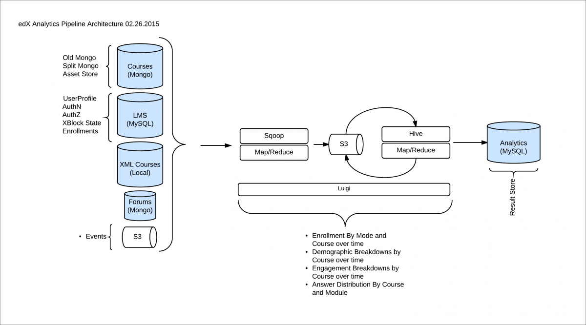

###########################
Open edX Architecture
###########################

The Open edX project is a web-based platform for creating, delivering, and
analyzing online courses. It is the software that powers edx.org and many other
online education sites.

This page explains the architecture of the platform at a high level, without
getting into too many details.

********
Overview
********

There are a handful of major components in the Open edX project. Where
possible, these communicate using stable, documented APIs.

The centerpiece of the Open edX architecture is `edx-platform`_, which contains
the learning management and course authoring applications (LMS and Studio,
respectively).

This service is supported by a collection of other autonomous web services
called independently deployed applications (IDAs). Over time, edX plans to
break out more of the existing edx-platform functions into new IDAs. This
strategy will help manage the complexity of the edx-platform code base to make
it as easy as possible for developers to approach and contribute to the
project.

.. image:: ../../shared/images/edx-architecture.png
  :width: 700
  :alt: A diagram of the components and technologies that make up an edX site.

Almost all of the server-side code in the Open edX project is in `Python`_,
with `Django`_ as the web application framework.

**************
Key Components
**************

================================
Learning Management System (LMS)
================================

The LMS is the most visible part of the Open edX project. Learners take courses
using the LMS. The LMS also provides an instructor dashboard that users who
have the Admin or Staff role can access by selecting **Instructor**.

The LMS uses a number of data stores. Courses are stored in `MongoDB`_, with
videos served from YouTube or Amazon S3. Per-learner data is stored in MySQL.

As learners move through courses and interact with them, events are published
to the analytics pipeline for collection, analysis, and reporting.

Front End
*********

The Django server-side code in the LMS and elsewhere uses `Mako`_ for front-end
template generation. The browser-side code is written primarily in JavaScript
with some `CoffeeScript`_ as well (edX is working to replace that code with
JavaScript). Parts of the client-side code use the `Backbone.js`_ framework,
and edX is moving more of the code base to use that framework. The Open edX
project uses `Sass`_ and the `Bourbon framework`_ for CSS code.

Course Browsing
***************

The Open edX project provides a simple front page for browsing courses. The
`edx.org`_ site has a separate home page and course discovery site that is not
open source.

Course Structure
****************

Open edX courses are composed of units called
:ref:`XBlocks<xblocktutorial:Open edX XBlock Tutorial>`. Anyone can write new
XBlocks, allowing educators and technologists to extend the set of components
for their courses. The edX platform also still contains several XModules, the
precursors to XBlocks. EdX is working to rewrite the existing XModules as
XBlocks and remove XModules from our code base.

In addition to XBlocks, there are a few ways to extend course behavior:

* The LMS is an :ref:`LTI<partnercoursestaff:LTI Component>` tool consumer.
  Course authors can embed LTI tools to integrate other learning tools into an
  Open edX course.

* Problems can use embedded Python code to either present the problem or assess
  the learner’s response. Instructor-written Python code is executed in a
  secure environment called CodeJail.

* JavaScript components can be integrated using
  :ref:`JS Input<Custom JavaScript Applications>`.

* Courses can be exported and imported using OLX (open learning XML), an XML-
  based format for courses.

======
Studio
======

Studio is the course authoring environment. Course teams use it to create and
update courses. Studio writes its courses to the same Mongo database that the
LMS uses.

===========
Discussions
===========

Course discussions are managed by an IDA called comments (also called forums).
comments is one of the few non-Python components, written in `Ruby`_ using the
`Sinatra`_ framework. The LMS uses an API provided by the comments service to
integrate discussions into the learners’ course experience.

The comments service includes a notifier process that sends learners
notifications about updates in topics of interest.

===========
Mobile Apps
===========

The Open edX project includes a mobile application, available for iOS and
Android, that allows learners to watch course videos and more. EdX is actively
enhancing the mobile app.

=========
Analytics
=========

Events describing learner behavior are captured by the Open edX analytics
pipeline. The events are stored as JSON in S3, processed using Hadoop, and then
digested, aggregated results are published to MySQL. Results are made available
via a REST API to Insights, an IDA that instructors and administrators use to
explore data that lets them know what their learners are doing and how their
courses are being used.

      analytics architecture.

===============
Background Work
===============

A number of tasks are large enough that they are performed by separate
background workers, rather than in the web applications themselves. This work
is queued and distributed using `Celery`_ and `RabbitMQ`_. Examples of queued
work include:

* Grading entire courses
* Sending bulk emails (with Amazon SES)
* Generating answer distribution reports
* Producing end-of-course certificates

The Open edX project includes an IDA called XQueue that can run custom graders.
These are separate processes that run compute-intensive assessments of
learners’ work.

======
Search
======

The Open edX project uses `Elasticsearch`_ for searching in multiple contexts,
including course search and the comments service.

================
Other Components
================

In addition to the components detailed above, the Open edX project also has
services for other capabilities, such as one that manages e-commerce functions
like order work flows and coupons.

.. _edx-platform: https://github.com/openedx/edx-platform
.. _Python: https://www.python.org/
.. _Django: https://www.djangoproject.com/
.. _MongoDB: http://www.mongodb.org/
.. _Mako: http://www.makotemplates.org/
.. _CoffeeScript: http://coffeescript.org/
.. _Backbone.js: http://backbonejs.org/
.. _Sass: http://sass-lang.com/
.. _Bourbon framework: http://bourbon.io/
.. _edx.org: http://edx.org/
.. _Ruby: https://www.ruby-lang.org/en/
.. _Sinatra: http://www.sinatrarb.com/
.. _Celery: http://www.celeryproject.org/
.. _RabbitMQ: http://www.rabbitmq.com/
.. _Elasticsearch: https://www.elastic.co/
