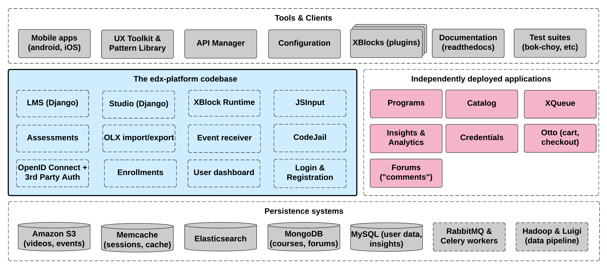

#####################
Open edX Architecture
#####################

The Open edX project is a web-based platform for creating, delivering, and
analyzing online courses. It is the software that powers edx.org and many other
online education sites.

This page explains the architecture of the platform at a high level, without
getting into too many details.

********
Overview
********

There are a handful of major components in the Open edX project. Where
possible, these communicate using stable, documented APIs.

The centerpiece of the Open edX architecture is `edx-platform`_, which contains
the learning management and course authoring applications (LMS and Studio,
respectively).

This service is supported by a collection of other autonomous web services
called independently deployed applications (IDAs). Over time, we plan to
break out more of the existing edx-platform functions into new IDAs and MFEs. This
strategy will help manage the complexity of the edx-platform code base to make
it as easy as possible for developers to approach and contribute to the
project.

Almost all of the server-side code in the Open edX project is in `Python`_,
with `Django`_ as the web application framework.

**************
Key Components
**************

================================
Learning Management System (LMS)
================================

======
Studio
======

Studio is the course authoring environment. Course teams use it to create and
update courses. Studio writes its courses to the same Mongo database that the
LMS uses.

===========
Discussions
===========

Course discussions are managed by an IDA called comments (also called forums).
comments is one of the few non-Python components, written in `Ruby`_ using the
`Sinatra`_ framework. The LMS uses an API provided by the comments service to
integrate discussions into the learners’ course experience.

The comments service includes a notifier process that sends learners
notifications about updates in topics of interest.

===========
Mobile Apps
===========

The Open edX project includes a mobile application, available for iOS and
Android, that allows learners to watch course videos and more. Open edX is actively
enhancing the mobile app.

=========
Analytics
=========

===============
Background Work
===============

A number of tasks are large enough that they are performed by separate
background workers, rather than in the web applications themselves. This work
is queued and distributed using `Celery`_ and `Redis`_. Examples of queued
work include:

* Grading entire courses
* Sending bulk emails (with Amazon SES)
* Generating answer distribution reports
* Producing end-of-course certificates

======
Search
======

The Open edX project uses `Elasticsearch`_ for searching in multiple contexts,
including course search and the comments service.

================
Other Components
================

In addition to the components detailed above, the Open edX project also has
services for other capabilities, such as one that manages e-commerce functions
like order work flows and coupons.

.. _edx-platform: https://github.com/openedx/edx-platform
.. _Python: https://www.python.org/
.. _Django: https://www.djangoproject.com/
.. _MongoDB: http://www.mongodb.org/
.. _Mako: http://www.makotemplates.org/
.. _CoffeeScript: http://coffeescript.org/
.. _Backbone.js: http://backbonejs.org/
.. _Sass: http://sass-lang.com/
.. _Bourbon framework: http://bourbon.io/
.. _edx.org: http://edx.org/
.. _Ruby: https://www.ruby-lang.org/en/
.. _Sinatra: http://www.sinatrarb.com/
.. _Celery: http://www.celeryproject.org/
.. _Redis: https://redis.io/
.. _Elasticsearch: https://www.elastic.co/
