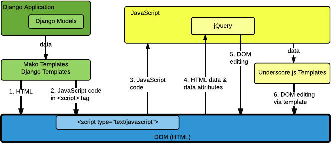

.. _Safe Templates:

###############################################
Preventing Cross Site Scripting Vulnerabilities
###############################################

Cross Site Scripting (XSS) vulnerabilities allow user-supplied data to be
incorrectly executed as code in a web browser. It can be difficult to write
templates that are safe from XSS security vulnerabilities. This section
presents best practices for handling proper escaping in the Open edX platform
to avoid these vulnerabilities.

.. note:: If you become aware of security issues, do not report them in
   public. Instead, please email security@edx.org.

.. contents::
   :depth: 1
   :local:

Philosophy and General Rules
****************************

The philosophy behind the recommendations in this section is to make things as
simple as possible for developers. Protecting against XSS vulnerabilities
typically requires properly escaping user-provided data before it is placed on
the page. Rather than trying to determine if data is user-provided and could
be compromised, you should play it safe and escape everything. Unfortunately,
because there are many different rules for escaping, you still must choose the
proper type of escaping.

Here are some general rules.

#. **Escape always.** Assume that all data is untrusted and escape it
   appropriately. Do not try to determine whether data could or could not be
   manipulated by a user.

#. **Escape late.** Delay escaping as long as possible, until you can see the
   actual context and understand the proper escaping that is required for
   the context. Browsers interpret different contexts such as HTML, URLs,
   CSS, and Javascript/JSON with different rules, so there are different
   escaping requirements based on where the data is being used in a page.

#. **Escape appropriately.** Know what kind of data you have (HTML, plain text,
   JSON, etc.) and where it is going (HTML, JavaScript, etc.). Choose the
   proper escaping method based on these details.

#. **Validation is not sufficient.** Validating inputs does not replace the
   need to properly escape. In some cases, this may reduce the likelihood of
   potential problems, but proper escaping is always necessary.

#. **Do not store escaped data.** Again, because you do not know ahead of time
   all the places that the data will be used, you must wait until you have
   the proper context to decide on the proper escaping.

Types of Context and Escaping
*****************************

The following diagram provides a high-level overview of the relationship
between the different templates, different contexts of DOM creation and
manipulation, and different types of escaping. As a general rule, proper
escaping is related to the context in which the data is being written, and
might not match the context that will eventually be reading the data.

     models through Mako templates and Django templates into an HTML page. Data can
     then flow from the HTML page into JavaScript, and back down into the DOM
     through jQuery or Underscore.js templates.

In the Open edX platform, data flows from the application to the initial HTML page
mainly through the use of Mako templates.

.. Make sure the numbers in the list below are in sync with the numbered arrows in
.. the safe-templates.png diagram above, if either the diagram or the list is modified.

Descriptions of each numbered arrow in the diagram follow.

#. This step represents the use of Mako templates to write general HTML tags
   (that is, tags other than ``

The following resulting unsafe page source is sent to the browser.

.. code-block:: mako

    

The browser would execute the JavaScript code in the ```` tag. The user has injected code into the page that would
display a pop-up alert, which we would not want to allow. Because this attack
could contain arbitrary JavaScript that would be executed by the browser with
the same trust as any JavaScript that is sent from the application, it has the
potential to do something much more malicious than simply displaying a pop-up.
An example might be to steal and email the user's cookies.

In Mako, you can introduce HTML-escaping for all expressions on a page using
the page directive with the ``h`` filter.  Here is an example of an expression
that is properly HTML-escaped.

.. code-block:: mako

    <%page expression_filter="h"/>
    ...
    
${course_name}

The resulting safe page source is as follows.

.. code-block:: mako

    
&lt;script&gt;alert(&#39;XSS!&#39;);&lt;/script&gt;

This time, the browser will not interpret the ``

For this example, imagine that someone set the course name as shown here.

.. code-block:: mako

    ";alert('XSS attack!');"

The resulting unsafe page source, sent to the browser with no escaping, would look
like this.

.. code-block:: mako

    

You can see how the attacker closed out the string and again tricked the browser
into executing the malicious JavaScript in the context of JavaScript. There
are several reasons why you do not want to use the default HTML-escaping here.

#. JavaScript-escaping will also escape all characters that are special
   characters in HTML, such as  ``<``. However, JavaScript-escaping will
   escape ``<`` to ``\u003C``, rather than to ``&lt;``. This will still keep
   the browser from finding an HTML tag where it does not belong.

#. The resulting string might not ultimately be used in an HTML context, so
   HTML entities might not be the proper escaping.

The way to properly JavaScript-escape code in Mako is shown in the following
example.

.. code-block:: mako

    <%! from openedx.core.djangolib.js_utils import js_escaped_string %>
    ...
    

The code above would produce the following safe page source.

.. code-block:: mako

    

Editing Template Files
**********************

When you edit template files (including Mako templates, Underscore templates,
or JavaScript), use the appropriate conventions.

The topics that follow address these points for each type of file.

#. What has to be at the top of the file (if anything) to make it safe?

#. How is code properly escaped? The answer is different depending on the
   templating language and the context.

#. How do you properly handle internationalization and escaping together? For
   more information, see :ref:`i18n`.

.. note:: Remember to take into account the type of file in addition to the
   programming language involved. For example, JavaScript embedded in an HTML
   Mako template is treated differently than JavaScript in a pure .js file.

To find the proper guidelines to follow, first start with the appropriate file
type below.

.. contents::
   :depth: 2
   :local:

.. _Safe Django Template Files:

Django Template Files
=====================

.. highlight:: django

Django templates are considered "safe by default", meaning that expressions
are HTML-escaped by default. HTML-escaping is not always the right choice for
escaping, for example, with embedded JavaScript.

.. _Safe Mako Template Calls:

Mako Template() Calls in Python Files
=====================================

.. highlight:: mako

If a Mako template is loaded from Python outside of the general template loading
scheme, the following default filters should be provided to make the template
safe by default (i.e. use HTML-escaping by default).

.. code-block:: mako

    template = Template(" ... ",
        default_filters=['decode.utf8', 'h'],
    )

.. _Safe Mako Template Files:

Mako Template Files
===================

This topic covers best practices for protecting Mako template files from XSS
vulnerabilities.

For more of a step-by-step set of instructions for converting a legacy Mako
template file to be safe by default, see
:ref:`Making Mako Templates Safe By Default`.

.. _HTML-escape Mako by Default:

HTML-escape by Default in Mako
~~~~~~~~~~~~~~~~~~~~~~~~~~~~~~

.. highlight:: mako

For Mako templates, all expressions will use HTML-escaping by default.  This is
accomplished by adding the following directive to the very top of each
template. ::

    <%page expression_filter="h"/>

Using this default HTML-escaping, the following combination will represent an
HTML-escaped expression. ::

    <%page expression_filter="h"/>
    ...
    ${data}

If you need to disable the default filters, you must use the ``n`` filter as
the first filter. This can be seen in some of the examples below.

For more information, see `Mako: Expression Filtering <http://docs.makotemplates.org/en/latest/filtering.html>`_.

Determining the Context in Mako
~~~~~~~~~~~~~~~~~~~~~~~~~~~~~~~

Most of the Mako template files are in an HTML context.  That is why
HTML-escaping is a good default option.

A JavaScript context can either appear explicitly through the use of a
``
    </%def>

For more information, see `Mako: Defs and Blocks
<http://docs.makotemplates.org/en/latest/defs.html>`_.

.. _Safe JavaScript Files:

JavaScript Files
================

.. highlight:: javascript

JavaScript files are often used to perform DOM manipulation, and must properly
HTML-escape text before inserting it into the DOM. In general, you should use
an Underscore.js template and follow the best practices for doing so.

If there is a strong reason why you cannot use an Underscore.js template, or
if you are reviewing legacy code, you can use the ``_.escape()`` function
provided by Underscore.js to create HTML-escaped plain text. Also, jQuery
elements have a ``text()`` method (in addition to the ``html()`` method) to
add plain text to the DOM by first HTML-escaping the text.

In the case of Backbone.js models, although attributes can be retrieved using
the  ``get()`` or ``escape()`` methods, you should avoid using the
``escape()`` method, which will HTML-escape the retrieved value. It is
preferable to use the ``get()`` method and delay escaping until the time of
rendering, which is handled using an Underscore.js template.

Additionally, be aware that you should not HTML-escape text where you are
setting an input's value, typically using jQuery's ``val()`` function.

.. _Safe CoffeeScript Files:

CoffeeScript Files
==================

.. highlight:: coffeescript

For CoffeeScript files, follow the same guidelines as provided for
:ref:`JavaScript files <Safe JavaScript Files>`.

.. _Safe Underscorejs Template Files:

Underscore.js Template Files
============================

.. highlight:: javascript

The best way to HTML-escape expressions in an Underscore.js template is to use
the ``<%-`` tag, which will perform the HTML-escaping.

There are some exceptions where you must use a combination of ``<%=``, which
does not escape, and ``_.escape()``, which also performs HTML-escaping.
However, wherever possible, the HTML tags should be part of the template
outside of the expression, and ``<%-`` should be used for the expression.

One case where this exception can occur is with translatable strings, when you
need to interpolate actual HTML tags to keep the entire string intact. There
will soon be a helper method that can more elegantly handle this situation.

.. _Making Mako Templates Safe By Default:

Making Legacy Mako Templates Safe by Default
********************************************

.. highlight:: mako

This topic provides a step-by-step set of instructions for making our Mako
templates safe by default.  For all best practices for writing a new Mako
template, see :ref:`Safe Mako Template Files`.

By default, our Mako templates perform no escaping for expressions.
We refer to this as not being "safe by default". Our intention is get to the
state where our Mako templates *are* "safe by default", by ensuring that Mako
template expressions perform HTML-escaping by default.

.. note:: It is important to understand that HTML-escaping might not be the
   right thing to do in all cases, but it is a good starting place. Additional
   escaping filters are available to help with other scenarios.

Due to valid exceptions to the general rule of HTML-escaping, it is not
possible to configure escaping for all Mako templates in the entire platform
without introducing errors.

The current process is for developers to make changes to each Mako template to
ensure that all expressions use HTML-escaping by default. For details, see
:ref:`Set HTML Escaping Filter as Default`.

The following topics describe the steps you need to take to make your Mako
templates safe by default. Although we have attempted to cover as many
scenarios as possible, we are sure to have missed some cases. If you are
unsure about what to do, reach out and ask for help. For contact information,
see the `Getting Help <https://open.edx.org/getting-help>`_ page on the Open
edX portal .

.. note:: If you come across an old template that is no longer in use and can
   be cleaned out of the platform, help to remove the template rather than
   following these steps.

.. contents::
   :depth: 1
   :local:

.. _Set HTML Escaping Filter as Default:

Set HTML-Escaping Filter as Default
===================================

Add the following line to the very top of your template.

.. code-block:: mako

    <%page expression_filter="h"/>

If this line has already been added, the process of making the template safe
by default might have been already completed.

Search for JavaScript Contexts
==============================

Search for any JavaScript contexts in the Mako template. These might appear
either explicitly through the use of a ``<script>`` tag, or implicitly through
the use of ``<%static:require_module>``.

Check that all Mako expressions (``${}``) in these JavaScript contexts are
using either ``| n, dump_js_escaped_json`` or ``| n, js_escaped_string``, as
detailed in :ref:`JavaScript Context in Mako`.

If the template was using the ``escapejs`` function, replace it with ``| n,
js_escaped_string``, which will also make sure that the string is unicode and
will replace ``None`` with an empty string.

Take note of any expression that was mistakenly using ``| h`` in a JavaScript
context. Although you likely just fixed a bug, you will want to pay extra
attention to the downstream JavaScript that is rendering this data and double-
check that it is being properly escaped. It might not be, because it would
have caused a double-escaping issue as it was.

Replace Calls to ``json.dumps``
===============================

Mako templates should not include calls to ``json.dumps``. Instead, you must
use the ``dump_js_escaped_json`` or ``dump_html_escaped_json`` filters as
detailed in :ref:`Safe Mako Template Files`. You must understand whether the
template is writing HTML or JavaScript in order to choose the correct filter.

Additionally, if you find a case where your string already contains JSON, it
is likely that ``json.dumps`` was called prematurely in Python before passing
the data to Mako. In this case, you should refactor to pass the data in its
original form, and then once again use one of the provided filters in the Mako
template.

Finally, if there is no way around having to work with a string that is already
JSON, the only way to ensure that any potential user-provided data is safe is
to use ``json.loads`` and then use one of the provided filters.

Remove All ``h`` Filters
========================

Review the page for any Mako expressions that have an ``h`` filter and remove
this redundant HTML-escaping.

Before::

    ${data | h}

After::

    ${data}

Fix Translations That Contain HTML Tags
=======================================

Search the page for calls to ``_()`` that have replacement strings that
contain actual HTML tags (such as ``<strong>``). For these cases, you must use
both the ``HTML()`` and ``Text()`` methods as documented in :ref:`i18n`.

Remove Calls to ``display_name_with_default_escaped``
======================================================

The XBlock function ``display_name_with_default_escaped`` has been deprecated
and should not be used. Instead, you must use the call
``display_name_with_default`` and follow the best practices for proper
escaping based on the context.

It might be that ``display_name_with_default_escaped`` was called from Python
while setting up the context for your Mako template. You still must fix this
to be ``display_name_with_default`` and make sure it is properly escaped in
the Mako template.

Take note of any places where this value was used in a JavaScript context. You
must make sure that this data is properly escaped downstream when it is
finally added to the page (for example, in an Underscore.js template).

Fix Custom Escaping
===================

One example of custom escaping is when the code includes ``&amp;`` directly in a
string. These should be removed.

Before::

    ${_("Files &amp; Uploads")}

After::

    ${_("Files & Uploads")}

Another example of custom escaping is if you have a string that was already
escaped through a call such as ``replace('<', '&lt;')``.

Again, the preferred solution is to not escape the string at all until you are
in the template, and then to escape only using the best practices previously
detailed.

If a string absolutely must be HTML-escaped before getting to the template, you
should use some combination of ``Text()`` and ``HTML()`` provided for use with
translations. Also, you should name any such variable with the suffix ``_html``
to make it clear that it contains HTML that was already escaped. For more
information, see :ref:`i18n`.

Fix Downstream JavaScript and Underscore.js Templates
=====================================================

Because Mako templates only generate the initial page source, you should
ensure that any downstream JavaScript files or Underscore.js templates  also
follow the best practices.

It can be difficult to trace through all these dependencies. One tip that is
useful is to know that ``-tpl`` is often appended to the name of an
Underscore.js template name inside the JavaScript code.

For example, when you see the following line of JavaScript:

.. code-block:: javascript

    _.template($("#show-textbook-tpl").text());

You will find the template code in a file named ``show-textbook.underscore``.

When you have found the proper downstream JavaScript and Underscore.js template
files, you can follow the best practices as detailed in :ref:`Safe JavaScript
Files` and :ref:`Safe Underscorejs Template Files`.

For information about internationalized strings found in JavaScript, see
:ref:`i18n`.

.. _Safe Templates Additional Resources:

Additional Resources
********************

To learn more about XSS in general, see the following references.

* `OWASP: Cross-site Scripting (XSS) <https://www.owasp.org/index.php/Cross-site_Scripting_(XSS)>`_
* `OWASP: XSS (Cross Site Scripting) Prevention Cheat Sheet <https://www.owasp.org/index.php/XSS_(Cross_Site_Scripting)_Prevention_Cheat_Sheet>`_
* `OWASP: DOM based XSS Prevention Cheat Sheet <https://www.owasp.org/index.php/DOM_based_XSS_Prevention_Cheat_Sheet>`_
* `OWASP: XSS Filter Evasion Cheat Sheet <https://www.owasp.org/index.php/XSS_Filter_Evasion_Cheat_Sheet>`_
