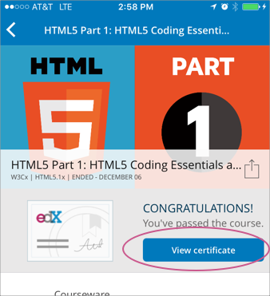
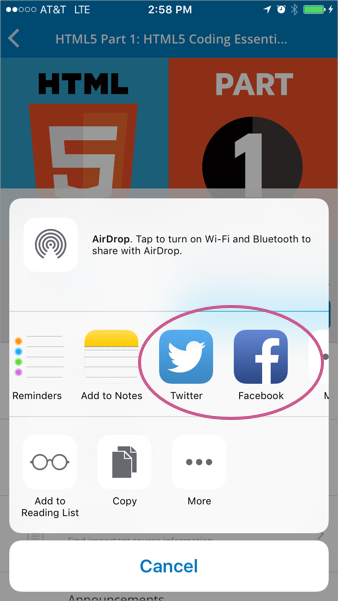
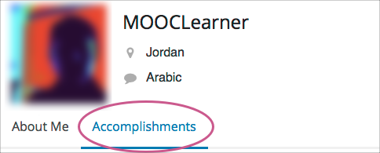
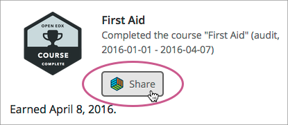
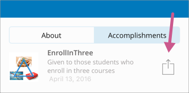
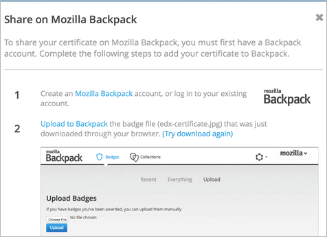

.. _Certificates:

######################################
Getting a Course Certificate or Badge
######################################

.. The edX Learner's Guide also includes a Certificates topic, but it has no
.. shared content with this topic and there is no "Certificates" file in the
.. Shared folder.

Your course might be set up to issue certificates as evidence that you
successfully completed the course. Different types of certificates might be
available for courses you take. For information about the certificates that
your course offers, contact the course team or institution that created your
course.

In addition, you might be able to earn badges for achievements such as
completing a course or a series of courses, or for participating in course
activities. The badges that you can earn depend on how badges have been set up
for the course platform that you are taking a course on.

.. contents::
  :depth: 1
  :local:

***********************
Accessing a Certificate
***********************

Some courses issue certificates, which you can access from your dashboard.

The following examples show the **View Certificate** option on a learner
dashboard on the edx.org website and on the mobile app.

.. image:: ../../shared/students/Images/SFD_Cert_web.png
   :width: 600
   :alt: Dashboard with course name, grade, and link to the web certificate.

To open a web certificate in your browser, select **View Certificate**. You can
then share or print your web certificate.

============================
Share a Web Certificate
============================

You can share your web certificates on Facebook, LinkedIn, and Twitter.

#. Make sure that you are logged in to the social site on which you want to
   share your web certificate.

#. In a different browser tab or window, open your web certificate.

#. Select the social icon at the top of your web certificate.

   A dialog box for the social site you selected opens, with the certificate
   URL already entered.

   On the mobile app, select the **Share** icon to open a page from which you
   choose the social network to share your certificate to.

#. Complete the steps for the social site to post your web certificate.

.. _Print a Web Certificate:

============================
Print a Web Certificate
============================

To print a web certificate, follow these steps.

#. Open the web certificate in your browser.

#. In the web certificate header, select **Print Certificate**.

To print your web certificate in the most professional looking format, follow
these guidelines.

* Do not print the header or footer. Depending on your system, you might need
  to clear these print options.

* Set the margins to the minimum space available. Depending on your system, you
  might need to select the **Minimum** option for the margins.

.. _View Earned Badges:

***************************************
Viewing Earned Badges in Your Profile
***************************************

If badges are available for your courses, you can see the badges you have
earned in the **Accomplishments** section of your profile.

.. _Sharing Badges:

************************************************
Sharing Badges on Mozilla Backpack
************************************************

You can share any badge that you earned, including certificate badges, to a
badging site such as Mozilla Backpack.

===============================
Share Badges From Your Profile
===============================

To share badges from your profile to the Mozilla Backpack site, follow these
steps.

.. note:: You have to create an account on Mozilla Backpack before you can share
   your badges.

#. On your profile, select **Accomplishments**.

#. For the badge that you want to share, select **Share**, or on the edX mobile
   apps, select the **Share** icon.

   The following examples show the **Share** options for badges on the edx.org
   website and on the mobile app.

    Accomplishments section of your user profile page.

You see instructions for downloading your badge and then sharing it on
the Mozilla Backpack site.

    Backpack share icon.

=========================
Share Certificate Badges
=========================

Some courses that offer web certificates allow you to download a badge that
represents the certificate, and then share that badge on a badging site such
as Mozilla Backpack. You can download your badge as soon as your web
certificate appears on your dashboard. Many courses distribute web
certificates within two weeks of the course end date.

To share your web certificate on the Mozilla Backpack site, follow these steps.

#. On your dashboard, locate the course that you want, and then select **View
   Certificate**.

   If this option is not available, the course might not have distributed
   certificates yet. Check your dashboard again in a few days.

#. On the certificate web page, select the badge sharing icon.

.. image:: ../../shared/students/Images/SFD_BadgeShareButton.png
   :width: 600
   :alt: Icon bar at the top of the certificate web view, showing the
     Mozilla Backpack share icon.

You see instructions for downloading your badge and then sharing it on
the Mozilla Backpack site. You have to create an account on Mozilla
Backpack before you can share your badge.

    Backpack share icon.
