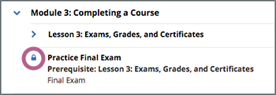
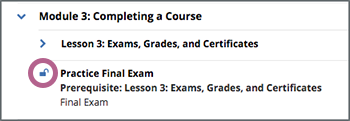

.. _course_content_availability:

########################################
Accessing Course Content and Information
########################################

This topic describes how to access course content and information, including
content that is not available when the course starts, archived course content,
and additional information.

.. contents::
  :local:
  :depth: 1

*************************************
Troubleshoot Accessing Course Content
*************************************

In many courses, all course content is available in the course outline on the
**Course** page as soon as the course starts. However, in some courses, content
becomes available at different times.

Course content might be unavailable for the following reasons.

* The course team has scheduled specific content for release on specific dates.
  That content becomes visible on the course outline only on the date that the
  course team chooses. For more information, see :ref:`Course Content with
  Release Dates`.
* Parts of the course have prerequisite content that you must complete. For
  more information, see :ref:`section_prereq`.
* The course team has made specific course content unavailable after certain
  points in the course, such as after an assignment’s due date has passed or
  after the course end date.

.. _Course Content with Release Dates:

=================================
Course Content with Release Dates
=================================

When course content has release dates, the content is only available on or
after those dates. Many courses release content at a specific time every week.

For information about your specific course, you can check the updates on the
**Course** page, or you can ask questions in the course discussions.

.. _section_prereq:

=================================
Course Content with Prerequisites
=================================

Some courses have content that only becomes available after you achieve a
minimum score in another section. In the course outline, this content appears
with a lock icon and the name of the section that you must complete, or
*prerequisite*.

.. note::
  In the edX mobile app, sections that have prerequisites are not visible in
  the course outline until after you complete the prerequisite.

When you try to open a section before you complete the prerequisite for that
section, the section page shows a message such as the following message, along
with a link to the prerequisite section.

``You must earn a passing score for 'Section N' to access this
content.``

After you complete a section’s prerequisite, the section is visible in the
course outline with an unlocked icon, and you can open and complete that
section.

     section.

*************************
Access an Archived Course
*************************

You can enroll or continue to work in some courses even after the course end
date. These courses are archived, which means that while you can access the
course content, you cannot submit answers for graded problems or participate in
course discussions.

To view the content of an archived course, follow these steps.

#. On your dashboard, locate the course.

#. Select **View Archived Course**.

*************************
View a Final Course Grade
*************************

To view your current grade in a course that has not yet ended, see :ref:`SFD
Check Progress`.

To view your final grade in a course that you have completed, follow these
steps.

#. On your dashboard, locate the course. Your final grade appears under the
   course name.

#. Optionally, print your dashboard to obtain a record of your achievement in
   the course.

You can also view the course and open its **Progress** page to view your final
grade, as well as your grades on all course assignments.

***********************
View Certificate Status
***********************

If you are enrolled in a certificate track for your course, updates on the
status of your certificate, and options for accessing earned certificates, are
available in the course card on your dashboard.

For example, if you have earned a certificate and the course team has
generated certificates for the course, you can use the **View Certificate**
option to access your web certificate.

.. image:: ../../shared/students/Images/SFD_Cert_web.png
   :width: 600
   :alt: Dashboard with course name, grade, and link to the certificate.

.. only:: Partners

  For information about how to access certificates, including how to view,
  print, and share certificates, see :ref:`learners:Certificates`.

.. only:: Open_edX

  For information about how to access certificates, including how to view,
  print, and share certificates, see :ref:`openlearners:Certificates`.

.. include:: ../../links/links.rst
