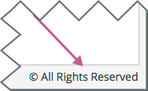
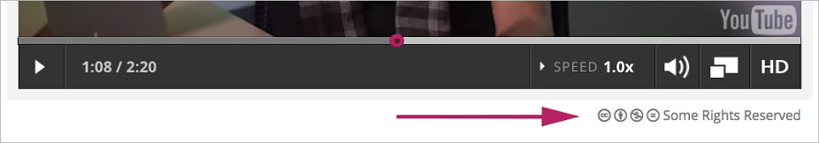

.. _Course and Video Licenses:

##################################################
Understanding How Courses and Videos Are Licensed
##################################################

This topic describes licenses in your course and restrictions on using course
content.

.. contents::
  :local:
  :depth: 1

****************************
Overview of Licenses
****************************

The course author can specify licensing options for course content as well as
for each video in the course.

The course and video licenses specify whether and how you can reuse course
content.

****************************
All Rights Reserved
****************************

All Rights Reserved indicates that the course author owns the copyright but
reserves all rights for sharing copies of course content or videos. You
cannot reuse or republish course content or videos that have All Rights
Reserved licenses.

****************************
Creative Commons License
****************************

The Creative Commons license indicates that the course author owns the
copyright but is granting certain permissions for reuse, depending on the
license options selected by the course team.

A Creative Commons license has one or more of the following options.

.. list-table::
   :widths: 10 70
   :header-rows: 1

   * - License Option
     - Description
   * - **Attribution**
     - This option allows you to copy, distribute, display, and perform
       copyrighted work but only if they give credit the way you request. This
       option is always selected for edX courses and videos under a Creative
       Commons license.
   * - **Noncommercial**
     - This option allows you to distribute, display, and perform work--and
       derivative works based upon it--but for non-commercial purposes only.
   * - **No Derivatives**
     - This option allows you to distribute, display, and perform only verbatim
       copies of the work, not derivative works based upon it. This option
       cannot be in use with the **Share Alike** option.
   * - **Share Alike**
     - This option allows you to distribute derivative works only under a
       license identical to the license that governs the work. This option
       cannot be in use with the **No Derivatives** option.

For more information, see the `Creative Commons website`_.

*************************************
Viewing Licenses
*************************************

If the course author has set a license for the course, you see the license at
the bottom of the page when you view content in the **Course** tab.

If a video has a different license than the course as a whole, you see
the license at the bottom right of the video player.

For a license that reserves some, but not all, rights, you can select the
license to get see information about your rights.

.. include:: ../../links/links.rst
