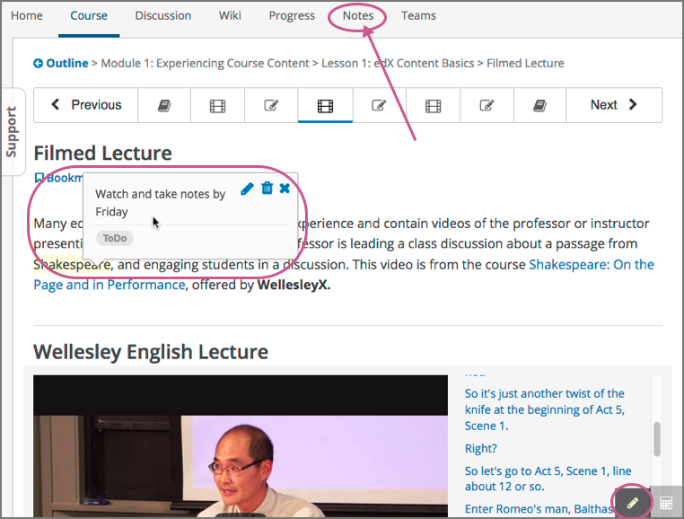
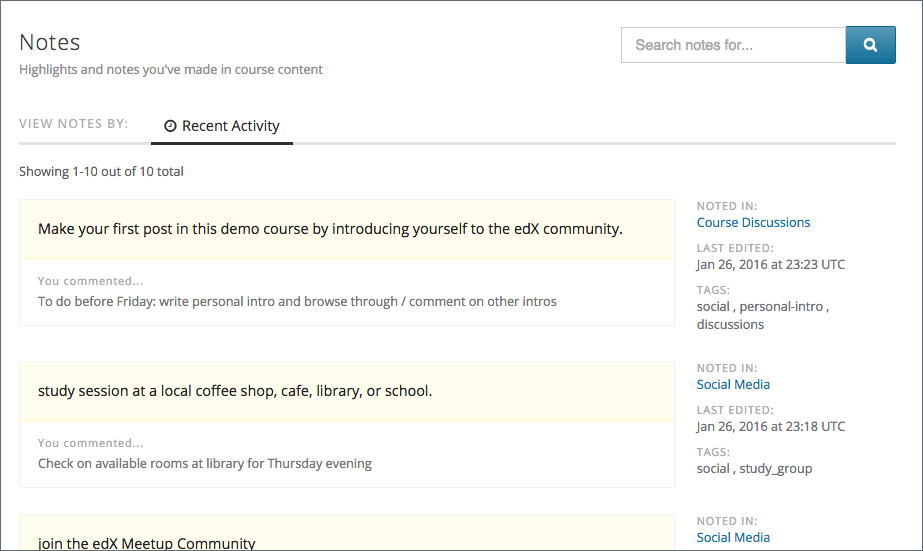

.. _SFD Notes:

#################################
Taking Notes in an edX Course
#################################

This topic describes how to work with notes in your edX course.

.. contents::
  :local:
  :depth: 1

******************
Overview of Notes
******************

As you work through an edX course, you may want to highlight a particular
passage or make a note about what you have read. In some edX courses, you can
highlight passages and make notes right in the course.

.. note:: You can create notes for most text in the body of the course.
 However, notes are currently not available for exercises, videos, or PDF
 textbooks.

When a course includes the notes feature, every page has a **Notes** page at
the top and a pencil icon in the lower right corner.

      highlighted text with an accompanying note, and the pencil icon in the
      lower right corner.

Your notes can contain text as well as tags that help you organize and find
your notes. You can see individual notes inside the course content, or you can
see a list of your notes on the **Notes** page. For more information, see
:ref:`The Notes Page`.

.. _SFD SN Add Note:

******************************************
Highlight a Passage or Add a Note
******************************************

You can use either the mouse or keyboard shortcuts to create, access, and
delete notes. For more information about using keyboard shortcuts, see
:ref:`SFD SN Keyboard Shortcuts`.

To highlight a passage or add a note that includes text and tags, follow these
steps.

#. Select the text that you want to highlight or make the note about. You can
   select as much text as you want.

#. When a pencil "edit" icon appears above the selected text, select
   the icon to open the note editor.

   .. image:: ../../shared/students/Images/SFD_SN_Create-EditNoteIcon.png
     :width: 400
     :alt: Paragraph with text selected and the pencil icon above the selected
         text.

#. When the note editor opens, enter your note and any tags that you want to
   add. You can also save the highlight for the passage without entering a
   note or tag.

  * To highlight a passage without adding a note or tag, select **Save** or
    press Enter. When you move your cursor over the highlighted text, the note
    field contains the words "no comment".

  * To enter a note, select **Comments**, and then type the text of your note.
    Your note can contain as many words as you want.

  * To add one or more tags, select **Add some tags here**, and then type any
    tags that you want to add.

    Tags cannot contain spaces. If you want to add a tag that has more than one
    word, type multiple words as one word with no spaces, or use hyphens (-)
    or underscores (_) to separate words in the tag.

     .. image:: ../../shared/students/Images/SFD_SN_NoteEditor.png
      :width: 400
      :alt: Note editor open with a learner's note.

#. After you finish writing your note and adding tags, select **Save** or
   press Enter. The note editor closes, and the text that you selected remains
   highlighted.

.. _SFD SN View Note:

***************************
View Notes
***************************

You can view your course notes in two places.

* You can view individual notes on the page where you created the notes. To see
  your notes, go to the unit that contains your note and move your cursor over
  or select the highlighted text. When you select the highlighted text, your
  note remains open until you move outside the highlighted text.

* You can view a list of the notes you have made in the course on the **Notes**
  page. You can also search your notes and tags on this page.

.. _The Notes Page:

================
The Notes Page
================

On the **Notes** page, you can see a list of the notes you have made in your
course. You can also search the text of your notes or the tags that you added
to your notes.

The **Notes** page lists your notes by the date you created or edited them,
with the most recently modified first. The page shows you both the text that
you selected and the note that you made. You can also see the following
information next to each note.

* A link to the location in the course that contains the highlighted text and
  your note. To go to that location, select the link under **Noted in**.
* The time and date when you last edited the note.
* Any tags that you added.

.. _SFD SN Edit Note:

************************************
Edit or Delete a Note or Highlight
************************************

To edit a note, follow these steps.

#. In the course body, move your cursor over the highlighted text until your
   note appears.
#. When the note appears, select the pencil icon in the upper right corner to
   open the note editor.

   .. image:: ../../shared/students/Images/SFD_SN_EditDeleteNote.png
    :width: 175
    :alt: Note editor with the pencil and paper and X icons visible.

#. In the note editor, edit your note, and then select **Save**.

To delete a note or highlight, follow these steps.

#. Move your cursor over the highlighted text until your note appears.

#. When the note appears, select the trash icon in the upper right corner to
   delete the note or highlight.

.. _SFD SN Show Notes:

***************************
Show or Hide Notes
***************************

By default, you can see all of your notes. You can hide your notes, and show
them again, by selecting the pencil icon in the lower right corner. When
the pencil icon has a dark gray background, notes are visible. When the pencil
icon has a light gray background, notes are hidden.

.. image:: ../../shared/students/Images/SFD_SN_NotesShowHide.png
  :width: 400
  :alt: Two page excerpts side by side, the image on the right showing notes
       visible, and the image on the left showing notes hidden.

.. note:: If you hide notes, you cannot make new notes. To make new
 notes, select the pencil icon to show notes.

.. _SFD SN Search Notes:

***************************
Search Notes
***************************

To search your notes, follow these steps.

#. At the top of any course page, select **Notes** to open the **Notes**
   page.

#. In the upper right corner of the page, type a search term in the **Search
   notes for** field. You can search for the text of a note, or you can search
   for a tag you created.

#. Select the magnifying glass icon or press Enter.

.. _SFD SN Keyboard Shortcuts:

*********************************************
Keyboard Shortcuts for Notes
*********************************************

You can use keyboard shortcuts to create, edit, and delete your notes.

.. note:: These keyboard shortcuts are for both PCs and Macintosh computers.
 However, you can only use these keyboard shortcuts on browsers that support
 caret browsing.

.. * Microsoft Edge, Internet Explorer 11, and (add back with DOC-2629)

  * Firefox supports caret browsing by
    default. To enable or disable caret browsing, press F7.

  * Safari supports caret browsing when VoiceOver is turned on. For more
    information about VoiceOver, see the `VoiceOver for OS X`_ website.

  * Chrome does not support caret browsing.

..    However, Google does offer a `Caret
    Browsing extension`_ that you can install and enable with F7. (add back with DOC-2628)

Before you use the following keyboard shortcuts, you must make sure that notes
are visible. To show or hide notes, press Ctrl + Shift + left bracket (``[``).

=======================================
Create a Note Using the Keyboard
=======================================

To create a note using keyboard shortcuts, follow these steps.

#. Enable caret browsing mode.

#. Use the arrow keys to move the cursor to the left of the text that you want
   to highlight.

#. Hold down Shift + right arrow to select the text.

#. Press Ctrl + Shift + right bracket (``]``) to open the note editor. The
   note editor opens with the cursor in the text field.

#. In the text field, type your note.

#. To add tags, press Tab to move to the tag field, and then add
   your tags.

#. To save your note, press Tab to move to the **Save** button, and then press
   Enter.

To close the note editor without creating a note, press Tab to move to the
**Cancel** button, and then press Enter. You can also press Esc to close the
note editor.

========================================
Edit or Delete a Note Using the Keyboard
========================================

To edit or delete a note, follow these steps.

#. Press Tab to move focus to the note that you want.

#. Press Ctrl + spacebar or Ctrl + Enter to open the note editor.

#. Press Tab to move the cursor to the text field or the tag field, and then
   make the changes that you want.

#. Press Tab to move to the **Edit**, **Delete**, or **Close** button, and
   then press Enter.

To close the note editor without making any changes, press **Esc**.

.. include:: ../../links/links.rst
