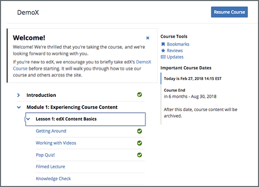

.. _SFD Starting a Course:

#################
Starting a Course
#################

As soon as you enroll in a course, you can access some information about the
course. However, if the course start date has not passed, you cannot access
course lessons or assignments.

.. only:: Partners

  For more information, see :ref:`Course Availability` and :ref:`Differences
  Between Instructor- and Self-Paced Courses<SFD Course Pacing>`.

.. only:: Open_edX

  For information about availability of course content, see
  :ref:`course_content_availability`.

.. contents::
  :local:
  :depth: 2

.. _Start Date and Duration:

************************
Find a Course Start Date
************************

You can enroll in a course before the start date. You cannot access course
materials before the start date.

.. note::
  If you want to start the course as soon as possible, you can find the start
  date for a course, and then set a calendar reminder for that date. Some
  courses also publish a start time.

.. only:: Partners

  The course start date is available in several locations.

  * The course card on edx.org. The course start date is located at the bottom
    of the card.

    .. image:: ../../shared/images/CourseCard_StartDate.png
     :alt: A course card, showing the course start date at the bottom of the
         card.

  * The course About page. The course start date is located above the **Enroll
    Now** option.

    .. image:: ../../shared/images/SFD_StartDateOnCourseAbout.png
     :width: 600
     :alt: A course's About page with the start date above the Enroll Now
         button.

  * The course on your :ref:`dashboard<SFD Learner Dashboard>`. The course
    start date is located below the course title.

    .. image:: ../../shared/images/SFD_StartDateOnDashboard.png
     :width: 600
     :alt: A course listing on a learner's dashboard, with the start date under
       the name of the course.

.. only:: Open_edX

  After you enroll in a course, the course is visible on your dashboard. The
  course start date is located below the course title.

    .. image:: ../../shared/images/SFD_StartDateOnDashboard.png
     :width: 600
     :alt: A course listing on a learner's dashboard, with the start date under
       the name of the course.

For more information about different course statuses, see :ref:`Course
Availability`

.. Deliberate omission of period at end of above sentence because the title that is inserted ends with a question mark.

.. _Start a Course:

************************
Start or Resume a Course
************************

After you enroll in a course, the course is visible on your :ref:`dashboard
<SFD Dashboard>` together with the course :ref:`start date <Start Date
and Duration>`. After the course start date has passed, you can access course content.

.. only:: Partners

 If a course is not visible on your dashboard, select the edX logo at the top
 of the page to view the `edX course catalog`_, and then select and
 :ref:`enroll <SFD Enrolling in a Course>` in the course that you want.

After the course start date has passed, you can access course content.

==============
Start a Course
==============

.. note::
  When you start a course, you do not need to sign in exactly when the course
  begins.

To start a course, locate the course on your dashboard, and then select **View
Course**.

The course opens to the **Course** page. On this page, below any messages from
the course team, the course outline is visible. Above the outline is a **Start
Course** option.

     the left pane.

* To start the course at the first section, select **Start Course**.
* To start the course at a different location, expand the course outline, and
  then select any part of the course.

===============
Resume a Course
===============

When you resume work in a course, you can return to the unit that you completed
most recently in all of your courses, or in a specific course.

.. note::
 A unit is complete when you have completed all of the following actions.

 * Watch all videos.
 * Submit answers to all problems.
 * View all text or other content for at least five seconds. 

 When you complete a part of a course, a green check mark is visible on the
 course outline. For more information, see :ref:`SFD Progress Indicators`.

Return to the Most Recently Completed Unit in All Courses
*********************************************************

To return to the unit you completed most recently in all of your courses,
select the arrow next to your username on any page, and then select **Resume
your last course**.

The course that you were most recently working in opens to the unit that you
most recently completed.

Return to the Most Recently Completed Unit in a Specific Course
***************************************************************

To return to the unit you completed most recently in a specific course, you
have the following options.

* On your edX dashboard, locate your course, and then select **Resume Course**
  next to the social media sharing options.
* Open the course, and then select **Resume Course** on the **Course** page.

When you select **Resume Course**, the course opens to the unit that you most
recently completed.

.. include:: ../../links/links.rst
