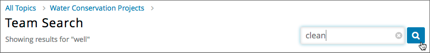

.. _SFD_Teams:

##########################################
Working on Team Projects and Activities
##########################################

In some courses, you might be assigned activities or projects that require
working in small groups, or teams. Course staff will create topics that you
can choose from. You choose a topic that interests you, and join or form a
team with other learners who have the same interest to work on the group
activity or project together. You can join only one team in your course.

If your course includes teams, your instructor or course staff will provide
information about how you should work in teams, guidelines for joining and
creating teams, and using discussions within teams.

.. contents::
  :local:
  :depth: 2

************************
About Teams and Topics
************************

If your course uses teams, there is a **Teams** page where you can see the
list of topics that the course team has created, and their descriptions.

You can browse the topics to find one that you are interested in working on.
Then, view the list of teams that exist within that topic. Teams are always
associated with a specific topic.

For each team, you can view the team members, team details, and discussions to
help you decide whether you want to join a particular team. If you do not find
a team that you want to join, you can create a new team in the topic. For more
information, see :ref:`Browse Topics and Find a Team`.

You can belong to only one team at a time. For information about joining and
leaving teams, see :ref:`Join a Team` and :ref:`Leave a Team`.

.. _Browse Topics and Find a Team:

======================================
Browse Topics and Find a Team to Join
======================================

To browse topics and find a team to join, follow these steps.

#. In the course, select the **Teams** page.
#. Select the **Browse** tab.
#. On the **Browse** page, view the list of available topics.

   You can sort the topics alphabetically by name, or by the team count in
   each topic.

4. When you have found a topic you are interested in, select the arrow button
   to see the teams that exist in that topic.

   .. image:: ../../shared/students/Images/Teams_TopicArrowButton.png
     :width: 500
     :alt: The page showing available topics, with the arrow button for one of
           the topics highlighted.

  You can sort by teams that showed the most recent activity, or by teams with
  the most open slots.

  You can also use keywords to search for teams within a topic. For more
  information, see :ref:`Search for a Team`.

  Each team's name and description are shown, as well as the number of team
  members, letting you know whether there is space for you to join.

  .. image:: ../../shared/students/Images/Teams_TopicViewButton.png
    :width: 500
    :alt: The View button on a team card within a topic.

5. To get a better sense of a team's members, discussion, and communications,
   select **View** for a team.

   On the **Team Details** page, you can browse the team's discussion posts,
   but you cannot participate unless you are a member of the team.

   .. image:: ../../shared/students/Images/Teams_TeamsDetails.png
     :width: 500
     :alt: Detailed view of team, showing discussions.

.. note:: You can navigate from the **Team Details** page back to the list of
   teams in a topic or back to the list of all topics using the breadcrumb
   links at the top of the page.

.. _Search for a Team:

******************
Search for a Team
******************

You can use keywords to search for teams within a topic that match your
interests.

To get a list of teams that match your search keywords, follow these steps.

#. In the course, select the **Teams** tab.

#. On the **Teams** page, select **Browse**, then select the topic in which
   you want to find a team.

#. In the search field, enter one or more keywords, then press **Enter** or
   select the search icon.

   Teams within the topic that match your search are displayed.

   To clear the existing search term, select the **X** in the search field.

.. note:: You can only use whole words for searching teams.

.. _Join a Team:

******************
Join a Team
******************

When you have found a team you want to join, select **Join Team**.

.. note:: If a team is full, or if you already belong to a team, the
   **Join Team** button is not available.

You are added as a member. Your profile is added to the list of team member
profiles, and you can participate in the team's discussions. The team that you
joined appears on your **My Team** page.

.. note:: You can only belong to one team at a time. If you belong to a team,
   but find another team that you want to join, you must leave the first team
   before you can join a new one. For information about leaving a team, see
   :ref:`Leave a Team`.

.. Add back Invite Friends section when this feature becomes available

.. _Leave a Team:

******************
Leave a Team
******************

.. note:: EdX recommends that you do not change teams after work in a course
   has started without carefully considering the impacts to your work and
   that of your fellow learners.

   If you must leave a team, make sure you communicate with your fellow team
   members and let them know why and when you are leaving. This is especially
   important if you are part of the way through your course, and you and your
   team have been working together on a project or activity.

To leave a team that you belong to, follow these steps.

#. On the **Team Details** page, select **Leave Team**.

  .. image:: ../../shared/students/Images/Teams_Leave Team.png
    :width: 200
    :alt: The Leave Team link on the Team Details page.

2. In the confirmation dialog, select **Leave Team**.

After you leave a team, you are no longer visible in the team membership
profiles list, or in the membership count. Although you can still view the
team's discussions, you can no longer participate in them.

.. _Create a Team:

******************
Create a Team
******************

If you do not want to join any of the existing teams in a topic, you can
create a new team. When you create a new team in a topic, you are
automatically added as a member.

.. note:: You cannot create a team if you already belong to a team.

To create a team, follow these steps.

#. On the **Teams** page in the course, find a topic that you are
   interested in.

#. Select the topic's arrow button to see the teams that exist in that topic.

#. At the bottom of the list of teams within the topic, select the **create a
   new team in this topic** link.

  .. image:: ../../shared/students/Images/Teams_CreateNewTeamLink.png
    :width: 500
    :alt: The "create a new team in this topic" link at the bottom of the page
        showing all teams in a topic.

4. On the **Create New Team** page, add a name and description for the team.

   In the description, include details about your proposed project or activity to
   help other learners to decide whether they want to join your team and work
   with you.

   .. image:: ../../shared/students/Images/Teams_CreateNewTeamForm.png
     :width: 500
     :alt: Empty form with fields to be completed when a learner creates a new team.

#. (Optional) Include some optional details for your team. You can
   specify a language that members would primarily use to communicate with
   each other, and a country that members would primarily identify with. Keep
   in mind that if your team details make the team membership seem too
   selective, other learners might be discouraged from joining.

   .. note:: Be careful in entering your team details. After you save the
      details for your new team, you cannot change them, and you cannot delete
      your team.

.. Do we want to mention to learners that course staff can edit and delete teams?

6. When you have finished adding your team details, click **Create**.

   Your new team appears in the list of team under your selected topic. You
   are automatically added as a team member.

..   Commented out until feature is added: For information about inviting
..   friends to join a team, see :ref:`Inviting Friends to Join Your Team`.

************************************
Participating in Team Discussions
************************************

After you join a team, you can participate in discussions on your team page
with other members.

Although you can view discussions in any team, you must belong to a team to
add new posts and responses to the team's discussion.

Team discussions work in the same way as your course discussions. For
information about course discussions, see :ref:`Anatomy of edX Course
Discussions`.

If you leave a team, you can view posts that are made, but you can no longer
participate in that team's discussions.
