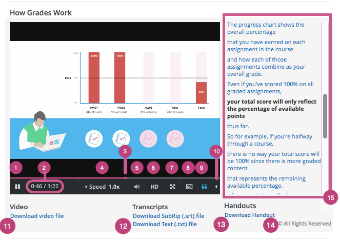

.. _Video Player:

#######################################
Watching Videos on the edX Video Player
#######################################

All edX courses include videos, and edX has its own video player. Most of the
controls on the player will be familiar to you if you have watched online
videos before. However, the edX video player has some extra features you may
not have seen.

The following image shows the video player in the middle of a video, followed
by an explanation of each option or control on the video player.

.. note:: The illustration that follows shows the video player for a video
   that has all of the possible features available. Only the controls that
   apply to a specific video will actually be present when you use the video
   player in a course.

      control.

1. **Play/pause**: You can play the video by selecting this control. Select
   this control again to pause the video.

2. **Time**: The first number indicates the length of time the video has
   already played. The second number indicates the total length of the video.

3. **Playback bar**: You can go to a different point in the video by selecting
   and dragging this control or by using the left and right arrow keys.

4. **Speed**: If you want the video to play faster or slower, you can
   select different speeds using this control.

5. **Volume**: You can use this control to change the volume of the
   video.

6. **HD**: You can play the video in high-definition visual resolution by
   selecting this option if HD quality is available for the video. This option
   works best if you have a fast Internet connection. Select this control again
   to play the video in standard resolution.

7. **Full screen**: You can expand the video to fill your browser
   window by selecting this control. To return to default mode, press ESC on
   your keyboard or select this control again.

8. **Show or hide closed captioning**: You can show an overlaid transcript of
   the audio portion of the file by selecting this control. If you show the
   captions, you can move them to different areas on the video screen by
   dragging and dropping them. To hide the captions, select this control again.

   .. note:: In some cases, two sets of captions can appear when you select
    **CC**. This situation can occur if YouTube is the host service for the
    video and your YouTube account settings for playback are set to always show
    captions. As a result, YouTube and your course might both provide captions
    for the video. To correct this problem, select **CC** again or change your
    YouTube account setting.

9. **Show transcript**: You can show a complete, scrolling transcript of the
   audio portion of the file to the right of the video by selecting this
   control. Many course teams set video transcripts to play by default when
   your video starts. Select this control again to hide the transcript.

10. **Language menu**: You can select a different language for the closed
    captions and the transcript with this control if translations are
    available.

    .. image:: ../../shared/students/Images/Video_language_menu.png
      :alt: A language menu with choices for English or Chinese.
      :width: 150

11. **Download video**: You can download the video to watch later with this
    option (if available for the video).

12. **Download transcript**: You can download the video's transcript as a
    SubRip (.srt) file or as a text (.txt) file. You can open files of either
    type in a text editor such as Notepad.

13. **Handouts**: You can download any handouts that the course team has
    associated with the video.

14. **License or Copyright**: If the course team reserves rights or specifies a
    Creative Commons license for the video that is different from the
    course-wide license, that information appears below the video player. For
    Creative Commons licenses, you can select the license to open a web site
    with more information about your rights.

    For more information, see :ref:`Course and Video Licenses`.

15. **Transcript**: You can scroll through the transcript and select any line
    to go to that point in the video.

For a demonstration of the edX video player, see `Videos on edX`_ in the edX
DemoX course.

.. include:: ../../links/links.rst
