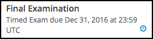

.. _taking_timed_exams:

####################
Taking a Timed Exam
####################

This section describes timed exams and explains how to complete them.

.. contents::
 :local:
 :depth: 1

*******************
Timed Exam Overview
*******************

Timed exams are sets of problems that you must complete in a limited amount of
time. The score you receive becomes part of your course progress record.

Timed exams are indicated on the **Course** page by a clock icon and the label
**Timed Exam**.

     the label "Timed Exam."

After you begin taking a timed exam, a timer on the course page displays the
amount of time that you have remaining to complete the exam. You cannot pause
or reset a timed exam. When there is no time remaining, the course page
automatically submits your exam.

The time limit for an exam applies to all of the units in an exam section. If
an exam includes problems on multiple unit pages, you must complete the
problems on each unit page before you submit the exam or before the time runs
out.

You can request additional time to complete a timed exam. Course teams can
increase the time allowed for individual learners if needed. You can only
request additional time before you start a timed exam. For more information,
see :ref:`requesting_additional_time`.

*******************
Taking a Timed Exam
*******************

To take a timed exam, follow these steps.

#. Open the timed exam page in the course.

#. Find the length of the time limit on the exam page. Make sure that you have
   enough time available to complete the exam.

   .. note::
      You will not be able to pause or restart the exam after you begin.

   Course teams can give individual learners additional time to complete the
   exam, if needed. For more information, see
   :ref:`requesting_additional_time`.

#. Select **I am ready to start this timed exam**.

#. Complete the problems in each unit of the exam. Select **Submit** to score
   the problems in the unit. If you do not select **Submit**, your responses
   will not be scored.

#. Monitor the amount of time remaining in the time display at the top of the
   course page.

   When 20% of the time remains, the time display bar darkens to alert you.
   When 5% of the time remains, the text on the time display bar becomes bold.

   .. note::
     You can hide the amount of time that remains in your exam. To do
     this, select the icon that is located next to the timer. To show the
     remaining time, select the icon again.

#. After you have completed and checked all the units in the exam, select **End
   My Exam** at the top of the course page. If you run out of time, the exam
   will end automatically.

.. note::
   You must select **Submit** to score the problems in each unit of an exam. If
   you submit an exam without selecting **Submit** in a unit, your exam results
   will not include scores for any of the problems in that unit.

.. _Hiding the Exam Timer:

*********************
Hiding the Exam Timer
*********************

By default, the amount of time that remains in the exam is visible. You can
hide or show the time that remains.

To hide the remaining time, select the "eye" icon that is located next to the
timer.

To show the remaining time, select the "eye" icon again.

.. image:: ../../../shared/images/ShowHideTimer.png
 :width: 232
 :alt: The End My Exam button next to an eye icon that shows and hides the exam
     timer.

.. _requesting_additional_time:

**************************
Requesting Additional Time
**************************

You can request additional time to complete a timed exam. Course teams and
instructors can increase the time allowed for individual learners to
accommodate specific needs.

.. note:: You can only request additional time before you begin a timed exam.
   After you start an exam, the course team cannot allow more time for that
   exam attempt.

Course teams decide whether or not to grant additional time
based on the criteria that they choose. You can get information about the
availability of additional time from your course team.
