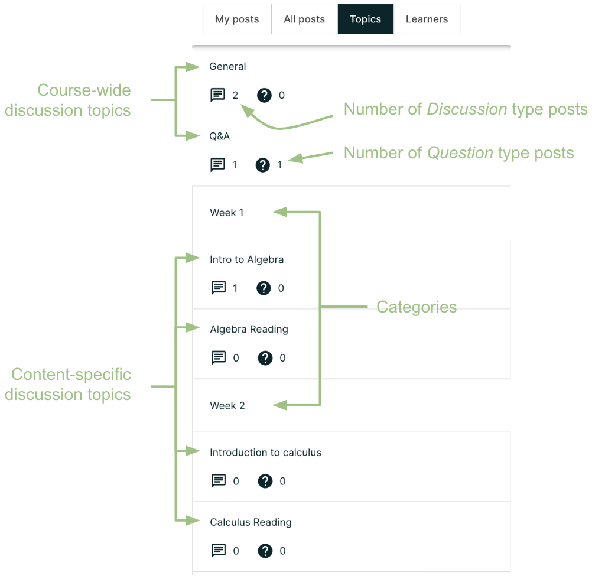
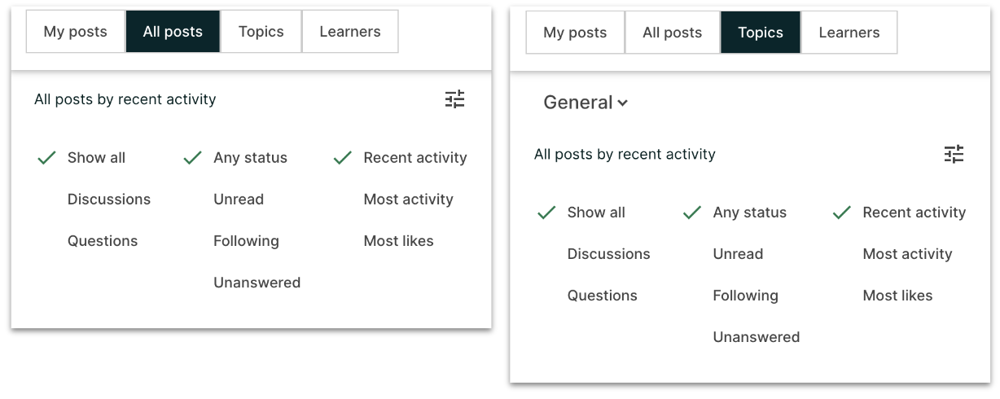
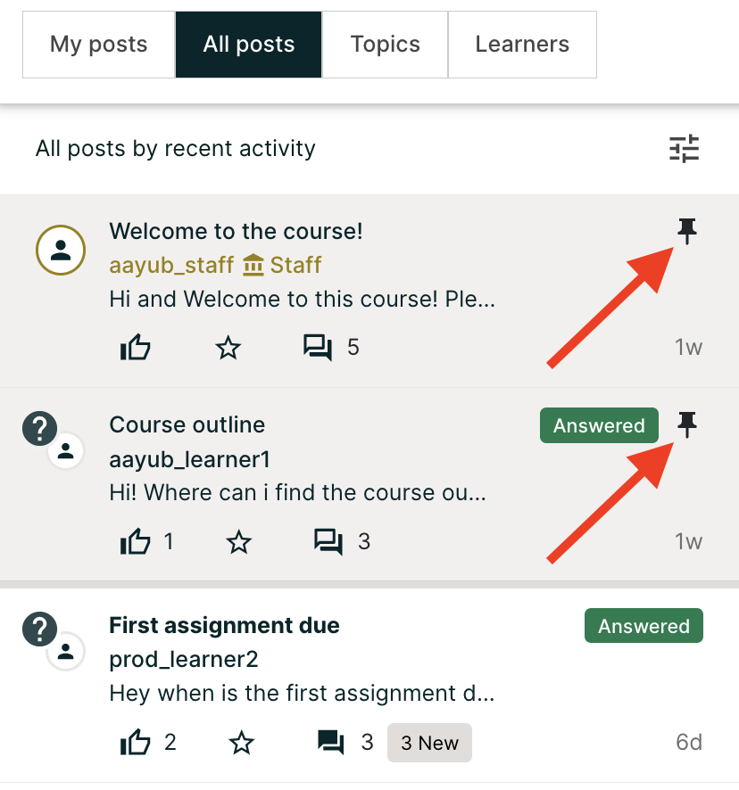

.. _Explore Posts:

###########################
Exploring Discussion Posts
###########################

Finding out whether someone else has already asked the same question or
initiated a conversation about the subject that interests you, and then reading
and contributing to that exchange instead of starting a new one, helps make the
time that everyone spends with the course discussions more productive. You can
search for something specific, or you can browse through the posts in a single
discussion topic.

.. contents::
  :local:
  :depth: 1

For information about finding new or updated posts in discussions, see
:ref:`Keep Up with New Activity`.

.. _Search Discussions:

***********************
Search Posts or Topics
***********************
The **Search** field on top of the **Discussion** page enables you to search all posts,
the posts that you have created or discussion topics when *All posts*, *My post* or
*Topics tab* is selected, respectively.

To search for all posts, responses, or comments containing a particular keyword or
phrase, select the *All posts* tab and enter the word or phrase, or a partial word in the **Search**
field at the top of the **Discussion** page.

To search for a particular keyword or phrase in the posts that you have authored,
select the *My posts* tab and enter the word or phrase, or a partial word in the
Searchfield at the top of the **Discussion** page.

To search for a discussion topic containing a particular keyword, select the
*Topics* tab and enter the word or phrase, or a partial word in the **Search**
field at the top of the **Discussion** page.

Search results are displayed in the content list area. If an exact
match is not found, search results are shown for a similar value.

.. _Discussion Topics:

*********************************************
View Discussions about a Specific Topic
*********************************************

Course discussions are organized by discussion topics, which are created by the
course team. Anyone who adds a post to the course discussions selects an
existing topic to associate their post with. For more information about topics,
see :ref:`Basic Elements of Course Discussions`.

You can browse discussions by topic, to join the discussion on subjects that
interest you, or to see if anyone else in the course has asked the same
question.

=======================================
View Topics on the Discussion Page
=======================================

On the **Discussion** page, select the *Topics* tab in discussion navigation pane to see
all of the discussion topics in the course. Topics tab will list course-wide discussion
topics first, followed by content-specific discussion topics. Select a topic from the list
to see all posts associated with that topic.

Note that course-wide topics do not have other topics indented below them,
while content-specific topics are indented under a category name.
You can also see the count of Discussion and Question type posts in each topic, in the topic list.

         topics.

=======================================
View Topics in a Course Unit
=======================================

Content-specific topics are located in specific units in the course. They
typically appear below the content they apply to. To access a content-specific
topic, view the unit that contains the topic.

.. image:: ../../../shared/images/HTMLandDisc.png
   :alt: A discussion topic that appears below text inside the course.

You can also use the **Discussion** page to access a discussion in the unit
where that topic is located.

#. In the list of topics, select the topic that you want.

#. Select a post title to open the complete post and its responses and comments
   next to the above the discussion navigation pane.

#. In the text of a post, select the name of the discussion topic to go to the
   discussion inside the unit.

*****************************************
Filter or Sort Posts
*****************************************

You can filter or sort the posts in *All post*, *My post* and *Topics* tab in following ways:

1. You can filter the posts by status: *Unread*, *Following* and *Unanswered* (question type posts only).
2. You can filter the posts by type: *Discussion* or *Question*.
3. You can sort the posts by *Recent activity*, *Most activity* and *Most likes*.

By default, both types of posts are displayed, having any status and sorted by *Recent activity*.
In this context, activity means creation of the post itself or a response or comment on the post.

*****************************************
View Pinned Posts
*****************************************

Pinned posts appear at the top of the list of posts in *All posts*, *My posts* and *Topics* tab.
Pinned posts can contain important information about the course or any part of the course, such as a
particular video or problem. The pinned post can originate from anyone in the
course, including other learners or members of the discussion moderation team,
but only members of the moderation team can pin a post.
Look for the pin icon on top-right of the summary of a post to identify a pinned post.

*****************************************
View Followed Posts
*****************************************

In the discussion navigation pane select *All posts* tab and then select *Following* filter from the
filter menu. The content list area refreshes to show only posts that you are following.
