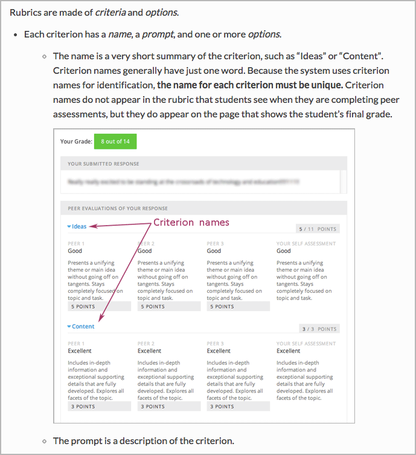
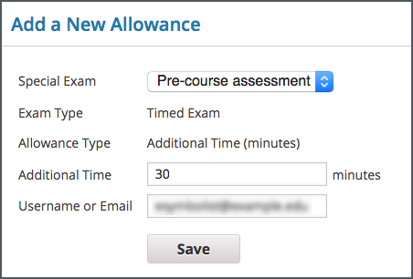

.. _Images:

#######
Images
#######

Because the user interface can change rapidly and frequently, and because it is
very expensive for translation teams to localize screen shots, the edX
documentation team uses screen shot images sparingly.

***************
Resources
***************

These resources for screen captures (existing dummy courses with good
data) are available on edX Edge.

* `AA Introduction to Music Theory`_

* `La Tierra Centroamericana`_

****************************
Guidelines for Adding Images
****************************

==========
Messages
==========

Avoid using a screen shot to show an error, warning, or informational
message. Instead, just include the text of the message as part of the procedure
or concept. Message text should be enclosed in quotation marks.

If you choose to show message text in a code block, you must include a
translator note in a comment immediately before that element. For more
information and an example, see :ref:`Documentation Translation Guidelines`.

=========================
Colors
=========================

Use the `edX pattern library`_ to select colors for your image.

====================
Browser Width
====================

Before you take a screen shot, reduce the window width to avoid extra white
space. Usually this means you narrow the width of your browser until the page
is no longer responsive. However, you do have the aesthetic control over when
reducing the width of the intended image will have the effect of making the
screen shot too long.

The following image has a lot of white space inside the component editor. To
produce a better illustration of the component editor, make the browser
narrower.

.. image:: Images/DiscussionComponentEditor.png
  :width: 450
  :alt: Image with extra white space on the right.

Keep images flush with text in bulleted and ordered lists.

************************
Capturing Screen Shots
************************

You can use any tool you like to capture images.

If you use SnagIt, you can configure preferences to include a timing delay and
specific on-screen objects, including the cursor, as well as setting keyboard
shortcuts for different configurations. References to the edX documentation
team's SnagIt Style Gallery follow.

If you use a Mac computer, you can use the built-in screen capture application
to take screen shots. To capture part of the screen, follow these steps.

.. note:: This method does not capture the positioning of the cursor.

#. Press CMD + SHIFT + 4. The cursor changes to a crosshairs symbol.
#. Click and drag from one corner of the area you want to capture to the corner
   diagonally opposite, and let go of the mouse when you've captured the image
   you want.

*****************
Editing Images
*****************

You can use any tool you like to edit images. Some guidelines for SnagIt are
included here.

=========================
SnagIt Style Gallery
=========================

SnagIt 3.3.5 has a Style Gallery feature that saves the customizations that you
make to borders, arrows, and so on for easy reuse.

If you use SnagIt, note that the following .snagstyles files are included in
the Images directory of this guide.

* ``arrows.snagstyles`` adds arrows in three edX base colors.
* ``color_fill.snagstyles`` adds three edX base colors.
* ``outline_shapes.snagstyles`` adds three outline shapes in each of the three
  edX base colors.
* ``numbered_callouts.snagstyles`` adds numbered callouts in three edX base
  colors.

To add these edX SnagIt styles to your SnagIt application, drag each
.snagstyles file onto the SnagIt icon in the toolbar of your computer.

========
Borders
========

Add a border with the following characteristics to every image.

(In SnagIt: Effects > Border; In Photoshop: Cmd + a, Edit > Stroke)

* Opacity: 100%
* Size: 2pt
* Color: edX Grayscale Dark, rgb(79, 89, 93) #4F595D

In SnagIt, the first time you make these selections for a border, a new tile
appears in the Style Gallery with these characteristics. Save that new style
(select its + icon) so that you can reuse it in the future.

=========================
File Size and Format
=========================

Save the file, without resizing, in .png format. You set the size in the
document: see :ref:`Image Sizes`.

=============
Annotations
=============

When you use SnagIt to add arrows, boxes, or other indicators, they are added
as vector-based images. You can save these additions in a special SnagIt format
so that you can edit them later: choose Save As > .snagproj format.

When all of your edits are complete and you are ready to publish, choose Save
As > png. This will flatten the image.

Colors for Annotations
**********************

When you annotate screen shots, use the colors in the `edX pattern library`_.

* For most additions, use edX Brand Secondary base, a dark pink (rgb(203, 89,
  141), #CB598D).

* If another color is required, use edX Brand Primary base, a medium blue
  (rgb(0, 121, 188), #0079BC).

Text in Annotations
**********************

If you want to annotate screen shots, instead of adding text to the image, use
numbered identifiers and provide a legend in the .rst file with the
descriptions.

For graphics that must include text, such as flowcharts, use a tool such as
Adobe Photoshop that allows you to add individually editable layers. When you
are ready to add the text, create a layer in the image specifically for the
text, and only text. Be sure to leave 30% extra surrounding space for
expansion.

Text in annotations uses the Open Sans font. To install the Open Sans font,
follow these steps.

#. Visit the `Google Fonts`_ page for Open Sans.
#. Under **Choose the styles you want**, select **Normal 400**.
#. (optional) Under **Choose the character sets you want**, select any
   character sets.
#. On the right side of the page, click the Download icon. Choose the .zip file
   option in the dialog box that opens.
#. Copy all of the unzipped .ttf files and move them to the Macintosh
   HD/Library/Fonts directory.
#. Close and reopen any application that you want to use the font in.

**************************
Adding an Image to a File
**************************

When you add an image to a file, include a directive with the following
information.

* The image directive
* The image width
* Image alt text

.. code-block:: xml

  .. image:: Images/HTMLEditor.png
    :width: 450
    :alt: An image of the Text component in the visual editor.

===========================
Alt Text for Accessibility
===========================

The purpose of alt text is to serve as a functional equivalent for an image.
Every image that you add to the edX documentation must have alt text that makes
the purpose of the image clear to those who are using screen readers.

The following examples are of useful alt text.

.. code-block:: xml

 :alt: Image of the feedback check mark and x from a student's point of view.

 :alt: A stacked bar chart for three subsections. In one subsection, fewer
  than a third of the students who started videos finished watching them.

The following examples are of alt text that is less useful.

.. code-block:: xml

 :alt: Image of a multiple choice problem.

 :alt: Example response.

When you write alt text, follow these guidelines.

* Quality and meaning are more important than brevity. However, length is a
  consideration, and some automated tests produce warnings for text that is
  longer than about 20 characters.
* Punctuate the alt text.
* To ensure that every image in an HTML file has alt text, try the
  `Durham University Alt Text Checker`_.
* To find other accessibility issues in an HTML file, try the
  `Web Accessibility Evaluation Tool`_.

.. _Image Sizes:

===========================
Image Sizes
===========================

When you save a screen shot, do not reduce it in size. You can define the image width in the rst file.

.. note that this only seems to control size in HTML output, not in PDFs.
.. - Alison 25 Sept 2015

.. code-block:: xml

  .. image:: Images/descriptive_image_name.png
       :width: 600
       :alt: Alt text in punctuated sentences or phrases.

.. list-table::

  * - Full screen width
    - 600
  * - Course pane
    - 500
  * - Component editor
    - 450
  * - Dialog box
    - 300
  * - Sidebar
    - 250
  * - Extra-wide screen
    - 800

Full screen width

.. image:: Images/Course_Outline_LMS.png
  :width: 600
  :alt: 600-pixel-wide image.

Course pane or Course Outline page

.. image:: Images/Units_LMS.png
  :width: 500
  :alt: 500-pixel-wide image.

Component editor

.. image:: Images/HTMLEditor_empty.png
  :width: 450
  :alt: 450-pixel-wide image.

Dialog box

Sidebar

.. image:: Images/unit-never-published.png
  :width: 250
  :alt: 250-pixel-wide image.

Extra-wide screen

.. image:: Images/Rerandomize.png
  :width: 800
  :alt: 800-pixel-wide image.

.. include:: ../../links/links.rst
