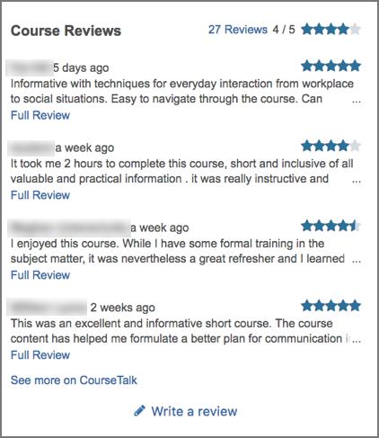

.. _Add CourseTalk (Deprecated):

################################################
DEPRECATED: This Is Unavailable in Lilac onwards
################################################

#############################################
Adding the CourseTalk Widget
#############################################

This topic describes how to add `CourseTalk`_ widgets to your instance of Open
edX. When you add the CourseTalk widget, it is visible for all courses.

.. contents::
   :local:
   :depth: 1

*********
Overview
*********

The CourseTalk widget allows learners to write reviews of your course and see
reviews that other learners have written. Learners can write reviews on the
course **Course** page, and the reviews are visible both in the course, and on
the course **About** page. Only learners who are enrolled in the course can
leave reviews of a course.

*********************************************
Add the CourseTalk Widget
*********************************************

To add the CourseTalk widget, follow these steps.

#. Sign in to the Django administration console for your base URL. For example,
   go to ``http://{your_URL}/admin``.
#. In the navigation pane, locate **Coursetalk**, and then select **Course talk
   widget configurations**.
#. On the **Select course talk widget configuration to change** page, select
   **Add course talk widget configuration**.
#. On the  **Add course talk widget configuration** page, select the
   **Enabled** check box, enter a value in the **Platform key** field, and then
   select **Save**.

   .. note::
    You can use any text that you want as your platform key. EdX recommends
    that you use your domain name, or part of your domain name.

#. In the LMS, open the **Course** page for any of your Open edX courses. Verify that the **Reviews** link in the sidebar opens the CourseTalk widget.
#. Sign out of your instance of Open edX and view the About page for any
   course.
#. In the right pane, verify that the CourseTalk widget appears below the
   course information panel.

.. include:: ../../../links/links.rst
