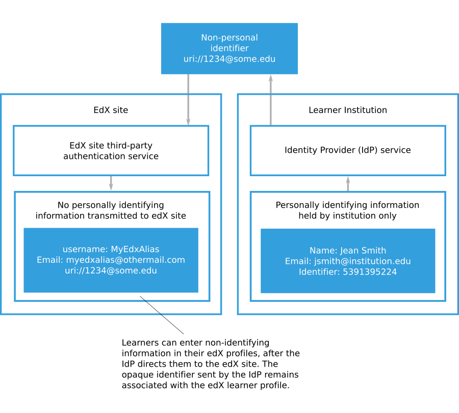

.. _eliminating_pii_third_party_authentication:

###############################################
Eliminating PII From Third-Party Authentication
###############################################

Open edX sites and Open edX Edge do not require any personally identifiable
information (PII) about learners during third-party authentication. PII is
information that can be used to reveal an individual's identity, such as a
name. Your identity provider (IdP) service can send only non-personal
identifiers to create Open edX site accounts for learners. If you configure
third-party authentication in this way, the Open edX site never receives PII
from your organization.

.. contents::
   :local:
   :depth: 1

.. note::
  The types of information that constitute PII and requirements for handling it
  depend on the laws and regulations that apply to your organization. The
  information in this documentation is intended to explain how Open edX sites
  can be configured to handle learner data. You cannot rely on this
  documentation as a source of legal guidance.

************************************************************
Creating Open edX Learner Accounts Without Transmitting PII
************************************************************

After you have configured a third-party authentication profile for an Open edX
site, the site's sign-in page will display a button for users to access your
IdP service. Learners will access your IdP service and authenticate using their
organization credentials. Your IdP service will direct learners back to the
Open edX site's sign-in screen with an authentication token.

The IdP authentication token includes an identifying string for a learner. This
identifier serves as a link between the identifying information that your
organization maintains for a learner and the Open edX account for that learner.
The identifying string does not need to include any PII for the learner. The
identifying string is sometimes referred to as an opaque identifier because it
does not make the identity of the learner visible.

When a learner uses third-party authentication to sign in to an Open edX site
for the first time, the Open edX site creates a learner account. The new Open
edX learner account is permanently associated with the identifying string
included in the IdP authentication token. Learners will be prompted to create
profiles by entering Open edX usernames, email addresses, and other information
in their accounts. Learners can take steps to minimize the PII in their
profiles. For more information, see
:ref:`creating_learner_accounts_without_pii`.

The following diagram shows how an IdP can direct a learner to an Open edX site to
create a learner account, without transmitting any PII.

      learner account on an Open edX site without transmitting any personally
      identifying information (PII).

You can download a report containing grades for all learners in the Open edX
courses that you run. The report includes the Open edX username for each
learner enrolled in the course, but the usernames may not correspond to learner
records that your organization maintains. If you need to match the scores for
Open edX site learners to the learner records that your organization maintains,
you can use the third- party authentication ID mapping REST API to retrieve the
user ID SAML attribute and matching Open edX username for a learner. For more
information about grade reports for Open edX courses that you run, see
:ref:`Access_grades`.

.. Organizations may be able to access learner information in other ways. Make
.. the paragraph above more general when we know of those other methods.

The following diagram shows how an organization that uses third-party
authentication can match non-personally identifying Open edX learner usernames
with the records that the organization holds for those learners.

.. image:: ../../../../shared/images/tpa-institution-associate-edx-id-with-personal-id.png
  :width: 900
  :alt: A diagram showing how an organization that uses third-party
      authentication can match non-personally identifying Open edX learner
      usernames with the records that the organization holds for those
      learners.

.. TODO: Add documentation for the third-party authentication ID mapping API.

.. _creating_learner_accounts_without_pii:

**********************************
Minimizing PII in Account Profiles
**********************************

When your IdP directs a learner to an Open edX site for the first time, the
learner enters information to create an Open edX site account. The basic
information required for an Open edX site account is an email address, full
name, public username, password, and country.  Learners may also provide
additional personal details such as gender, year of birth, and educational
background.  While course teams have access to full registration information
for learners enrolled in their courses, only public usernames are used to
identify learners in course discussions and other public-facing course
interactions.

To minimize PII stored on an Open edX site, learners can limit the information
in their Open edX account profiles to the basic information required for an
Open edX site account.  Additionally, learners may use random or nondescript
public usernames and create non-identifying email addresses to receive course
updates.

If you want to avoid transmitting PII for the Open edX learner accounts that
use third-party authentication, you should not include personally identifying
information in the authentication token. The only piece of information that is
required in the authentication token is the user ID, which should not be
personally identifying.

For more information about configuring the information in a third-party
authentication token, see :ref:`Configuration Options for SAML Providers`.

****************************
PII Considerations with SAML
****************************

Organizations that use SAML to integrate their IdPs with Open edX need to
understand what personal information is provided to Open edX when users sign in
using SAML.

When a user uses SAML or Shibboleth to sign in to Open edX, the IdP
authoritatively asserts pieces of information about the user.

Each piece of information is called a SAML attribute. Each attribute has a
name and a formal identifier that is called an object identifier (`OID`_)
uniform resource name (`URN`_).

The following table lists some common attributes.

.. list-table::
   :widths: 25 30 45

   * - Name
     - OID URN
     - Example Value
   * - User ID
     - ``urn:oid:0.9.2342.19200300.100.1.1``
     - 123456789
   * - Full Name
     - ``urn:oid:2.5.4.3``
     - Donna Noble
   * - First Name
     - ``urn:oid:2.5.4.42``
     - Donna
   * - Last Name
     - ``urn:oid:2.5.4.4``
     - Noble
   * - Email
     - ``urn:oid:0.9.2342.19200300.100.1.3``
     - dnoble@school.edu
   * - eduPersonPrincipalName
     - ``urn:oid:1.3.6.1.4.1.5923.1.1.1.6``
     - dnoble@school.edu
   * - eduPersonEntitlement
     - ``urn:oid:1.3.6.1.4.1.5923.1.1.1.7``
     - urn:mace:school.edu:confocalMicroscope

For more information about ``eduPersonPrincipalName`` and
``eduPersonEntitlement``, see `eduPersonPrincipalName`_ and
`eduPersonEntitlement`_ on the `eduPerson Object Class Specification`_ page.

When a new user uses SAML to sign in to Open edX, the IdP sends information
about the user to Open edX in the form of these attributes. These attributes
can be used to pre-fill the registration form.

For example, when a user signs in, their server may provide the following
information.

.. code-block:: python

    "urn:oid:0.9.2342.19200300.100.1.1: 123, urn:oid:2.5.4.3: John Smith,
    urn:oid:0.9.2342.19200300.100.1.3: jsmith@school.edu"

Open edX saves the user ID because it is required to match future sign-in
attempts to the correct user account. The full name (``John Smith``) and email
(``jsmith@school.edu``) is pre-filled on the registration form, but if the user
edits those, Open edX saves only the new changed version. (For example, if the
user changes the email to ``jsmith@example.com``, Open edX would record the
user's email as ``jsmith@example.com`` and would not have any record of the
``jsmith@school.edu`` address.)

By default, Open edX expects the standard **User ID** field
(``urn:oid:0.9.2342.19200300.100.1.1``) and uses that as the unique external
ID. Open edX can accept any set of attributes that a SAML IdP sends, as long as
one of the attributes is a unique, permanent identifier for the user being
authenticated. The URN or OID of the unique identifier must be specified in the
Open edX "Provider Configuration (SAML IdPs)" profile for the organization
(part of the Django administration console) in the **User ID Attribute**
field.

If you want to configure Open edX to always store all of the attributes that
the external IdP sends for each user, you can enable that with a
setting, as follows.

#. Sign in to the Django administration console for your base URL. For example,
   ``http://{your_URL}/admin``.

#. Go to the **SAML Configuration** page, and then select **Add SAML
   Configuration**. (Do not go to the **SAML Provider Configuration** page.)

#. In the **Other Config Str** section, add the following code.

   .. code-block:: none

     "EXTRA_DATA": [ "attributes" ]

This setting causes all the attributes to be saved in the
``social_auth_usersocialauth`` table's ``extra_data`` column for every new SAML
user. This data is only accessible by accessing the database directly or by
going to the **User social auths** page of the Open edX LMS Django
administration console.

For organizations that want to avoid sending any personally identifiable
information to Open edX during the SAML sign in or registration process, we
recommend that the organization configure their SAML IdP to only send a single
attribute: **a unique, permanent, opaque user identifier**. This should be a
value that uniquely identifies any learner or staff member, but is different
from their organization ID or any other identifier they may have.

For reporting and analytics purposes when using an opaque user identifier, the
organization can use the :ref:`Third Party Auth ID Mapping API` to convert Open
edX user IDs found in reports or analytics back to these opaque organization
user identifiers. Organization partners can then convert each opaque user
identifier back to the official learner ID.

.. include:: ../../../../links/links.rst
