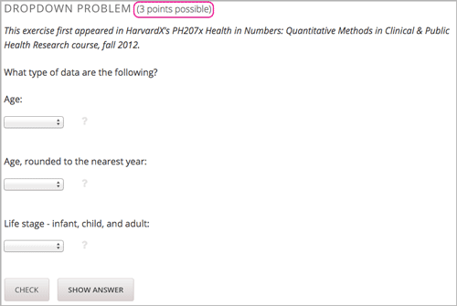

.. _Working with Problems:

################################
Working with Problems
################################

******************************
Overview of Problem Components
******************************

The problem component allows you to add interactive, automatically
graded exercises to your course content. You can create many different
types of problems in OLX.

All problems receive a point score, but, by default, problems do not count
toward a student's grade. If you want the problems to count toward the
student's grade, change the assignment type of the subsection that contains the
problems.

This section covers the basics of problem components: what they look like to
you and your students, and the options that every problem component has. 
For more information, see the following topics.

* `The Student View of a Problem`_
* `Problem Settings`_
* `Modifying a Released Problem`_
* `Additional Work with Problems`_

.. _Problem Student View:

************************************
The Student View of a Problem
************************************

All problems on the edX platform have several component parts.

.. image:: ../../../shared/building_and_running_chapters/Images/AnatomyOfExercise1.png
 :alt: Image of a problem from a student's point of view, with callouts for 
       elements of the problem

#. **Problem text.** The problem text can contain any standard HTML formatting.

#. **Response field with the student's answer.** Students enter answers
   in *response fields*. The appearance of the response field depends on
   the type of the problem.

#. **Rendered answer.** For some problem types, the LMS uses MathJax to
   render plain text as “beautiful math.”

#. **Check button.** The student clicks **Check** to submit a response
   or find out if his answer is correct. If the answer is correct, a green
   check mark appears. If it is incorrect, a red X appears. When a
   student clicks **Check**, the LMS saves the grade and current
   state of the problem.

#. **Save button.** The student can click **Save** to save his current
   response without submitting it for a grade. This allows the student to
   stop working on a problem and come back to it later.

#. **Show Answer button.** This button is optional. When the student
   clicks **Show Answer**, the student sees both the correct answer (see 2
   above) and the explanation (see 10 below). You define whether
   the **Show Answer** button is visible.

#. **Attempts.** You can set a specific number of attempts or allow
   unlimited attempts for a problem. By default, the course-wide **Maximum
   Attempts** advanced setting is null, meaning that the maximum number of
   attempts for problems is unlimited. If the course-wide **Maximum Attempts**
   setting is changed to a specific number, the **Maximum Attempts** setting
   for individual problems defaults to that number, and cannot be set to
   unlimited.

   .. image:: ../../../shared/building_and_running_chapters/Images/AnatomyOfExercise2.png
    :alt: Image of a problem from a student's point of view, with callouts for 
          attempts and showing the answer

#. **Feedback.** After a student clicks **Check**, all problems return a
   green check mark or a red X.

   .. image:: ../../../shared/building_and_running_chapters/Images/AnatomyofaProblem_Feedback.png
    :alt: Image of feedback checkmark and x from a student's point of view

#. **Correct answer.** Most problems require that you specify
   a single correct answer.

#. **Explanation.** You can include an explanation that
   appears when a student clicks **Show Answer**.

#. **Reset button.** Students can click **Reset** to clear any input that has
   not yet been submitted, and try again to answer the question. If the student
   has already submitted an answer, clicking **Reset** clears the submission
   and, if the problem contains randomized variables and randomization is set
   to **On Reset**, changes the values the student sees in the problem. If the
   number of maximum attempts that was set for this problem has been reached,
   the **Reset** button is not visible.

#. **Hide Answer button.**

   .. image:: ../../../shared/building_and_running_chapters/Images/AnatomyOfExercise3.png
    :alt: Image of a problem in the left pane

#. **Grading.** You can specify whether a group of problems
   is graded. If a group of problems is graded, a clock icon appears for
   that assignment in the left pane.

   .. image:: ../../../shared/building_and_running_chapters/Images/clock_icon.png

#. **Due date.** The date that the problem is due. A problem that is
   past due does not have a **Check** button. It also does not accept
   answers or provide feedback.

.. note:: Problems can be **open** or **closed.** Closed problems do not 
          have a **Check** button. Students can still see questions, solutions,
          and revealed explanations, but they cannot check their work, submit
          responses, or change an earlier score.

There are also some attributes of problems that are not immediately
visible. You can set these attributes in Studio.

*  **Randomization.** For some problems, you can specify
   whether a problem will use randomly generated numbers that vary from
   student to student.

*  **Weight.** Different problems in a particular problem set can be
   given different weights.

*  **Label.** To improve accessibility for students who have disabilities, each
   problem needs a descriptive label. The label typically contains part or all
   of the text of the question in the problem. Most templates include a space
   for a label. You can find example labels in the documentation for each
   problem or tool type.

******************
Problem Settings
******************

In addition to the text of the problem, problems that you create have the
following settings.

*  **Display Name**
*  **Maximum Attempts**
*  **Problem Weight**
*  **Randomization**
*  **Show Answer**
*  **Show Reset Button**

===============
Display Name
===============

This setting indicates the name of your problem. This name appears as a
heading above the problem and as a tooltip in the learning sequence at the top
of the **Courseware** page.

.. image:: ../../../shared/building_and_running_chapters/Images/ProbComponent_LMS_DisplayName.png
 :alt: Image of the problem in a unit page from a student's point of view

The display name is also used in edX Insights reports.

You set the display name as an attribute of the ``problem`` element.

.. code-block:: xml
  
  <problem display_name="Checkboxes" . . . >

==============================
Maximum Attempts
==============================

This setting specifies the number of times a student is allowed to attempt
answering the problem. By default, the course-wide **Maximum Attempts**
advanced setting is null, meaning that the maximum number of attempts for
problems is unlimited. If the course-wide **Maximum Attempts** setting is
changed to a specific number, the **Maximum Attempts** setting for individual
problems defaults to that number, and cannot be set to unlimited.

.. note:: Only questions that have a **Maximum Attempts** setting of 1 or 
 higher are included on the Student Answer Distribution report that you can
 download during your course.

You set the maximum attempts as an attribute of the ``problem`` element.

.. code-block:: xml
  
  <problem max_attempts="3" . . . >

.. _Problem Weight:

==============================
Problem Weight
==============================

.. note:: The LMS stores scores for all problems, but scores only count 
          toward a student's final grade if they are in a subsection that is
          graded.

This setting specifies the maximum number of points possible for the
problem. The problem weight appears next to the problem title.

       points circled

By default, each response field, or "answer space", in a problem component is
worth one point. Any problem component can have multiple response fields. For
example, the problem component above contains one dropdown problem that has
three separate questions, and also has three response fields.

You set a different component weight as an attribute of the ``problem``
element.

.. code-block:: xml
  
  <problem weight="2.0" . . . >

Computing Scores
****************

The score that a student earns for a problem is the result of the
following formula.

**Score = Weight × (Correct answers / Response fields)**

*  **Score** is the point score that the student receives.

*  **Weight** is the problem's maximum possible point score.

*  **Correct answers** is the number of response fields that contain correct
   answers.

*  **Response fields** is the total number of response fields in the problem.

**Examples**

The following are some examples of computing scores.

*Example 1*

A problem's **Weight** setting is left blank. The problem has two
response fields. Because the problem has two response fields, the
maximum score is 2.0 points.

If one response field contains a correct answer and the other response
field contains an incorrect answer, the student's score is 1.0 out of 2
points.

*Example 2*

A problem's weight is set to 12. The problem has three response fields.

If a student's response includes two correct answers and one incorrect
answer, the student's score is 8.0 out of 12 points.

*Example 3*

A problem's weight is set to 2. The problem has four response fields.

If a student's response contains one correct answer and three incorrect
answers, the student's score is 0.5 out of 2 points.

.. _Randomization:

===============
Randomization
===============

This setting specifies whether certain values in your problem change each time
a different student accesses the problem, or each time a single student tries
to answer the problem. For example, the highlighted values in the problem below
change each time a student submits an answer to the problem.

.. image:: ../../../shared/building_and_running_chapters/Images/Rerandomize.png
 :alt: The same problem shown twice, with color highlighting on values that 
       can change

If you want to change, or "randomize," specific values in your problem, you
have to do both of the following:

* Make sure that your problem contains a Python script that randomizes the
  values that you want.

* Enable randomization in the Problem component. 

.. note:: Note that specifying this **Randomization** setting is different 
 from *problem randomization*. The **Randomization** setting randomizes
 variables within a single problem. Problem randomization offers different
 problems or problem versions to different students. For more information, see
 :ref:`Problem Randomization`.

To enable randomization, select an option for the **Randomization** setting.
This setting has the following options.

+-------------------+--------------------------------------+
| **Always**        | Students see a different version of  |
|                   | the problem each time they click     |
|                   | **Check**.                           |
+-------------------+--------------------------------------+
| **On Reset**      | Students see a different version of  |
|                   | the problem each time they click     |
|                   | **Reset**.                           |
+-------------------+--------------------------------------+
| **Never**         | All students see the same version    |
|                   | of the problem. This is the default. |
+-------------------+--------------------------------------+
| **Per Student**   | Individual students see the same     |
|                   | version of the problem each time     |
|                   | they look at it, but that version    |
|                   | is different from the version that   |
|                   | other students see.                  |
+-------------------+--------------------------------------+

You set value randomization as an attribute of the ``problem`` element.

.. code-block:: xml
  
  <problem rerandomize="always" . . . >

.. note:: The edX Platform has a 20-seed limit for randomization.

.. _Show Answer:

===============
Show Answer
===============

This setting defines when the problem shows the answer to the student.
This setting has the following options.

+-------------------+--------------------------------------+
| **Always**        | Always show the answer when the      |
|                   | student clicks the **Show Answer**   |
|                   | button.                              |
+-------------------+--------------------------------------+
| **Answered**      | Show the answer after the student    |
|                   | tries to answer the problem.         |
|                   |                                      |
|                   | If the question can be, and is,      |
|                   | reset, the answer                    |
|                   | is not shown until the student tries |
|                   | the problem again. (When a student   |
|                   | answers a question, the question is  |
|                   | considered to be                     |
|                   | both attempted and answered. When    |
|                   | the question is reset, the question  |
|                   | is still attempted, but not yet      |
|                   | answered.)                           |
+-------------------+--------------------------------------+
| **Attempted**     | Show the answer after the student    |
|                   | tries to answer the problem.         |
|                   |                                      |
|                   | If the question can be, and is,      |
|                   | reset, the answer                    |
|                   | *continues to show*.                 |
|                   | (When a student answers a question,  |
|                   | the question is considered to be     |
|                   | both attempted and                   |
|                   | answered. When the question is       |
|                   | reset, the question is still         |
|                   | attempted, but not yet answered.)    |
+-------------------+--------------------------------------+
| **Closed**        | Show the answer after the student    |
|                   | has used up all his attempts to      |
|                   | answer the problem or the due date   |
|                   | has passed.                          |
+-------------------+--------------------------------------+
| **Finished**      | Show the answer after the student    |
|                   | has answered the problem correctly,  |
|                   | the student has no attempts left, or |
|                   | the problem due date has passed.     |
+-------------------+--------------------------------------+
| **Correct or      | Show the answer after the student    |
| Past Due**        | has answered the problem correctly   |
|                   | or the problem due date has passed.  |
+-------------------+--------------------------------------+
| **Past Due**      | Show the answer after the due date   |
|                   | for the problem has passed.          |
+-------------------+--------------------------------------+
| **Never**         | Never show the answer. In this case, |
|                   | the **Show Answer** button does not  |
|                   | appear next to the problem in Studio |
|                   | or in the LMS.                       |
+-------------------+--------------------------------------+

You set the show answer preference as an attribute of the ``problem`` element.

.. code-block:: xml
  
  <problem showanswer="correct_or_past_due"  . . . >

.. _Show Reset Button:

=================
Show Reset Button
=================

This setting defines whether a **Reset** button is visible on the problem.
Students can click **Reset** to clear any input that has not yet been submitted,
and try again to answer the problem. If the student has already submitted an
answer, clicking **Reset** clears the submission and, if the problem contains
randomized variables and randomization is set to **On Reset**, changes the
values the student sees in the problem. If the number of maximum attempts that
was set for this problem has been reached, the **Reset** button is not visible.

This problem-level setting overrides the course-level **Show Reset Button for
Problems** setting.

You set the show reset button preference as an attribute of the ``problem``
element.

.. code-block:: xml
  
  <problem show_reset_button="true"  . . . >

.. include:: ../../../shared/exercises_tools/Section_adding_hints.rst

.. Comment out partial credit.. include:: ../../../shared/exercises_tools/Section_partial_credit.rst

.. _Modifying a Released Problem:

*********************************
Modifying a Released Problem
*********************************

.. warning:: Be careful when you modify problems after they have been 
 released! Changes that you make to published problems can affect the student
 experience in the course and analysis of course data.

After a student submits a response to a problem, the LMS stores the student's
response, the score that the student received, and the maximum score for the
problem. For problems with a **Maximum Attempts** setting greater than 1, the
LMS updates these values each time the student submits a new response to a
problem. However, if you change a problem or its attributes,
existing student information for that problem is not automatically updated.

For example, you may release a problem and specify that its answer is 3.
After some students have submitted responses, you notice that the answer
should be 2 instead of 3. When you update the problem with the correct
answer, the LMS doesn't update scores for students who answered 2 for the
original problem and thus received the wrong score.

For another example, you may change the number of response fields to
three. Students who submitted answers before the change have a score of
0, 1, or 2 out of 2.0 for that problem. Students who submitted answers
after the change have scores of 0, 1, 2, or 3 out of 3.0 for the same
problem.

If you change the weight setting for the problem in Studio, however, existing
student scores update when the student's **Progress** page is refreshed. In a
live section, students will see the effect of these changes.

===============
Workarounds
===============

If you have to modify a released problem in a way that affects grading, you
have two options within Studio to assure that every student has the opportunity
to submit a new response and be regraded. Note that both options require you to
ask your students to go back and resubmit answers to a problem.

*  In the problem component that you changed, increase the number of attempts
   for the problem. Then ask all your students to redo the problem.

*  Delete the entire Problem component in Studio and create a new Problem
   component with the content and settings that you want. (If the revisions you
   must make are minor, duplicate the problem component before you delete it
   and revise the copy.) Then ask all your students to complete the new
   problem.

.. _Additional Work with Problems:

************************************
Additional Work with Problems
************************************

You have some further options when you work with problems. You can include more
than one problem in a single problem component, or you can set up a problem
that presents different versions to different students.

.. _Multiple Problems in One Component:

====================================
Multiple Problems in One Component
====================================

You may want to create a problem that has more than one response type. For
example, you may want to create a numerical input problem, and then include a
multiple choice question about the numerical input problem. Or, you may want a
student to be able to check the answers to many problems at one time. To do
this, you can include multiple problems inside a single ``problem`` element.
The problems can be different types.

.. note:: 
  You cannot use a :ref:`Custom JavaScript` in a component that contains more
  than one problem. Each custom JavaScript problem must be in its own
  component.

To create multiple problems in one component, create a new blank advanced
problem component, and then add the XML for each problem in the component
editor. You only need to include the XML for the problem and its answers. You
don't have to include the code for other elements, such as the **Check**
button.

Elements such as the **Check**, **Show Answer**, and **Reset** buttons, as well
as the settings that you select for the problem component, apply to all of the
problems in that component. Thus, if you set the maximum number of attempts to
3, the student has three attempts to answer the entire set of problems in the
component as a whole rather than three attempts to answer each problem
individually. If a student clicks **Check**, the LMS scores all of the problems
in the component at once. If a student clicks **Show Answer**, the answers for
all the problems in the component appear.

.. _Problem Randomization:

===========================
Problem Randomization
===========================

You may want to present different students with different problems, or
different versions of the same problem. To do this, you'll create a ``problem``
element for each problem or version in Studio, and then edit your course
outside of Studio to randomize the problem that students see.

Note that *problem randomization* is different from the **Randomization**
setting in Studio. The **Randomization** setting randomizes variables within a
single problem. Problem randomization offers different problems or problem
versions to different students.

.. _Create Randomized Problems:

Create Randomized Problems
****************************

#. Create a separate ``problem`` element component for each version or problem
   that you want to randomize. For example, if you want to offer four versions
   or problems, you'll create four separate ``problem`` elements. Make a note
   of the 32-digit unit ID that appears in the **Unit Identifier** field under
   **Unit Location**.

#. Open the ``vertical`` element that contains the randomized problems.

   The file contains a list of all the components in the unit, together with
   the URL names of the components. For example, the following file contains
   four ``problem`` elements.

   .. code-block:: xml
     
       <vertical display_name="Test Unit">
          <problem url_name="random_problem_1"/>
          <problem url_name="random_problem_2"/>
          <problem url_name="random_problem_3"/>
          <problem url_name="random_problem_4"/>
       </vertical>

#. Add ``<randomize> </randomize>`` tags around the components for the problems
   that you want to randomize.

   .. code-block:: xml
      
       <vertical display_name="Test Unit">
         <randomize>
            <problem url_name="d9d0ceb3ffc74eacb29501183e26ad6e"/>
            <problem url_name="ea66d875f4bf4a9898d8e6d2cc9f3d6f"/>
            <problem url_name="2616cd6324704f85bc315ec46521485d"/>
            <problem url_name="88987707294d4ff0ba3b86921438d0c0"/>
         </randomize>
       </vertical>

.. include:: ../../../shared/exercises_tools/Section_adding_tooltip.rst       

.. include:: ../links.rst