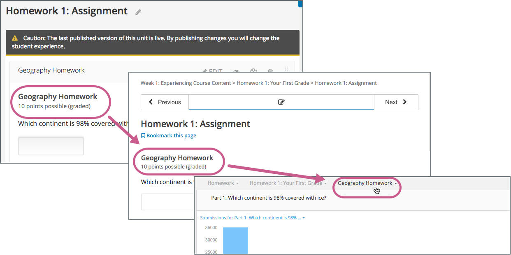

.. _Working with Problems:

################################
Working with Problems
################################

.. contents::
  :local:
  :depth: 1

******************************
Overview of Problem Components
******************************

The problem component allows you to add interactive, automatically
graded exercises to your course content. You can create many different
types of problems in OLX (open learning XML).

All problems receive a point score, but, by default, problems do not count
toward a learner's grade. If you want the problems to count toward the
learner's grade, change the assignment type of the subsection that contains
the problems.

This section covers the basics of problem components: what they look like to
you and your learners, and the options that every problem component has.

.. _Problem Student View:

.. include:: ../../../shared/course_components/Section_learner_problem_view.rst

******************
Problem Settings
******************

In addition to the text of the problem, problems that you create have the
following settings.

.. contents::
  :local:
  :depth: 1

===============
Display Name
===============

This setting indicates the name of your problem. This name appears as a heading
above the problem in the LMS, and it identifies the problem for you in
Insights.

The following illustration shows the display name of a problem in Studio, in
the LMS, and in Insights.

     Insights.
 :width: 800

Each problem type supplies a default display name that identifies the type of
problem component added. Changing the default to a unique, descriptive display
name can help you and your learners identify different problems quickly and
accurately. If you delete the default display name and do not enter your own
identifying name, the platform supplies "problem" for you.

For more information about metrics for your course's problem components, see
`Using edX Insights`_.

With OLX, you set the display name as an attribute of the ``problem`` element.

.. code-block:: xml

  <problem display_name="Geography Homework"></problem>

==============================
Maximum Attempts
==============================

This setting specifies the number of times a learner is allowed to attempt
answering the problem. By default, the course-wide **Maximum Attempts**
advanced setting is null, meaning that the maximum number of attempts for
problems is unlimited. If the course-wide **Maximum Attempts** setting is
changed to a specific number, the **Maximum Attempts** setting for individual
problems defaults to that number, and cannot be set to unlimited.

.. note:: Only questions that have a **Maximum Attempts** setting of 1 or
 higher are included on the Learner Answer Distribution report that you can
 download during your course.

With OLX, you set the maximum attempts as an attribute of the ``problem``
element.

.. code-block:: xml

  <problem max_attempts="3"></problem>

.. _Problem Weight:

==============================
Problem Weight
==============================

.. note:: The LMS stores scores for all problems, but scores only count
          toward a learner's final grade if they are in a subsection that is
          graded.

This setting specifies the maximum number of points possible for the
problem. The problem weight appears next to the problem title.

.. image:: ../../../shared/images/ProblemWeight_DD.png
 :alt: Image of a problem from a learner's point of view, with the possible
       points circled

By default, each response field, or "answer space", in a problem component is
worth one point. Any problem component can have multiple response fields. For
example, the problem component above contains one dropdown problem that has
three separate questions, and also has three response fields.

With OLX, you set a different component weight as an attribute of the
``problem`` element.

.. code-block:: xml

  <problem weight="2.0"></problem>

Computing Scores
****************

The score that a learner earns for a problem is the result of the
following formula.

**Score = Weight × (Correct answers / Response fields)**

*  **Score** is the point score that the learner receives.

*  **Weight** is the problem's maximum possible point score.

*  **Correct answers** is the number of response fields that contain correct
   answers.

*  **Response fields** is the total number of response fields in the problem.

**Examples**

The following are some examples of computing scores.

*Example 1*

A problem's **Weight** setting is left blank. The problem has two
response fields. Because the problem has two response fields, the
maximum score is 2.0 points.

If one response field contains a correct answer and the other response
field contains an incorrect answer, the learner's score is 1.0 out of 2
points.

*Example 2*

A problem's weight is set to 12. The problem has three response fields.

If a learner's response includes two correct answers and one incorrect
answer, the learner's score is 8.0 out of 12 points.

*Example 3*

A problem's weight is set to 2. The problem has four response fields.

If a learner's response contains one correct answer and three incorrect
answers, the learner's score is 0.5 out of 2 points.

.. _Randomization:

===============
Randomization
===============

.. note:: The **Randomization** setting serves a different purpose from
 "problem randomization". The **Randomization** setting affects how numeric
 values or multiple choice options are randomized within a single problem.
 Problem randomization offers different problems or problem versions to
 different learners. For more information, see :ref:`Problem Randomization`.

For numerical input problems that include a Python script to generate numbers
randomly, or multiple choice problems that are set up to shuffle answers, this
setting specifies when problem appearance changes.

.. note:: This setting should only be set to an option other than **Never**
 for problems that are configured to do random number generation or shuffle
 multiple choice answers.

For example, in this problem, the highlighted values change every time a
learner selects **Check** for this problem.

.. image:: ../../../shared/images/Rerandomize.png
 :alt: An image of the same problem shown twice, with color highlighting on
   values that change.
 :width: 800

If you want to randomize numeric values in a problem, you complete both of
these steps.

* Make sure that you edit your problem to include a Python script that randomly
  generates numbers.

* Select **Edit** and then **Settings** for the problem to specify an option
  other than **Never** for the **Randomization** setting.

If you want to shuffle answers in a multiple choice problem, you complete both
of these steps.

* Use the simple or advanced editor to set up your problem to :ref:`shuffle
  answers<Shuffle Answers in a Multiple Choice Problem>`.

* Select **Edit** and then **Settings** for the problem to specify an option
  other than **Never** for the **Randomization** setting.

..  For more information, see :ref:`Use Randomization in a Numerical Input Problem`.
..  ^^ add back to first bullet when DOC-2175 gets done - Alison 30 Jul 15

The edX Platform has a 20-seed maximum for randomization. This means that
learners see up to 20 different problem variants for every problem that has
**Randomization** set to an option other than **Never**. It also means that
every answer for the 20 different variants is reported by the Answer
Distribution report and edX Insights. Limiting the number of variants to a
maximum of 20 allows for better analysis of learner submissions by allowing you
to detect common incorrect answers and usage patterns for such answers.

For more information, see :ref:`Student_Answer_Distribution` in this guide, and
`Review Answers to Graded Problems`_ or `Review Answers to Ungraded Problems`_
in *Using edX Insights*.

You can choose the following options for the **Randomization** setting.

.. list-table::
   :widths: 15 70
   :header-rows: 1

   * - Option
     - Description
   * - **Always**
     - Learners see a different version of the problem each time they select
       Check.
   * - **On Reset**
     - Learners see a different version of the problem each time they select
       Reset.
   * - **Never**
     - All learners see the same version of the problem. For most courses, this
       option is supplied by default. Select this option for every problem in
       your course that does not include a Python script to generate random
       numbers.
   * - **Per Student**
     - Individual learners see the same version of the problem each time they
       look at it, but that version is different from the version that other
       learners see.

With OLX, you set value randomization as an attribute of the ``problem``
element.

.. code-block:: xml

  <problem rerandomize="always"></problem>

.. _Show Answer:

===============
Show Answer
===============

This setting defines when the problem shows the answer to the learner.
This setting has the following options.

+-------------------+--------------------------------------+
| **Always**        | Always show the answer when the      |
|                   | learner selects the **Show Answer**  |
|                   | button.                              |
+-------------------+--------------------------------------+
| **Answered**      | Show the answer after the learner    |
|                   | tries to answer the problem.         |
|                   |                                      |
|                   | If the question can be, and is,      |
|                   | reset, the answer                    |
|                   | is not shown until the learner tries |
|                   | the problem again. (When a learner   |
|                   | answers a question, the question is  |
|                   | considered to be                     |
|                   | both attempted and answered. When    |
|                   | the question is reset, the question  |
|                   | is still attempted, but not yet      |
|                   | answered.)                           |
+-------------------+--------------------------------------+
| **Attempted**     | Show the answer after the learner    |
|                   | tries to answer the problem.         |
|                   |                                      |
|                   | If the question can be, and is,      |
|                   | reset, the answer                    |
|                   | *continues to show*.                 |
|                   | (When a learner answers a question,  |
|                   | the question is considered to be     |
|                   | both attempted and                   |
|                   | answered. When the question is       |
|                   | reset, the question is still         |
|                   | attempted, but not yet answered.)    |
+-------------------+--------------------------------------+
| **Closed**        | Show the answer after the learner    |
|                   | has used up all his attempts to      |
|                   | answer the problem or the due date   |
|                   | has passed.                          |
+-------------------+--------------------------------------+
| **Finished**      | Show the answer after the learner    |
|                   | has answered the problem correctly,  |
|                   | the learner has no attempts left, or |
|                   | the problem due date has passed.     |
+-------------------+--------------------------------------+
| **Correct or      | Show the answer after the learner    |
| Past Due**        | has answered the problem correctly   |
|                   | or the problem due date has passed.  |
+-------------------+--------------------------------------+
| **Past Due**      | Show the answer after the due date   |
|                   | for the problem has passed.          |
+-------------------+--------------------------------------+
| **Never**         | Never show the answer. In this case, |
|                   | the **Show Answer** button does not  |
|                   | appear next to the problem in Studio |
|                   | or in the LMS.                       |
+-------------------+--------------------------------------+

With OLX, you set the show answer preference as an attribute of the
``problem`` element.

.. code-block:: xml

  <problem showanswer="correct_or_past_due"></problem>

.. _Show Reset Button:

=================
Show Reset Button
=================

This setting defines whether a **Reset** button is visible on the problem.
Learners can select **Reset** to clear any input that has not yet been
submitted, and try again to answer the problem. If the learner has already
submitted an answer, selecting **Reset** clears the submission and, if the
problem contains randomized variables and randomization is set to **On Reset**,
changes the values the learner sees in the problem. If the number of maximum
attempts that was set for this problem has been reached, the **Reset** button
is not visible.

This problem-level setting overrides the course-level **Show Reset Button for
Problems** setting.

With OLX, you set the show reset button preference as an attribute of the
``problem`` element.

.. code-block:: xml

  <problem show_reset_button="true"></problem>

.. include:: ../../../shared/exercises_tools/Section_adding_hints.rst

.. include:: ../../../shared/exercises_tools/Section_partial_credit.rst

.. _Modifying a Released Problem:

*********************************
Modifying a Released Problem
*********************************

.. warning:: Be careful when you modify problems after they have been
 released! Changes that you make to published problems can affect the learner
 experience in the course and analysis of course data.

After a learner submits a response to a problem, the LMS stores the learner's
response, the score that the learner received, and the maximum score for the
problem. For problems with a **Maximum Attempts** setting greater than 1, the
LMS updates these values each time the learner submits a new response to a
problem. However, if you change a problem or its attributes,
existing learner information for that problem is not automatically updated.

For example, you might release a problem and specify that its answer is 3.
After some learners have submitted responses, you notice that the answer
should be 2 instead of 3. When you update the problem with the correct
answer, the LMS does not update scores for learners who answered 2 for the
original problem and thus received the wrong score.

For another example, you might change the number of response fields to
three. Learners who submitted answers before the change have a score of
0, 1, or 2 out of 2.0 for that problem. Learners who submitted answers
after the change have scores of 0, 1, 2, or 3 out of 3.0 for the same
problem.

If you change the weight setting for the problem in Studio, however, existing
learner scores update when the learner's **Progress** page is refreshed. In a
live section, learners will see the effect of these changes.

===============
Workarounds
===============

If you have to modify a released problem in a way that affects grading, you
have two options within Studio to assure that every learner has the opportunity
to submit a new response and be regraded. Note that both options require you to
ask your learners to go back and resubmit answers to a problem.

*  In the problem component that you changed, increase the number of attempts
   for the problem. Then ask all your learners to redo the problem.

*  Delete the entire Problem component in Studio and create a new Problem
   component with the content and settings that you want. (If the revisions you
   must make are minor, duplicate the problem component before you delete it
   and revise the copy.) Then ask all your learners to complete the new
   problem.

.. _Additional Work with Problems:

************************************
Additional Work with Problems
************************************

You have some further options when you work with problems. You can include more
than one problem in a single problem component, or you can set up a problem
that presents different versions to different learners.

.. _Multiple Problems in One Component:

====================================
Multiple Problems in One Component
====================================

You can create a problem that has more than one response type. For example, you
might want to create a numerical input problem, and then include a multiple
choice question about the numerical input problem. Or, you might want a learner
to be able to check the answers to many problems at one time. To do this, you
can include multiple problems inside a single ``problem`` element. The problems
can be different types.

.. note::
  You cannot use a :ref:`Custom JavaScript` in a component that contains more
  than one problem. Each custom JavaScript problem must be in its own
  component.

To create multiple problems in one component, create a new blank advanced
problem component, and then add the XML for each problem in the component
editor. You only need to include the XML for the problem and its answers. You
do not have to include the code for other elements, such as the **Check**
button.

Elements such as the **Check**, **Show Answer**, and **Reset** buttons, as well
as the settings that you select for the problem component, apply to all of the
problems in that component. Thus, if you set the maximum number of attempts to
3, the learner has three attempts to answer the entire set of problems in the
component as a whole rather than three attempts to answer each problem
individually. If a learner selects **Check**, the LMS scores all of the
problems in the component at once. If a learner selects **Show Answer**, the
answers for all the problems in the component appear.

.. _Problem Randomization:

***********************************
Problem Randomization
***********************************

Presenting different learners with different problems or with different
versions of the same problem is referred to as "problem randomization".

You can provide different learners with different problems by using randomized
content blocks, which randomly draw problems from pools of problems stored in
content libraries. For more information, see :ref:`Randomized Content Blocks`.

.. note:: Problem randomization is different from the **Randomization** setting
   in Studio. Problem randomization offers different problems or problem
   versions to different learners, whereas the **Randomization** setting
   controls when a Python script randomizes the variables within a single
   problem. For more information about the **Randomization** setting, see
   :ref:`Randomization`.

.. _Create Randomized Problems:

====================================
Create Randomized Problems
====================================

.. note:: Creating randomized problems by exporting your course and editing
   some of your course's XML files is no longer supported.

You can provide different learners with different problems by using randomized
content blocks, which randomly draw problems from pools of problems stored in
content libraries. For more information, see
:ref:`partnercoursestaff:Randomized Content Blocks`.

.. include:: ../../../shared/exercises_tools/Section_adding_tooltip.rst

.. include:: ../../../links/links.rst
