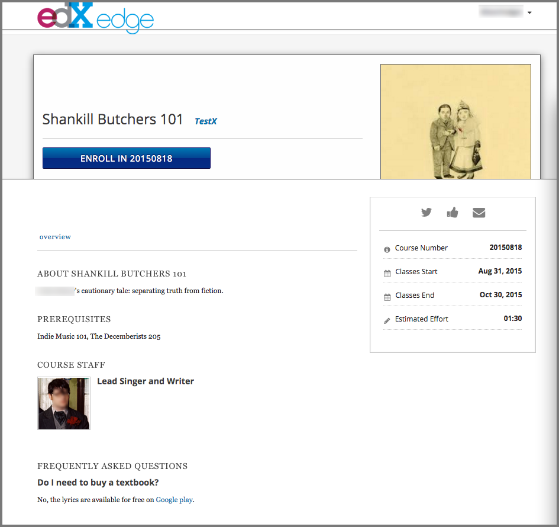

.. _Creating a Course About Page:

############################
Creating a Course About Page
############################

The course About page, sometimes called the course summary page, provides
information about your course to learners. In addition to the course
:ref:`start and end dates<Scheduling Your Course>` and an overview of course
objectives, the About page can include information such as a course
description with course prerequisites, requirements, and team biographies.
Learners can see the About page before they enroll in the course, and
might decide to enroll based on the content of the page.

You enter the information for the About page in Studio. For more information,
see :ref:`Adding Information to the Course About Page`.

.. note::
  If the CourseTalk widget is enabled for your instance of the Open edX
  platform, the About page for every course also includes the CourseTalk
  widget. Learners who have enrolled in your course use this widget to write
  reviews of your course on the **Home** page in the LMS. These reviews are
  then visible on the course About page. For more information, see
  :ref:`installation:Add CourseTalk`.

.. contents::
  :local:
  :depth: 1

.. _Adding Information to the Course About Page:

*******************************************
Adding Information to the Course About Page
*******************************************

You add the contents of your course About page in Studio.

.. _Describe Your Course:

=======================
Describe Your Course
=======================

Learners see a description of your course on the course About page, under the
heading "About this course". For more information about creating an effective
course description, see :ref:`Course Description`.

To provide a description for your course, follow these steps.

#. On the **Settings** menu, select **Schedule & Details**.

#. Scroll down to the **Introducing Your Course** section, then locate the
   **Course Overview** field.

   .. image:: ../../../../shared/images/course_overview.png
    :alt: Image of the HTML course description.
    :width: 600

#. Overwrite the content as needed for your course, following the directions in
   the boilerplate text. Do not edit HTML tags. For a template that includes
   these placeholders, see the :ref:`A Template For Course Overview`.

#. To test how the description will appear to learners, from the text that
   follows the **Course Overview** field select **your course summary page**.

#. Select **Save Changes**.

.. _Add a Course Image:

=======================
Add a Course Image
=======================

For more information about effective course images, see :ref:`Course and Program Images and Videos`.

To add a course image, follow these steps.

#. From the **Settings** menu, select **Schedule & Details**.

#. In the **Course Image** section, select **Upload Course Image**, and then
   follow the prompts to find and upload your image. To specify an image that
   has already been :ref:`added to the course<Add Files to a Course>`, select
   **files & uploads**.

   When you make changes on this page, a panel with options to save or cancel
   your work appears.

#. Select **Save Changes**.

#. View your dashboard to test how the image will appear to learners.

.. _Add an About Video:

===========================
Adding a Course About Video
===========================

To upload a course About video, follow these steps.

#. Upload the video file to YouTube. Make note of the code that appears
   between **watch?v=** and **&feature** in the URL. This code appears in
   the green box below.

   .. image:: ../../../../shared/images/youtube_vequals_URL.png
    :alt: A YouTube video with the code between watch?v= and &feature
     indicated.

#. From the **Settings** menu, select **Schedule & Details**.

#. Scroll down to the **Course Introduction Video** section.

#. In the field below the video box, enter the YouTube video ID (the code you
   copied in step 1). When you add the code, the video automatically loads in
   the video box.

#. When you make changes, a **Save Changes** option appears at the bottom
   right of the page. Select **Save Changes** after you add the course
   video.

#. View your course About page to test how the video will appear to
   learners.

.. _Set Course Effort Expectations:

==============================
Set Course Effort Expectations
==============================

The estimated effort that the course requires appears in the course About
page.

To set the hours and minutes a week estimate in Studio, follow these steps.

#. From the **Settings** menu, select **Schedule & Details**.

#. In the **Requirements** section, locate the **Hours of Effort per Week**
   field.

#. Enter the number of hours you expect learners to work on this course each
   week.

   When you make changes on this page, a panel with options to save or cancel
   your work appears.

#. Select **Save Changes**.

#. View your course About page to test how the requirements will appear to
   learners.

.. _A Template For Course Overview:

==============================
Course Overview Template
==============================

Replace the placeholders in the following template with information for your
course.

.. code-block:: html

  <section class="about">
    <h2>About This Course</h2>
    
Include your long course description here. The long course description
    should contain 150-400 words.

    
This is paragraph 2 of the long course description. Add more paragraphs
    as needed. Make sure to enclose them in paragraph tags.

  </section>
  <section class="prerequisites">
    <h2>Requirements</h2>
    
Add information about the skills and knowledge students need to take
    this course.

  </section>
  <section class="course-staff">
    <h2>Course Team</h2>
    <article class="teacher">
      

        
      

      <h3>Team Member #1</h3>
      
Biography of course team member #1

    </article>
    <article class="teacher">
      

        
      

      <h3>Team Member #2</h3>
      
Biography of course team member #2

    </article>
  </section>
  <section class="faq">
    <section class="responses">
      <h2>Frequently Asked Questions</h2>
      <article class="response">
        <h3>Do I need to buy a textbook?</h3>
        
No, a free online version of Chemistry: Principles, Patterns, and
        Applications, First Edition by Bruce Averill and Patricia Eldredge
        will be available, though you can purchase a printed version (
        published by FlatWorld Knowledge) if you’d like.

      </article>
      <article class="response">
        <h3>Question #2</h3>
        
Your answer would be displayed here.

      </article>
    </section>
  </section>

.. include:: ../../../../links/links.rst
