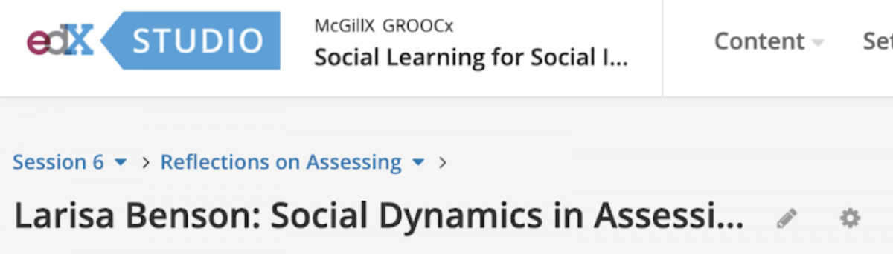
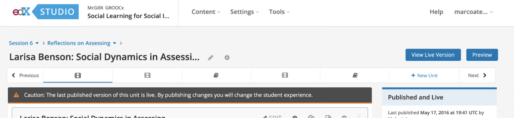
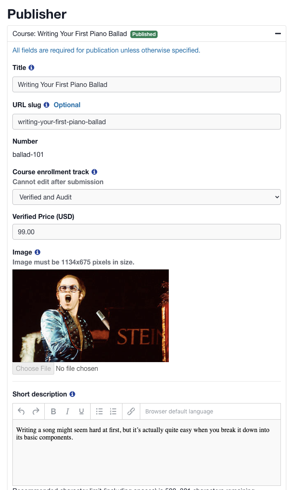
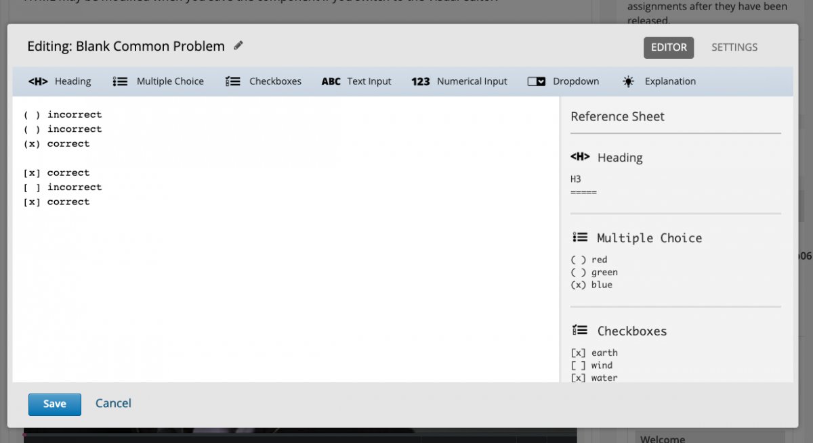

.. _juniper_educator:

###########################################
Juniper release notes: Educator Experiences
###########################################

===========================
Course Authoring Experience
===========================

Content Authoring
-----------------

Course Outline & Structure
..........................

**In-Context Unit Naming:** You can now quickly edit the name of a Unit page
directly from the Studio Course Outline page, speeding up course scaffolding
and authoring in this quick edit page where changes are applied without needing
a draft or publish step, as is the case on the Unit Pages today. 

Learning Sequence Authoring
...........................

**Educator Jump Navigation:** To start, we plan to update the Unit page title
area breadcrumbs adding dropdowns that let you jump to other sections or
subsections.  Read more about this at `Viewing the Unit Page`__.

.. __: https://edx.readthedocs.io/projects/open-edx-building-and-running-a-course/en/latest/developing_course/course_units.html#viewing-the-unit-page

**Educator Sequence Bar Navigation:** On the unit page we introduced a
representation of the learner-facing sequence bar, helping authors more quickly
jump to the unit pages before or after the one they are currently authoring.
Additionally educators can create new units within this learning sequence bar.
This update replaces the navigation links that were further down the page on
the right sidebar of Unit pages.

**Studio & Insights Links within Learner Experience Instructor Toolbar:** The
instructor bar in the learner experience now includes two actions linking to
Studio and Insights. As part of this work we have removed the “View Unit in
Studio” button that rendered previously in the content area of the learner
experience.  

**Display Name Editing:** Courses often contain thousands of components, so any
time we can save course authors on an individual component we expect that time
will add up! We have updated the component editing window to allow you to edit
the component display name in context in the title area of the window, meaning
you no longer have to go to the Settings tab to update the display name. 

Course Enrollment Page Publishing
.................................

**Publisher Tool:**  A `new micro-frontend`__ was built which integrates with
the course discovery and ecommerce services as a new catalog publishing and
configuration tool. Publisher can be used to manage ecommerce products,
marketing information, and the creation of new course runs within a course.
This tool also replaces the course creation action within Studio when enabled,
and a link to the Publisher tool settings for a given course run is also
provided with the authoring experience.

.. __: https://github.com/openedx/frontend-app-publisher

Weekly Highlights
.................

This feature has been updated to also be available for both self and instructor
paced courses. This change will make it easier for course teams to pre-program
weekly communications in their Instructor-paced courses. Weekly nudging emails
are disabled for instructor-paced courses if they choose to use weekly
highlight emails. This is to prevent duplication and oversaturation of
communications from course teams, making each email more valuable to the
learner.

..
    Content Logic & Sequencing
    --------------------------

    Group Configuration & Visibility Rules
    Internal Notes on v1.1 Content: 
    Feature Based Enrollment Overrides?
    Special Exams: Proctored
    Internal Notes on v1.1 Content: 
    Deen - Streamlined proctoring integration
    Deen - Proctortrack* (link here)
    RPNow Virtual Proctoring Update (V4)* (link here)
    Proctor track integration (Master's, MM) / New proctoring tools/vendor?
    Deen - Proctoring API changes? 
    Special Exams: Timed
    Internal Notes on v1.1 Content: 
    Deen - any changes here to timed exam config that made it to Juniper? 

Learning App Configuration
--------------------------

Teams Configuration
...................

**Team Management Improvements:** The Teams application has been improved to
provide a way for instructors to create and manage teams and team memberships
within the Teams application. Staff can also bulk view, create, and modify team
membership via CSV download and upload. 

Staff (including TAs) can now create “instructor managed” team sets. Only
course staff can create teams and manage team membership in these team sets.
Students cannot create teams or leave and/or join teams in these team sets.

**Configuring Private & Public Team Sets:** Instructor managed team sets can
either be Public or Private. In Public team sets, students can view other
teams, their membership, and their team discussions. In Private team sets,
students cannot view other teams, nor the membership or discussions of these
other teams. 

..
    Course Asset Management
    -----------------------

    Internal Notes on v1.1 Content: 
    Seth - updates here? Cut from v1 but I suspect video management might have had updates? 

..
    Settings & Configuration
    ------------------------

    Schedule & Dates
    Internal Notes on v1.1 Content: 
    Kaitlin / Shelby - updates here?  Perhaps nothing in Juniper? (improvements to scheduler + relative data storage?
    Enrollment Tracks / Commerce
    Internal Notes on v1.1 Content:  
    FBE Exception documented? 
    Special Exam Providers
    Internal Notes on v1.1 Content: 
    Deen - any changes here to proctoring config that made it to Juniper? 

=============================
Content Blocks & Interactives
=============================

Core Course Content Blocks
--------------------------

..
    Video Block
    ...........

    **HLS Support and Delivery:** Through our video pipeline, videos now support
    HTTP Live Streaming (HLS), enabling learners to view videos at the quality
    level that fits their current network bandwidth for both the web and mobile
    application video experiences. 

Common Problem Blocks
.....................

**Problem Markdown Editor Learnability & Usability:** Problem authoring can be
time intensive, especially as problems become more complex through hints,
feedback, and explanations. We have updated the icons in the common problem
markdown editor so that the name of the problem template is more obvious. For
new course authors we also hope this improves the learnability of this markdown
editor. 

**Problem Markdown Reference Sheet Visibility:** Another set of changes relates
to the markdown reference sheet, which will now be visible by default. As part
of this change we have made the component editing modal window larger, ensuring
the authoring space was not reduced with the addition of the reference sheet.

        visible on the side.

Open Response Assessments
.........................

**Improved File Management:** It is now possible to incrementally add and
delete individual files while submitting an ORA problem that has file upload
enabled. Learners also can see the file name for their uploads as well. As part
of this work the file size limit was increased to 500MB (from 20MB). 

**Staff Graded Team Assignments:** As referenced in the Teams application area,
instructors can now create team ORA assignments whereby groups of students can
collaborate on the assignment and submit a team response, and instructors then
evaluate the submission and assign a team grade. Staff can enable an Open
Response Assessment for team submission and attach a team set to it. Only
students on a team in that team set will be able to submit a response. One team
member can submit for the group. Staff can assign the same assignment grade and
provide the same feedback to all members of a team. 

..
    Drag Drop Block
    ...............

    Summary of changes coming from OpenCraft

External Content Blocks
-----------------------

LTI Content Block
.................

**Interactive Content Icon:** Previously LTI blocks were not recognized as
graded content, meaning that in the learning sequence bar LTI unit pages were
represented as text. The icon is now the problem / assessment icon which makes
it clear that this page in the sequence bar has interactive content. 

**LTI v1.3 Base Implementation:** Initial support behind the scenes for LTI
v1.3 was merged in March, though the full functionality requires updating the
LTI consumer xblock to its June release to fully support this additional
specification option. Once enabled educators will be able to configure LTI
ungraded components relying on the LTI v1.3 specification. Koa will include
full LTI v1.3 support including graded passback support. 

**LTI Plugin Parameters:** A community contribution added the ability to pass
extra parameters such as the team and cohort of a student to the LTI provider,
enabling rich integrations that take into this metadata in their embedded
learning content.

Custom External Graders
.......................

**Python 3 Support for CodeJail:** ...

Specialized, Experimental, or Advanced Blocks
---------------------------------------------

Additional details to follow about improvements to this platform area. 

..
    Internal Notes on v1.1 Content: 
    Deen - Zoom integration (Master's, MM), edX Live* (?) 
    Deen - Staff Grade Points
    xBlock/LTI-backed course extensions and applications

=================
Course Operations
=================

Grading Tools
-------------

Additional details to follow about improvements to this platform area. 

..
    Internal Notes on v1.1 Content: 
    Deen - Gradebook v2 (only available for MM and Masters)*
    Deen - Bulk grade mgmt
    Deen - Master's grade API 

Course Team Roles & Membership
..............................

**Institutional Course Data Researchers:** A new role has been created to
provide more granular controls for the ability to download learner information
through reports in the data downloads tab. When the role is enabled, you must
have this role configured to see the Instructor Dashboard’s Data Downloads tab.
This new role of “data researcher” can be set at either the organization level
in Django admin or for a specific course run in the Course Team Management area
of the Membership tab of the Instructor Dashboard by a course administrator.

Data Downloads
..............

**Offline Report Download Age-Off:** A change was introduced to the table of
downloaded instructor dashboard reports that seeks to limit the offline use and
presence of learner data. After 90 days downloaded reports are now removed from
the list of report downloads and a summary of this policy change is described
near the downloaded report area. 

============================
Program Operations / Console
============================

Additional details to follow about improvements to this platform area. 

..
    All sub-sections here cut from Juniper Release Notes v1
    Program Console
    Internal Notes on v1.1 Content: 
    Deen - Console + Registrar Service / 
    Deen - Program Bulk Enrollments
    Program - Intervention report
    ADA Accommodations*
    Degree Lead Management
    Internal Notes on v1.1 Content: 
    Deen - Lead Management for Masters Programs*
    Enhanced Lead management
    Program Data Downloads
    Internal Notes on v1.1 Content: 
    Deen - Program Analytics*
