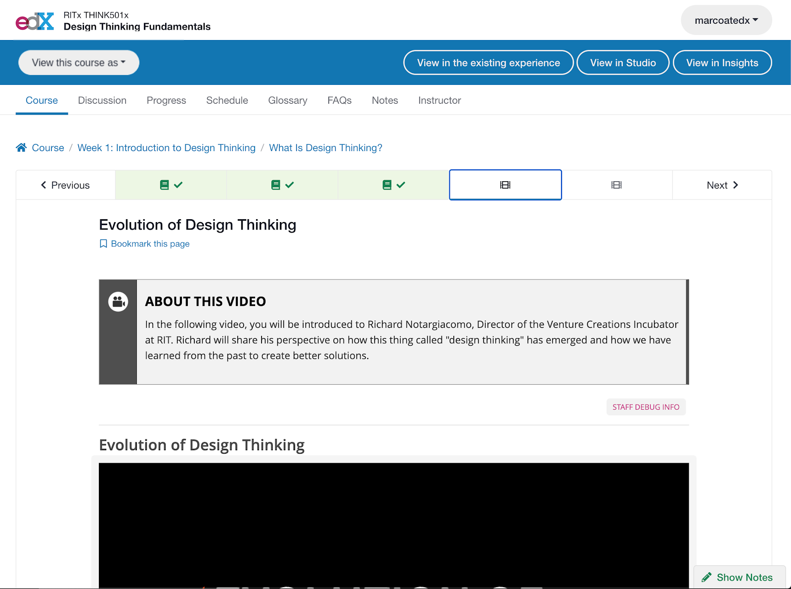
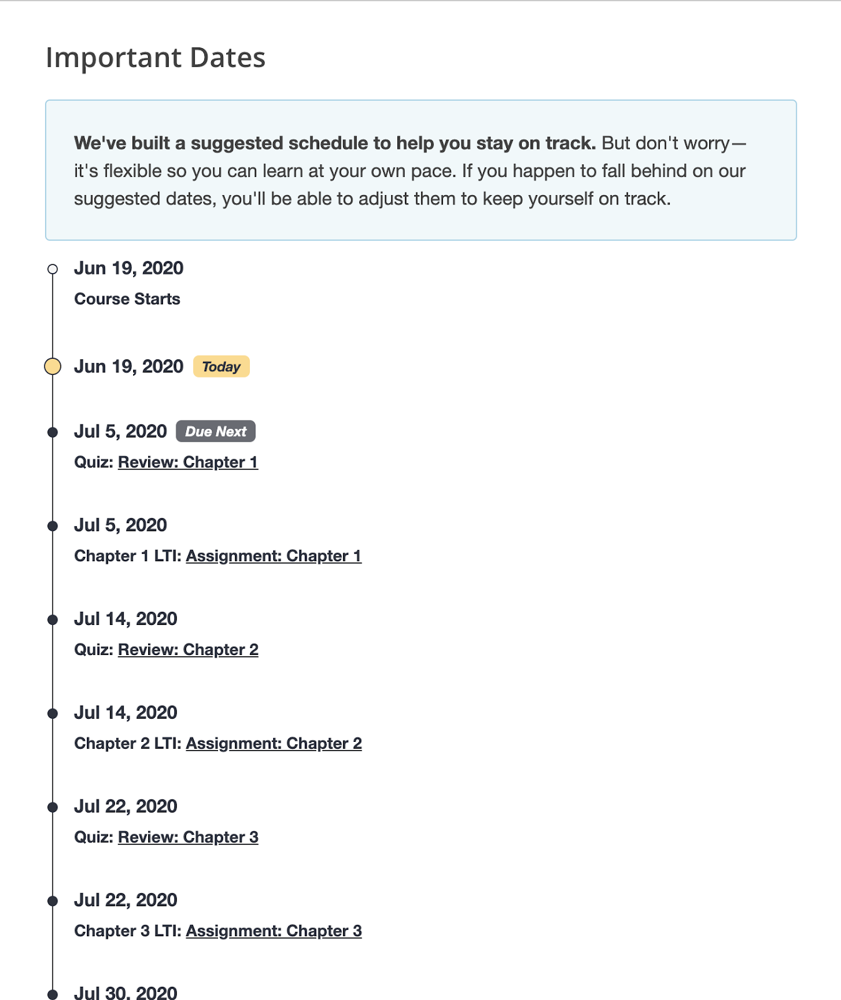
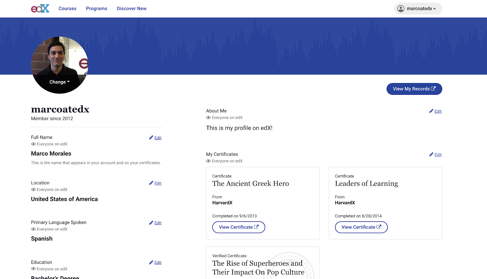
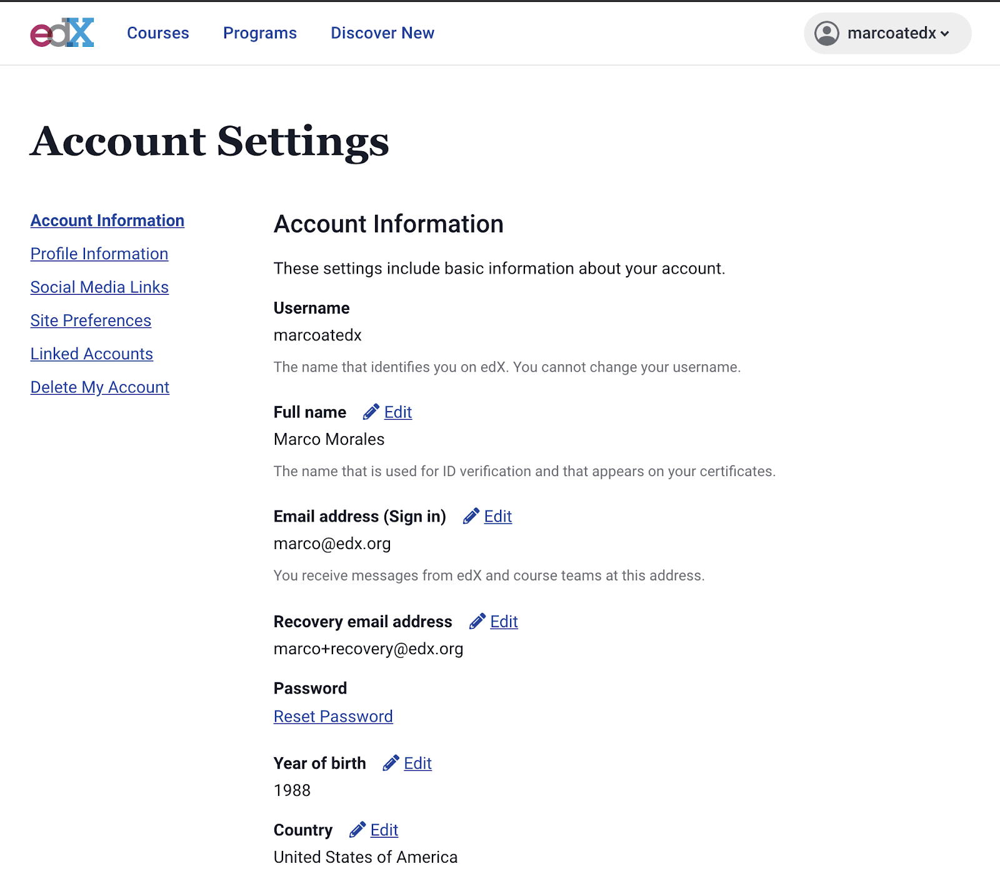
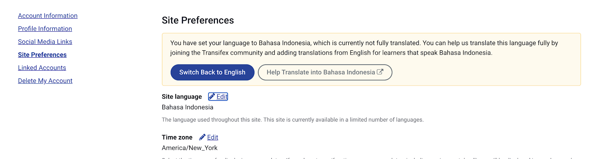
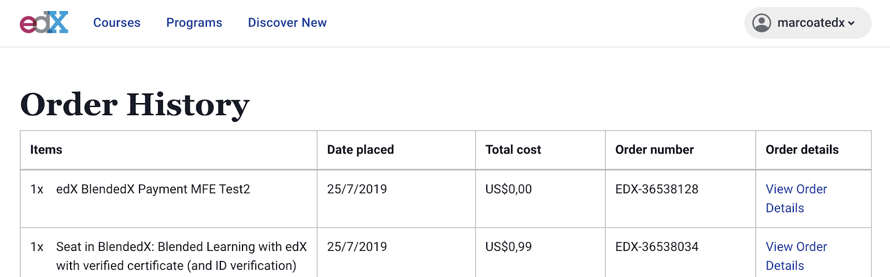
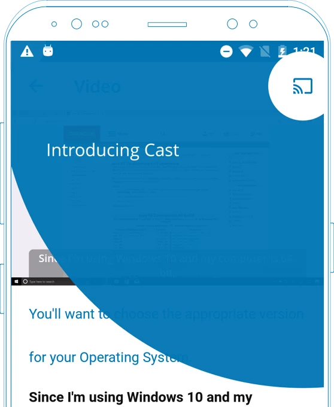
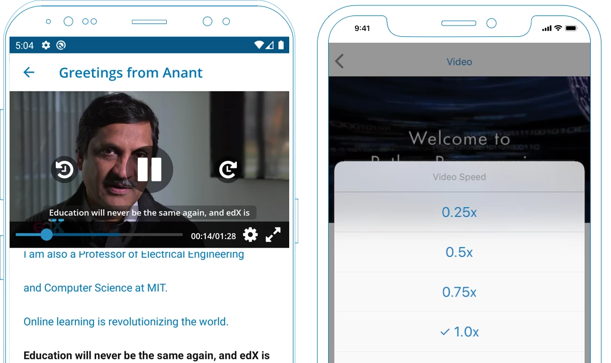

.. _juniper_learner:

##########################################
Juniper release notes: Learner Experiences
##########################################

=================
Course Experience
=================

Primary Content Experience
--------------------------

Course Home Experience
......................

**Course Outline Depth:** For some time the course outline was shifted to
rendering sections, subsections, and units. The resulting outline was long and
provided detail that learners could navigate once in a subsection (aka learning
sequence). The course outline has been updated to once again show only sections
and subsections. As a part of this change we have made sure graded subsections
show an icon to better highlight that they are graded. 

**Graded Question Count:** The course outline now highlights the number of
graded questions included in a subsection. The additional information added to
the outline will allow learners to understand at-a-glance, and better plan for,
the effort of a given graded assignment or exam.

Learning Sequence Experience
............................

**New Course MFE:** A major platform change for the learner experiences comes
in the form of a new `micro-frontend application`__ to modernize the course
learning experience. The primary Juniper focus of this application is an
overhaul of the learning sequence experience, though we anticipate other views
like Course Home will eventually also make their way into this new application. 

.. __: https://edx.readthedocs.io/projects/open-edx-release-notes/en/latest/juniper.html

**Content iFrames & Security:** This new micro-frontend is easier to update
and configure than our previous experience, helping support lower development
times and easier configuration and extension. The new experience uses iframes
to render content into the application, as a side-effect does limit the ability
to use Javascript on the page to interact with elements outside of the content
frame, like the navigation or other areas of the page. The use of iframes here
improves site security and code sandboxing, helping ensure stability for
learners on the new application. 

**Course Home Clarity:** A home icon was also introduced to the breadcrumbs to
reinforce the Course tab as the main home page for the course. Learners will
still be able to click the top level course tab as well to get back to the
Course Home.

**Responsive Sequence Bar:** The learning sequence bar is now a bit smarter in
how it responds to screen size and length of learning sequences. When learning
sequences have too many items to properly render the icons and completion
status, or when you are viewing the course on a mobile browser,  we replace the
sequence bar with a dropdown that retains the unit type icon and completion
status. 

**Next & Previous Action Clarity:** The next and previous buttons at the bottom
of the page will be easier to spot and click, focusing on the “Next” action.
Additionally, a message is shown to learners when they have reached the end of
the course rather than show the next button at the bottom of the page.

Visual Course Progress
......................

In the new course experience, visual completion is more obvious for learners
with the elevated use of green checkmarks to convey progress. A recent
completion logic change also reduced the time necessary to trigger completion
on HTML only pages, an issue that was limiting some learners from being able to
trigger completion rules.

..
    Special Exams Experience
    ........................

    Internal Notes on v1.1 Content: 
    Various end learner proctoring changes? Or cover in educator experience since most changes are behind the scenes?

Course Dates & Milestones
.........................

**Personalized Schedules:** Though self-paced courses offer the significant
advantage of being available on-demand when a learner wants them, they lack the
supporting structure of schedules and timelines. We’ve introduced some of this
structure and accountability by creating personalized schedules for each
learner, and clearly showing the suggested dates and timeline in the course.
These schedules are based off of the course’s expected duration, and customized
for each learner’s unique start date. We’ve also retained the advantages of
flexibility --- should a learner fall behind, they are able to adjust their
schedule. 

**Full Page Dates View:** To improve visibility into dates for both
instructor-paced and self-paced courses, we have also introduced a dedicated
full page view of critical course dates. Each relevant milestone will also link
directly to the subsection, to provide easy and quick access. In the future, we
will also add the ability for learners to add these dates to their calendars.

        suggested schedule to help you stay on track. But don't worry: it's flexible
        so you can learn at your own pace."

Content Search Tools
....................

A key improvement to the learner experience is course content search and the
ability for learners to find results within their courses. This existing
feature has been updated to support improved scaling and performance for larger
courses and instances. 

Course Welcome & Updates
........................

The visual height of welcome messages has been capped, adding a “Show More”
action for longer posts that might have previously obscured view of the course
outline for new learners visiting a course. 

Learning Apps: Individual Support
---------------------------------

**Bookmarks:** Bookmarks were updated to also work in the new learner sequence
experience. 

**Notes App:** The Notes tool that enables / disables notes in a learning
sequence was updated to work for the new course micro-frontend.

**Calculator:** The Calculator experience has been updated to work in the new
course micro-frontend, making the markdown help tools easier to use and read as
well. 

Learning Apps: Peer & Community
-------------------------------

Discussion Forum Application
............................

**Discussion Forum Daily Digests + Notifier Service:** We have marked this
service as deprecated and disabled the discussion forum daily digest feature.
We may revisit or reimplement this in the future but the experience was used by
few learners, and the service that powered this capability was prone to
instability and needed many upgrades to remain viable. 

Teams Application
.................

**Team Assignments:** Educators can now create team assignments, enabling a
team of students to collaborate on the assignment and submit a team response
through a linked Open Response Assessment problem. (Additional details in the
Open Response Assessment updates section).  

**Private Teams:** In addition, new “private team sets” allow for teams that
are not viewable to non-team members and which automatically create discussion
forums for these teams that are visible only to team members and course staff.

**Multiple Team Support:** It is now possible for learners to join more than
one team in a given course. 

==========================
Identity and Account Tools
==========================

Learner Profile
---------------

A complete rewrite of the learner profile experience was completed during this
time. The new experience is powered by a `new micro-frontend`__ and the latest
version of our `Paragon component library`_. If configured, this new experience
provides improved visibility controls and new optional fields that can be shown
on the profile. 

.. __: https://github.com/openedx/frontend-app-profile

.. _Paragon component library: https://edx.github.io/paragon/

One aspect of the earlier learner profiles that was not migrated to the new
experience is the  badges experience section of the profile. We are hoping to
update our credentials infrastructure which will enable us to add these back
into the updated learner profile in the future. 

Account Settings
----------------

**New Account Experience:** A new `Account micro-frontend`__ now also powers an
updated account settings experience on the platform. The account settings page
can now be more easily extended with plugins, and all features available on the
previous account settings page were migrated over to this updated experience. 

.. __: https://github.com/openedx/frontend-app-account

**Beta Language Support:** Learners can now go to their account settings to see
a longer list of languages including both fully supported languages and any
languages enabled as beta languages. When learners select a beta (aka partially
supported) language they are shown a message letting them know the language is
partially translated. Additionally there are buttons to quickly switch back to
their previous language or head to Transifex to join the open community that
helps us translate the platform if they would like to contribute. Included
below are visuals of the language dropdown as well as an example message shown
for partially supported languages. 

        Bahasa Indonesia, saying it is not fully translated.

**Recovery Email Address:** A new field was added to the account settings
allowing learners to specify a recovery email address, which also needs to be
activated to be set fully. When this feature is enabled, learners also see a
message on their learner dashboard notifying them that their recovery email
address has not been set or fully activated yet. 

..
    Identity Verification
    .....................

    Internal Notes on v1.1 Content: 
    Any Updates? Deen to check, it may not have made it into Juniper
 

Order History
.............

A `new micro-frontend`__ was created for ecommerce related views, and the Order
History page experience was added to this new tool. The new experience shows
all ecommerce orders with links to the order detail pages. 

.. __: https://github.com/openedx/frontend-app-ecommerce

===========
Credentials
===========

Assignment Badges
-----------------

As called out in the Learner Profile section, this feature has not been
migrated to the new learner profile experience and is thus no longer visible to
learners on their profile. We hope this feature will be supported again in the
future once we have completed infrastructure investments into our Credential
service, but we do not plan to make future changes to the current badge related
edx-platform code.

..
    ===================
    Programs Experience
    ===================

    Programs Home
    -------------

    Internal Notes on v1.1 Content: Updates TBD  

    Degree Home
    -----------

    Internal Notes on v1.1 Content: 
    - Master's learner portal & SSO integration
        - Master's integrations/student portal/SSO (Master's only) / Portal designer to allow for configurable landing pages (like for Master's programs)
    - Portal Designer*

    Program Tools
    -------------

    Internal Notes on v1.1 Content: 
    - Deen - Master's face to face interaction (edXLive)
    - Deen - Master's program structure, student access, enrollment API

===========================
Upgrade Messaging & Payment
===========================

Course Upsell Messaging and Payment
-----------------------------------

**New Payment MFE:** A `new micro-frontend`__ has been created and scoped just
to the checkout experience for those using the ecommerce tools and services
built into the platform. This application supports Apple Pay, PayPal, and
Cybersource credit card payment types. The improved checkout flow should
improve checkout conversion rates and provide avenues for other plugins or
integrations as well. 

.. __: https://github.com/openedx/frontend-app-payment

**First Purchase Discount** is a configurable time-limited offer to extend to
first time purchasers. In our experimentation, we have found a meaningful
impact to initial purchase rate.

..
    Internal Notes on v1.1 Content: 
    Cut FBE + First Purchase Discount, can add back in if details are ready for support / use

    Bundled Program Purchases and Redemption
    Internal Notes on v1.1 Content: 
    Deen - Program upsell 
    Coupon Codes (Enrollment, Redemption)
    Internal Notes on v1.1 Content: 
    Deen - Updates TBD

===================
Mobile Applications
===================

The first Mobile app release to be packaged from the start of Juniper was
`version 2.18`_, and `version 2.22`_ was released May 13th, 2020 before Juniper
was cut. Additional details about Mobile App changes can also be found in the
`Mobile Versions / Releases page`__. 

.. _version 2.18: https://openedx.atlassian.net/wiki/spaces/LEARNER/pages/931693785/Mobile+Release%3A+2.18
.. _version 2.22: https://openedx.atlassian.net/wiki/spaces/LEARNER/pages/1373306918/Mobile+Release+2.22
.. __: https://openedx.atlassian.net/wiki/spaces/LEARNER/pages/129335440/Mobile%2BVersions%2BReleases

Mobile App Discovery
--------------------

**Deep-Linking Integration with Branch.io:** Our applications can optionally be
configured now to integrate with Branch.io, a tool that can `deep-link`_ new or
existing app users directly to the app store listing and then through to the
specific view screen from the app, improving retention especially for new
users. 

.. _deep-link: https://branch.io/what-is-deep-linking/

**Journeys Integration with Branch.io:** Additionally through Branch.io, we are
using their `Journey banners`_ to let learners on mobile web browsers quickly
jump into the application or discover that mobile apps are an option for new
learners. 

.. _Journey banners: https://branch.io/journeys/

**Mobile Application Login & Registration:** A number of improvements were made
to registration and login including the addition of Microsoft Login, reflecting
updated branding requirements for Google and Facebook, as well as some updates
around the mobile app refresh token that was forcing learners to log back in
when not expected.

Mobile Course Experience
------------------------

My Courses Mobile View
......................

**iPad Experience for My Courses Screen:**  Layout improvements to the My
Courses view now show course cards in a grid, taking advantage of the iPad
screen size in both portrait and landscape viewing modes.                                                                                                                                                                                                                                                                                                      

Mobile App Upgrade Experience
.............................

Subsections and components within the
content experience now provide clarity on when certain content is not
visible in the currently active learner enrollment track.  Similarly for
courses that use feature based enrollments where content access is set to
expire some time after enrollment, this date is now more clear for learners
within the courses and on course cards in the My Courses view.  

Mobile App Video Experience
...........................

**Chromecast Support:** We have added support for Chromecast to the videos
across both the iOS and Android applications. You can cast your videos now to
other displays that support chromecast, including many Smart TVs. 

        upper-right.

**In-App Youtube Player:** We also now have the ability to render Youtube
videos within the application experience thanks to a major contribution.
Previously learners would be redirected out of the application to view videos
on Youtube. 
 
**Removed Legacy Videos Support:** We have removed the code for the legacy My
Videos page, instead shifting to a new videos tab view within the course
experience.  

**Increased Video Playback Speed Options:** We have added the ability for the
mobile applications to adjust playback speed for videos, allowing for
adjustments between 0.25x and 2x video speed. 

**Video Rewind and Forward Controls:** Additional rewind and forward controls
have been added to the video screen when learners tap on the video to expose
play pause and video settings actions. A rewind action takes learners back 10
seconds and they can also jump forward 15 seconds at a time. 

**Offline SD Card Storage Support:** You can now choose to have your videos
stored on an SD card if you have one, with a new setting shown in the settings
area if an SD card is detected on your Android device. 

**Mobile App Video HLS Delivery:** Through our video pipeline, mobile app
videos now support HTTP Live Streaming (HLS), enabling learners to view videos
at the quality level that fits their current network bandwidth for the and
mobile application video experiences. 

Mobile Content Discovery
------------------------

**Program & Degree Discovery:** You can now search programs and degrees using
the mobile application, additional views added to our existing discovery
experience that loads webviews for each of these discovery facets. 

App-Wide Learner Improvements
-----------------------------

**Expanded Language Support:** Across both iOS and Android applications, you
can now view the app experience in French, German, Portuguese, Chinese,
Japanese, Vietnamese, Arabic, and Turkish. iOS also additionally includes
support for Hebrew. The application uses your device language to specify this
setting.

**Firebase Analytics & Push Notifications:** The application has removed its
support for the now deprecated Fabric analytics tool, and we have made it easy
to toggle on Firebase as an analytics and push notification provider. 

**iOS Dynamic Type Support:** In support of improved text accessibility our iOS
application supports dynamic type across the application, helping with
legibility of text for learners with varying text sizes configured on their iOS
devices. 

**Webview Performance: Discovery + Content Views:** We have done some work to
improve xBlock caching and preloading for the mobile web views rendered in the
application. For Android this also includes hardware acceleration for Mobile
App web views.
