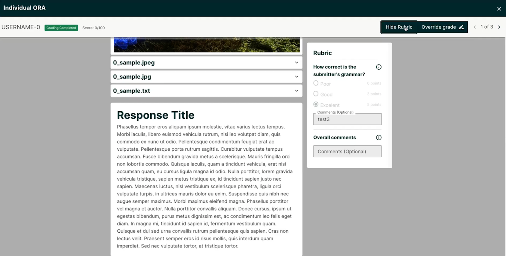

.. _Open edX Olive Release:

######################
Open edX Olive Release
######################

These are the release notes for the Olive release, the 15th community release of the Open edX Platform, spanning changes from April 11 2022 to October 11 2022.  You can also review details about `earlier releases`_ or learn more about the `Open edX Platform`_.

.. _earlier releases: https://edx.readthedocs.io/projects/edx-developer-docs/en/latest/named_releases.html
.. _Open edX Platform: https://openedx.org

.. contents::
 :depth: 1
 :local:

Breaking Changes
================

All grades are persisted
------------------------
The Persistent Grades feature was added as an option in Hawthorne. Legacy, non-persistent grades were deprecated in Nutmeg. Now, persistent grades are required. If you have not turned on persistent grades in your installation yet, when you upgrade to Olive, grades will not appear on learners' Progress page or in data downloads. You must follow the instructions in `Migrating to Persistent Grading`_ for grades to appear. This process can take a significant amount of time, depending on how many graded problems are in your installation, and how long those grades take to be calculated. It can be run before or after the upgrade.

.. _Migrating to Persistent Grading: https://openedx.atlassian.net/wiki/spaces/AC/pages/755171487/Migrating+to+Persistent+Grading

Learning MFE is now required
----------------------------
The Learning Micro Frontend (MFE) is no longer optional, and must be run as part of your installation now. It has been the default since the Maple release, with a setting that allowed for opting out. The setting :code:`courseware.use_legacy_frontend` has been removed. (See Deprecations & Removals below for more).

JWT access tokens expire in 1 hour
----------------------------------
The default expiration for JWT access tokens is now one hour. This default setting can be overriden by setting :code:`JWT_ACCESS_TOKEN_EXPIRE_SECONDS`.

Learner Experiences
===================

Learner Records Micro-frontend (MFE)
------------------------------------

- The Learner records MFE is now available as an optional frontend for the Credentials application (or is it a plugin?). See the `Learner Records MFE README`_ for configuration information.
- Even if the the Learner Records MFE is turned on, the old UI is still used for public links to records. This will be changed in the Palm release. (this may have been backported already)
- Masquerading is not supported, as it is in the legacy UI. Use the "Records" tab in support tools as an alternative.

.. _Learner Records MFE README: https://github.com/openedx/frontend-app-learner-record/blob/open-release/olive.master/README.rst

Other Learner Experience changes
--------------------------------

- add reset option to the Randomized Content Block. See this `video demo <https://www.loom.com/share/91b7224cb8a74cf2891a240b6e4fb8c6>`_ for the new user experience.
- tabs will now display in a consistent order: Course, Progress, Dates, Discussion, etc.
- "Live" tab displayed on course when live content is enabled (for example, Zoom or Big Blue Button)

Instructor Experiences
======================

.. _course-authoring-mfe:

Course Authoring Micro-frontend (MFE)
-------------------------------------

The Course Authoring Micro-frontend is included in the Olive release. It is enabled by setting :code:`COURSE_AUTHORING_MICROFRONTEND_URL`. The Course Authoring MFE allows for several new features, including :ref:`pages-and-resources` in Studio, and a new :ref:`text-html-editor` and a new :ref:`video-editor`. More details on each of these features are below, and in the `Course Authoring MFE README`_.

.. _Course Authoring MFE README: https://github.com/openedx/frontend-app-course-authoring/blob/open-release/olive.master/README.rst

.. _pages-and-resources:

Pages & Resources
-----------------

Part of the :ref:`course-authoring-mfe`, when this feature is enabled course authors can now get to the Pages & Resources view from the Content menu (it replaces the "Pages" menu item). This is a modular interface for settings for various course applications and tools. Depending on which ones are enabled, they can include Progress, Discussion, Notes, Wiki, Calculator, Custom pages, Proctoring, and Textbooks. The waffle flag :code:`discussions.pages_and_resources_mfe` must be set to enable access to Pages & Resources.

.. image:: ../images/olive/page_and_resources_view.png
    :alt: new Pages & Resources page in Studio

.. _text-html-editor:

Text / HTML Editor
-------------------

Part of the :ref:`course-authoring-mfe` the new Text Editor includes updates that make it even easier to include text and images in your course content. Set the waffle flag :code:`new_core_editors.use_new_text_editor` to enable it. The newly updated editor:

- makes incorporating special characters and symbols easier,
- adds undo / redo actions,
- lets you author tables without going into HTML mode,
- makes emoticons easy to include
- and more.

.. _video-editor:

Video Editor
------------
Part of the :ref:`course-authoring-mfe`, the new video editor can be enabled by setting the waffle flag :code:`new_core_editors.use_new_text_editor`

.. image:: ../images/olive/video_editor_view.png
    :alt: new Video Editor in Studio

Discussions
-----------

- Send out an email to discussion moderators when a content (post/response/comment) is reported. See https://github.com/openedx/edx-platform/pull/30276 for more details.

Other Instructor Experience changes
-----------------------------------

- Course authors can optionally set Randomized Content Blocks to display a reset option. This allows students to use the Randomize Content Block as a problem-bank for studying. See this `video demo <https://www.loom.com/share/91b7224cb8a74cf2891a240b6e4fb8c6>`_ for the new user experience.
- upgraded TinyMCE version 4 to version 5.5.1.

ORA Grading Micro-frontend (MFE)
--------------------------------

ORA Staff Grading App is a staff grading experience for Open Response Assessments (ORAs). This experience was designed to streamline the grading process and enable richer previews of submission content. To enable it, you must set :code:`ORA_GRADING_MICROFRONTEND_URL` and enable the waffle flag :code:`openresponseassessment.enhanced_staff_grader`. When enabled, ORAs with a staff grading step will link to this new MFE when clicking "Grade Available Responses" from the ORA or link in the instructor dashboard. See the `Staff Grading for Open Response Assignments`_ section of Building and Running an edX Course for usage information.

.. _Staff Grading for Open Response Assignments: https://edx.readthedocs.io/projects/edx-partner-course-staff/en/latest/exercises_tools/open_response_assessments/ORA_Staff_Grading.html#staff-grading-for-open-response-assignments

Administrators & Operators
==========================

- fixed a performance issue when using multiple themes when running in docker. Now by using LRU cache when searching themes,  the performance was improved.

Pre-Alpha Features
-------------------

The following Micro-frontends (MFEs) are in a "pre-alpha" state. They exist on GitHub but are not yet supported in Tutor. Additionally, they may lack key features such as support for theming, internationalization, and path-based deployments. We include mention of them because we expect all of them to be supported in the next release, Palm.

* `Authentication Micro-Frontend (MFE)`_
* `Discussions Micro-Frontend (MFE)`_
* `Learner Record Micro-Frontend (MFE)`_

.. _Authentication Micro-Frontend (MFE): https://github.com/openedx/frontend-app-authn
.. _Discussions Micro-Frontend (MFE): https://github.com/openedx/frontend-app-discussions
.. _Learner Record Micro-Frontend (MFE): https://github.com/openedx/frontend-app-learner-record

Settings and Toggles
--------------------

New settings and toggles added since the Nutmeg release:

* `CUSTOM_RESOURCE_TEMPLATES_DIRECTORY <https://edx.readthedocs.io/projects/edx-platform-technical/en/latest/settings.html#setting-CUSTOM_RESOURCE_TEMPLATES_DIRECTORY>`_
* `LEARNER_RECORD_MFE_URL <https://edx.readthedocs.io/projects/edx-platform-technical/en/latest/settings.html#setting-LEARNER_RECORD_MFE_URL>`_
* `MFE_CONFIG <https://edx.readthedocs.io/projects/edx-platform-technical/en/latest/settings.html#setting-MFE_CONFIG>`_
* `MFE_CONFIG_API_CACHE_TIMEOUT <https://edx.readthedocs.io/projects/edx-platform-technical/en/latest/settings.html#setting-MFE_CONFIG_API_CACHE_TIMEOUT>`_
* `MFE_CONFIG_OVERRIDES <https://edx.readthedocs.io/projects/edx-platform-technical/en/latest/settings.html#setting-MFE_CONFIG_OVERRIDES>`_
* `PREPEND_LOCALE_PATHS <https://edx.readthedocs.io/projects/edx-platform-technical/en/latest/settings.html#setting-PREPEND_LOCALE_PATHS>`_
* `DISABLE_JWT_FOR_MOBILE <https://edx.readthedocs.io/projects/edx-platform-technical/en/latest/featuretoggles.html#featuretoggle-DISABLE_JWT_FOR_MOBILE>`_
* `DISABLE_UNENROLLMENT <https://edx.readthedocs.io/projects/edx-platform-technical/en/latest/featuretoggles.html#featuretoggle-FEATURES['DISABLE_UNENROLLMENT']>`_
* `ENABLE_DYNAMIC_REGISTRATION_FIELDS <https://edx.readthedocs.io/projects/edx-platform-technical/en/latest/featuretoggles.html#featuretoggle-ENABLE_DYNAMIC_REGISTRATION_FIELDS>`_
* `ENABLE_MFE_CONFIG_API <https://edx.readthedocs.io/projects/edx-platform-technical/en/latest/featuretoggles.html#featuretoggle-ENABLE_MFE_CONFIG_API>`_
* `ENABLE_CERTIFICATES_IDV_REQUIREMENT <https://edx.readthedocs.io/projects/edx-platform-technical/en/latest/featuretoggles.html#featuretoggle-FEATURES['ENABLE_CERTIFICATES_IDV_REQUIREMENT']>`_
* `SEND_CATALOG_INFO_SIGNAL <https://edx.readthedocs.io/projects/edx-platform-technical/en/latest/featuretoggles.html#featuretoggle-SEND_CATALOG_INFO_SIGNAL>`_
* `contentstore.bypass_olx_failure <https://edx.readthedocs.io/projects/edx-platform-technical/en/latest/featuretoggles.html#featuretoggle-contentstore.bypass_olx_failure>`_
* `contentstore.individualize_anonymous_user_id <https://edx.readthedocs.io/projects/edx-platform-technical/en/latest/featuretoggles.html#featuretoggle-contentstore.individualize_anonymous_user_id>`_
* `contentstore.split_library_on_studio_dashboard <https://edx.readthedocs.io/projects/edx-platform-technical/en/latest/featuretoggles.html#featuretoggle-contentstore.split_library_on_studio_dashboard>`_
* `course_apps.exams_ida <https://edx.readthedocs.io/projects/edx-platform-technical/en/latest/featuretoggles.html#featuretoggle-course_apps.exams_ida>`_
* `course_live.enable_big_blue_button <https://edx.readthedocs.io/projects/edx-platform-technical/en/latest/featuretoggles.html#featuretoggle-course_live.enable_big_blue_button>`_
* `credentials.use_learner_record_mfe <https://edx.readthedocs.io/projects/edx-platform-technical/en/latest/featuretoggles.html#featuretoggle-credentials.use_learner_record_mfe>`_
* `discussions.enable_learners_stats <https://edx.readthedocs.io/projects/edx-platform-technical/en/latest/featuretoggles.html#featuretoggle-discussions.enable_learners_stats>`_
* `discussions.enable_reported_content_email_notifications <https://edx.readthedocs.io/projects/edx-platform-technical/en/latest/featuretoggles.html#featuretoggle-discussions.enable_reported_content_email_notifications>`_
* `student.enable_2u_recommendations <https://edx.readthedocs.io/projects/edx-platform-technical/en/latest/featuretoggles.html#featuretoggle-student.enable_2u_recommendations>`_
* `student.enable_amplitude_recommendations <https://edx.readthedocs.io/projects/edx-platform-technical/en/latest/featuretoggles.html#featuretoggle-student.enable_amplitude_recommendations>`_
* `student.enable_enrollment_confirmation_email <https://edx.readthedocs.io/projects/edx-platform-technical/en/latest/featuretoggles.html#featuretoggle-student.enable_enrollment_confirmation_email>`_

The following settings were removed:

* :code:`DISCUSSIONS_MFE_FEEDBACK_URL`
* :code:`bypass_olx_failure`
* :code:`PersistentGradesEnabledFlag.enabled`
* :code:`course_experience.latest_update`
* :code:`course_home.course_home_use_legacy_frontend`
* :code:`courseware.microfrontend_course_team_preview`
* :code:`courseware.use_legacy_frontend`
* :code:`grades.assume_zero_grade_if_absent`
* :code:`split_library_on_studio_dashboard`

Deprecations & Removals
=======================

Legacy learner experience
-------------------------
A few pieces of the legacy/deprecated learner experience have been removed entirely in favor of the Learning MFE experience, specifically, the outline, dates, and courseware tabs. Instead, you must run the Learning MFE, and its tabs will be used. Along with the legacy code, a few old waffle flags have been removed: :code:`course_experience.latest_update`, :code:`course_experience.show_upgrade_msg_on_course_home`, :code:`course_experience.upgrade_deadline_message`, :code:`course_home.course_home_use_legacy_frontend`, :code:`courseware.microfrontend_course_team_preview`, and :code:`courseware.use_legacy_frontend`.

Legacy OLX attributes translations removed
------------------------------------------
Support for importing courses that use obsolete XML attributes has been removed. Courses with attributes :code:`slug`, :code:`name` in course tags, :code:`display_name` and :code:`id` in discussion tags and :code:`attempts` in problem tags, will no longer import properly. A simple import and export before upgrading will update the XML attributes. See https://github.com/openedx/public-engineering/issues/74 for more details.

Other removals/deprecations
---------------------------

- The `Molecular Structure Problem type`_ was removed.
- `Removed the last vestiges of the save option from anonymous_id_for_user`_.
- `Removed Learner View in Insights, Data Pipeline and API`_
- The `frontend-learner-portal-base repo`_ has been archived. Any MFEs that depend on this library have been updated.
- `Removed dependency in ecommerce application on deprecated v1 catalog API`_.
- Removed all dependencies on `django-ratelimit-backend library`_.

.. _frontend-learner-portal-base repo: https://github.com/openedx-unsupported/frontend-learner-portal-base
.. _Removed the last vestiges of the save option from anonymous_id_for_user: https://github.com/openedx/public-engineering/issues/35
.. _Removed Learner View in Insights, Data Pipeline and API: https://github.com/openedx/public-engineering/issues/36kl
.. _Molecular Structure Problem type: https://github.com/openedx/public-engineering/issues/14
.. _Removed dependency in ecommerce application on deprecated v1 catalog API: https://github.com/openedx/public-engineering/issues/61
.. _django-ratelimit-backend library: https://github.com/openedx/public-engineering/issues/12

.. include:: links.rst
.. include:: ../../links/links.rst

Developer Experience
====================

Hooks Extension Framework
-------------------------

As part of `OEP-55`_, the following filters were added in olive:

- :code:`certificate.render.started`
- :code:`cohort.change.requested.v1`
- :code:`course_about.render.started`
- :code:`dashboard.render.started.v1`
- :code:`certificate.creation.requested`

.. _OEP-55: https://open-edx-proposals.readthedocs.io/en/latest/architectural-decisions/oep-0050-hooks-extension-framework.html

Researcher & Data Experiences
=============================

* Added analytics event on recommendation course click, :code:`edx.bi.user.recommended.course.click`
* added tracking event on learner search (in discussions)
* added many new discussion events, including :code:`edx.forum.thread.edited`, :code:`edx.forum.response.edited`, :code:`edx.forum.comment.edited`

