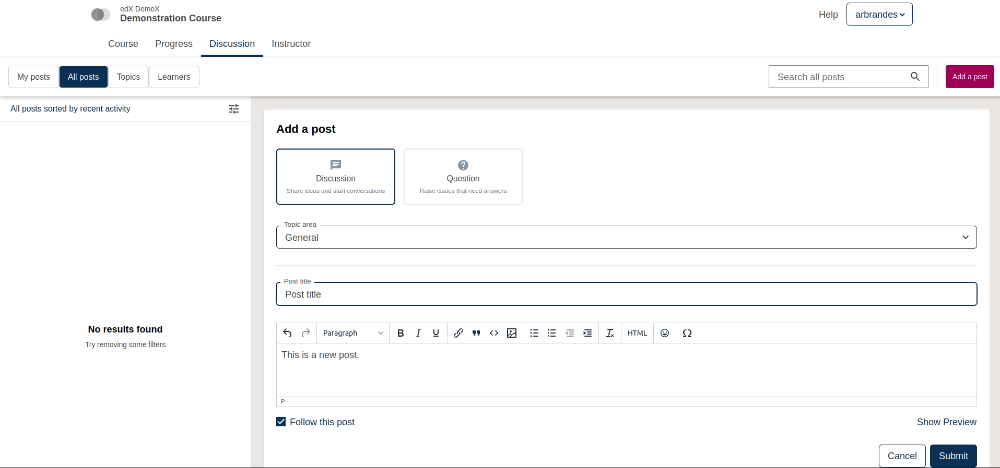
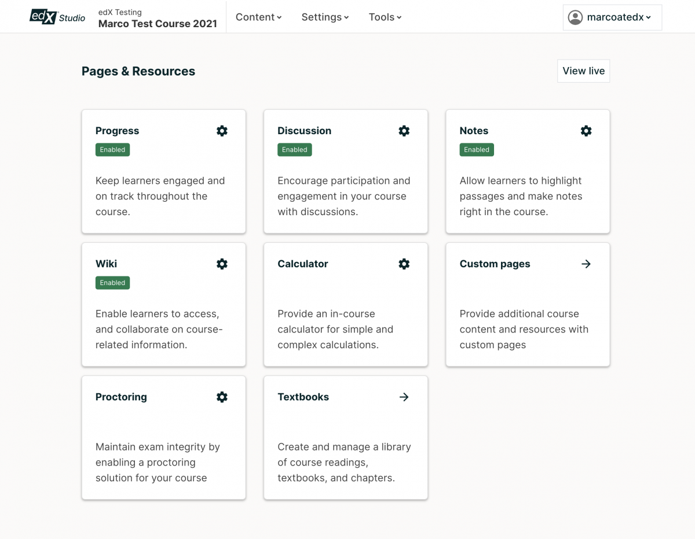
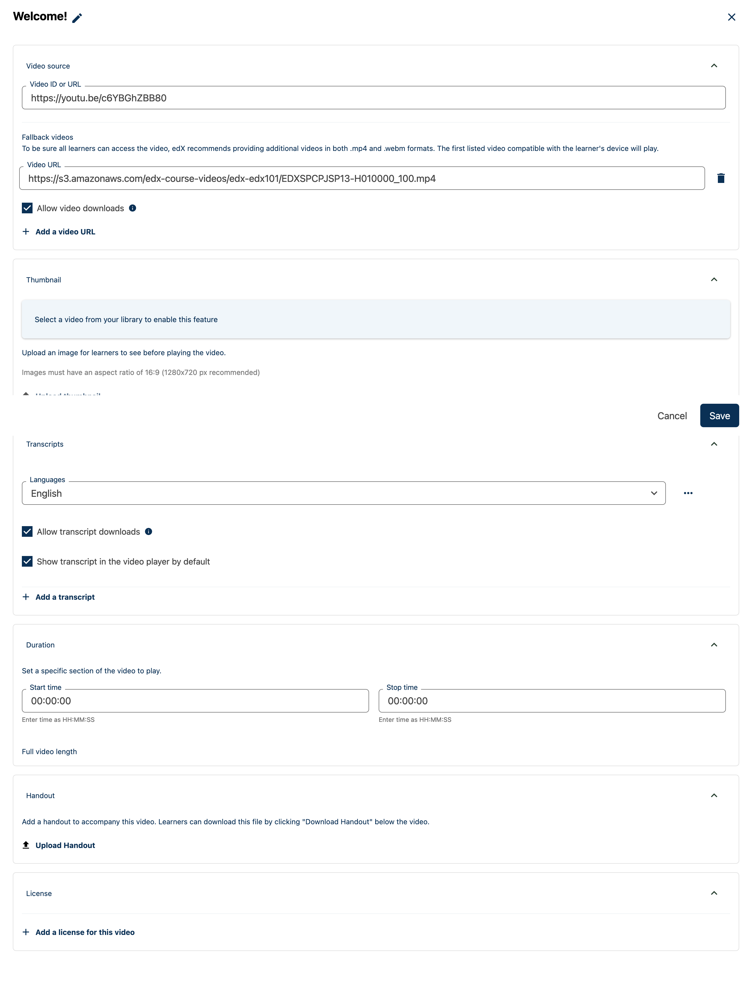

.. _Open edX Olive Release:

######################
Open edX Olive Release
######################

These are the release notes for the Olive release, the 15th community release of the Open edX Platform, spanning changes from April 11 2022 to October 11 2022.  You can also review details about `earlier releases`_ or learn more about the `Open edX Platform`_.

.. _earlier releases: https://edx.readthedocs.io/projects/edx-developer-docs/en/latest/named_releases.html
.. _Open edX Platform: https://openedx.org

.. contents::
 :depth: 1
 :local:

Breaking Changes
================

All grades are persisted
------------------------
The Persistent Grades feature was added as an option in Hawthorne. Legacy, non-persistent grades were deprecated in Nutmeg and enabled by default in Tutor. Now, persistent grades are required.

If you are not using Tutor, and have not turned on persistent grades in your installation yet, grades will disappear from learners' Progress pages and in Instructors' data downloads when you upgrade to Olive. You must follow the instructions in `Migrating to Persistent Grading`_ for grades to appear. This process can take a significant amount of time, depending on how many graded problems are in your installation, and how long those grades take to be calculated. While we recommend this be run before the upgrade, to ensure learners experience no disruptions to their Progress pages, it will still work if it is run after the upgrade.

.. _Migrating to Persistent Grading: https://openedx.atlassian.net/wiki/spaces/AC/pages/755171487/Migrating+to+Persistent+Grading

Learning MFE is now required
----------------------------
The Learning Micro Frontend (MFE) is no longer optional, and must be run as part of your installation. In Tutor, this means that the `MFE plugin`_ must be installed and enabled.

.. _MFE Plugin: https://github.com/overhangio/tutor-mfe

The Learning MFE has been the default since the Maple release, with a setting that allowed for opting out. The setting :code:`courseware.use_legacy_frontend` has been removed. (See :ref:`deprecations-and-removals` for more).

JWT access tokens expire in 1 hour
----------------------------------
The default expiration for JWT access tokens was changed from ten hours to one hour. This default setting can be overriden now, by setting :code:`JWT_ACCESS_TOKEN_EXPIRE_SECONDS`.

Learner Experiences
===================

Authentication Micro-frontend (MFE)
-----------------------------------

The Authentication MFE is responsible for the login, registration and password reset functionality. It is enabled by default in Olive and has all the same features as the legacy login and registration pages. You can revert to the legacy experience by setting :code:`FEATURES['ENABLE_AUTHN_MICROFRONTEND']` to False. Although the deprecation process for the legacy experiences has not yet started, they could be removed as soon as the next release, Palm.

There are a number of settings that affect this experience. See the `Authentication MFE README`_ for a complete list.

.. _Authentication MFE README: https://github.com/openedx/frontend-app-authn/blob/master/README.rst

Discussions Micro-frontend (MFE)
--------------------------------

The Discussions MFE is included in the Olive release and enabled by default. You can control which learners will see it with the waffle flag :code:`discussions.enable_discussions_mfe`. To configure course discussions, the :ref:`course-authoring-mfe` must be enabled as well. Although the deprecation process for the legacy discussion experiences has not yet started, they could be removed as soon as the next release, Palm.

See the `New discussions forum experience wiki page`_ for a detailed explanation of new and improved functionality.

Known issues: Discussions MFE (rendered in Discussions tab) uses tinyMCE v5 which is a different text editor compared to the in-line discussions. As a result, there are some incompatibilities:

#. Hyperlinks created in MFE do not appear in in-line discussions
#. Images uploaded in MFE do not appear in in-line discussions in some cases
#. Code formatted in MFE does not appear formatted in in-line discussions

.. _New discussions forum experience wiki page: https://openedx.atlassian.net/wiki/spaces/COMM/pages/3509551260/New+discussions+forum+experience+-+Course+teams+and+moderators

Learner Records Micro-frontend (MFE)
------------------------------------

- The Learner records MFE is now available as an optional frontend for the Credentials application. See the `Learner Records MFE README`_ for configuration information.
- Even if the the Learner Records MFE is turned on, the old UI is still used for public links to records. This will be changed in the Palm release.
- Masquerading is not supported, as it is in the legacy UI. Use the "Records" tab in support tools as an alternative.

.. _Learner Records MFE README: https://github.com/openedx/frontend-app-learner-record/blob/open-release/olive.master/README.rst

Other Learner Experience changes
--------------------------------

- add reset option to the Randomized Content Block. See this `video demo <https://www.loom.com/share/91b7224cb8a74cf2891a240b6e4fb8c6>`_ for the new user experience.
- "Live" tab displayed on course when live content is enabled (for example, Zoom or Big Blue Button)

Instructor Experiences
======================

.. _course-authoring-mfe:

Course Authoring Micro-frontend (MFE)
-------------------------------------

The Course Authoring Micro-frontend is included and enabled by default in the Olive release, but only the :ref:`pages-and-resources` feature is turned on. The MFE can be disabled by setting :code:`COURSE_AUTHORING_MICROFRONTEND_URL` to False. The Course Authoring MFE also allows for new course editors in Studio, although only the new :ref:`text-html-editor` is production ready. More details on each of these features are below, and in the `Course Authoring MFE README`_.

.. _Course Authoring MFE README: https://github.com/openedx/frontend-app-course-authoring/blob/open-release/olive.master/README.rst

.. _pages-and-resources:

Pages & Resources
-----------------

Part of the :ref:`course-authoring-mfe`, when this feature is enabled course authors can now get to the Pages & Resources view from the Content menu (it replaces the "Pages" menu item). This is a modular interface for settings for various course applications and tools. Depending on which ones are enabled, they can include Progress, Discussion, Notes, Wiki, Calculator, Custom pages, Proctoring, and Textbooks. The waffle flag :code:`discussions.pages_and_resources_mfe` must be set to enable access to Pages & Resources.

.. _text-html-editor:

Text / HTML Editor
-------------------

Part of the :ref:`course-authoring-mfe`, the new Text Editor includes updates that make it even easier to include text and images in your course content. Set the waffle flag :code:`new_core_editors.use_new_text_editor` to enable it. The newly updated editor:

- makes incorporating special characters and symbols easier,
- adds undo / redo actions,
- lets you author tables without going into HTML mode,
- makes emoticons easy to include,
- and more.

.. _video-editor:

Video Editor
------------

Part of the :ref:`course-authoring-mfe`, the new video editor is not production ready. If you want to experiment with it, you can enable it by setting the waffle flag :code:`new_core_editors.use_new_video_editor`

Discussions
-----------

An email can now be sent out to discussion moderators when content (post/response/comment) is reported.  To use it, set the :code:`discussions.enable_reported_content_email_notifications` waffle flag.  See https://github.com/openedx/edx-platform/pull/30276 for more details.

Other Instructor Experience changes
-----------------------------------

- Course authors can optionally set Randomized Content Blocks to display a reset option. This allows students to use the Randomize Content Block as a problem-bank for studying. See this `video demo <https://www.loom.com/share/91b7224cb8a74cf2891a240b6e4fb8c6>`_ for the new user experience.
- upgraded TinyMCE version 4 to version 5.5.1.

Administrators & Operators
==========================

Relevant changes to Tutor are in the `Tutor Changelog <https://github.com/overhangio/tutor/blob/olive/CHANGELOG.md>`_.

MFE runtime configuration support
---------------------------------

Where up until Nutmeg it was only possible to change a micro-frontend's settings at build time, it is now possible to do so at both server _and_ browser runtime via a new configuration mechanism.  In addition to the added convenience, this significantly reduces the frequency at which MFE container images need to be rebuilt.  Many operators will never have to build them to begin with, as pre-built ones can be (and are) provided, thus saving up precious time and resources on deployment.

This behavior is optional and controlled by the :code:`ENABLE_MFE_CONFIG_API` Django setting in the LMS, and the :code:`APP_ID` and :code:`MFE_CONFIG_API_URL` MFE build-time settings.  The actual runtime configuration can then be specified via the :code:`MFE_CONFIG` and :code:`MFE_CONFIG_OVERRIDES` variables in the LMS.  (These can also be overriden via `site configuration <https://edx.readthedocs.io/projects/edx-installing-configuring-and-running/en/latest/configuration/sites/configure_site.html>`_, with the effect that such configuration can be changed dynamically via the backing database.)  For more details, refer to the `corresponding architecture decision record <https://github.com/openedx/edx-platform/blob/open-release/olive.master/lms/djangoapps/mfe_config_api/docs/decisions/0001-mfe-config-api.rst>`_.

Upgrade note
~~~~~~~~~~~~

In Tutor, :code:`ENABLE_MFE_CONFIG_API` is enabled and used by default by all supported MFEs.  Because of it, a previously supported mechanism of setting some MFE settings via Tutor configuration is no longer available.  When upgrading from Nutmeg to Olive, the following variables can no longer be set via :code:`tutor config save --set`:

* Account MFE: :code:`COACHING_ENABLED` and :code:`ENABLE_DEMOGRAPHICS_COLLECTION`
* Profile MFE: :code:`ENABLE_LEARNER_RECORD_MFE`

Instead, the recommended way to modify MFE settings from Olive onwards is to write a Tutor plugin and use the :code:`openedx-lms-production-settings` and :code:`openedx-lms-development-settings` hooks to change :code:`MFE_CONFIG` or :code:`MFE_CONFIG_OVERRIDES` as needed.  For instance::

  MFE_CONFIG["PLATFORM_NAME"] = "My Awesome Platform"
  MFE_CONFIG_OVERRIDES["account"]["SITE_NAME"] = "My Awesome Site"

Also note that if you've maintained such a plugin prior to Olive, the following hooks are no longer available after the upgrade::

* :code:`mfe-env-production`
* :code:`mfe-env-development`

You must instead migrate your MFE settings to the LMS settings hooks as described above.
Other Operator Experience changes
---------------------------------
- fixed a performance issue when using multiple themes when running in docker. Now by using LRU cache when searching themes,  the performance was improved.

Pre-Alpha Features
-------------------

The following Micro-frontends (MFEs) are in a "pre-alpha" state. They exist on GitHub but are not yet supported in Tutor. Additionally, they may lack key features such as support for theming, internationalization, and path-based deployments. We include mention of them because we expect all of them to be supported in the next release, Palm.

* `Learner Record Micro-Frontend (MFE)`_
* `ORA Grading Micro-frontend (MFE)`_ `

.. _Learner Record Micro-Frontend (MFE): https://github.com/openedx/frontend-app-learner-record
.. _ORA Grading Micro-frontend (MFE): https://github.com/edx/frontend-app-ora-grading

Settings and Toggles
--------------------

New settings and toggles added since the Nutmeg release:

* `CUSTOM_RESOURCE_TEMPLATES_DIRECTORY <https://edx.readthedocs.io/projects/edx-platform-technical/en/latest/settings.html#setting-CUSTOM_RESOURCE_TEMPLATES_DIRECTORY>`_
* `LEARNER_RECORD_MFE_URL <https://edx.readthedocs.io/projects/edx-platform-technical/en/latest/settings.html#setting-LEARNER_RECORD_MFE_URL>`_
* `MFE_CONFIG <https://edx.readthedocs.io/projects/edx-platform-technical/en/latest/settings.html#setting-MFE_CONFIG>`_
* `MFE_CONFIG_API_CACHE_TIMEOUT <https://edx.readthedocs.io/projects/edx-platform-technical/en/latest/settings.html#setting-MFE_CONFIG_API_CACHE_TIMEOUT>`_
* `MFE_CONFIG_OVERRIDES <https://edx.readthedocs.io/projects/edx-platform-technical/en/latest/settings.html#setting-MFE_CONFIG_OVERRIDES>`_
* `PREPEND_LOCALE_PATHS <https://edx.readthedocs.io/projects/edx-platform-technical/en/latest/settings.html#setting-PREPEND_LOCALE_PATHS>`_
* `DISABLE_JWT_FOR_MOBILE <https://edx.readthedocs.io/projects/edx-platform-technical/en/latest/featuretoggles.html#featuretoggle-DISABLE_JWT_FOR_MOBILE>`_
* `DISABLE_UNENROLLMENT <https://edx.readthedocs.io/projects/edx-platform-technical/en/latest/featuretoggles.html#featuretoggle-FEATURES['DISABLE_UNENROLLMENT']>`_
* `ENABLE_DYNAMIC_REGISTRATION_FIELDS <https://edx.readthedocs.io/projects/edx-platform-technical/en/latest/featuretoggles.html#featuretoggle-ENABLE_DYNAMIC_REGISTRATION_FIELDS>`_
* `ENABLE_MFE_CONFIG_API <https://edx.readthedocs.io/projects/edx-platform-technical/en/latest/featuretoggles.html#featuretoggle-ENABLE_MFE_CONFIG_API>`_
* `ENABLE_CERTIFICATES_IDV_REQUIREMENT <https://edx.readthedocs.io/projects/edx-platform-technical/en/latest/featuretoggles.html#featuretoggle-FEATURES['ENABLE_CERTIFICATES_IDV_REQUIREMENT']>`_
* `SEND_CATALOG_INFO_SIGNAL <https://edx.readthedocs.io/projects/edx-platform-technical/en/latest/featuretoggles.html#featuretoggle-SEND_CATALOG_INFO_SIGNAL>`_
* `contentstore.bypass_olx_failure <https://edx.readthedocs.io/projects/edx-platform-technical/en/latest/featuretoggles.html#featuretoggle-contentstore.bypass_olx_failure>`_
* `contentstore.individualize_anonymous_user_id <https://edx.readthedocs.io/projects/edx-platform-technical/en/latest/featuretoggles.html#featuretoggle-contentstore.individualize_anonymous_user_id>`_
* `contentstore.split_library_on_studio_dashboard <https://edx.readthedocs.io/projects/edx-platform-technical/en/latest/featuretoggles.html#featuretoggle-contentstore.split_library_on_studio_dashboard>`_
* `course_apps.exams_ida <https://edx.readthedocs.io/projects/edx-platform-technical/en/latest/featuretoggles.html#featuretoggle-course_apps.exams_ida>`_
* `course_live.enable_big_blue_button <https://edx.readthedocs.io/projects/edx-platform-technical/en/latest/featuretoggles.html#featuretoggle-course_live.enable_big_blue_button>`_
* `credentials.use_learner_record_mfe <https://edx.readthedocs.io/projects/edx-platform-technical/en/latest/featuretoggles.html#featuretoggle-credentials.use_learner_record_mfe>`_
* `discussions.enable_learners_stats <https://edx.readthedocs.io/projects/edx-platform-technical/en/latest/featuretoggles.html#featuretoggle-discussions.enable_learners_stats>`_
* `discussions.enable_reported_content_email_notifications <https://edx.readthedocs.io/projects/edx-platform-technical/en/latest/featuretoggles.html#featuretoggle-discussions.enable_reported_content_email_notifications>`_
* `student.enable_2u_recommendations <https://edx.readthedocs.io/projects/edx-platform-technical/en/latest/featuretoggles.html#featuretoggle-student.enable_2u_recommendations>`_
* `student.enable_amplitude_recommendations <https://edx.readthedocs.io/projects/edx-platform-technical/en/latest/featuretoggles.html#featuretoggle-student.enable_amplitude_recommendations>`_
* `student.enable_enrollment_confirmation_email <https://edx.readthedocs.io/projects/edx-platform-technical/en/latest/featuretoggles.html#featuretoggle-student.enable_enrollment_confirmation_email>`_

The following settings were removed:

* :code:`DISCUSSIONS_MFE_FEEDBACK_URL`
* :code:`bypass_olx_failure`
* :code:`PersistentGradesEnabledFlag.enabled`
* :code:`course_experience.latest_update`
* :code:`course_home.course_home_use_legacy_frontend`
* :code:`courseware.microfrontend_course_team_preview`
* :code:`courseware.use_legacy_frontend`
* :code:`grades.assume_zero_grade_if_absent`
* :code:`split_library_on_studio_dashboard`

.. _deprecations-and-removals:

Deprecations & Removals
=======================

Legacy learner experience
-------------------------
A few pieces of the legacy/deprecated learner experience have been removed entirely in favor of the Learning MFE experience, specifically, the outline, dates, and courseware tabs. Instead, you must run the Learning MFE, and its tabs will be used. Along with the legacy code, a few old waffle flags have been removed: :code:`course_experience.latest_update`, :code:`course_experience.show_upgrade_msg_on_course_home`, :code:`course_experience.upgrade_deadline_message`, :code:`course_home.course_home_use_legacy_frontend`, :code:`courseware.microfrontend_course_team_preview`, and :code:`courseware.use_legacy_frontend`.

Legacy OLX attributes translations removed
------------------------------------------
Support for importing courses that use obsolete XML attributes has been removed. Courses with attributes :code:`slug`, :code:`name` in course tags, :code:`display_name` and :code:`id` in discussion tags and :code:`attempts` in problem tags, will no longer import properly. A simple import and export before upgrading will update the XML attributes. See https://github.com/openedx/public-engineering/issues/74 for more details.

Other removals/deprecations
---------------------------

- The `Molecular Structure Problem type`_ was removed.
- `Removed the last vestiges of the save option from anonymous_id_for_user`_.
- `Removed Learner View in Insights, Data Pipeline and API`_
- The `frontend-learner-portal-base repo`_ has been archived. Any MFEs that depend on this library have been updated.
- `Removed dependency in ecommerce application on deprecated v1 catalog API`_.
- Removed all dependencies on `django-ratelimit-backend library`_.

.. _frontend-learner-portal-base repo: https://github.com/openedx-unsupported/frontend-learner-portal-base
.. _Removed the last vestiges of the save option from anonymous_id_for_user: https://github.com/openedx/public-engineering/issues/35
.. _Removed Learner View in Insights, Data Pipeline and API: https://github.com/openedx/public-engineering/issues/36kl
.. _Molecular Structure Problem type: https://github.com/openedx/public-engineering/issues/14
.. _Removed dependency in ecommerce application on deprecated v1 catalog API: https://github.com/openedx/public-engineering/issues/61
.. _django-ratelimit-backend library: https://github.com/openedx/public-engineering/issues/12

.. include:: links.rst
.. include:: ../../links/links.rst

Developer Experience
====================

Open edX Test Course
--------------------

In order to make testing your Open edX installation easier, `this course and its associated libraries`_ aim to expose as many Open edX Studio & courseware features as possible. It does so by providing example usages of various block types and by enabling various features through Advanced Settings.

.. _this course and its associated libraries: https://github.com/openedx/openedx-test-course

Hooks Extension Framework
-------------------------

As part of `OEP-50`_, the following filters were added in Olive:

- :code:`certificate.render.started`
- :code:`cohort.change.requested.v1`
- :code:`course_about.render.started`
- :code:`dashboard.render.started.v1`
- :code:`certificate.creation.requested`

.. _OEP-50: https://open-edx-proposals.readthedocs.io/en/latest/architectural-decisions/oep-0050-hooks-extension-framework.html

Researcher & Data Experiences
=============================

* Added analytics event on recommendation course click, :code:`edx.bi.user.recommended.course.click`
* added tracking event on learner search (in discussions)
* added many new discussion events, including :code:`edx.forum.thread.edited`, :code:`edx.forum.response.edited`, :code:`edx.forum.comment.edited`

Known Issues
============

- The Authentication MFE contains some hard-coded mentioned of edX. We expect these will be fixed by the time Olive.2 is released.
- The Zoom tool is not working. There is currently no plan for when this may be fixed.

