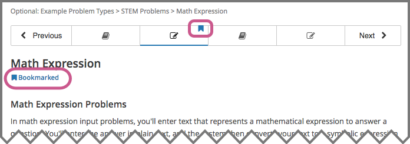
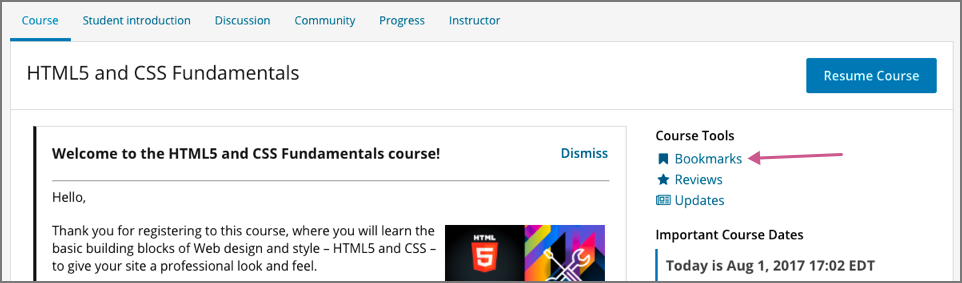

.. _SFD Bookmarks:

###########################
Bookmarking Course Content
###########################

To mark course content so that you can come back to it later, you can bookmark
any course page, up to a limit of 100 bookmarks for any one course.

The course material that you bookmark is identified in the unit navigation bar
on the **Course** page, or you can see a list of all of your bookmarks on the
**My Bookmarks** page.

For more information, see the following topics.

.. contents::
 :local:
 :depth: 1

***************************
Add or Remove a Bookmark
***************************

You can bookmark any page in the course. To bookmark a page, select
**Bookmark this page** under the name of the page.

.. image:: ../../shared/students/Images/SFD_Bkmk_UnitButton.png
 :width: 600
 :alt: A course page showing the Bookmark control.

After you add a bookmark, **Bookmark this page** changes to **Bookmarked**, and
an indicator appears in the unit navigation bar.

     navigation bar.

To remove a bookmark from a page, select **Bookmarked**.

After you remove a bookmark, **Bookmarked** changes back to **Bookmark this
page**, and the indicator disappears from the unit navigation bar.

***************************
View Your Bookmarks
***************************

As you go through the course, you can see which pages are bookmarked in the
unit navigation bar on the **Course** page. You can also see a list of all of
your bookmarks on the **My Bookmarks** page.

To access the **My Bookmarks** page, select **Bookmarks** on the course
page.

    heading in the sidebar.

The **My Bookmarks** page lists all of the pages you have bookmarked in the
course, with the most recently created ones at the top. This page includes the
location of the bookmarked material and the date that you added the bookmark.

To go to any bookmarked page, click anywhere in the box for that bookmark.
