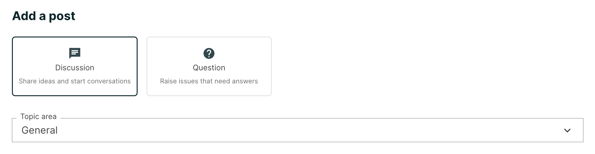
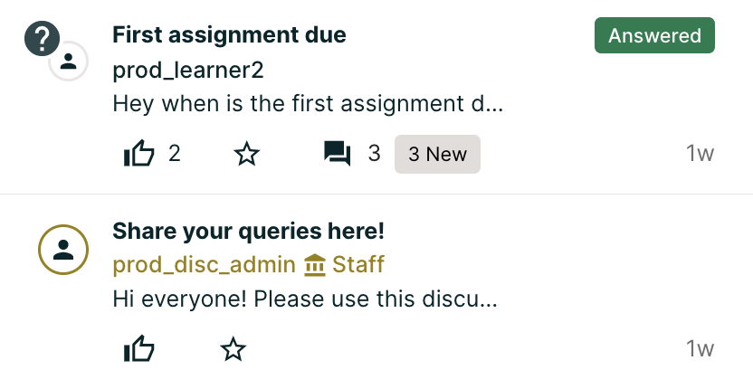
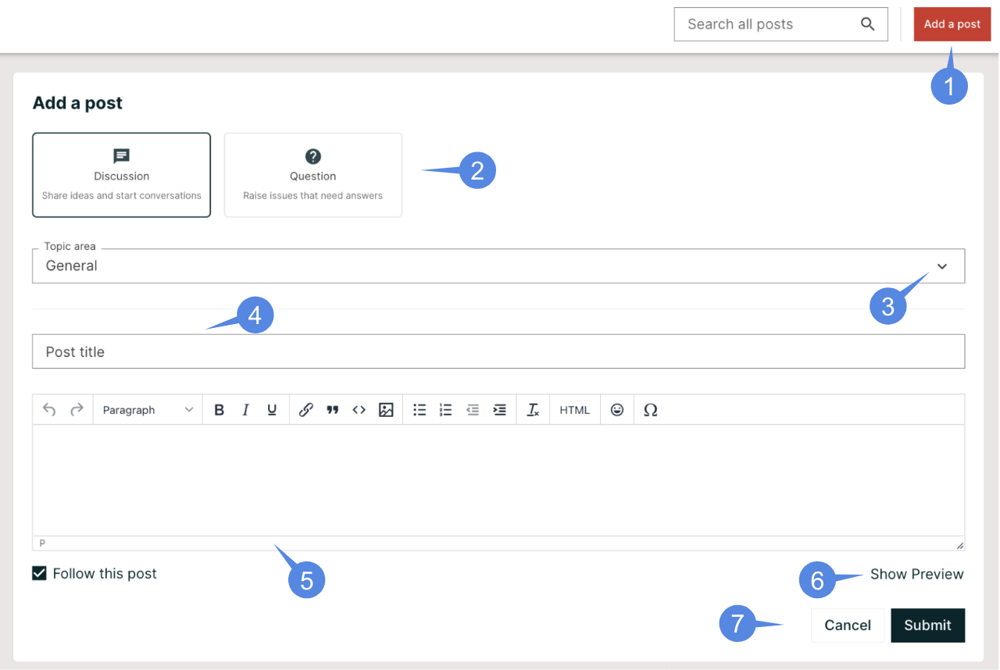
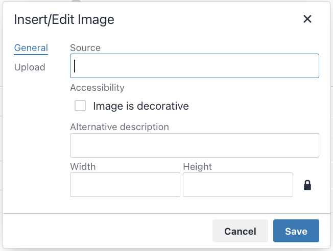
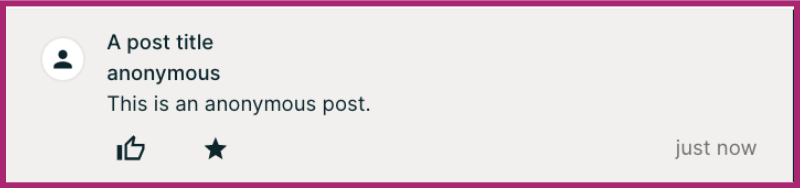
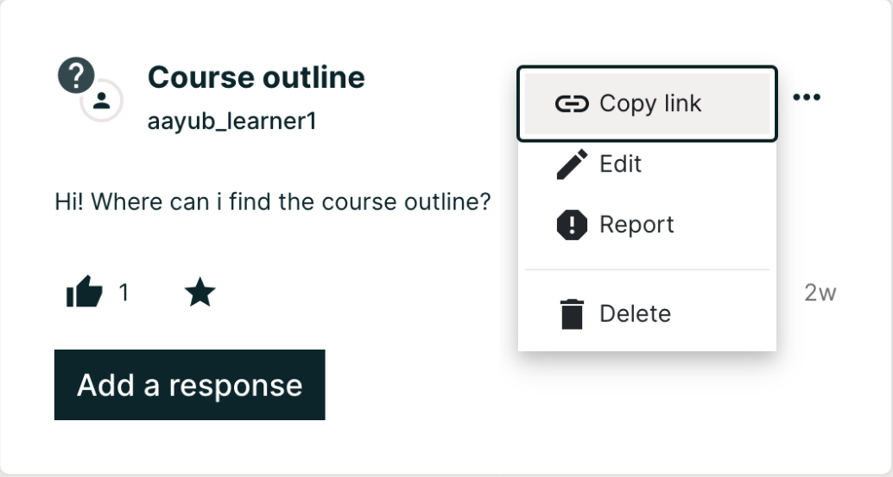

.. _Add or Edit a Contribution:

#######################################
Taking Part in Course Discussions
#######################################

This topic describes how to add, edit, and delete contributions to discussions.

.. contents::
  :local:
  :depth: 1

.. note::
  You might want to enter mathematical or scientific expressions in a
  discussion. For information about how to enter plain text so that it will
  appear as a formatted mathematical expression, see `Math Formatting in Course
  Discussions`_.

.. _Add a Post:

**************
Adding a Post
**************

When you add a post to a discussion in your course, you decide what type of
post to make and the topic of the post. For course-wide discussion topics, you
can add a post on the **Discussion** page. For content-specific discussions in
a course unit, you can add a post either on the **Discussion** page or
directly in the course unit.

.. _Determine Post Type:

**************************************************
Determining the Post Type: Discussion or Question
**************************************************

To make sure that other learners and the course team can find and respond to
your post, decide what type of post you want to make: either question or
discussion.

* A question post raises an issue so that the discussion moderation team or
  community can provide answers.

* A discussion post starts a conversation by sharing thoughts and
  reflections, and inviting community participation.

If you have any difficulty deciding which type of post you want to add, think
about whether you want to get concrete information (a question) or start an
open-ended conversation (a discussion). If you are asking a question about the
course and need an answer from the course team, be sure to create your post as
a question, so that the course team sees that a response is required and
responds appropriately.

After you make your post, on the **Discussion** page for your course, a
question mark next to the avatar identifies posts that ask questions.

.. note:: You can change the post type from discussion to question or vice
   versa at any time after you add your post. For more information, see
   :ref:`Edit or Delete`.

.. _Determine Post Topic:

****************************
Determining the Post Topic
****************************

Every post in the course discussions has an associated topic. The course team
creates the list of discussion topics for each course, and you choose a
topic from that list when you create your post. Before you add a post, you
should look through the list of topics in the course discussions so that you
can decide which topic is the most appropriate for your post. For more
information, see :ref:`Explore Posts`.

After you decide on a post type and topic, you can add your post on the
**Discussion** page or in the body of the course.

.. _Add a post on discussion page:

************************************
Add a Post on the Discussion Page
************************************

You can add a post for course-wide or content-specific discussion
topics on the **Discussion** page.

#. On the **Discussion** page, select **Add a Post**.

#. Determine the type of post you want to make, and select **Question** or
   **Discussion**.

#. Determine the most appropriate topic for adding your post to, and select the
   topic from the **Topic Area** list.

#. In the **Title** box, enter a short, descriptive title. The title is the
   part of your post that others see when they are browsing on the
   **Discussion** page or scrolling through one of the content-specific topics.

#. Enter the text of your post. To format the text or to add links or
   images, use the formatting options above the text box.

   Any text formatting or images that you add are only visible when others
   read your post in a web browser. The edX mobile app currently does
   not display added formatting or images.

#. Click the **Show preview** button to see how the post will look after submission.

#. Click the **Submit** if you are satisfied with the appearance or click **Cancel**, if you want to discard the post.

.. _Add image on a post:

============================================
Add Image to a Post on the Discussion Page
============================================

You can add an image while creating a post, click the **Insert image** button visible on top of the text editor to
open a dialog box. Use this dialog box to upload and resize the image and add description and source of the image.

.. note:: If you include an image with your post, include a description so
      that learners who use screen readers to access the course can understand
      the image's content and purpose. The description also displays in place
      of the image if problems occur with the image file. If the image has no
      functional purpose, leave the **Alternative description** field empty and check the  image is decorative.

      The maximum size for an uploaded file is 1 MB.

.. _add post in course unit:

************************************
Add a Post in a Course Unit
************************************

If you come to a discussion as you work through the units in your course, or
if you know where in the course a particular discussion originates, you can
add a post for that discussion from the unit in your course.

The following steps apply only to content-specific discussions.

#. Select **Course**.

#. Open the unit in the course that includes the discussion topic that you
   want to add a post to.

#. Select **Show Discussion** to read what others have already contributed to
   the conversation.

   The title and the first line of each post is shown in the list of posts.

   To read an entire post and view its responses and comments, select any part
   of the post preview.

#. To contribute a new post to the discussion, select **Add a Post** and follow
   the steps that you use to add a post to the discussion page. For more
   information, see :ref:`Add a post on discussion page`.

   To respond to an existing post or comment on an existing response, follow
   the steps described in :ref:`Add Response`.

.. _Add image in course unit:

=====================================
Add Image to a Post in a Course Unit
=====================================

You can add an image while creating a post, click the Insert image button visible on top of the
text editor to open a dialog box. Use this dialog box to upload and resize the image and add
description and source of the image.

.. note:: If you include an image with your post, include a description so that learners who use
    screen readers to access the course can understand the image’s content and purpose. The description
    also displays in place of the image if problems occur with the image file. If the image has no
    functional purpose, leave the **Image Description** field empty and select
    **This image is for decorative purposes only and does not require a description**.

    The maximum size for an uploaded file is 1 MB.

.. _Posting Anonymously:

**********************
Posting Anonymously
**********************

If the course staff has enabled the option to allow anonymous posts, a **Post anonymously to peers** checkbox
will be available under the field where you enter your text, when creating a post. When you post anonymously,
the course team and discussion moderation team including community TAs can see your username, but other learners cannot.

.. _Add response on discussion page:

**************************************************
Add a Response or Comment on the Discussion Page
**************************************************

You can add a response or comment to course-wide or content-specific
discussion topics on the **Discussion** page.

#. On the **Discussion** page, find the post that you want to contribute to. To
   help you decide where to add your thoughts, review the current responses and
   their comments.

   For more information about finding posts by searching, sorting, or using
   filters, see :ref:`Explore Posts`.

#. Add a response or comment.

  * To add a response to the post, select **Add A Response**. When you have
    finished entering your response, select **Submit**.

  * To add a comment to a response, move your cursor inside the **Add a
    comment** field below the response. When you have finished entering your
    comment, select **Submit**.

.. _add response in post in course unit:

*******************************************
Add a Response or Comment in a Course Unit
*******************************************

You can add a response or comment to a content-specific discussion
topic inside the course.

#. In the unit that contains the discussion topic where you want to make
   your contribution, select **Show Discussion**.

#. Select the post that you want to contribute to. To help you decide
   where to add your thoughts, review the current responses and their comments.

#. Add a response or comment.

  * To add a response to the post, select **Add A Response**. When your
    response is complete, select **Submit**.

  * To add a comment to a response, select inside the **Add a comment** field
    below the response. When your comment is complete, select **Submit**.

.. _Edit or Delete:

*******************************************
Edit or Delete a Post, Response, or Comment
*******************************************

You can only edit or delete your own posts, responses, or comments. You cannot
edit or delete contributions from other learners.

#. Locate the contribution that you want to edit or delete, either in the body
   of the course or on the **Discussion** page.

#. In the top-right corner of the contribution, open the actions menu by clicking on the three dots (...)

        Report options.

#. Edit or delete the contribution.

  * To edit the contribution, select **Edit**, make the changes that you want
    in the text editor that opens, and then select **Submit**. For
    posts, you can change the post topic and the post type as well as the text
    of the post.

  * To delete the contribution, select **Delete**, and then select **Delete** in
    the confirmation box.

.. include:: ../../../links/links.rst

