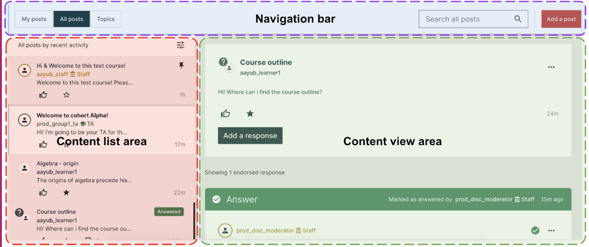
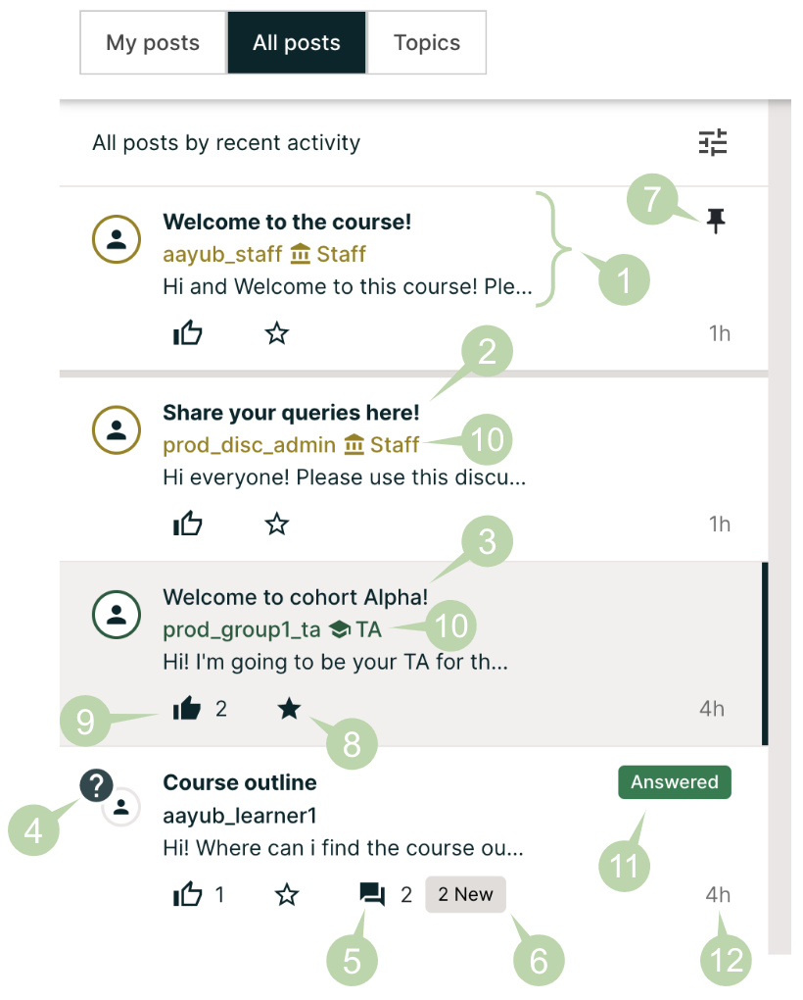

.. _Anatomy of edX Course Discussions:

#######################################
Anatomy of Course Discussions
#######################################

This section describes the structure and elements of course discussions.

.. contents::
  :local:
  :depth: 1

For information about how to participate in course discussions, see :ref:`Add
or Edit a Contribution`.

.. _Basic Elements of Course Discussions:

******************************************************
Basic Elements: Topics, Posts, Responses, and Comments
******************************************************

The following example shows the different ways that you can contribute to a
discussion.

::

  Post: "Please introduce yourself."
    - Response: "My name is Lee and I teach secondary school maths in Canberra,
      Australia."
    - Response: "Hello everyone, I am Sumei from Hong Kong, China."
      - Comment: "Hi Sumei, I am taking this course in Hong Kong too. Maybe we
        should make a study group!"
      - Comment: "I'd like to join the Hong Kong study group too, I think it
        will help me keep up with the homework."
    - Response: "Hi from Johannesburg! I am taking the course to prepare for my
      matric exams."

A post initiates the conversation, responses are replies to a post, and
comments expand on specific responses. Before you add a post, response, or
comment to your course discussion, take a moment to consider which of these
options best suits the contribution that you want to make. This helps keep
course discussions organized and easy to follow.

Every post is associated with a topic, chosen from the list of topics created
by the course team. For information about topics, see :ref:`About Discussion
Topics`.

For more information about joining the discussions in your course, see
:ref:`Explore Posts` and :ref:`Add or Edit a Contribution`.

.. _About Discussion Topics:

====================================
Discussion Topics
====================================

Discussion topics are created by the course team and organize all posts in the
course discussion. Discussion topics can be course-wide or content-specific.

* Course-wide discussion topics cover matters that affect the entire course,
  and can include topics such as "Frequently Asked Questions" and
  "Troubleshooting". In the discussion navigation pane, course-wide topics do
  not have other topics indented below them.

* Content-specific discussion topics are added as part of a course unit, and
  relate to specific video lectures, reading assignments, homework problems,
  or other course content. In the discussion navigation pane on the
  **Discussion** page, content-specific topics are indented under an identifying
  category name.

For course-wide topics, you read or add posts, responses, and comments on the
**Discussion** page. For content-specific discussion topics, you can read or
add posts, responses, and comments both on the **Discussion** page and in the
discussion that is embedded in the course unit on the **Course** page.

Before you add a post, look through the topics. When you add your post to the
most appropriate topic, others with the same interest can find, read, and
respond to it more easily.

====================================
Types of Discussion Posts
====================================

When you make a contribution in a course discussion topic, you add your post
as either a question or a discussion.

* A question post raises an issue so that members of the discussion
  administration team and the course community can provide answers.

* A discussion post starts a conversation by sharing thoughts and reflections,
  and inviting community participation.

When you add a post to a discussion topic, you must specify whether it is a
question or a discussion.

On the **Discussion** page for your course, a question mark icon identifies
posts that ask questions and a conversation bubble icon identifies posts that
start discussions.

If you have any difficulty deciding which type of post you want to add, think
about whether you want to get concrete information (a question) or start an
open-ended conversation (a discussion). If you require an answer from the
course team, be sure to create your post as a question, so that the course
team sees that a response is required and responds appropriately.

********************
The Discussion page
********************

You browse and contribute to course discussions on the **Discussion** page for
your course. Discussions page is broadly divided into three areas, as seen below:

1. Navigation bar: For navigating forum content like threads, topics, learners, post creation etc.
2. Content view area: To view posts, responses and comments
3. Content list area: List of posts, learners, topics, search results etc.

.. _Discussion Navigation Pane:

===========================
Discussion Navigation Pane
===========================

Use tabs on top of the Discussions page to access forum content in your course:

 * **All posts** tab lists all the posts in the course.
 * **My posts** tab lists all the posts that you have created.
 * **Topics** tab lists all discussion topics in the course.

''''''''''''''
All posts tab
''''''''''''''

The **All posts** tab shows the list of all posts in the forum for this course.
Post summaries in the list show various icons and labels to provide you with information about the status or content of posts:

1. Post summary shows title, author and the beginning of the post content.

2. Summary for a post that you have not read appears with a white background and bold title font.

3. Summary for a post that you have read appears with a gray background.

4. A “question mark” icon next to the avatar indicates that a post is a question. For more information, see :ref:`Determine Post Type`.

5. The response or comment count indicator shows the number of responses and comments for a post.

6. The number of new responses or comments that were added after you previously read a post is displayed next to the response count indicator. For more information, see :ref:`Keep Up with New Activity`.

7. A “Pinned” icon shows that a post has been pinned by moderators so that it always stays at the top of the topic list regardless of sort order.

8. A filled "star" button indicates that you are following the post. You can click on the button to follow/unfollow the post. By default, you’ll be following the posts that you have created.

9. A filled "like" button indicates that you have liked the post. You can click the like button to like and unlike a post. The count next to the like button indicates how many likes does the post have.

10. The “Staff” or “TA” label next to the username indicates that the user belongs to the course team or has a community teaching assistant (TA) role, respectively.

11. The “Answered” label on summary of a question and indicates that a response to this question has been marked as an answer by a user having moderation privileges.

12. Time elapsed since post creation is visible on the bottom right of the post summary. Hovering over the time will show the exact timestamp of post creation. Symbols “s”, “m”, “h”, “w” and “y” in time elapsed info indicate seconds, minutes, hours, weeks and years respectively.

A labeled screenshot of features described above, is presented below:

''''''''''''
My post tab
''''''''''''
**My posts** tab shows a list of all posts that you have created. You can use this tab to follow up on your forum contributions.

'''''''''''
Topics tab
'''''''''''
The **Topics** tab lists all the discussion topics in your course.
Course-wide discussion topics appear on top of the list followed by content specific discussion topics.You can click on each topic to see the posts in that topic.
To learn more about exploring content in topics, see :ref:`Discussion Topics`.
