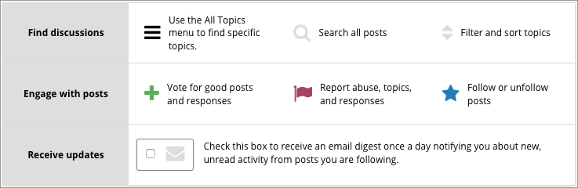

.. _Anatomy of edX Course Discussions:

#######################################
Anatomy of Course Discussions
#######################################

This section describes the structure and elements of course discussions.

.. contents::
  :local:
  :depth: 1

For information about how to participate in course discussions, see :ref:`Add
or Edit a Contribution`.

.. _Basic Elements of Course Discussions:

******************************************************
Basic Elements: Topics, Posts, Responses, and Comments
******************************************************

The following example shows the different ways that you can contribute to a
discussion.

::

  Post: "Please introduce yourself."
    - Response: "My name is Lee and I teach secondary school maths in Canberra,
      Australia."
    - Response: "Hello everyone, I am Sumei from Hong Kong, China."
      - Comment: "Hi Sumei, I am taking this course in Hong Kong too. Maybe we
        should make a study group!"
      - Comment: "I'd like to join the Hong Kong study group too, I think it
        will help me keep up with the homework."
    - Response: "Hi from Johannesburg! I am taking the course to prepare for my
      matric exams."

A post initiates the conversation, responses are replies to a post, and
comments expand on specific responses. Before you add a post, response, or
comment to your course discussion, take a moment to consider which of these
options best suits the contribution that you want to make. This helps keep
course discussions organized and easy to follow.

Every post is associated with a topic, chosen from the list of topics created
by the course team. For information about topics, see :ref:`About Discussion
Topics`.

For more information about joining the discussions in your course, see
:ref:`Explore Posts` and :ref:`Add or Edit a Contribution`.

.. _About Discussion Topics:

====================================
Discussion Topics
====================================

Discussion topics are created by the course team and organize all posts in the
course discussion. Discussion topics can be course-wide or content-specific.

* Course-wide discussion topics cover matters that affect the entire course,
  and can include topics such as "Frequently Asked Questions" and
  "Troubleshooting". In the discussion navigation pane, course-wide topics do
  not have other topics indented below them.

* Content-specific discussion topics are added as part of a course unit, and
  relate to specific video lectures, reading assignments, homework problems,
  or other course content. In the discussion navigation pane on the
  **Discussion** page, content-specific topics are indented under an identifying
  category name.

For course-wide topics, you read or add posts, responses, and comments on the
**Discussion** page. For content-specific discussion topics, you can read or
add posts, responses, and comments both on the **Discussion** page and in the
discussion that is embedded in the course unit on the **Course** page.

Before you add a post, look through the topics. When you add your post to the
most appropriate topic, others with the same interest can find, read, and
respond to it more easily.

====================================
Types of Discussion Posts
====================================

When you make a contribution in a course discussion topic, you add your post
as either a question or a discussion.

* A question post raises an issue so that members of the discussion
  administration team and the course community can provide answers.

* A discussion post starts a conversation by sharing thoughts and reflections,
  and inviting community participation.

When you add a post to a discussion topic, you must specify whether it is a
question or a discussion.

On the **Discussion** page for your course, a question mark icon identifies
posts that ask questions and a conversation bubble icon identifies posts that
start discussions.

If you have any difficulty deciding which type of post you want to add, think
about whether you want to get concrete information (a question) or start an
open-ended conversation (a discussion). If you require an answer from the
course team, be sure to create your post as a question, so that the course
team sees that a response is required and responds appropriately.

********************
The Discussion Page
********************

You browse and contribute to course discussions on the **Discussion** page for
your course.

======================
How to Use Discussions
======================

The **How to use edX discussions** graphic appears in the main area of the
**Discussion** page when you have not selected any topics or posts.

This graphic shows the basic actions you can take with course discussions.

       the basic actions you can take with course discussions, including
       filtering and sorting topics, voting on or following posts, and
       reporting abuse.

When you browse topics and posts from the :ref:`Discussion Navigation Pane
<discussion navigation pane>`, the **How to use edX discussions** graphic is
replaced by the contents of the topic or post that you selected.

.. _Discussion Navigation Pane:

===========================
Discussion Navigation Pane
===========================

Use the discussion navigation pane on the left side of the **Discussions**
page to access discussion topics and posts in your course, including
discussions that appear inline in course content.

You can view all discussion topics or only the posts that you are following,
or you can view a specific topic. You can also filter posts by entering
keywords or phrases that you want to find in post titles or text.

.. image:: ../../../shared/images/Discussion_NavPane.png
   :width: 300
   :alt: Use the navigation pane on the Discussion page to read posts in your
       course discussion. You can view all topics or only topics that you are
       following. You can also filter and sort posts, and you are notified
       about new unread responses and comments in posts.

The breadcrumb path above the navigation pane shows you the topic that you are
currently viewing. In the following example, **Posts I'm Following** is
selected.

.. image:: ../../../shared/images/Discussion_Indicators.png
   :width: 300
   :alt: Posts in the navigation pane have states and icons to indicate whether
       you have read them, and whether they are questions, discussions, or
       answered questions. Icons also indicate posts that you are following, that
       were pinned by discussion administrators, and that were posted by Staff
       or a Community Teaching Assistant.

When you view topics and posts, the navigation pane shows various icons and
labels to provide you with information about the status or content of posts.

.. image:: ../../../shared/images/Discussion_ReadUnreadNew.png
  :width: 300
  :alt: The discussion navigation pane, showing some unread and some read
     posts, including a post that has been read but now has additional new
     responses or comments.

*  Posts that appear in blue type with a blue bar indicate posts that you have
   not read.

*  Posts that appear in gray type without a bar indicate posts that you have
   read.

*  The post type icon indicates whether a post is a question or a discussion.
   For more information, see :ref:`Determine Post Type`.

*  The check mark icon indicates a "correct answer". The check mark icon
   indicates that one of the responses to the post correctly answers the
   question asked in the post.

*  The response or comment count indicator shows the number of responses and
   comments for a post. The number of new responses or comments that were
   added after you previously read a post is displayed next to the indicator.
   For more information, see :ref:`Keep Up with New Activity`.

*  A "Pinned" label shows that a post has been pinned by administrators
   so that it always stays at the top of the topic list regardless of sort
   order.

*  A "Following" label marks posts that you are following.

*  A "Staff" or "Community TA" label marks posts that were added by course
   staff or community teaching assistants (TAs).
