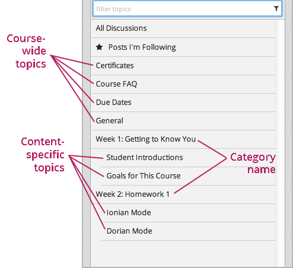
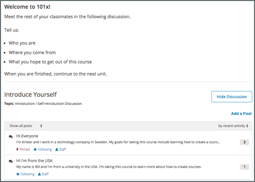

.. _Explore Posts:

###########################
Exploring Discussion Posts
###########################

Finding out whether someone else has already asked the same question or
initiated a conversation about the subject that interests you, and then reading
and contributing to that exchange instead of starting a new one, helps make the
time that everyone spends with the course discussions more productive. You can
search for something specific, or you can browse through the posts in a single
discussion topic.

.. contents::
  :local:
  :depth: 1

For information about finding new or updated posts in discussions, see
:ref:`Keep Up with New Activity`.

.. _Search Discussions:

*************
Search Posts
*************

To search for posts, responses, or comments containing a particular keyword or
phrase, enter the word or phrase, or a partial word in the **Search all posts**
field at the top of the **Discussion** page.

Search results are displayed in the discussion navigation pane. If an exact
match is not found, search results are shown for a similar value.

You can also enter a username to search for posts added by a specific person.
Select the linked username in the search result to show a list of posts made by
that person. For more information about viewing contributions from a specific
user, see :ref:`View from Participant`.

.. _Discussion Topics:

*********************************************
View Discussions about a Specific Topic
*********************************************

Course discussions are organized by discussion topics, which are created by the
course team. Anyone who adds a post to the course discussions selects an
existing topic to associate their post with. For more information about topics,
see :ref:`Basic Elements of Course Discussions`.

You can browse discussions by topic, to join the discussion on subjects that
interest you, or to see if anyone else in the course has asked the same
question.

=======================================
View Topics on the Discussion Page
=======================================

On the **Discussion** page, you can view both course-wide and content-specific
discussions. Select **All Topics** above the discussion navigation pane to see
all of the discussion topics in the course. To see all of the posts in an
individual topic, select the topic name in the discussion navigation pane.

Note that course-wide topics do not have other topics indented below them,
while content-specific topics are indented under a category name.

         topics.

=======================================
View Topics in a Course Unit
=======================================

Content-specific topics are located in specific units in the course. They
typically appear below the content they apply to. To access a content-specific
topic, view the unit that contains the topic.

You can also use the **Discussion** page to access a discussion in the unit
where that topic is located.

#. In the list of topics, select the topic that you want.

#. Select a post title to open the complete post and its responses and comments
   next to the above the discussion navigation pane.

#. In the text of a post, select the name of the discussion topic to go to the
   discussion inside the unit.

*****************************************
View Only Unread or Unanswered Posts
*****************************************

To limit the posts shown on the **Discussion** page or shown for a content-
specific discussion, you can select one of the filter options. By default, the
**Show all** option is selected.

* To show posts (both discussions and questions) that you have not yet viewed,
  select **Unread**.

* To show only question posts that do not yet have any responses marked as
  answers, select **Unanswered**.

*****************************************
View Pinned Posts
*****************************************

Pinned posts appear at the top of the list of posts in the discussion
navigation pane when you view all discussions. Pinned posts can contain
important information about the course or any part of the course, such as a
particular video or problem. The pinned post can originate from anyone in the
course, including other learners or members of the discussion moderation team,
but only members of the moderation team can pin a post.

*****************************************
View Followed Posts
*****************************************

In the discussion navigation pane select **Posts I'm Following**. The
navigation pane refreshes to show only posts that you are following.

.. _View from Participant:

*************************************************
View Contributions from a Specific Participant
*************************************************

You can review all the posts, responses, and comments that any learner in the
course or member of the course team has made. To do this, select the username
that appears at the top of any one of the participant's contributions. You can
also enter a username in the **Search all posts** field and select the linked
username in the search result.

.. include:: ../../../links/links.rst
