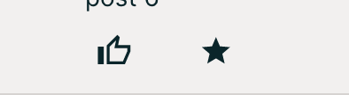
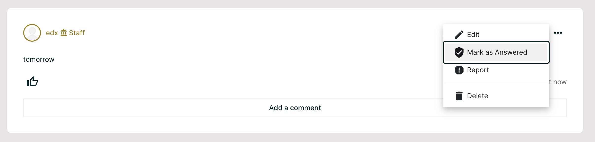
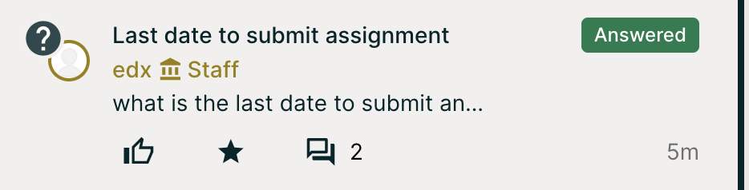

.. _Provide Feedback:

###############################################
Providing Feedback on Contributions
###############################################

As you read the contributions that other learners and course team members make
to discussion topics, you can provide feedback in other ways than writing a
complete response or comment.

.. contents::
  :local:
  :depth: 1

****************
Feedback Options
****************

When you open a post, response, or comment, the **Like** and **Follow**
feedback option icons appear at the top right. Move your cursor over these
icons to show the full label.

.. _Like Posts or Responses:

************************************
Like Posts or Responses
************************************

To provide positive feedback for a post or one of its responses, you can like
it. Open the post or response, and click the thumbs up icon next to the
number of **Likes**.

In the discussion navigation pane, you can sort the list of posts so that the
posts with the most likes appear at the top. To do this, select the drop-down
list of sorting options and select **Most Likes**. For more information
about ways to sort the list of discussion topics, see :ref:`Read New or
Updated Posts`.

.. _Follow Posts:

************************************
Follow Posts
************************************

If you find a conversation or question particularly interesting, you can
follow it so that you can return to it easily.

To follow a post, move your cursor over the star icon for the post, and then
select **Follow**.

Each post that you follow appears with a *Filled Star* indicator in the list of
posts.

In the discussion navigation pane, you can list only the posts that you are
following, regardless of the discussion topic they apply to. To do this,
select **All Posts** tab and then select **Following** filter from list.

.. _Answer Questions:

********************************************************
Answer Questions and Mark Questions as Answered
********************************************************

Anyone in a course can answer questions that are posted in the course
discussions. To respond to a question that has been asked by someone else in
the course, add a response with your answer to the question post.

If you have received a helpful or correct response to a question that you
yourself have asked, you can mark the response as the correct answer. To do
this, open actions menu by clicking top right icon on the response and select **Mark as Answered**.

.. note:: The discussion moderation team can mark any response as correct.
   Learners can only mark responses as correct for their own posts.

After at least one response to a question post is marked as answer, a
label is added to the post summary card in the discussion navigation pane.

.. _Report Discussion Misuse:

************************************
Report Discussion Misuse
************************************

On rare occasions you might come across a discussion contribution that is
inappropriate. You can flag any post, response, or comment for a discussion
moderator to review. To do so, open the contribution, select top right icon to open actions menu, and then
select **Report**.

The discussion moderation team can investigate any flagged posts, responses,
or comments and take the appropriate action.

.. Future: DOC-121 As a course author, I need a template of discussion guidelines to give to students
