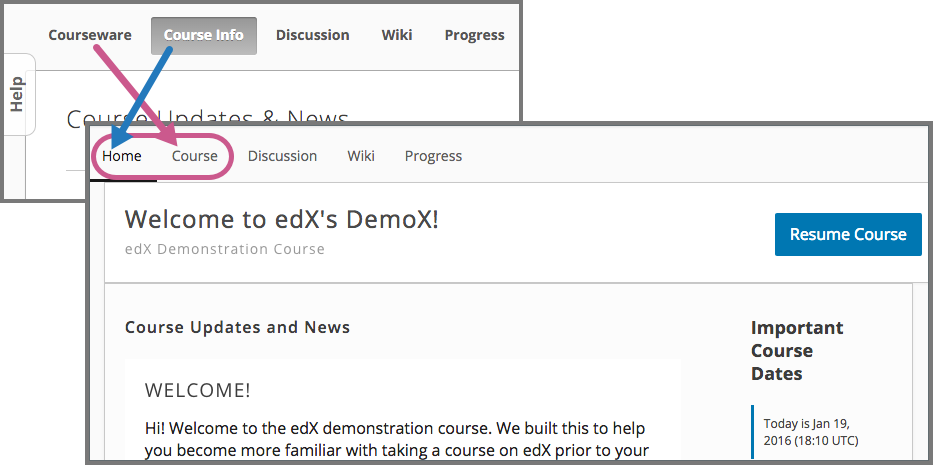

#############
Coming Soon
#############

This topic describes features that are in development and that edX expects to
release in the near future. After these features are released, the release
notes will include links to related documentation.

****************************************
Notetaking Feature for Learners
****************************************

A feature that gives learners the ability to highlight course content and make
notes while they take a course will soon be enabled for all courses on the
edx.org and edge.edx.org websites. Learners who use this feature will be able
to review their notes either in the course content or listed on a new, separate
**Notes** page in the course.

************************
Peer Instruction Tool
************************

Course teams will soon be able to use Studio to enable the peer instruction
tool and add peer instruction components to a course. Peer instruction
assignments emulate the classroom experience of the Peer Instruction learning
system for learners in an online course. The components provide opportunities
for learners to discuss questions and arrive at a deeper understanding of
concepts.

***********************************
LMS Page Renaming and Resequencing
***********************************

A change is coming to the learner experience. Instead of the existing **Course
Info** and **Courseware** pages in the LMS, learners will soon see **Home** and
**Course** pages.

* The **Home** page replaces the **Course Info** page. It will open
  automatically when the learner signs in and selects a course. In addition to
  course updates and news, the **Home** page will feature important course
  dates. **Home** is now the first page option for learners.

* **Course** is the new name for the **Courseware** page. It will be located to
  the right of the **Home** page.

  locations.

****************************************
End of Support for Internet Explorer 10
****************************************

EdX support for the Microsoft Internet Explorer 10 browser will end soon.
Testing of the edX platform on the Microsoft Edge browser is in progress.

EdX currently supports use of the edX platform on the latest versions of these
browsers.

* `Chrome`_
* `Safari`_
* `Firefox`_

.. include:: ../../links/links.rst
