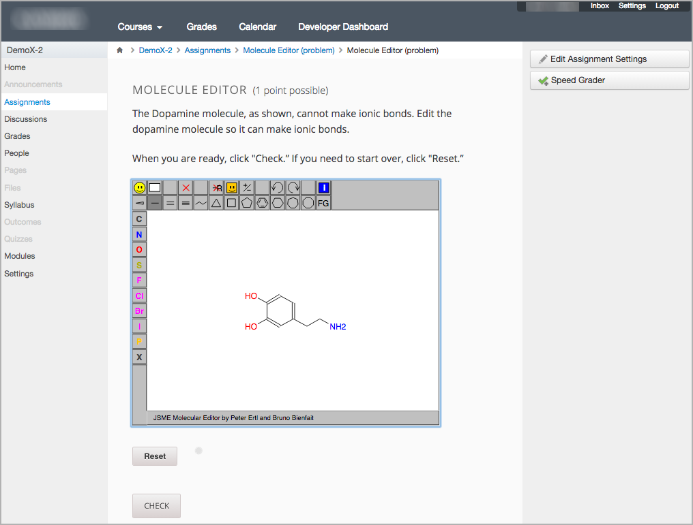

.. _Reusing Course Content:

##########################################
Reusing Course Content with LTI
##########################################

When you use LTI to reuse edX course content, learners who are already familiar
with an external learning management system (external LMS) see content from edX
that is seamlessly integrated into a familiar context. Only the content that
you specify from edX appears in the external LMS, typically within an IFrame on
a page.

      Canvas system.

This section provides background information on different aspects of the
experience that learners and course team members have when interacting with edX
content in the context of an external LMS.

.. contents:: 
   :local:
   :depth: 1

For information about the content that you can include in an external LMS, see
:ref:`Preparing Content`.

**********************************
Course Roster Management
**********************************

Course teams manage the course roster entirely on the external LMS, as you
would for any other course. No enrollment activities are needed in Studio or
the edX LMS. You do not need to pre-register or pre-enroll learners separately
in the edX LMS, or send learners a link to an edX course.

You use the features available in the external LMS for enrollment data.

******************************************
Learner Identification and Single Sign On
******************************************

.. note:: Different configuration options are available for how an external 
 LMS and edX Edge authenticate users. Your DevOps team might have additional
 information about the specific authentication process used by your
 institution.

Learners do not need to navigate to a second web site, or sign in to more than
one system, to access content that is provided from an edX course.

An initial authentication step occurs the first time the learner attempts to
view content in an external LMS that is linked from an edX course. An
additional sign in might be needed at this time. When learners enter their
credentials during this initialization step, the edX instance associates unique
internal identifiers with each learner's credentials. This associated ID allows
for a streamlined sign in experience in the future.

However, this separate edX identifier can make some edX content confusing for
learners when viewed in the context of an external LMS. For example, edX course
discussions can identify participants by their edX IDs instead of the usernames
they would normally see in the external LMS. As a result, some edX content is
not currently suitable for use in an external LMS. 

For more information, see :ref:`Preparing Content`.

.. a lot of guess work here ^. 

******************************
Learner Progress and Grades
******************************

Each learner's progress through the edX content is saved. Learners start, stop,
and resume work in the external LMS in the same way that they would in the edX
LMS.

Learner responses to edX problem components are graded by the edX system, and
then transferred automatically to the grade book in the external LMS. For more
information, see :ref:`Grading Remote Content`.

You use the features available in the external LMS for engagement and
performance data.
