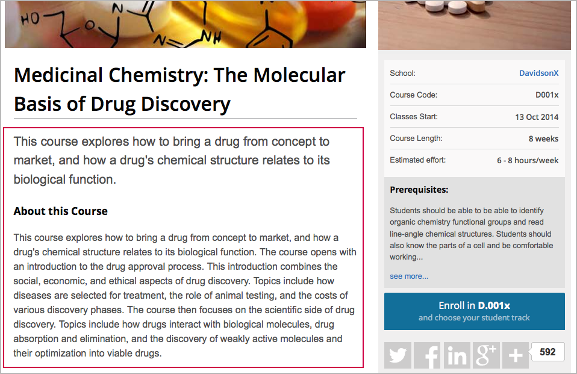
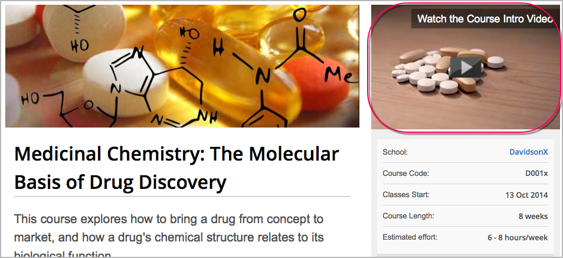
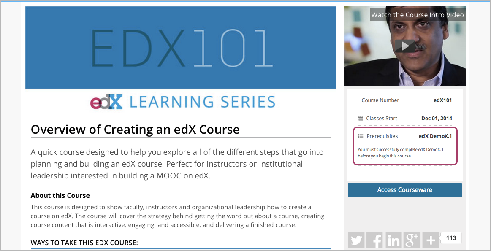
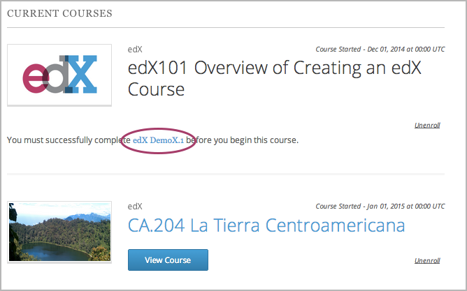
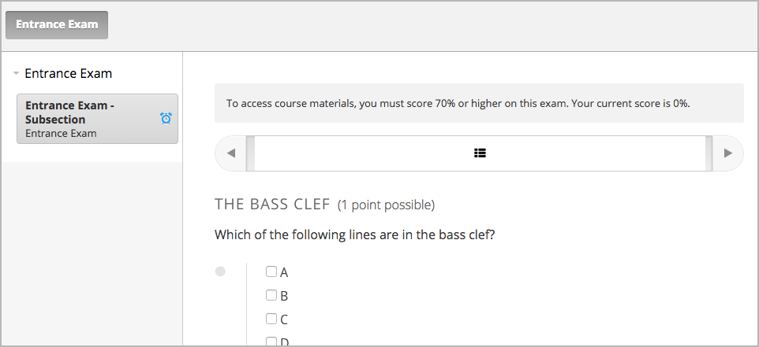

.. _Providing a Course Overview:

#####################################
Providing a Course Overview
#####################################

**********
Overview
**********

Prospective students need to know specific information about your course,
including what the course covers, how much time they should plan to spend on the
course each week, and whether the course requires any prior skills and
knowledge. You specify all of this information in Studio.

For more information, see the following topics:

* :ref:`Describe Your Course`
* :ref:`Add a Course Image`
* :ref:`Add a Course Video`
* :ref:`Set Course Time Requirements`
* :ref:`Set Course Prerequisites`
* :ref:`Set Important Dates for Your Course`

Most of this information appears on the course About page, sometimes called the
course summary page. The following image shows a typical About page.

.. image:: ../../../shared/building_and_running_chapters/Images/about_page.png
 :width: 600
 :alt: An image of the course About page showing the course start and end dates,
     prerequisites, description, and other information

Students see the course About page before they enroll in the course. After a
student enrolls in the course, students can see information about your course on
the Student Dashboard.

.. image:: ../../../shared/building_and_running_chapters/Images/dashboard.png
 :width: 600
 :alt: An image of the dashboard showing courses with start and end dates

.. note:: If your course will be available on edX.org, you must work with 
 your edX program manager to prepare the content for your About page, including
 the course overview, image, and video. For more information, see the `About
 page lesson <https://www.edx.org/course/overview- creating-edx-course-edx-
 edx101#.VLA9IWTF-RU>`_ in `edX101 <https://www.edx.org/course/overview-
 creating-edx-course-edx-edx101#.VLA9IWTF- RU>`_.

.. _Describe Your Course:

*********************************
Describe Your Course
*********************************

You describe your course in a course overview. The overview contains important
information for students who may be interested in taking your course. It
introduces the main idea of the course and describes the topics or concepts that
the course covers. The overview can also describe the skills and knowledge your
students need to be able to succeed in your course, as well as provide
information about course requirements and staff.

The course overview is outlined in the following course About page.

You use HTML to enter the course overview in Studio. The **Course Overview**
field in Studio contains a boilerplate that includes placeholders.

To enter the course overview, follow these steps.

#. From the **Settings** menu, select **Schedule & Details**.
#. Scroll down to the **Introducing Your Course** section, then locate the
   **Course Overview** field.

  .. image:: ../../../shared/building_and_running_chapters/Images/course_overview.png
   :width: 600
   :alt: Image of the HTML course description.

3. Replace the placeholders in the boilerplate text to create your course overview.
   Studio automatically saves your changes.

   .. note:: Do not edit HTML tags in the boilerplate. These tags align 
    the content on the course About page.
 
4. Below the **Course Overview** field, click **your course summary page** to
   see how the description will appear to students. A sample About page opens in
   a new window. 

   When you make changes, note that you may have to wait a moment for the content to auto-save before the changes appear on the page.

.. _Add a Course Image:

************************
Add a Course Image
************************

You provide a course image that identifies your course. The course image that
you add in Studio appears on the student dashboard. On Edge, the course image
also appears on the course About page.

.. image:: ../../../shared/building_and_running_chapters/Images/dashboard-course-image.png
 :width: 600
 :alt: Image of the course image in the student dashboard

The course image must be a minimum of 660 pixels in width by 240 pixels in
height, and in .jpg or .png format.

To add a course image, follow these steps.

#. From the **Settings** menu, select **Schedule & Details**.
#. Scroll down to the **Course Image** section.
#. To select an image from your computer, click **Upload Course Image**, then
   follow the prompts to find and upload your image.
#. View your dashboard to see how the image will appear to students.

.. _Add a Course Video:

*********************************
Add a Course Introduction Video
*********************************

To excite and entice potential students to enroll, each course can have a course
introduction video. The video should reveal some of the personality the
instructors bring to the course.

The video should answer these key questions.

* Who is teaching the course?
* What university or college is the course affiliated with?
* What topics and concepts does your course cover?
* Why should a learner enroll in your course?

The video should deliver your message as concisely as possible and have a run
time of less than 2 minutes.

Ensure your course introduction video follows the same :ref:`Compression
Specifications` and :ref:`Video Formats` guidelines as course content videos.

To add a course introduction video:

#. Upload the course video to YouTube. Make note of the code that appears
   between **watch?v =** and **&feature** in the URL. This code appears in the
   box below.

  .. image:: ../../../shared/building_and_running_chapters/Images/image127.png
    :alt: Image of a sample course video
    
2. From the **Settings** menu, select **Schedule & Details**.
#. Scroll down to the **Course Introduction Video** section.
#. In the field below the video box, enter the YouTube video ID (the code you
   copied in step 1). When you add the code, the video automatically loads in
   the video box. Studio automatically saves your changes.

.. _Set Course Time Requirements:

************************************
Set Course Time Requirements
************************************

To specify the number of hours that you expect students to spend on the course
each week, follow these steps.

#. From the **Settings** menu, select **Schedule & Details**.
#. Scroll down to the **Requirements** section.
#. In the **Hours of Effort per Week** field, enter the number of hours you
   expect students to work on this course each week.
#. View your course About page to see how the requirements will appear to
   students.

.. _Set Course Prerequisites:

********************************************
Set Course Prerequisites
********************************************

You might want to make sure that your students have a specific set of skills and
knowledge before they take your course. In addition to suggesting general
requirements in your course overview, you can require students to :ref:`complete
specific prerequisite courses<Specify Prerequisite Courses>`, or :ref:`take an
entrance exam<Require an Entrance Exam>`, or both.

.. _Specify Prerequisite Courses:

===================================
Specify Prerequisite Courses
===================================

You can require that your students pass a particular edX course before they
enroll in your course. Students see information about course prerequisites on
the course About page.

If students have not completed the prerequisite course, they can enroll in your
course and then see your course on the Student Dashboard. However, unlike with
other courses, the Student Dashboard does not provide a link to the courseware.
The Student Dashboard includes a link to the About page for the prerequisite
course. Students can enroll in the prerequisite course from the About page.

      unavailable because it has a prerequisite

To specify a prerequisite course, you must be a course author in both the
current course and in the prerequisite course.

#. In Studio, open your course.
#. On the **Settings** menu, select **Schedule & Details**.
#. On the **Schedule & Details** page, scroll to the **Requirements** section.
#. Under **Prerequisite Course**, click the drop-down list to select a course.
#. At the bottom of the page, select **Save Changes**.

.. note:: Currently, you can specify only one prerequisite course.

.. _Require an Entrance Exam:

===================================
Require an Entrance Exam
===================================

You can require your students to pass an entrance exam before they access your
course materials. If you include an entrance exam, students who enroll in your 
course see only the **Course Updates & News** page and an **Entrance Exam** tab 
until they pass the exam.

      left

After students pass the exam, they can access all released materials in your 
course. 

To require an entrance exam, follow these steps.

#. In Studio, open your course.
#. On the **Settings** menu, select **Schedule & Details**.
#. On the **Schedule & Details** page, scroll to the **Requirements** section.
#. Select the **Require students to pass an exam before accessing course
   materials** check box.
#. At the bottom of the page, select **Save Changes**.

After you save your changes, Studio automatically creates an **Entrance Exam** 
section in your course outline. To add content to your entrance exam, go to the 
course outline. 

Best Practices for Entrance Exams
********************************************

We strongly recommend that you follow several guidelines to help you and your
students have a positive experience with entrance exams.

* Make sure that your beta testers include the entrance exam when they test your
  other course content.

* Make sure that you mention the entrance exam in the course description on your
  course About page. Otherwise, students will not know about the entrance exam
  before they enroll in your course and try to access course content.

* Add an anouncement at the top of the **Course Updates & News** page that
  contains information and instructions for students who need to take the exam.
  When students first try to access content in a course that has an entrance
  exam, they see the **Course Updates & News** page. We suggest that you include
  the following information.

  * To begin the course entrance exam, students click the **Entrance Exam** tab
    on the left side of the screen.

  * After students complete the entrance exam, they have to click the **Entrance
    Exam** tab again or refresh the page in their browser. When the page
    refreshes, students can see all currently available course content.

    .. image:: ../../../shared/building_and_running_chapters/Images/EntEx_CourseAccordionAfterPass.png
      :width: 500
      :alt: The student view after the student has passed the entrance exam,
          with all available course sections listed in the course accordion

Create an Entrance Exam from the Course Outline
**************************************************

You create your course entrance exam from the course outline in Studio. Creating
entrance exam content is just like creating other course content. For more
information, see :ref:`Creating Course Content Index`.

Adjust Scores in the Entrance Exam
********************************************

If you find an error in the exam after students have taken it, and corrections
to the exam are unavoidable, you have several options to rescore the exam for
individual students. These options are available on the Instructor Dashboard.

On the Instructor Dashboard, click **Student Admin**, and then scroll to the
**Entrance Exam Grade Adjustment** section. The following options are available.

* **Reset Student Attempts**: Reset the value for one particular student's
  attempts back to zero so that the student can begin work over again. For more
  information, see :ref:`reset_attempts`.

* **Rescore Student Submission**: Rescore the responses that a student has
  submitted. For more information, see :ref:`rescore`.

* **Delete Student State for Problem**: Delete a student's entire history for
  the exam from the database. For more information, see :ref:`delete_state`.

Another option on the Instructor Dashboard is **Show Background Task History for
Student**. If you reset student attempts, rescore student submissions, or delete
student state, the operation runs in the background. If you want to see a record
of all the operations that have run for the entrance exam, select **Show
Background Task History for Student**.

.. _Set Important Dates for Your Course:

***********************************
Set Important Dates for Your Course
***********************************

You must set dates and times for enrollment and for the course.

#. In Studio, from the **Settings** menu, select **Schedule and Details**.  
#. Follow the on-screen text to enter the course and enrollment schedule.

   .. image:: ../../../shared/building_and_running_chapters/Images/schedule.png
    :width: 450
    :alt: An image of the course schedule page.

.. note:: The **Time** fields on this page, and the times that students 
 see, use Universal Coordinated Time (UTC).

.. _The Course Start Date:

=======================
The Course Start Date
=======================

.. note:: The default course start date is set far into the future, to
 **01/01/2030**. This is to ensure that your course does not start before
 you intend it to. You must change the course start date to the date you want
 students to begin using the course.

Students see the course start date and time on their **Current Courses**
dashboards and on the course About page. Students can see some parts of the
course before the course start date. For example, students can see your **Course
Info** page and course-wide discussion topics as soon as they enroll in your
course. For more information about course-wide discussion topics, see
:ref:`Create CourseWide Discussion Topics`.

The following example shows the course start date and time on the course About
page:

.. image:: ../../../shared/building_and_running_chapters/Images/about-page-course-start.png
 :width: 600
 :alt: An image of the course About page, with the start date circled.

In the dashboard, students see the start dates and times for each of their
courses, as in the following examples.

.. image:: ../../../shared/building_and_running_chapters/Images/dashboard-course-to-start.png
 :width: 600
 :alt: An image of two courses in the student dashboard, with the start dates
     and times circled.

.. note:: If you do not specify a start time for your course, students see
   the default start time, 00:00 Coordinated Universal Time (UTC).

.. _Set the Advertised Start Date:

======================================
Set the Advertised Start Date
======================================

You can set an advertised start date for your course that is different than the
course start date you set in the **Schedule and Details** page. You may want to
do this if there is uncertainty about the exact start date. For example, you
could advertise the start date as **Spring, 2014**.

To set an advertised start date:

#. From the **Settings** menu, select **Advanced Settings**.
#. Find the **Course Advertised Start Date** policy key. The default value is
   **null**.
#. Enter the value you want to display as the advertised start date. You can
   use any string, enclosed in double quotation marks. If you format the string
   as a date (for example, as 02/01/2014), the value is parsed and presented to
   students as a date.

  .. image:: ../../../shared/building_and_running_chapters/Images/advertised_start.png
   :alt: Image of the advertised start date policy key with a value of "anytime,
       self-paced"

4. Click **Save Changes** at the bottom of the page.

The start date shown on the dashboard is now the value of the **Course
Advertised Start Date** policy key:

.. image:: ../../../shared/building_and_running_chapters/Images/dashboard-course_adver_start.png
 :width: 600
 :alt: An image of a course listing in the student dashboard, with the
     advertised start date circled.

If you do not change the default course start date (01/01/2030), and the
**Course Advertised Start Date** policy value is ``null``, then the student
dashboard does not list a start date for the course. Students just see that
the course has not yet started.

.. _The Course End Date:

=====================
The Course End Date
=====================

The course end date is the date after which students can no longer earn credit
toward certificates. Students who have earned certificates can view them after
the course end date.

.. important::
 If you do not set a course end date, students will not be able to access
 earned certificates.

After grades and certificates are finalized, students see the course end date
on their personal **Current Courses** dashboards, as shown in the following
examples.

* If grades and certificates are not yet finalized, students can see the course
  end date and a message:

  .. image:: ../../../shared/building_and_running_chapters/Images/dashboard-wrapping-course.png
   :alt: Image of a course on the student dashboard that has ended, but not
     been graded

* When grades and certificates are finalized, students who have not earned a
  certificate see their score and the score required to earn a certificate:
  
  .. image:: ../../../shared/building_and_running_chapters/Images/dashboard-no-cert-course.png
   :alt: Image of a course on the student dashboard that has ended, but not
     been graded

* Students whose final score is equal to or higher than the required score can
  click **Download Certificate** to get their certificates as PDFs:

  .. image:: ../../../shared/building_and_running_chapters/Images/dashboard-completed-course.png
   :alt: Image of a course on the student dashboard that has ended, but not
     been graded

