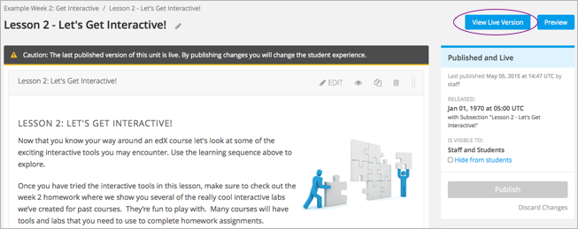

.. _Developing Course Units:

###################################
Developing Course Units
###################################

To work with units in the course outline and develop your course, you need to
understand the following concepts and complete the following tasks.

.. contents::
   :depth: 1
   :local:

You add content to units with :ref:`course components<Developing Course
Components>`.

.. _What is a Unit?:

****************************
What is a Unit?
****************************

A unit is a part of a :ref:`subsection<Developing Course Subsections>` that
learners view as a single page.

A unit contains one or more :ref:`components<Developing Course Components>`,
such as :ref:`HTML content<Working with HTML Components>`,
:ref:`problems<Working with Problem Components>`, :ref:`discussions<Working
with Discussion Components>`, and
:ref:`videos<Working with Video Components>`.

****************************
Viewing Units in the Outline
****************************

To view units in the outline, you :ref:`expand<Navigating the Course Outline>`
the parent section and subsection.

.. image:: ../../../shared/building_and_running_chapters/Images/outline-callouts.png
 :alt: An outline with callouts for sections, subsections, and units.

****************************
Viewing the Unit Page
****************************

When you select a unit name in the outline, the **Unit** page opens.

The following example shows a unit page with two components, with circles and
text to show different areas and controls in the page.

.. image:: ../../../shared/building_and_running_chapters/Images/unit-page.png
 :alt: The Unit page.

****************************
Viewing Units as a Learner 
****************************

To a learner using the edX Learning Management System, each unit in the
subsection appears as a link in the learning sequence at the top of the
**Courseware** page. The contents of the active unit appear below the learning
sequence.

The following image shows a subsection that has five units, which are circled
in the learning sequence above the video, with the first unit open.

.. image:: ../../../shared/building_and_running_chapters/Images/Units_LMS.png
 :alt: Image of units from the learner's point of view.

.. _The Unit Workflow:

************************************************
The Unit Workflow
************************************************

When you have set up the :ref:`section<Developing Course Sections>` and
:ref:`subsection<Developing Course Subsections>` in the course outline, you
then work with units.

The typical workflow includes these steps.

#. :ref:`Create a new unit<Create a Unit>`.
#. :ref:`Add components to the unit<Add a Component>`.
#. :ref:`Publish the unit<Publish a Unit>`.
   
After you publish the unit, you can complete these steps.

#. :ref:`Modify components in the unit<Developing Course Components>`.
#. :ref:`Publish the changes to the unit<Publish a Unit>`.
   
The following diagram shows the typical unit development workflow.

.. image:: ../../../shared/building_and_running_chapters/Images/workflow-create-unit.png
 :alt: Diagram of the unit development workflow.
   
As you work through these steps, the **publishing status** of the unit changes.
The publishing status controls the content available to learners, along with
:ref:`release dates<Release Dates>`. See the next section for more information.

.. _Unit States and Visibility to Students:

*************************************************
Unit Publishing Status and Visibility to Learners
*************************************************

The following information summarizes whether or not learners can see a unit.

* Learners never see a unit with the publishing status `Draft (Never
  Published)`_.

* Learners never see a unit with the publishing status `Visible to Staff
  Only`_. For more information, see :ref:`Hide a Unit from Students`.

* Learners do not see a unit with the publishing status `Published Not Yet
  Released`_ until the :ref:`release date <Release Dates>`. On the release
  date, the status changes to `Published and Live`_.

* If the publishing status is `Published and Live`_, learners see the current
  version of the unit.
  
* If the publishing status is `Draft (Unpublished Changes)`_, learners see the
  last published version of the unit if the :ref:`release date <Release Dates>`
  for the containing section and subsection has passed.

For more information, see :ref:`Controlling Content Visibility`.

.. _Unit Publishing Status:

************************************************
Unit Publishing Status
************************************************ 

As a course author, you work with units with the following statuses.

.. contents::
   :depth: 1
   :local:

.. _Draft (Never Published):

========================
Draft (Never published)
========================

When you create a new unit and add components to it, the unit's publishing
status is **Draft (Never Published)**, as shown in the status panel.

.. image:: ../../../shared/building_and_running_chapters/Images/unit-never-published.png
 :alt: Status panel of a unit that has never been published.

In Studio, you see the version of the content that you're working on. Learners
never see a unit with this status, even if the release date has passed.

Though you do not see the unit in the LMS, you can :ref:`preview the
unit<Preview Course Content>`.

You must :ref:`publish the unit<Publish a Unit>` for it to be included in the
LMS.

.. _Published and Live:

====================
Published and Live
====================

The release date for the section and subsection have passed. You've published
the unit and haven't made any changes to it. You and learners both see the
current version of the unit.

.. image:: ../../../shared/building_and_running_chapters/Images/unit-published.png
 :alt: Status panel of a unit that is published.

.. _Published Not Yet Released:

====================================
Published (not yet released)
====================================

You published the unit, but the release date is still in the future. Learners
cannot see this unit until the release date passes.

.. image:: ../../../shared/building_and_running_chapters/Images/unit-published_unreleased.png
 :alt: Status panel of a unit that is published but not released.

.. _Draft (Unpublished Changes):

===========================
Draft (Unpublished changes)
===========================

When you edit a published unit, whether or not it is released, the unit's
publishing status changes to **Draft (Unpublished Changes)**, as shown in the
status panel.

.. image:: ../../../shared/building_and_running_chapters/Images/unit-pending-changes.png
 :alt: Status panel of a unit that has pending changes.

In Studio, you see the draft of the content that you're working on. If the
release date has passed, learners see the last published version of the unit.
If the release date hasn't passed, learners cannot see your content.

You must :ref:`publish the unit<Publish a Unit>` for learners to see your
changes.

You can :ref:`preview the changes to a unit<Preview Course Content>` to test
how your changes will appear to learners after you publish the unit.

.. _Visible to Staff Only:

===========================
Visible to Staff Only
===========================

When you :ref:`hide a unit from learners<Hide a Unit from Students>`, the
unit's publishing status changes to **Visible to Staff Only**.

The publishing status of a unit can be **Visible to Staff Only** if you hid the
parent :ref:`section<Hide a Section from Students>` or :ref:`subsection<Hide a
Subsection from Students>` from learners.

Learners never see a unit with this status, even if it has been published and
the release date has passed.

.. image:: ../../../shared/building_and_running_chapters/Images/unit-unpublished.png
 :alt: Status panel of a unit that has pending changes.

.. _Create a Unit:

****************************
Create a Unit
****************************

You can create a unit from the outline or create a unit in the same subsection
from the unit page.

To create a unit from the outline, follow these steps.

#. In the outline, expand the subsection in which you want to create a new
   unit.
#. Select **New Unit** at the bottom of the expanded subsection. A new
   page opens for you to add components to the unit.
#. On the unit page, the unit name is selected. Supply an identifying name. A
   descriptive name can help learners locate content in the courseware. It can
   also help you select content when you analyze performance in edX Insights.
#. :ref:`Add components<Add a Component>` to the new unit as needed.

To create a new unit from a unit page, follow these steps.

#. In the **Unit Location** panel, select **New Unit**.

   .. image:: ../../../shared/building_and_running_chapters/Images/unit_location.png
    :alt: The Unit Location panel in the Unit page.

   The unit page for the new unit opens automatically.

#. On the unit page, the unit name is selected. Supply an identifying name. A
   descriptive name can help learners locate content in the courseware. It can
   also help you select content when you analyze performance in edX Insights.

#. :ref:`Add components<Add a Component>` to the new unit as needed.

You must then :ref:`publish the unit<Publish a Unit>` to make it visible to
learners.

.. _Edit a Unit:

**************
Edit a Unit
**************

You can edit a unit in the following ways.

* `Edit the unit name`_
* :ref:`Develop components<Developing Course Components>`
* `Reorganize Components in Units`_

When you make any of these changes, if you previously published the unit, the
state changes to `Draft (Unpublished Changes)`_. You must then :ref:`publish
the unit<Publish a Unit>` to make your edits visible to learners.

==============================
Edit the Unit Name
==============================

To edit a unit name, select the **Edit** icon next to the name.

.. image:: ../../../shared/building_and_running_chapters/Images/unit-edit-icon.png
  :alt: The Edit Unit Name icon.

The name field becomes editable. Enter the new name, and then tab or click
outside of the field to save the name.

==============================
Reorganize Components in Units
==============================

You can reorganize components within a unit by dragging and dropping them to
new locations.

To move a component, hover over the handle on the right of the component's box
until the cursor changes to a four-headed arrow. For example, in the image
below, the handle for the discussion component is selected.

.. image:: ../../../shared/building_and_running_chapters/Images/unit-drag-selected.png
  :alt: A discussion component selected to drag it.

Then, click and drag the component to the location that you want. 

A dashed outline indicates where the component will land when you release the
mouse button. For example, in the image below, the discussion component is
being moved to the top of the unit.

.. image:: ../../../shared/building_and_running_chapters/Images/unit-drag-moved.png
 :alt: A component being dragged to a new location.

.. _Preview a Unit:

****************************
Preview a Unit
****************************

You preview a unit to review and test the content before it is visible to
learners.

You can preview a unit before it is published and before the course is live.
In a live course, after the unit is published and if there are no pending
changes, previewing a unit is exactly the same as viewing the live version of
the unit.

To preview the unit, in the unit page, select **Preview**.

.. image:: ../../../shared/building_and_running_chapters/Images/preview_changes.png
 :alt: A course unit page, with the Preview button circled.

The unit opens in preview mode.

.. image:: ../../../shared/building_and_running_chapters/Images/preview_mode.png
 :alt: The unit in preview mode in the LMS.

When you are revising a previously published unit, it is helpful to preview
your changes in one window and :ref:`view the published unit<View a Published
Unit>` in a second window.

For more information about previewing courseware, see :ref:`Preview Course
Content`.

.. _Publish a Unit:

****************************
Publish a Unit
****************************

Publishing a unit makes the current version of the unit in Studio available to
learners, if the release date for the section and subsection have passed.

You publish a unit that has a status of `Draft (Never Published)`_ or `Draft
(Unpublished Changes)`_. When you publish a unit, the status changes to
`Published and Live`_ or `Published Not Yet Released`_.

You can publish a unit from the unit page or the course outline.

=======================================
Use the Unit Page to Publish a Unit
=======================================

To publish the unit, select **Publish** in the status panel.

.. image:: ../../../shared/building_and_running_chapters/Images/unit-publish-button.png
 :alt: Unit status panel with Publish button circled.

=======================================
Use the Outline to Publish a Unit
=======================================

To publish a unit from the outline, select the **Publish** icon in the box for
the unit.

.. image:: ../../../shared/building_and_running_chapters/Images/outline-publish-icon-unit.png
 :alt: Publishing icon for a unit.

.. note:: 
 The **Publish** icon only appears when there is new or changed content in the
 unit.

.. _Discard Changes to a Unit:

****************************
Discard Changes to a Unit
****************************

When you modify a published unit, your changes are saved in Studio, though the
changes are not visible to learners until you publish the unit again.

In certain situations, you may decide that you never want to publish your
changes. You can discard the changes so that Studio reverts to the last
published version of the unit.

To discard changes and revert the Studio version of the unit to the last
published version, select **Discard Changes** in the status panel.

.. image:: ../../../shared/building_and_running_chapters/Images/unit-discard-changes.png
 :alt: Unit status panel with Discard Changes circled.

.. caution::
 When you discard changes to a unit, the changes are permanently deleted. You
 cannot retrieve discarded changes or undo the action.

.. _View a Published Unit:

****************************
View a Published Unit
****************************

To view the last published version of a unit in the LMS, select **View Live
Version**.

The unit page opens in the LMS in Staff view. You might be prompted to log in
to the LMS.

If the unit status is `Draft (Unpublished Changes)`_, you do not see your
changes in the LMS until you publish the unit again.

If the unit status is `Draft (Never Published)`_, **View Live Version** is not
enabled.

.. _Hide a Unit from Students:

****************************
Hide a Unit from Learners
****************************

You can prevent learners from seeing a unit regardless of the unit status or
the release schedules of the section and subsection. 

For more information, see :ref:`Content Hidden from Students`.

You can hide a unit from learners using the course outline or the unit page.

=======================================
Use the Unit Page to Hide a Unit
=======================================

Select the **Hide from students** check box in the status panel.

.. image:: ../../../shared/building_and_running_chapters/Images/unit-hide.png
 :alt: Unit status panel with Hide from Students checked.

For more information, see :ref:`Controlling Content Visibility`.

=======================================
Use the Outline to Hide a Unit
=======================================

#. Select the **Configure** icon in the unit box.
   
   .. image:: ../../../shared/building_and_running_chapters/Images/outline-unit-settings.png
      :alt: The unit settings icon circled.

   The **Settings** dialog box opens.

#. Check **Hide from students**.

   .. image:: ../../../shared/building_and_running_chapters/Images/outline-unit-settings-dialog.png
      :alt: The unit hide from students setting.

#. Select **Save**.

=======================================
Make a Hidden Unit Visible to Learners
=======================================

Before you make a hidden unit visible to learners, be aware that course content
will immediately be visible to learners, as follows.

* For a hidden unit that previously was published, clearing the check box
  publishes the current content for the unit. If you made changes to the unit
  while is was hidden, those draft changes are published.

* When you make a section or subsection that was previously hidden visible to
  learners, draft content in units is *not* published. Changes you made since
  last publishing units are not made visible to learners.

You can make a hidden unit visible to learners from the unit page or the course
outline. Follow the instructions above and clear the **Hide from students**
check box.

You are prompted to confirm that you want to make the unit visible to learners.

********************************
Delete a Unit
********************************

You delete a unit from the course outline.

When you delete a unit, you delete all components within the unit.

.. warning::  
 You cannot restore course content after you delete it. To ensure you do not
 delete content you may need later, you can move any unused content to a
 section in you

To delete a unit, follow these steps.

#. Select the **Delete** icon in the box for the unit you want to delete.

.. image:: ../../../shared/building_and_running_chapters/Images/section-delete.png
 :alt: The section with Delete icon circled.

2. When you receive the confirmation prompt, select **Yes, delete this
   unit**.
