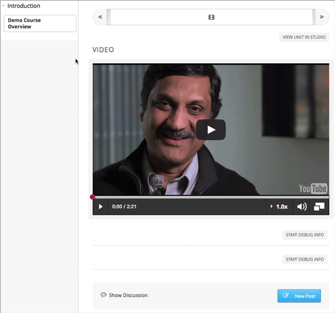

.. _Testing Your Course Content:

###########################
Testing Your Course Content
###########################

The way your course looks in Studio is different from the way that learners
will see and experience it when it is live.

It is recommended that you test your content continually as you build your
course, so you can interact with your course from a learner's point of view.

.. contents::
  :local:
  :depth: 2

.. note:: If you use content groups in your course to designate content as
  visible only to particular students, see :ref:`Preview Cohort Specific
  Courseware`.

For information about setting up a beta test for your course, see
:ref:`Beta_Testing`.

.. _Preview Course Content:

*************************
Preview Course Content
*************************

You can preview course content before a course is live or before you publish
specific units, to test how content will appear to students when it is
released.
 
When you preview course content, you see the latest course content that is
configured in Studio. You see content in units with the publishing status
:ref:`Draft (Never Published)`, :ref:`Draft (Unpublished Changes)`, or
:ref:`Visible to Staff Only`.

.. note:: If you use content groups and have designated components in a unit
   as visible only to particular groups, the visibility status indicates that
   some content in the unit is visible only to particular groups. For
   information about previewing course content if you use content groups to
   designate content as visible only to particular groups, see :ref:`Preview
   Cohort Specific Courseware`.

.. note:: If you use randomized content blocks in your courseware, you cannot
   preview unpublished units that contain content from randomized content
   blocks, because the randomized content is not assigned until after the unit
   is published. For information about viewing the actual content that has
   been assigned to a particular student from a randomized content block in a
   live course, see :ref:`Specific Student View`.

For example, you :ref:`publish a unit<Publish a Unit>` with a video and a
discussion.

.. image:: ../../../shared/building_and_running_chapters/Images/test-unit-studio.png
 :alt: A unit in Studio with a video and discussion

Students see the same content in the LMS.

You later decide to add a multiple choice problem to the unit, before the
discussion. Before you publish this change, you can see how the question will
look to students by previewing the unit in the LMS.

.. image:: ../../../shared/building_and_running_chapters/Images/test-unit-studio-added-comp.png
 :alt: A unit in Studio with a video and multiple choice problem. (The
   discussion component below the multiple choice problem is not included in
   the screen capture).

When you click **Preview** and select to view the course as a **Student**, you
see the unit in the LMS with the multiple choice question. This preview shows
how students will experience the unit after you :ref:`publish the
change<Publish a Unit>`.

.. image:: ../../../shared/building_and_running_chapters/Images/test-unit-lms-added-comp.png
 :alt: A unit in the LMS with "View as Student" selected, showing a video and
  a multiple choice problem. (The discussion component below the multiple
  choice problem is not included in the screen capture).

In the live course, students continue to see the existing content, without the
multiple choice question, until you :ref:`publish the change<Publish a Unit>`.

.. note:: When the unit's state is :ref:`Published and Live`, the preview and
   the live version of the courseware are exactly the same. Selecting either
   of **View Live** or **Preview** gives you the same view.

 
.. _View Your Live Course:

******************************************
View Your Live Course
******************************************

While you are working in Studio, you can test your live course by viewing it
in the LMS as all students, or a particular student, would see it. You can see
your course in `Staff View`_, `Student View`_, or `Specific Student View`_. If
you are using content groups to designate specific content as visible only to
particular content groups, you can see your course as a content group would
see it.

You can view the course as a member of these groups.

.. list-table::
    :widths: 15 30
    :header-rows: 1

    * - Role
      - When You "View As" This Role
    * - Staff
      - You see all content in the course, including content
        that is hidden from students.
    * - Student
      - You see any content that is intended for all
        students.
    * - Specific Student
      - You see content that is intended for the student whose email or
        username you specify. 
    * - Student in <Content Group Name>            
      - You see content that is intended for all students, as well
        as any content specifically set to be visible to this content group.

To switch to your live course and see how it appears to members of the groups
in the table above, follow these steps.

#. From the course outline page in Studio, click **View Live** or, from a unit page in Studio, click **View Live Version**. 
   
  .. image:: ../../../shared/building_and_running_chapters/Images/test-outline-view-live.png
   :alt: View live button on the outline
   
  .. image:: ../../../shared/building_and_running_chapters/Images/test-unit-view-live.png
   :alt: View Live Version button on the unit page

#. In the live view of the course in the LMS, from the navigation bar at the
   top of the page, select one of the options in the **View this course as**
   drop down list, as described in the table above.

The course view refreshes and the content is presented as a member of the
selected group would see it.

For details about each view, see `Staff View`_, `Student View`_, or `Specific
Student View`_.

.. _Staff View:

=================
Staff View
=================

In the LMS, to view your live course as anyone with the role of **Staff**
would see it, use **Staff View**.

.. image:: ../../../shared/building_and_running_chapters/Images/Live_Course_Staff_View.png
 :alt: Image of the Courseware page in a live course with Staff View indicated
  at top right and a View Unit in Studio button

* You see all units that are :ref:`Published and Live`. For units that are
  :ref:`Draft (Unpublished Changes)` or :ref:`Visible to Staff Only`, you
  see the last published version of the unit. You see these units
  regardless of the release dates of the containing section or subsection.

* You do not see units that are :ref:`Draft (Never Published)`. To
  see these units, you must use Preview mode as described in :ref:`Preview
  Course Content`.

* You can access the Instructor Dashboard, which has features and reports that
  help you :ref:`run your course<Running Your Course Index>`.

When you view your course in **Staff View**, you can execute tests to make sure
that your course works the way you intend. For example,  before the release
date of a subsection, members of the course team can work through the problems
to verify that the correct answer gets a green check for correct, and that any
answer other than the correct one gets a red X for incorrect.

.. _Student View:

============
Student View
============

In the LMS, to see the course content in your live course that is intended for
all students, use the **Student** view.

.. note:: If you have enabled your course for cohorts and have designated some
  content as visible only to certain content groups, you can select a content
  group from the **View Course As** drop down list to see the content exactly
  as a student in a cohort associated with that content group will see it. For
  details, see :ref:`Preview Cohort Specific Courseware`.

To switch to the **Student** view, click **View this course as** and select
**Student** from the drop down list.

.. image:: ../../../shared/building_and_running_chapters/Images/test-view-as-student.png
 :alt: Image of the "View Course As" dropdown list with Staff, Student, and
  named content group options shown.

* You do not see sections or subsections that have not yet been released.

* If the section and subsection are released, you see units that are
  :ref:`Published and Live`. For units that are :ref:`Draft (Unpublished
  Changes)`, you see the last published version of the unit.

* You do not see units that are :ref:`Draft (Never Published)` or
  :ref:`Visible to Staff Only`. To see these units, you must switch back to
  Instructor view or use Preview mode as described in :ref:`Preview Course
  Content`.

* You can access the Instructor Dashboard, which has features and reports that
  help you run your course.

.. _Specific Student View:  

=====================
Specific Student View
=====================

In the LMS, the course content in your live course as one particular student
would see it, use the **Specific student** view.

Seeing the content in your live course as a specific student sees it is useful
in some situations. For example, to adjust a grade or reset the attempts for a
problem that was assigned from a randomized content block, you will need to
view the courseware as a specific student to see the actual problems that they
were assigned. For details about adjusting grades or resetting attempts, see
:ref:`Adjust_grades`.

To switch to the **Specific student** view, click **View this course as**.
Select **Specific student** from the drop down list, and enter the username or
the email address of the specific student that you want to view the courseware
as.

.. image:: ../../../shared/building_and_running_chapters/Images/ViewCourseAsSpecificStudent.png
 :alt: Image of the "View Course As" dropdown list with Staff, Student, and
  Specific student options shown, and the field that is used to specify the student's username or email address.

* You do not see sections or subsections that have not yet been released.

* If the section and subsection are released, you see units that are
  :ref:`Published and Live`. For units that are
  :ref:`Draft (Unpublished Changes)`, you see the last published version of the
  unit. 

* You do not see units that are :ref:`Draft (Never Published)` or
  :ref:`Visible to Staff Only`. To see these units, you must switch back to
  Staff view or use Preview mode as described in :ref:`Preview Course Content`.

* You can access the Instructor Dashboard, which has features and reports that
  help you run your course.

*************************************
Open Studio from Your Live Course
*************************************

When you are viewing your course in the LMS as **Staff View**, you can open
Studio directly.
   
* In a unit page, click **View Unit in Studio**.
  
  .. image:: ../../../shared/building_and_running_chapters/Images/Live_Studio_from_LMS_Unit.png
   :alt: The View Unit in Studio button in an LMS unit

  The unit page opens in Studio.
 
* In the Instructor Dashboard, click **View Course in Studio** to open the
  course outline.
 
  .. image:: ../../../shared/building_and_running_chapters/Images/Live_Course_Instructor_Dashboard.png
    :alt: Image of the Instructor Dashboard in a live course with a View Course
        in Studio button

  For information about the tasks you can complete on the Instructor Dashboard,
  see :ref:`Running Your Course Index`.
 
* In the **Course Progress** page, click **View Grading in Studio** to open the
  Grading page.
 
  .. image:: ../../../shared/building_and_running_chapters/Images/Student_Progress.png
     :alt: Image of the Course Progress page for a student with a View  Grading
         in Studio button

  For information about checking a student's progress, see
  :ref:`Review_grades`.
