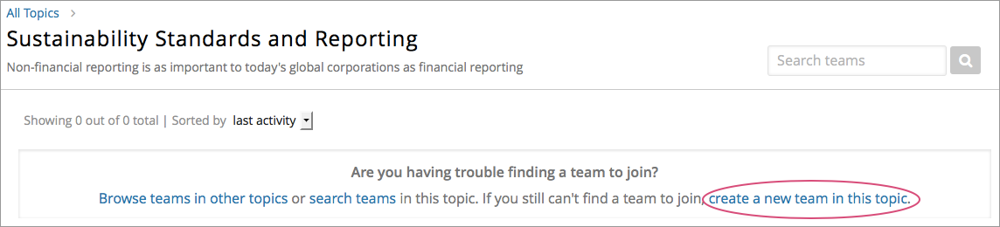

.. _CA Learner Experience of Teams:

##########################################
The Learner's Experience of Teams 
##########################################

After you have :ref:`enabled teams <Teams Setup>` and created topics in your
course, learners can begin browsing and joining teams. Each learner can belong
to only one team.

.. contents::
  :local:
  :depth: 1

***********************************
Browsing Teams by Topic
***********************************

On the Teams page in the LMS, learners in your course can browse topics to
find a subject that they are interested in working on. 

.. image:: ../../../shared/building_and_running_chapters/Images/Teams_TopicArrowButton.png
  :width: 500
  :alt: On the page showing available topics, one topic has the arrow button
      that takes users to the list of teams within that topic highlighted.

Within each topic, learners can see whether teams already exist for the topic. 

.. image:: ../../../shared/building_and_running_chapters/Images/Teams_TopicViewButton.png
  :width: 500
  :alt: View of a team within a topic showing name and description, number of members.

If there are existing teams, learners can view each team's name, description,
and, if these are defined, the team's primary language of communication and
country that members primarily identify with. Learners can also view
discussion posts that team members have made, but they cannot add posts unless
they belong to a team.

*************************************
Joining, Creating, or Leaving a Team
*************************************

When learners find a team that they want to join, they select **Join Team**
and are immediately added to the team membership, subject to the maximum team
size. 

.. note:: Course team members who have administrative roles, discussion
   moderator, or discussion administrator roles can also create teams, but
   they are not automatically added to the team membership. This is also true
   for students who also have the community TA role.

If no teams exist, if existing teams have reached the maximum number of
members, or if none of the existing teams are appealing, learners can create
their own teams. Under the list of existing teams in a topic, learners select
**create a new team in this topic**. 

They specify a name and description for their team, and optionally specify a
country and language that team members identify with. A learner who creates a
team automatically becomes a member of the new team.

.. note:: Encourage learners to join existing teams before creating new teams.

At any time, learners can leave teams that they have joined, although you
should emphasize to learners that they should try not to change teams after
any team projects or activities have started.

Learners can only belong to one team at a time. If they attempt to join a team
while they belong to another team, they see a message indicating that they
already belong to a team. To join a new team, they must first leave their
existing team.

*************************************
Inviting Friends to Join a Team
*************************************

After learners join a team, they can invite friends to join that same team by
copying a URL, which they can then forward to invitees by any external means
such as email, or social media post.

.. image:: ../../../shared/building_and_running_chapters/Images/Teams_InviteOthers.png
  :width: 200
  :alt: The Invite Others field on the Team Details page, with a URL that can
      be copied and shared.

*************************************
Participating in Team Discussions
*************************************

Only members of a team (or anyone with a discussion administrator, discussion
moderator, or community TA role) can post to a team's discussion forum. Any
learner in your course can view team discussions without being a member, but
they cannot add posts to a team's discussion unless they also belong to the
team.

.. note:: Team discussions are not divided by cohort. Learners who are in the
   same team, but who belong to different cohorts can view and participate in
   their team discusssions without regard to the cohort they belong to.

For information about course discussions and managing discussions, see
:ref:`Discussions` and :ref:`Discussions for Students and Staff`.
