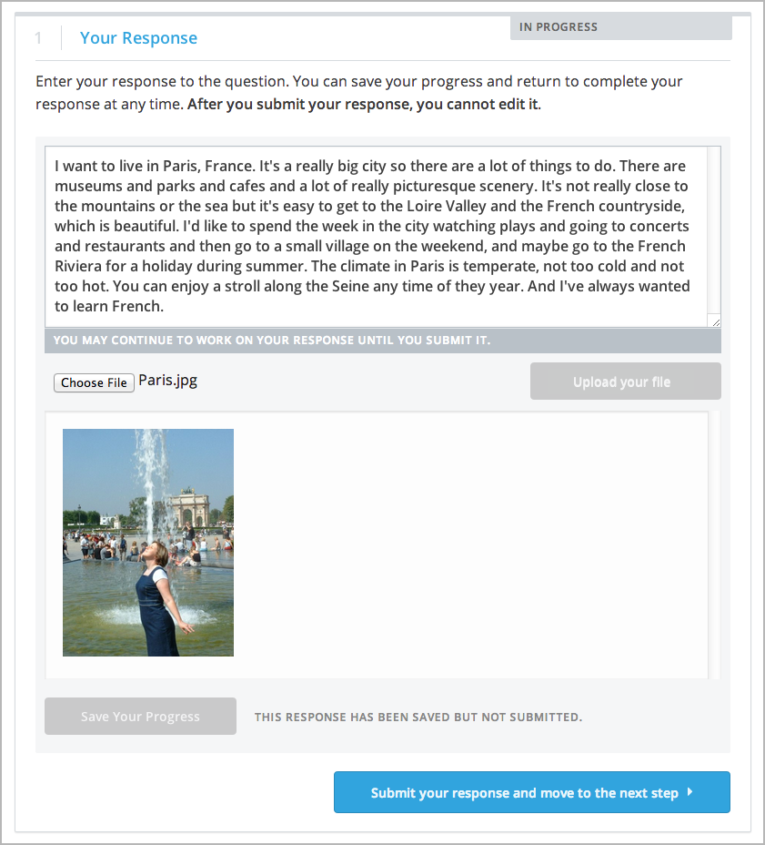

.. _SFD_ORA:

##############
Writing Essays
##############

Some courses include assignments that require written responses to questions
that might not have simple or definitive answers. To score one of these essay
style assignments, you might be asked to do one or more of the following.

* Assess your own work.
* Assess the essays written by other learners.

To receive your score for an essay style assignment, you might receive one or
more of the following.

* Assessments from other learners in the course.
* An assessment from a member of the course team.

Because these essay assignments have a flexible design and can include
different assessment options, they are called open response assessments.

This topic describes how to work with open response assessments in your edX
course.

.. contents::
  :local:
  :depth: 1

*********************************************
Overview of Open Response Assessments
*********************************************

In an open response assessment, you provide written responses to questions that
might not have simple or definitive answers. For some open response
assessments, you can submit an image or other file to accompany a written
response.

.. contents::
  :local:
  :depth: 1

==========================================
The Steps in an Open Response Assessment
==========================================

In addition to :ref:`your own responses<Submit Your Response>` to the
questions in the assignment, open response assessments have several steps that
can include assessment training steps, peer assessments, self assessment, and
staff assessments.

* In training steps, you perform assessments of sample responses that the
  course team provides. The goal is to give the sample response the same grade
  that a member of the course team would have given. For more information, see
  :ref:`Learn to Assess Responses`.

* In peer assessments, you perform assessments of responses that other
  learners in the course have submitted, and other learners in the course also
  assess your responses. For each assignment, your course team decides the
  number of peer assessments that you have to perform. For more information,
  see :ref:`Assess Peer Responses`.

* In self assessments, you assess your own response. For more information,
  see :ref:`Assess Your Response`.

* In staff assessments, members of the course team assess your response. For
  more information, see :ref:`Staff Grade`.

  .. note:: Course staff can grade your open response assignment even if a
     staff assessment step is not included in the assignment. This might
     happen if, for example, you receive peer assessments of your response
     that are inappropriate. In such cases, course staff can perform an
     assessment of your response that overrides any peer assessment grades.

==========================================
The Rubric, Criteria, and Options
==========================================

Every open response assessment has a rubric that the course team provides, to
be used as guidance for grading. The rubric is a list of expectations that the
response should meet. Grading for all the types of assessments in an open
response assessment is done by comparing each response against the same
rubric.

Rubrics consist of criteria and options.

* Criteria describe characteristics that each response should have, such as
  concepts that a response should cover, or the amount of supporting
  information that a response must include.

* Each criterion has options, which describe how well each response satisfies
  the criterion. These are usually a range of ratings, for example "Fair",
  "Good", or "Excellent".

The following image shows a rubric with two criteria. Each of the criteria has
several options.

.. image:: ../../shared/students/Images/PA_S_Rubric.png
   :alt: Rubric showing criteria and options.
   :width: 500

When you assess a response, you select the option that best describes how well
the response met each of the criteria.

Some open response assessments provide a **Top Responses** section that shows
the top scoring responses for the assignment and the scores that these
responses received. If it is provided, this section appears below your score
after you complete each step of the assignment.

**************************************
Completing an Open Response Assessment
**************************************

When you come to an open response assessment in the course, you see the
questions you must answer, with a response field for each question in the
assignment. After you enter and submit your response, you assess some of your
peers' responses, your own response, or both, depending on the assignment.
Below the final response field in the **Your Response** step, you can see the
steps that your assignment includes.

.. image:: ../../shared/students/Images/PA_S_AsmtWithResponse.png
   :alt: Open response assessment example with question, response field, and
       assessment types and status labeled.
   :width: 550

The following topics describe how you complete an open response assessment
that includes a learner training step, a peer assessment step, a self
assessment step, and a staff grade step.

.. contents::
 :local:
 :depth: 1

At any time during an assessment, you can see your progress at the bottom of the
page under **Your Grade**. A message indicates the steps that must still be
completed before you can receive your final grade for the assignment. For
example, you might see the following message.

.. code-block:: xml

  Not Completed

  You have not completed the peer assessment step and self assessment step of
  this problem.

.. _Submit Your Response:

=====================
Submit Your Response
=====================

To submit your response, follow these steps.

#. Read each question carefully. Some course teams include important
   information in the question, such as how long a response must be, or
   specific topics that your response must cover.

   .. note:: The total word count for the assessment cannot
      be more than 10,000 words (approximately the equivalent of 20 pages of
      8.5x11 inch paper, with text single-spaced).

#. For each question, enter your response into the field under **Your
   Response**.

#. When you have completed all of the questions, select **Submit
   your response and move to the next step**.

   If you need more time, you can select **Save Your Progress** to save a
   draft of your responses, and then come back and submit them later.

After you submit your responses, the next step, which is usually either
assessment training or peer assessment, starts immediately. However, you do not
have to start the next step right away. If you want to stop working and come
back later, just refresh or reopen your browser when you come back.

.. note:: You can view your own responses at any time after you submit them. To
   do this, for the response you want to view, select the **Your Response**
   heading to expand the response field. Your response appears, along with the
   status of your response, and information about additional steps you have to
   complete before you receive your grade.

.. image:: ../../shared/students/Images/PA_S_ReviewResponse.png
   :alt: Image of the Response field collapsed and then expanded.
   :width: 500

.. _Submit a File with Your Response:

Submit a File with Your Response
***********************************

For some assignments, you might be asked to submit a file along with your text
response. Those assignments include **Choose File** and **Upload your file**
options below the response field. Note the following requirements.

* A text response is always required. If you upload a file in your response,
  also include a text response that describes the file you have uploaded in
  such a way that a reviewer who cannot access the uploaded file can still
  assess the text content of your response using a screen reader or other text
  parsing tool.

* You can upload only one file to submit with your response.

* The file that you upload must be smaller than 5 MB in size.

* Image files can be in .jpg, .gif, or .png format.

To upload your file, follow these steps.

#. Below the response field, select **Choose File**.

#. Select the file that you want to upload, and then select **Open**.

#. Select **Upload your file**.

The name of the file that you selected and uploaded appears below the response
field.

You can replace the file that you uploaded with a different one until you
submit your response. To do so, follow steps 1-3 again.

.. _Learn to Assess Responses:

============================
Learn to Assess Responses
============================

As part of an open response assessment, you learn how to assess responses
effectively by reviewing and assessing sample responses provided by the course
team. You then try to give the sample responses the same scores that the course
team selected.

.. note:: Not all course teams provide sample responses for training. If the
   course team did not provide sample responses, this step is not included in
   the assignment.

After you submit your own response, a sample response appears along with the
rubric for the assignment. Read the sample response and the rubric carefully,
select the options that you think best reflect the response, and then select
**Compare your selections with the instructor's selections**.

* If all of your selections are the same as the defined selections, the
  next sample response opens automatically.

* If any option that you select is not the same as the defined selection,
  you see the response again, and the following message appears above the
  response.

.. code-block:: xml

  Learning to Assess Responses

  Your assessment differs from the instructor's
  assessment of this response. Review the response and consider why the
  instructor may have assessed it differently. Then, try the assessment again.

For each of the criteria, you see one of the following two messages, depending
on whether your selections matched those defined by the course team.

.. code-block:: xml

  Selected Options Agree
  The option you selected is the option that the instructor selected.

.. code-block:: xml

  Selected Options Differ
  The option you selected is not the option that the instructor selected.

In the following example, the learner chose one correct option and one
incorrect option.

.. image:: ../../shared/students/Images/PA_TrainingAssessment_Scored.png
   :alt: Sample training response, with one correct and one incorrect option.
   :width: 500

You continue to assess the sample response until the options you select for all
criteria match the options defined by the course team.

When you have successfully assessed all of the sample responses, you move to
the next step in the assignment.

.. _Assess Peer Responses:

=====================
Assess Peer Responses
=====================

When the peer assessment step starts, you can see counts of how many responses
you are expected to assess and how many you have already assessed at the top of
the page. Then you see each original question, another learner's response, and
the rubric for the assignment.

.. image:: ../../shared/students/Images/PA_S_PeerAssmt.png
   :alt: An in-progress peer assessment.
   :width: 500

You assess other learners' responses by selecting options in the rubric. This
process will be familiar to you if your assignment included the :ref:`learn to
assess responses<Learn to Assess Responses>` step. Additionally, this step has
a field below the rubric where you can provide comments about the learner's
response.

.. note:: Some assessments might have a **Comments** field for one or
  more of the assessment's individual criteria. You can enter up to 300
  characters in these fields. In the following image, both criteria have a
  **Comments** field. There is also a field for overall comments on the
  response.

    .. image:: ../../shared/students/Images/PA_CriterionAndOverallComments.png
       :alt: Rubric with comment fields under each criterion and under overall
           response.
       :width: 600

After you have selected options in the rubric and provided additional comments
about the response, select **Submit your assessment and move to response
#{number}**.

When you submit your assessment of the first learner's response, a response
from another learner opens for you. Assess each response in the same way that
you assessed the first learner's responses, and submit each assessment. You
repeat these steps until you have assessed the required number of responses.
The count of how many responses you have assessed updates after you assess each
response.

If there are no new submitted responses available for grading, a status
message indicates that no peer responses are currently available for you to
assess, and that you should check back later.

=================================================
Assess Additional Peer Responses (optional)
=================================================

If you have assessed the required number of peer responses, the peer
assessment step "collapses" so that only the **Assess Peers** heading is
visible.

.. image:: ../../shared/students/Images/PA_PAHeadingCollapsed.png
   :width: 500
   :alt: The peer assessment step with just the heading visible.

If you want to, you can assess more peer responses than the assignment
requires. To assess more responses, select the **Assess Peers** heading to
expand the step, and then select **Continue Assessing Peers**.

.. image:: ../../shared/students/Images/PA_ContinueGrading.png
   :width: 500
   :alt: The peer assessment step expanded so that "Continue Assessing Peers"
       is visible.

.. _Assess Your Response:

=====================
Assess Your Response
=====================

When you have completed the required number of peer assessments, your self
assessment opens. You see your response along with the same rubric that you
used in the peer assessment step. Assess your response, and then select
**Submit Your Assessment**.

.. _Staff Grade:

=====================
Staff Grade
=====================

In some assignments, a staff assessment step is included for a member of the
course team to grade your responses. You do not need to take any action for
this step. The status of the **Staff Grade** step changes to **Complete** when
a member of the course team has completed grading your response.

If a **Staff Grade** step exists in your assignment, you receive your final
assignment grade when staff grading is complete, even if your response has not
been assessed by the required number of peer reviewers.

.. note:: Course staff can grade your open response assignment even if a staff
   assessment step is not included in the assignment. This might happen if
   for example you receive peer assessments of your response that are
   inappropriate. In such cases, course staff can perform an assessment of
   your response that overrides any peer assessment grades. If a member of the
   course staff has graded your response, a **Staff Grade** section appears in
   the grading details for your assignment.

==========================================
Receive Your Score and Provide Feedback
==========================================

After you submit your self assessment, if other learners are still assessing
your response, you see this message under the **Assess Your Response** step.

.. code-block:: xml

  Your Grade: Waiting for Peer Assessment

  Your response is still undergoing peer assessment. After your peers have
  assessed your response, you will see their feedback and receive your final
  grade.

If you see this message, keep checking back periodically until the peer
assessments of your work are complete.

When peer assessment is complete, and if the assignment does not include a
staff assessment step, you can see the scores you received from all of the
peers who scored your work, as well as your self assessment. You can also see
any additional comments that your peers have provided.

If you want to, you can provide feedback on the peer scores that you received,
under **Provide Feedback on Peer Assessments**.

.. image:: ../../shared/students/Images/PA_AllScores.png
   :alt: A learner's response with peer and self assessment scores.
   :width: 550

If the assignment included a staff assessment step, you receive your final
grade when a member of the course team has graded your response. If a staff
assessment step is included in the assignment, peer assessment grades and
comments are included in the assignment grade details, but the staff grade
becomes the final grade.

***********************
Peer Assessment Scoring
***********************

.. note:: If a staff grade is provided in the assignment, either because a
   staff assessment step was included or because a member of the course team
   graded your response to override inappropriate peer assessments, peer
   assessments are not taken into account in the grading. If a staff grade
   exists, it is always your final grade.

Peer assessments are scored by criteria. An individual criterion's score is the
median, not the average, of the scores that each peer assessor gave that
criterion. For example, if the Ideas criterion in a peer assessment receives 10
from one learner, 9 from a second learner, and 5 from a third learner, the
score for that criterion is 9 (the median), not 8 (the average).

Your final score for a peer assessment is the sum of the median scores for each
individual criterion.

For example, a response might receive the following scores from peer assessors.

.. list-table::
   :widths: 25 10 10 10 10
   :stub-columns: 1
   :header-rows: 1

   * - Criterion Name
     - Peer 1
     - Peer 2
     - Peer 3
     - Median
   * - Ideas (out of 10)
     - 10
     - 7
     - 8
     - **8**
   * - Content (out of 10)
     - 7
     - 9
     - 8
     - **8**
   * - Grammar (out of 5)
     - 4
     - 4
     - 5
     - **4**

To calculate the final score, the system adds the median score for each
criterion.

  Ideas median (8 out of 10) + Content median (8 out of 10) +
  Grammar median (4 out of 5) = final score (20 out of 25)

Note, again, that your final score is not the median of the scores that each
individual peer assessor gave the response.

==================================
View Top Responses (optional)
==================================

If the course team included a **Top Responses** section, you can review the
highest-scoring responses submitted for each question. This section appears
only after you have completed all the steps of the assignment.

.. image:: ../../shared/students/Images/PA_TopResponses.png
   :alt: Section that shows the text and scores of the top three responses for
       the assignment.
   :width: 500

********************************
Canceled Responses
********************************

If the course team deems a response that you have submitted to be
inappropriate, they can cancel that response and remove it from peer grading.
In the open response assessment you see an indicator that your submission was
canceled, with the date and time of the cancellation, and a comment by the
course team member about the reason.

The course team might allow you to submit a replacement response for the
canceled one, or they might not. If they do not allow you to submit a
replacement response, your grade is zero for the assignment.

******************************************************
Try an Example Open Response Assessment Problem
******************************************************

If you want to try an example open response assessment problem, check out the
edX demonstration course, `edX Demo course`_. In addition to giving you a tour
of a typical edX course, the edX Demo course contains `information about open
response assessments`_ and an `example peer assessment`_.

.. include:: ../../links/links.rst
