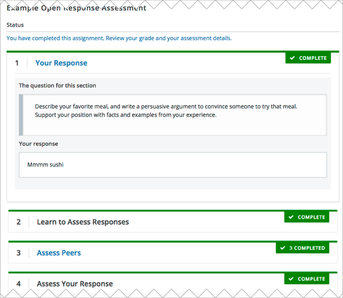
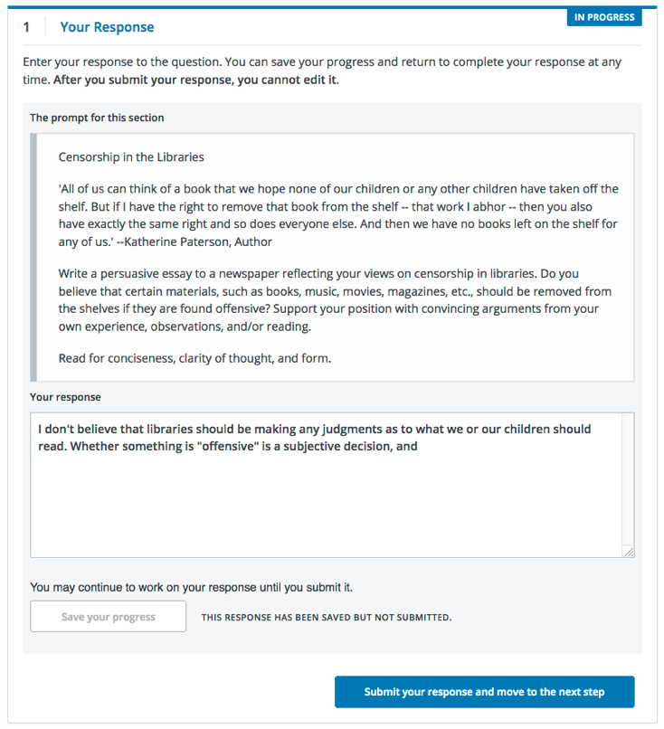
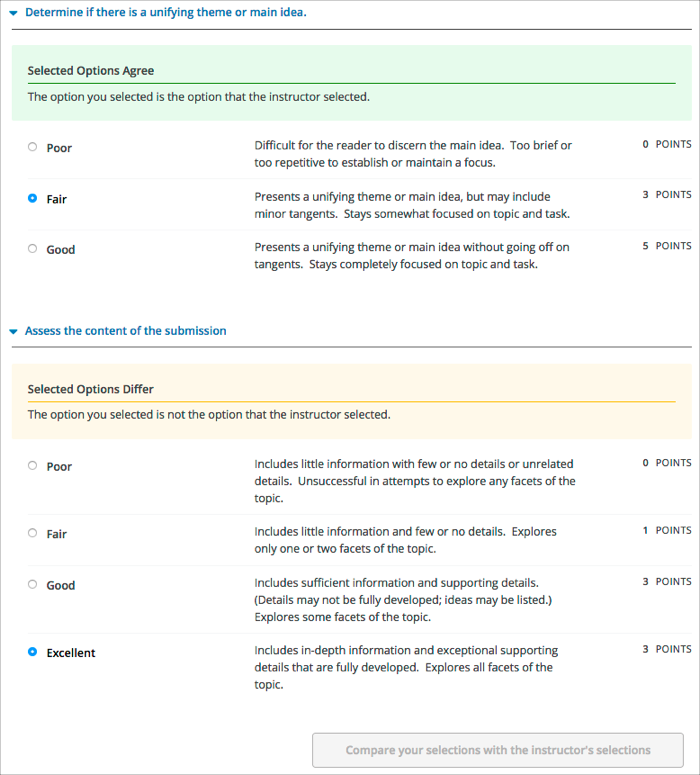
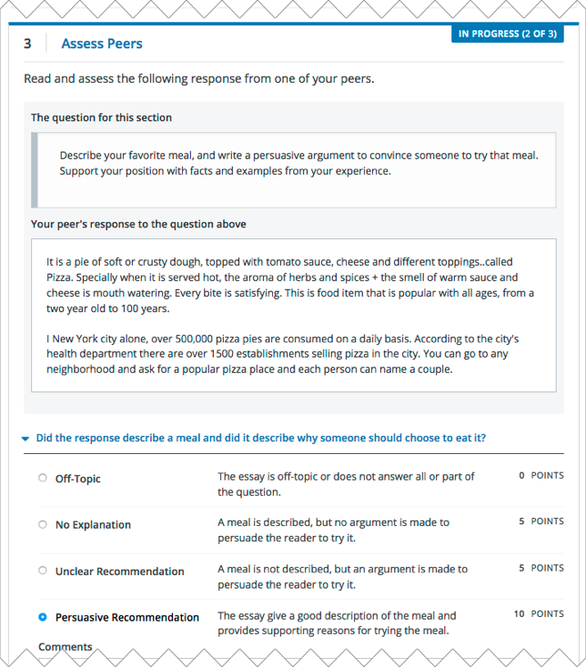
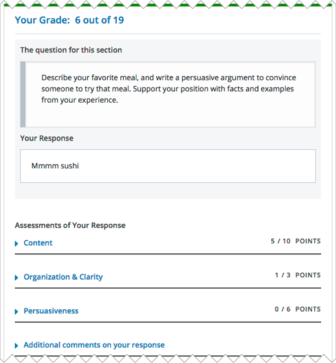
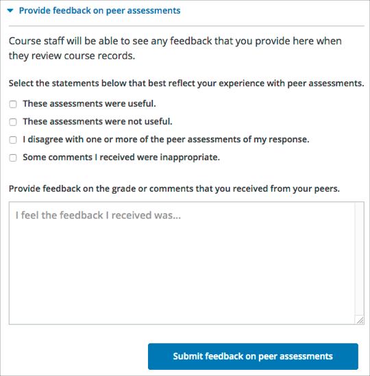

.. _SFD_ORA:

#############################
Completing Essay Assignments
#############################

In some courses, you are asked to write essays in response to topics or to
questions that do not have simple answers. These essay assignments are called
open response assessments (ORA) because they have a flexible design, and can
include various assessment options, including peer assessments and self
assessments.

In some assignments, you can also submit an image or other type of file. For
information about uploading images or other files in your open response
assessment, see :ref:`Submit a File with Your Response`.

.. note::

   If you want to try an example open response assessment problem, check out
   the edX demonstration course, `edX Demo course`_. In addition to giving you
   a tour of a typical edX course, the edX Demo course contains `information
   about open response assessments`_ and an `example peer assessment`_.

This section describes how to work with open response assessments in your edX
course.

.. contents::
  :local:
  :depth: 1

.. _Steps in an Open Response Assessment:

*********************************************
The Steps in an Open Response Assessment
*********************************************

Open response assessments can have several possible steps, which appear in the
order that you must complete them. Future steps are not available until you
complete your current step. This topic describes all of the possible steps.
The actual steps in your assignment depend on how your course team has
designed the assignment.

      assessment step and self assessment step.
   :width: 550

* :ref:`Your Response<Submit Your Response>`. In this first step in an open
  response assessment, you submit your response to the assignment question.

* :ref:`Learn to Assess Responses<Learn to Assess Responses>`. In this step
  you practice grading some responses. You evaluate example responses
  and then see how the grade you gave differs from the grade that a member
  of the course team gave. The goal is to learn how to assess responses
  similar to the way that course staff would assess them, using the same
  rubric.

* :ref:`Assess Peers<Assess Peer Responses>`. You grade responses that other
  learners in the course have submitted, and other learners in the course
  grade your responses.

  Your course team decides the number of peer assessments that you have to
  perform and receive. For example, you might be required to assess the
  responses of two of your peers, as well as receive assessments by two of
  your peers.

* :ref:`Assess Your Response<Assess Your Response>`. In this step you assess
  your own response, using the same rubric that you used to perform peer
  assessments.

* :ref:`Staff Grade <Staff Grade>`. Members of the course team assess your
  response. If you receive a staff grade for your assignment, it always
  overrides any peer assessment grades that you receive.

  .. note:: Course staff can grade your open response assignment even if a
     staff assessment step is not included in the assignment. This might
     happen if, for example, you receive peer assessments of your response
     that are inappropriate. In such cases, course staff can perform an
     assessment of your response that overrides any peer assessment grades.

.. _How Grading Is Done in ORA:

*****************************************************
How Grading Is Done In Open Response Assessments
*****************************************************

Grading for every type of assessment in an ORA assignment is done by comparing
each response against the same set of guidelines, called a rubric. Every open
response assessment has a rubric provided by the course team.

A rubric consists of several criteria and a set of options for each criterion.

The parts of the rubric in the image below are labelled as follows.

#. **Criteria**. Each criterion describes characteristics that a response
   should have, such as concepts that a response should cover, or the amount
   of supporting information that a response must include.

#. **Options**. Each criterion has options which describe how well each
   response satisfies the criterion. The options are usually a range of
   ratings, for example "Fair", "Good", or "Excellent", with details to help
   you decide the rating.

When you assess a response, you evaluate the response, and for each criterion,
select the option that best describes how well the response met that
criterion.

.. image:: ../../shared/images/ORA_Rubric.png
   :alt: An example rubric showing criteria and options.
   :width: 550

.. _Completing an Open Response Assessment:

*******************************************
Completing an Open Response Assessment
*******************************************

An open response assessment's steps are arranged in the order that you must
complete them.

The topics in this section describe how you complete an example open response
assessment that includes a response step, an assessment training step, a peer
assessment step, a self assessment step, and a staff grade step. Your actual
assignment might not contain all of these steps. Possible steps are described
in :ref:`Steps in an Open Response Assessment`.

.. contents::
 :local:
 :depth: 1

At any time during an assessment, you can see your progress at the bottom of
the page under **Your Grade**. A message indicates the steps that must still be
completed before you can receive your final grade for the assignment.

.. _Submit Your Response:

=====================
Submit Your Response
=====================

To submit your response to an open response assessment question, follow these
steps.

#. Read each question carefully. Some course teams include important
   information in the question, such as how long a response must be, or
   specific topics that your response must cover.

   .. note::

      The total word count for your response cannot be more than 10,000 words
      (approximately the equivalent of 20 pages of 8.5x11 inch paper, with
      single-spaced text).

#. For each question, enter your response into the field under **Your
   Response**.

   .. note::

      In some assignments, you can submit images or other types of files along
      with or instead of a written response. If you can upload files in your
      assignment, **Browse** and **Upload your files** options are available
      below the response field.

      For information about uploading images or other files in your ORA
      assignment, see :ref:`Submit a File with Your Response`.

   .. note::

      For assignments that require LaTeX responses, a **Preview in LaTeX**
      option is available that you can use to preview your work before you
      submit your response.

#. When you have finished answering all of the questions, select **Submit
   your response and move to the next step**.

   If you need more time, you can select **Save Your Progress** to save a
   draft of your responses, and then come back and submit them later.

After you submit your response, the next step, which is usually either
assessment training or peer assessment, becomes available. However, you do not
have to start the next step right away. If you want to stop working and come
back later, just refresh or reopen your browser when you come back.

.. _Submit a File with Your Response:

Submit a File with Your Response
***********************************

If your assignment requires or allows you to submit images or other types of
files, you see two buttons below the response field: **Choose Files** one one
side of the page, and **Upload Files** on the other side of the page.

.. note::

   * The cumulative size of the files that you upload must be less than 500 MB.

   * Image files can be in .jpg, .gif, or .png format.

To upload files in your response, follow these steps.

#. Below the response field, select **Choose Files**.

#. In the dialog box that opens, select the file that you want to upload, and
   then select **Open**.

   A preview image of each file is visible.

#. In the boxes next to each preview image, enter a written description of the
   image. This step is required to help learners who cannot see or access the
   image understand and evaluate your response.

#. Across from the **Choose Files** button, select **Upload files**.

You can replace the files that you uploaded with different files until you
submit your response. To replace your uploaded files, repeat steps 1-3.

View Your Submitted Response
***********************************

You can view your own response at any time after you submit it.

Select the **Your Response** heading in the assignment to expand the section.

   Your response appears, along with the status of the response, and
   information about additional steps you have to complete before you receive
   your grade.

.. _Learn to Assess Responses:

============================
Learn to Assess Responses
============================

Some ORA assignments include a training step so that you can learn how to
effectively assess responses for a later peer assessment step.

In a training step, you evaluate example responses using a provided rubric as
a guide for grading. After you complete the grading, you are shown how the
grades you gave differ from the grades that a member of the course team gave.
The goal is to learn how to assess responses similar to the way that course
staff would assess them, using the same :ref:`rubric<How Grading Is Done in
ORA>`.

Complete the training step as follows.

#. Read each sample response and the rubric carefully, then for each
   criterion, select the option that you think best reflect the response.

#. When you are satisfied with your assessment, select **Compare your
   selections with the instructor's selections**.

   * If all of your selections are the same as the instructor's selections, the
     next sample response opens automatically.

   * If any option that you select is not the same as the instructor's
     selection, you see the response again, with a message indicating that
     your assessment differs from the instructor's assessment.

#. If your assessment did not match the instructor's assessment, review the
   response again and consider why the instructor assessed the response
   differently than you did. Continue to assess the example response until the
   options you select for all criteria match options selected by the
   instructor.

    that did not match the grade that the course team gave.
   :width: 550

When you have successfully assessed the sample responses, the next step in the
assignment becomes available.

.. _Assess Peer Responses:

=====================
Assess Peer Responses
=====================

In the peer assessment step of an open response assessment, you perform
assessments of responses that were submitted by other learners in your course.
The course team sets the requirement for how many peer assessments each
learner is expected to complete.

At the top of the peer assessment step, you can see counts of how many
responses you are expected to assess and how many you have already assessed.
For example, if you are required to perform 3 peer assessments and are about
to start your first peer assessment, the count appears as "1 of 3". Within the
**Assess Peers** step, you see each question, a learner's response, and the
rubric that you will use to grade the response.

You assess other learners' responses by selecting options in the rubric. This
process will be familiar to you if your assignment included the :ref:`learn to
assess responses<Learn to Assess Responses>` step. Additionally, this step has
a field below the rubric where you can provide comments about the learner's
response.

.. note:: In addition to a field for overall comments on a learner's response,
   some peer assessments include **Comments** fields for individual criteria
   that allow you to enter up to 300 characters. In some assessments, you must
   enter comments before you can submit the assessment.

After you have selected options in the rubric and provided comments about the
response, select **Submit your assessment and move to response #{number}**.

After you submit each peer assessment, a response from another learner becomes
available, until you have assessed the required number of responses. The count
of how many responses you have assessed updates after you assess each
response.

When you have completed the required number of peer assessments, the next step
in the assignment becomes available.

.. note:: If there are no submitted responses available for grading, a status
   message indicates that no peer responses are currently available for you to
   assess, and that you should check back later.

=================================================
Assess Additional Peer Responses (optional)
=================================================

If you have assessed the required number of peer responses, the peer
assessment step collapses so that only the **Assess Peers** heading is
visible.

If you want to, you can assess more peer responses than the assignment
requires. To assess more responses, select the **Assess Peers** heading to
expand the step, and then select **Continue Assessing Peers**.

.. _Assess Your Response:

=====================
Assess Your Response
=====================

When you have completed the required number of peer assessments, the self
assessment step of the assignment becomes available. You see your response
along with the same rubric that you used in the peer assessment step.

Perform an assessment of your own response, and then select **Submit Your
Assessment**.

When you have completed assessing your own response, the next step in the
assignment becomes available. If there are no further steps, and if you have
received the required number of peer assessments on your own response, you can
:ref:`receive your score<Receive Your Score and Provide Feedback>`.

.. _Staff Grade:

=====================
Staff Grade
=====================

In some assignments, a staff assessment step is included for a member of the
course team to grade your responses. You do not need to take any action for
this step. The status of the **Staff Grade** step changes to **Complete** when
a member of the course team has completed grading your response.

If a **Staff Grade** step exists in your assignment, you receive your final
assignment grade when staff grading is complete, even if your response has not
been assessed by the required number of peer reviewers.

.. note:: Course staff can grade your open response assignment even if a staff
   assessment step is not included in the assignment. This might happen if,
   for example, you receive peer assessments of your response that are
   inappropriate. In such cases, course staff can perform an assessment of
   your response that overrides any peer assessment grades. If a member of the
   course staff has graded your response, a **Staff Grade** section appears in
   the grading details for your assignment.

.. _Receive Your Score and Provide Feedback:

***************************************
Receive Your Score and Provide Feedback
***************************************

You receive your score for an open response assessment when you have completed
the following steps.

* :ref:`Submitted your response<Submit Your Response>` to the question.
* Completed the :ref:`assessment training step<Learn to Assess Responses>` (if
  included).
* Performed the required number of :ref:`peer assessments<Assess Peer
  Responses>`.
* Performed a :ref:`self assessment<Assess Your Response>` (if included).
* Received the required number of peer assessments of your own work.
* Received a :ref:`staff assessment<Staff Grade>` (if included).

If other learners are still assessing your response, you see the following
message below the **Assess Your Response** step.

.. code-block:: xml

  Your Grade: Waiting for Peer Assessment

  Your response is still undergoing peer assessment. After your peers have
  assessed your response, you will see their feedback and receive your final
  grade.

If you see this message, check back periodically until peer assessments of
your work are complete.

.. _View Your Score:

=====================
View Your Score
=====================

When peer assessment is complete, and if the assignment does not include a
staff assessment step, you can see the scores you received from all of the
peers who scored your work, as well as your self assessment. You can also see
any comments that your peers have provided.

     as well as a breakdown by criterion.
   :width: 550

If the assignment included a staff assessment step, you receive your final
grade when a member of the course team has graded your response. If a staff
assessment step is included in the assignment, peer assessment grades and
comments are included in the assignment grade details, but the staff grade
becomes the final grade.

.. _Provide Feedback on Peer Assessments Received:

==============================================
Provide Feedback on Peer Assessments Received
==============================================

If you want to, you can provide feedback on the peer scores that you received,
under **Provide Feedback on Peer Assessments**.

    statements or written comments as feedback on the peer scores that you
    received.
   :width: 550

.. _View Top Responses:

==================================
View Top Responses (optional)
==================================

Some open response assessments include a **Top Responses** section below your
own score, that shows the highest scoring responses that were submitted for
each question.

If your course team included this section in your assignment, it appears only
after you have completed all the steps of the assignment.

.. image:: ../../shared/images/ORA_TopResponses.png
   :alt: Section that shows the text and scores of the top three responses for
       the assignment.
   :width: 550

.. _How Peer Assessment Scores Are Calculated:

******************************************
How Peer Assessment Scores Are Calculated
******************************************

.. note:: If a :ref:`staff grade<Staff Grade>` is provided in the assignment,
   either because a staff assessment step was included or because a member of
   the course team graded your response to override inappropriate peer
   assessments, peer assessments are not taken into account in the grading. If
   a staff grade exists, it is always your final grade.

Peer assessments are scored by criteria. Each criterion's score is the median,
not the average, of the scores that each peer assessor gave that criterion.
For example, if the Ideas criterion in a peer assessment receives 10 from one
learner, 9 from a second learner, and 5 from a third learner, the score for
that criterion is 9 (the median), not 8 (the average).

Your final score for a peer assessment is the sum of the median scores for each
individual criterion.

For example, your response might receive the following scores from peer assessors.

.. list-table::
   :widths: 25 8 8 8 12
   :stub-columns: 1
   :header-rows: 1

   * - Criterion Name
     - Peer 1
     - Peer 2
     - Peer 3
     - Median for the Criterion
   * - Ideas (out of 10)
     - 10
     - 7
     - 8
     - **8**
   * - Content (out of 10)
     - 7
     - 9
     - 8
     - **8**
   * - Grammar (out of 5)
     - 4
     - 4
     - 5
     - **4**
   * - FINAL SCORE (out of 25)
     -
     -
     -
     - **20**

To calculate the final score, the system adds the median score for each
criterion.

  Ideas median (8 out of 10) + Content median (8 out of 10) +
  Grammar median (4 out of 5) = final score (20 out of 25)

Note, again, that your final score is not the median of the scores that each
individual peer assessor gave the response. Your final score is the sum of the
median scores for each individual criterion.

********************************
Canceled Responses
********************************

If the course team deems a response that you have submitted to be
inappropriate, they can cancel that response and remove it from peer grading.
In the open response assessment you see an indicator that your submission was
canceled, with the date and time of the cancellation, and a comment by the
course team member about the reason.

The course team might allow you to submit a replacement response for the
canceled one, or they might not. If they do not allow you to submit a
replacement response, your grade is zero for the assignment.

.. include:: ../../links/links.rst
