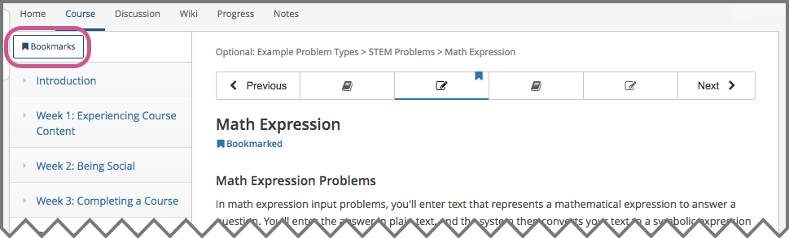

.. _SFD Bookmarks:

###########################
Bookmarking Course Content
###########################

To mark course content so that you can come back to it later, you can bookmark
any course page, up to a limit of 100 bookmarks for one course.

You can see the pages you have bookmarked in an individual lesson in the
learning sequence at the top of the page, or you can see all the bookmarks you
have added in a course on the **My Bookmarks** page.

For more information, see the following sections.

.. contents::
 :local:
 :depth: 1

***************************
Add or Remove a Bookmark
***************************

You can bookmark any page in the course. To bookmark a page, select
**Bookmark** in the upper right corner of the page.

.. note:: You can add up to 100 bookmarks in a course.

.. image:: ../../shared/students/Images/SFD_Bkmk_UnitButton.png
 :width: 500
 :alt: A course page showing the "Bookmark" button in the upper right
     corner

After you add a bookmark, the **Bookmark** button changes color, and an
indicator for the bookmark appears in the learning sequence at the top of the
page.

.. image:: ../../shared/students/Images/SFD_Bkmk_PgsBkmkd.png
 :width: 500
 :alt: A course page showing the changed Bookmark button and a bookmark
     icon in the learning sequence

To remove a bookmark from a page, select **Bookmark** in the upper right
corner of the page.

After you remove a bookmark, the **Bookmark** button changes to the original
color, and the bookmark indicator disappears from the learning sequence at the
top of the page.

***************************
View Your Bookmarks
***************************

You can see all of the pages that you have bookmarked in a particular lesson
in the learning sequence bar at the top of the page. Also, you can see all of
the bookmarks that you have made in the course on the **My Bookmarks** page.
To access the **My Bookmarks** page, select **Bookmarks** in the upper left
corner of the page.

     and showing several bookmark icons in the learning sequence

The **My Bookmarks** page lists all of your bookmarks in the course, with the
most recently created ones at the top. The page includes the location of the
bookmark in the course and the date that you added the bookmark.

.. image:: ../../shared/students/Images/SFD_Bkmk_MyBookmarksPage.png
 :width: 500
 :alt: The "My Bookmarks" page showing four bookmarks

To go to any bookmark in the course, select **View** for that bookmark.
