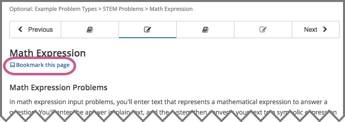
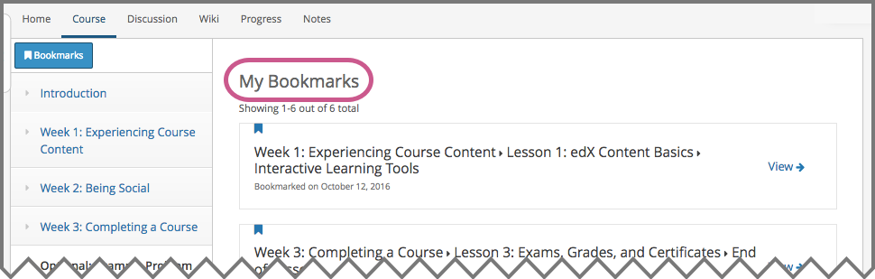

.. _SFD Bookmarks:

###########################
Bookmarking Course Content
###########################

To mark course content so that you can come back to it later, you can bookmark
any course page, up to a limit of 100 bookmarks for one course.

The course material that you bookmark is identified in the unit navigation bar
on the **Course** page, or you can see a list of all of your bookmarks on the
**My Bookmarks** page.

.. note:: You can add up to 100 bookmarks in a course.

For more information, see the following topics.

.. contents::
 :local:
 :depth: 1

***************************
Add or Remove a Bookmark
***************************

You can bookmark any page in the course. To bookmark a page, select
**Bookmark** at the upper right of the page.

After you add a bookmark, the **Bookmark** control changes color, and an
indicator for the bookmark appears in the unit navigation bar at the top of the
page.

.. image:: ../../shared/students/Images/SFD_Bkmk_PgsBkmkd.png
 :width: 500
 :alt: A course page showing the dark-colored Bookmark control and a bookmark
     icon in the unit navigation bar.

To remove a bookmark from a page, select **Bookmark** again.

After you remove a bookmark, the **Bookmark** control changes back to its
original color, and the bookmark indicator disappears from the learning
sequence.

***************************
View Your Bookmarks
***************************

As you go through the course, you can see which pages are bookmarked in the
unit navigation bar on the **Course** page. You can also see a list of all of
your bookmarks on the **My Bookmarks** page.

To access the **My Bookmarks** page, select **Bookmarks** above the course
navigation pane.

.. image:: ../../shared/students/Images/SFD_Bkmk_BookmarksButton.png
 :width: 600
 :alt: A course page that shows the Bookmarks option above the course
     navigation pane and units with bookmark icons in the unit navigation bar.

The **My Bookmarks** page lists all of your bookmarks in the course, with the
most recently created ones at the top. The page includes the location of the
bookmark in the course and the date that you added the bookmark.

To go to any bookmark in the course, select **View** for that bookmark.
