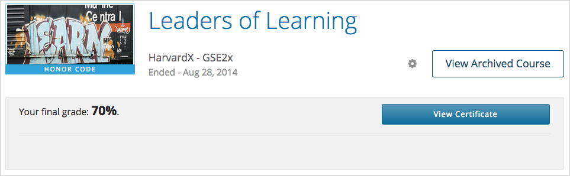

.. _Certificates:

##############################
Certificates
##############################

This section describes edX certificates and how you access them.

.. contents::
 :local:
 :depth: 1

**********
Overview
**********

.. only:: Partners

  Nearly every course on edx.org offers a certificate when you complete the
  course successfully. 

  A certificate includes your name, the name of the course, and the edX partner
  university that created the course. Verified certificates also include the
  names of one or more members of the course team.

  .. note:: 
    A small number of edX courses do not offer certificates. For evidence that
    you completed the course, you can print a copy of the **Progress** page in
    the course.

.. only:: Open_edX

  Your course might be set up to issue certificates as evidence that you
  successfully completed the course.

===========================
Certificates and Your Name
===========================

You must ensure that if you earn a certificate, it accurately displays your
full name.

Your certificate uses the full name that appears on your dashboard. 
Before your course ends, make sure that the name on your dashboard is
correct. For more information, see :ref:`SFD Basic Information`.

=================================
Certificates, Grades, and Credit
=================================

Certificate do not include grades or specify the number of credit hours
that the course might earn at a university. 

.. only:: Partners

In addition, transcripts are not available for edX course work.

  .. Note:: 
    Some edX courses offer academic credit. These courses have different
    requirements and steps for earning certificates. For more information, see
    :ref:`SFD Academic Course Credit Index`.

****************************
Certificate Types
****************************

.. only:: Open_edX

  Different types of certificates might be available for courses you take: for
  example, "honor code" or "verified". You select the certificate type you want
  when you enroll in a course. You select the certificate type when you
  :ref:`enroll in a course <SFD Enrolling in a Course>`.

.. only:: Partners

    EdX offers three types of certificates. You select the certificate type
    when you :ref:`enroll in a course <SFD Enrolling in a Course>`.

    .. contents::
     :local:
     :depth: 1

    .. Note:: Not all courses offer every type of certificate.

    .. _SFD Honor Code Certificates:

    =========================
    Honor Code Certificates
    =========================

    Honor code certificates are free of charge and are available for all except
    a few specific courses. When you audit a course, or when you take a course
    that does not offer verified certificates, you automatically receive an
    honor code certificate if you meet the requirements to pass the course.

    .. image:: ../../shared/students/Images/SFD_HCCert.png
       :width: 500
       :alt: Example edX honor code certificate

    .. _SFD Verified Certificates:

    ======================
    Verified Certificates
    ======================

    Some edX courses offer verified certificates. A verified certificate shows
    not only that you successfully completed your edX course, but also that you
    have verified your identity by using a webcam and an official ID from your
    country or region. You might want to work toward a verified certificate if
    you plan to use your course for job applications, promotions, or school
    applications.

    .. image:: ../../shared/students/Images/SFD_VerCert.png
       :width: 500
       :alt: Example edX verified certificate

    If a course offers verified certificates, you see a "Verified" badge on the
    course image in the list of courses on edx.org.

    .. image:: ../../shared/students/Images/SFD_VerifiedBadge.png
       :width: 200
       :alt: Image of DemoX course listing with a verified badge

    For a list of all courses that offer verified certificates, see the `edX
    course catalog`_.

    Verified certificates are available for a fee that varies by course. The
    fee helps support edX. If you want to donate to edX, you can choose to pay
    more than the minimum required fee. For more information about the fee for
    a particular course, see the About page for that course.

    When you enroll in the verified certificate track for a course, you must
    submit a payment before you can see course content. You do not have to
    verify your identity at that time. However, you must verify your identity
    before the deadline for verification in that course. For more information,
    see :ref:`SFD Verify Your Identity`.

    .. note:: When you verify your identity for one course, you verify your 
     identity for all edX courses. Verification is effective for one year. If
     you enroll in another verified course within that year, you do not have to
     verify your identity again.

    If you have a question or an issue with billing for a verified certificate,
    contact edX at `billing@edx.org <mailto://billing@edx.org>`_. Include your
    order number, but please **do not include your credit card information**.

    =========================
    XSeries Certificates
    =========================

    XSeries certificates show that you have successfully earned a verified
    certificate for each course in a series of courses that make up an XSeries
    program.

    If a course is part of an XSeries program, you see an "XSeries Program"
    badge on the course image in the list of courses on edx.org.

    .. image:: ../../shared/students/Images/SFD_XseriesBadge.png
       :width: 200
       :alt: An image of the DemoX course listing with a verified badge.

    For a list of all courses that are part of an XSeries program, see the `edX
    course catalog`_.

    .. _edX course catalog: https://www.edx.org/course-list/allschools/verified/allcourses`

    ****************************
    Changing a Certificate Type
    ****************************

    You can register for one type of certificate but later decide that you want
    a different type of certificate. For example, you might register for an
    honor code certificate, but then later decide that you want to earn a
    verified certificate.

    You can change the certificate type until registration for verified
    certificates ends for your course, usually two or more weeks after the
    course starts.

    * To upgrade to a verified certificate, go to your dashboard, and then
      select **Upgrade to Verified Track** under the name of your course. You
      then follow the instructions to register for a verified certificate.

    * To change from a verified certificate to an honor code certificate, go to
      your dashboard, and then select **Unregister** under the name of your
      course. The edX support team will contact you with information about a
      refund. You must change to an honor code certificate before verified
      certificate registration closes for your course if you want to receive a
      refund.

      If you do not see the **Unregister** button, registration for verified
      certificates has closed. Registration for verified certificates typically
      closes two weeks after the course has started, or after at least one
      assignment due date has passed.

    If you have questions about changing your certificate type, contact the edX
    support team at `technical@edx.org <mailto://technical@edx.org>`_.

*************************
Receiving a Certificate
*************************

Certificates are distributed shortly after a course ends, usually within two
weeks. After the course ends, you see the following message under the
course name on your dashboard.

::

  Final course details are being wrapped up at this time. Your final standing
  will be available shortly.

When your certificate is ready, your dashboard shows your final grade as well
as a link to your certificate. You can access either a `web-based <Web
Certificates>`_ or `PDF-based <PDF Certificates>`_ certificate.

*************************
Web Certificates
*************************

Newer edX courses issue web-based certificates. You access your web-based
certificate from your dashboard.

The following example shows the link to a certificate in the dashboard.

Select **View Certificate** to open the certificate in your browser. You can
then share and print the certificate.

============================
Share Your Web Certificates
============================

You can share your web certificates on Facebook, LinkedIn, and Twitter.

Ensure you are logged in to the social site on which you want to share your
certificate.

Select the social icons at the top of each certificate.

A dialog for the social site you selected opens, with the certificate URL
entered. Complete the steps for the social site to post your certificate.

.. _Print a Web Certificate:

============================
Print a Web Certificate
============================

To print a web certificate, open the certificate and select **Print
Certificate** in the certificate header.

To print your certificate in the most professional looking format, note the
following guidelines.

* Do not print the header or footer. Depending on your system, you might need
  to clear this option.

* Set the margins to the minimum space available. Depending on your system, you
  might need to select the **Minimum** option for the margins.

*************************
PDF Certificates
*************************

Older edX courses issued PDF certificates. You can access your PDF certificates
from the your dashboard.

The following example shows the link to an honor code certificate in the
dashboard.

Select **Download Certificate (PDF)** to open the PDF certificate in your
browser. You can then print the certificate or save it to your computer if
needed.

========================================
Share Your PDF Certificates on LinkedIn
========================================

You can share your PDF certificate on LinkedIn.

Select **Add to profile** beneath the course in your dashboard.

Your profile page in LinkedIn opens, with a prompt to confirm the addition of
your certificate.

***********************************
Certificates for Self-Paced Courses
***********************************

While most edX courses have specific start and end dates, some courses are
self-paced. You can start these courses anytime and work through the
courseware at your own pace.

Receiving a certificate for a self-paced course is similar to receiving a
certificate for a regular course. After you have completed all course
requirements, a certificate is generated automatically. You do not have to
complete any additional steps to obtain your certificate.

Be aware, however, that different self-paced courses issue certificates at
different intervals. Some courses issue certificates once a month, and others
issue certificates less frequently. For more information about your course's
specific certificate schedule, see the About page or the **Course Info** tab
for your course.

.. _SFD On Demand Certificates: 

======================
On-Demand Certificates
======================

Some self-paced courses offer on-demand certificates. These certificates
allow you to request and download your certificate as soon as you complete
enough of the course with a high enough grade to qualify for a certificate.
You do not have to wait until you finish the course. You can usually find out
if a course offers on-demand certificates on the course About page.

If a course offers on-demand certificates, as soon as you have qualified for a
certificate, you see the following message at the top of the course
**Progress** page.

.. image:: ../../shared/students/Images/SFD_Cert_QualifiedOnDemand.png
  :width: 600
  :alt: Image of the top of a Progress page, with the text "Congratulations,
      you qualified for a certificate!"

You can request your certificate at any time after you have qualified for the
certificate. 

.. Caution:: 
 The grade that you see on your dashboard reflects your grade at that time you
 requested the certificate. If you complete more assignments to raise your
 grade, the grade listed on your dashboard is not updated.

.. _Request Download Certificate:

====================================
Request and Download a Certificate
====================================

To receive your certificate at any time after you qualify, follow these steps.

#. On the course **Progress** page, select **Request Certificate**.

   The certificate creation process may take up to 48 hours. After your
   certificate has been created, you see the following message on your
   **Progress** page.

   .. image:: ../../shared/students/Images/SFD_Certs_CertificateAvailable.png
    :width: 600
    :alt: Image of a message with the following text: "Your certificate is
        available. You can keep working for a higher grade, or request your
        certificate now."

#. Download your certificate from the **Progress** page or from your dashboard.

   * To download your certificate from the **Progress** page, select
     **Download Your Certificate** in the upper right corner of the page.

   * To download your certificate from your dashboard, select **Download Your
     Certificate** next to the name of your course.

.. only:: Open_edX

    ************************************
    Upload a Badge to Mozilla Backpack
    ************************************

    For most courses, when you earn a certificate, you can download a badge
    representing your achievement and share it on a badging site such as
    Mozilla Backpack.

    To share your badge on Mozilla Backpack, follow these steps.

    #. When your certificate for a course is ready, your dashboard will show
       you your final grade for the class and a link to your certificate.

       .. image:: ../../shared/students/Images/SFD_Cert_DownloadButton.png
        :width: 600
        :alt: Dashboard with course name, grade, and link to certificate

    #. Select **View Your Certificate**.

    #. On the certificate web page, select the badge icon.

       .. image:: ../../shared/students/Images/SFD_BadgeShareButton.png
        :width: 600
        :alt: Icon bar at the top of the certificate web view, showing the
           Mozilla Backpack share icon.

       You see instructions for downloading your badge and then sharing it on
       the Mozilla Backpack site. You have to create an account on Mozilla
       Backpack to share your badge.

       .. image:: ../../shared/students/Images/SFD_MozillaBackpackShareDialog.png
        :width: 500 
        :alt: Dialog with instructions that opens when you select the Mozilla
            Backpack share icon.
